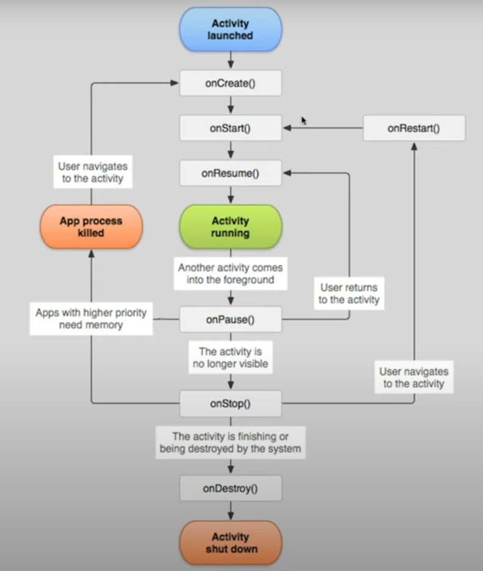

# Android

## Tools

- Android Studio

## Build APK

Build -> Generate Signed Bundle / APK

## Layout

- Guideline
- Group
- Barrier

## Lifecycle



- onCreate()
- onStart()
- onResume() -- 允许用户交互了
- onPause() -- 别的Activity占用前台
- onStop() -- 此Activity已经退到后台了
- onDestroy() --用`finish()` 方法的时候
- OnRestart() -- 如果APP没有被其他APP杀掉（更需要memory的情况），开启APP将会调用这个回调

> 启动

```
onCreate
onStart
onResume
```

> 退出

```
onPause
onStop
```

再点击APP

```
onRestart
onStart
onResume
```

> 转屏幕

```
onPause
onStop
onDestroy
onCreate
onStart
onResume
```

## Log

```java
Log.d(TAG, "string")
```

## 控件

```
TextView
Button
Switch
ProgressBar
EditText
RadioGroup
ImageView
SeekBar
CheckBox
RatingBar
```

### Find 查找

> `findViewById(..)`

```java
TextView textView;

onCreate(...) {
  textView = findViewById(R.id.tv);
}
```

_Note: `R` stands for resource. You can use `R.layout`, `R.raw`_


### 操控控件

#### TextView

```java
textView.setText("你好");
```

#### Button

```java
button.setOnClickListener(new View.onClickListener() {
  @Override
  public void onClick(View view) {
    textView.setText("clicked button");
  }
})
```

#### Switch

```java
switch.setOnCheckedChangeListener(new CompoundButton.OnCheckedChangeListener() {
  @Override
  public void onCheckedChanged(CompoundButton compoundButton, boolean b) {
    if (b) {
      textView.setText("开");
    } else {
      textView.setText("关");
    }
  }
})
```

#### EditText

```java
editText.getText().toString();
```

#### ProgressBar

```java
progressBar.setProgress(Integer.valueOf(myValue));
```

#### RadioGroup

```java
radioGroup.setOnCheckedChangeListener(new RadioGroup.OnCheckedChangeListener() {
  @Override
  public void onCheckedChanged(RadioGroup radioGroup, int i) {
    if (i==R.id.radioButton) {
    } else if
  }
})
```

#### ImageView

```java
imageView.setImageResource(R.drawable.androidLogo);
```

#### SeekBar

```java
seekbar.setOnSeekBarChangeListener(new SeekBar.OnSeekBarChangeListener() {
  @Override
  public void onProgressChanged(SeekBar seekbar, int i, boolean b) {
    display.setText(String.valueOf(i));
  }

  @Override
  public void onStartTrackingTouch(SeekBar seekbar) {

  }

  @Override
  public void onStopTrackingTouch(SeekBar seekbar) {

  }
})
```

#### CheckBox

```java
checkBox.setOnCheckedChangeListener(new CompoundButton.OnCheckedChangeListener() {
  @Override
  public void onCheckedChanged(CompoundButton compoundButton, boolean b) {
    if (b) {
      textView.setText("被勾了");
    } else {
      textView.setText("不勾了");
    }
  }
})
```

#### RatingBar

```java
ratingBar.setOnRatingBarChangeListener(new RatingBar.OnRatingBarChangeListener() {
  @Override
  public void OnRatingChange(RatingBar ratingBar, float v, boolean b) {
  }
})
```

#### Toast

```java
// 1. Context
// 2. String
// 3. 时间长
Toast.makeText(this or getApplicationContext(), String.valueOf(123), Toast.LENGTH_SHORT).show();
```

## Save Bundle

存储Activity数据，避免Destroy了无法恢复。比如，解决屏幕翻转会出现的问题。

```java
// 存入Bundle
@Override
protected void onSaveInstanceState(Bundle outState) {
  super.onSaveInstanceState(outState);
  outState.putString("KEY", textView.getText().toString());
}

onCreate(..) {
  //...
  if (savedInstanceState != null) {
    String s = savedInstanceState.getString("KEY");
    textView.setText(s);
  }
}

```
