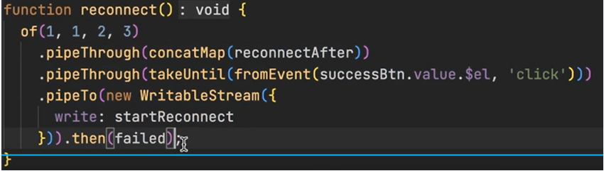
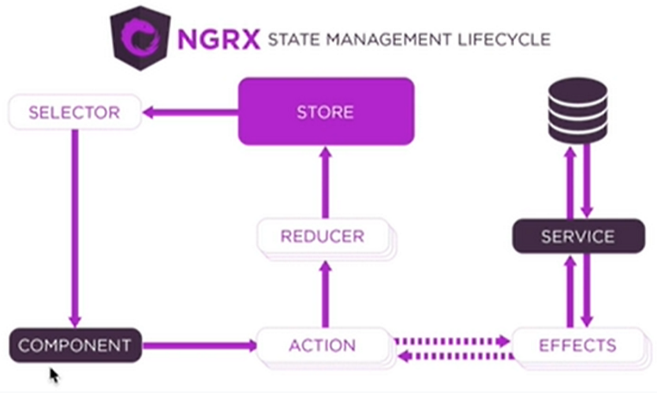
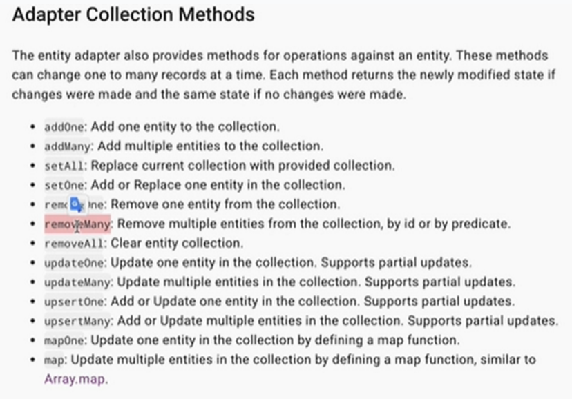

# RXJS

> 是一个异步编程的js库

## Observable
**Observable**
- to subscribe **Observer** to call the observer's method
- can have multiple observable to subscribe same observer
- no action without subscribe
- multiple actions even if **same** observable subscribe observer multiple times.
- please remember to complete after mission done.

**Observer**
- have few functions:
	- next
	- complete
	- error

```typescript
import { Observable } from 'rxjs'

const observable = new Observable(function (observer) {
	setTimeout(function() {
		observer.next({ // send this data to observer
			name: "ABC"
		})
		// observer.complete() // no param
		// observer.error("error msg")
	}, 2000)
}


const observer = {
	next: function (value) {
		console.log(value)
	},
	complete: function() {
		console.log("ending")
	},
	error: function(error) {
		console.log(error)
	}
}

observable.subscribe(observer)
```
> **result**
> {name: "ABC"}

**Tips:** observer next will not be carried out once complete / error.


## Subject
**Subject**
- create empty observable
- no action carried out with subscribe
- action will be carried out when subject.next()
- next method can be used externally

```typescript
import { Subject } from "rxjs"

const demoSubject = new Subject()

demoSubject.subscribe({next: function (value) {
	console.log(value)
}})
demoSubject.subscribe({next: function (value) {
	console.log(value)
}})

setTimeout(function() {
	demoSubject.next("hello")
}, 2000)
```
> **result**
> hello
> hello

**Behavior Subject**
- have every functions that subject have,
- however,  it will be carried out for default value for one time first when using behaviorSubject.next("...")

```typescript
import { BehaviorSubject } from 'rxjs'

const demoBehavior = new BehaviorSubject("default value")
demoBehavior.subscribe({next: function (value) {
	console.log(value)
}})
demoBehavior.next("hello")
```
> **result**
> default value
> hello

**Replay Subject**
- like Subject
- however, the later subscribe will use the previous '.next' too

```typescript
import { ReplaySubject } from 'rxjs'

const rSubject = new ReplaySubject()

rSubject.subscribe(value => {
	console.log(value)
})

rSubject.next("Hello 1")
rSubject.next("Hello 2")

setTimeout(function() {
	rSubject.subscribe({next: function(value) {
		console.log(value)
	}})
}, 3000)

```
> **result**
> Hello 1
> Hello 2
> Hello 1
> Hello 2


# Stream
## Function
### range - return observable
> range(start, length)

```typescript
import { range } from 'rxjs'

range(0, 5).subscribe(n => console.log)
```
> **Result:**
> 0
> 1
> 2
> 3
> 4


### from
> convert Array, Promise, Iterator into Observable
> from([10, 20, 30])

**Array**
```typescript
import { from } from 'rxjs'

from(["a", "b", "c"]).subscribe(console.log)
```
> **Result:**
> a
> b
> c

**Promise**
```typescript
import { from } from 'rxjs'

function p() {
	return new Promise (function(resolve) {
		setTimeout(function() {
			resolve({ a:1 })
		}, 2000)
	})
}

from(p()).subscribe(console.log)
```
> **Result:**
> {a:1}

**useful to work with axios as it is a promise type**

### forkJoin
> forkjoin is rx verion's Promise.all(), which only return once all observable completed

```typescript
import axios from 'axios'
import { forkJoin. from } from "rxjs"

// example only, which get goods and category
forkJoin({
	goods: from(axios.get("http:....")),
	categories: from(axios.get("http:..."))
}).subscribe(console.log)

```
> **Result**
> { goods: {....,'data': ...}, category: {...}}

**Tips:** to intercept the axios to get data of the return value

```typescript
import axios from 'axios'
import { forkJoin. from } from "rxjs"

axios.interceptors.response.use(response => response.data)

// example only, which get goods and category
forkJoin({
	goods: from(axios.get("http:....")),
	categories: from(axios.get("http:..."))
}).subscribe(console.log)

```


### fromEvent
> convert event into observable

```typescript
import { fromEvent } from 'rxjs'
import { map } from 'rxjs/operators'

const button = document.getElementById("btn")

fromEvent(button, "click")
.pipe(map(event => event.target))
.subscribe(console.log)

```
> Result:
> `<button id="btn">按钮</button>`


### interval
**interval**: send a value out every interval, value is auto-increment

```typescript
import { interval } from 'rxjs'

interval(1000).subscribe(n => console.log(n))
```
> **Result:**
> 0
> 1
> 2
> 3
> ...


### of
> convert params into data stream
> of(x,y,x)

```typescript
import { of } from 'rxjs'

of("a", [], {}, true, 20).subscribe(v => console.log(v))

```
> **Result:**
> a
> []
> {}
> true
> 20


## Operators
https://rxmarbles.com/

### map / mapTo
> map(x => ...x...)

```typescript
import { map } from 'rxjs/operators'
import { range } from 'rxjs'

range(1, 10)
.pipe(map(n => n * 10))
.subscribe(n => console.log)

```
> Result:
> 10
> 20
> 30
> 40
> 50
> 60
> 70
> 80
> 90
> 100

### pluck
> get the attribute of the stream

```typescript
import { fromEvent } from 'rxjs'
import { pluck } from 'rxjs/operators'

const button = document.getElementById("btn")

//.pipe(map(event => event.target))
fromEvent(button, "click")
.pipe(pluck("target"))
.subscribe(console.log)

```
> Result:
> `<button id="btn">按钮</button>`


### switchMap
> switchMap(i => ...)
> switch to the data you want

```typescript
import { switchMap } from "rxjs/operators"
import { interval, fromEvent } from "rxjs"

const button = document.getElementById("btn")

fromEvent(button, "click")
.pipe(switchMap(event => interval(1000))
.subscribe(console.log)

```
> **Result:**
> `when first click`
> 0
> 1
> 2
> 3
> 4
> `when second click`
> 0
> 1
> 2
> 3
> 4
> ...

**Tips:** switchMap operator will give up the previous stream if it was triggered again

### concatMap

> difference with switchMap: does not stop the previous stream if new observable observed



### take, takeWhile, takeUtil
> take the data from stream 
> take: few from first
> takeWhile: take from first when the condition met, please be noted that once the condition not met, then the further data may not be in consideration.
> takeUntil: **accept observable param**, stop only when the observable emit value


**take**
```typescript
import { take } from "rxjs/operators"
import { range } from "rxjs"

range(1, 10)
.pipe(take(2))
.subscribe(console.log)
```

> **Result:**
> 1
> 2


**takeWhile**

```typescript
import { takeWhile } from "rxjs/operators"
import { range } from "rxjs"

// n => n < 3 means n < 3
range(1, 10)
.pipe(takeWhile( n => n < 3))
.subscribe(console.log)
```

> **Result:**
> 1
> 2


**takeWhile**

```typescript
import { takeUntil } from "rxjs/operators"
import { fromEvent } from "rxjs"

const button = document.getElementById("btn")

fromEvent(document, "mousemove")
.pipe(takeUntil(fromEvent(btn, "click")))
.subscribe(console.log)
```


### throttleTime
> limit the times of data 
> throttleTime(fn, { leading: true, trailing: true})

```typescript
import { formEvent } from 'rxjs'
import { throttleTime } from 'rxjs/operators'

fromEvent(document, "click")
.pipe(throttleTime(2000))
.subscribe(console.log)

```

### debounceTime
> only response with the last data
> debounceTime(time)

```typescript
import { formEvent } from 'rxjs'
import { debounceTime} from 'rxjs/operators'

fromEvent(document, "click")
.pipe(debounceTime(2000))
.subscribe(console.log)
// noticed:
// keep clicking -> no result
// after 2 second of final click -> response get
```

### distinctUntilChanged
> if new data is similar to the previous, then skip; else, send

```typescript
import { of } from "rxjs"
import { distinctUntilChanged } from "rxjs/operators"

of(1,1,2,2,3,4)
.pipe(distinctUntilChanged())
.subscribe(console.log)
```

> **Result:**
> 1
> 2
> 3
> 4


### catchError


# Example
## 1. drag the box
[watch me for video](https://www.bilibili.com/video/BV1ri4y1R7Si/?spm_id_from=333.788)
```css
<style>
	#box {
		width: 200px;
		height: 200px;
		background: skyblue;
		position: absolute;
		left: 0;
		top: 0;
	}
</style>
```

```html
<div id="box"></div>

```
using javascript
```javascript
const box = document.getElementById("box")
box.onmousedown = function (event) {
	let distanceX = event.clientX - event.target.offsetLeft
	let distanceY = event.clientY - event.target.offsetTop
	document.onmousemove = function(event) {
		let left = event.clientX - distanceX
		let top = event.clientY - distanceY
		box.style.left = left + 'px';
		box.style.top = top + 'px';
	}
	box.onmouseup = function() {
		document.onmousemove = null;
	}
}

```

using rxjs
```javascript
import { fromEvent } from 'rxjs'
import { map, switchMap } from 'rxjs/operators'

const box = document.getElementById("box")

fromEvent(box,'mousedown')
.pipe(
	map(event => ({
		distanceX: event.clientX - event.target.offsetLeft，
		distanceY: event.clientY - event.target.offsetTop
	})),
	switchMap(({distanceX, distanceY}) => 
		fromEvent(document,"mousemove").pipe(map(event => ({
			left: event.clientX - distanceX,
			top: event.clientY - distanceY
		})),
		takeUntil(fromEvent(box, "onmouseup"))
	)
)
.subscribe(function({left, top}) {
	box.style.left = left + 'px'
	box.style.top = top + 'px';
})


```

##2. search
[watch me for video](https://www.bilibili.com/video/BV1ti4y1R7LG/?spm_id_from=333.788)

```html
<input id="search" type="text" placeholder="please input..."/>
```
```javascript
import { fromEvent, from } from 'rxjs'
import { map, switchMap, debounceTime, distinctUntilChanged, pluck } from 'rxjs/operators'
import axios from "axios"

const search = document.getElementById('search')

fromEvent(search, 'keyup')
.pipe(
	debounceTime(700),
	map(event => event.target.value),
	distinctUntilChanged(),
	switchMap(keyword => 
		from(axios.get(`http.....=${keyword}`)
		).pipe(pluck("data"))
	)
)
.subscribe(console.log)
```

**Tips:** the use of debounceTime and distinctUntilChanged to lower the frequency of requests

## multi requests

```html
<button id="btn">get user detail</button>
```
```javascript
import axios from 'axios'
import { from, fromEvent } from 'rxjs'
import { pluck, concatMap } from 'rxjs/operators'

const button = document.getElementById('btn')

fromEvent(button, "click")
	.pipe(
		concatMap(event => from(axios.get(http:..../token))),
		concatMap(token => from(axios.get(http:..../userInfo))
	)
	.subscribe(console.log)
```
> **Result:**
> {name: .., age: ...}


**Tips:** concatMap only start after previous concatMap finished


# NgRx

> - 实现全局**状态管理**的Redux 架构解决方案
> - store 的东西只能通过reducer去更改
> - 如果**component 要改store的东西**，必须触发action，action会被reducer接收到，在reducer中根据不同的action进行不同的处理，处理后返回状态给到store，让store处理这个状态
> - **component获取store的东西**, 通过selector。Selector会从store当中获取比较复杂的数据，component从selector获取需要的数据
> - **Effect 是用来做异步操作的**, 可以接收action, 对action进行过滤得到他想要的action。如果找到了那就可以执行异步操作了。
> - **Effect can be used to update store states too.** if this is to send request to server asynchronously, then the code of sending request should be in **service**, effect to call service, service send request to server, server response service, effects get response from service. Once effect got the response, it can trigger an action, and action to be sent to reducer.

```
Need to install
---------------
1. @ngrx/store: 全局状态管理模块
2. @ngrx/effects: 处理副作用
3. @ngrx/store-devtools: 浏览器调试工具，need to depends on ReduxDevtoolsExtension
4. @ngrx/schematics: 命令行工具，快速生成NgRx文件
5. @ngrx/entity: 提供了很多操作数据的方法，提高开发者在Reducer中操作数据的效率
6. @ngrx/router-store: 将路由状态同步到全局store
```

## Quick Start
1. install
	`npm install @ngrx/store @ngrx/effects @ngrx/entity @ngrx/router-store @ngrx/store-devtools @ngrx/schematics`

2. config
	`ng config cli.defaultCollection @ngrx/schematics`
	```json
	// angular.json
	"cli": {
		"defaultCollection": "@ngrx/schematics"
	}
	```

3. create **store**, different module shall have different store
	> 包含状态的名字和reducer的一个对应关系, 和状态的名字和状态的类型的对应关系
	`ng g store State --root --module app.module.ts --statePath store --stateInterface AppState`
	```
	State // 固定
	--root // 如果是根模块就用我
	--module // for which module?
	--statePath // 存储路径, this case ./store/index.ts
	--stateInterface // 类型接口名字，你的store里面的状态是什么样的类型
	```
	```typescript
	...
	// store 中存储的状态类型接口,存储状态名字和状态类型的对应关系
	export interface AppState{}
	
	// 存储状态名字和reducer的对应关系
	export const reducers: ActionReducerMap<AppState> = {}

	export const metaReducers: MetaReducer<AppState>[] = !environment.production
		? []
		: []
	```

4. create **action**
	`ng g action store/actions/counter --skipTests`
	`Should we generate success and failure actions? N`
	`Do you want to use the create function? y` 生成辅助代码
	```typescript
	// ./store/actions/counter.actions.ts
	import { createAction } from "@ngrx/store"
	
	export const increment = createAction("increment")
	export const decrement = createAction("decrement")
	```

5. create **reducer**
	`ng g reducer store/reducers/counter --skipTests --reducers=../index.ts`
	`Should we generate success and failure actions? N`
	`Do you want to use the create function? y` 生成辅助代码
	```
	--reducer= // 想把这个reducer定到哪个store?
	```
	```javascript
	// ./store/reducers/counter.reducers.ts
	import { createReducer, on } from "@ngrx/store"
	import { decrement, increment } from "../actions/counter.actions"
	
	// 这是个状态名称，叫做counter
	export const counterFeatureKey = "counter"
	
	// 状态类型接口
	export interface State {
		count: number
	}

	// 初始状态
	export const initialState: State = {
		count: 0
	}

	// 创建reducer函数
	export const reducer = createReducer {
		initialState,
		on(increment, state => ({ 
			...state, // 拿到原来的状态
			count: state.count + 1 // 修改state
		})), // 返回
		on(decrement, state => ({ 
			...state,
			count: state.count - 1 
		}))
	}
	```
	```typescript
	updated index.ts (store)
	------------------------
	...
	import * as fromCounter from "./reducers/counter.reducer"
	
	// store 中存储的状态类型接口,存储状态名字和状态类型的对应关系
	export interface AppState{
		[fromCounter.counterFeatureKey]: fromCounter.State // "counter: state"
	}
	
	// 存储状态名字和reducer的对应关系
	export const reducers: ActionReducerMap<AppState> = {
		[fromCounter.counterFeatureKey]: fromCounter.reducer // "counter: reducer"
	}

	export const metaReducers: MetaReducer<AppState>[] = !environment.production
		? []
		: []
	```

6. create Selector
	`ng g selector store/selectors/counter --skipTests`
	```typescript
	import { createFeatureSelector, createSelector } from "@ngrx/store"
	import { counterFeatureKey, State } from "../reducers/counter.reducer"
	import { AppState } from ".."
	
	// 获取最外层的状态, <是什么类型，要获取什么类型>
	export const selectCounter = createFeatureSelector<AppState, State>(counterFeatureKey)
	
	// 根据外层得到内层的状态, state => state.count
	export const selectCount = createSelector(selectCounter, state => state.count)
	```


7. 组件触发action, get states
	```typescript
	// ./src/app/app.component.ts
	import { select, Store } from "@ngrx/store"
	import { Observable } from 'rxjs'
	import { AppState } from './store'
	import { decrement, increment } from "./store/actions/counter.actions"
	import { selectCount } from "./store/selectors/counter.selectors"

	export class AppComponent {
		count: Observable<number>
		constructor(private store: Store<AppState>) { // 指定Store存储的类型
			this.count = this.store.pipe(select(selectCount)) // 获取状态
		}
		increment() {
			this.store.dispatch(increment())
		}
		decrement() {
			this.store.dispatch(decrement())
		}
	}
	```
	**html**
	```html
	<button (click)="increment()">+1</button>
	<!--(x | async) to convert observable into object -->
	<span>{{ (counter | async) }}</span> 
	<button (click)="decrement()">-1</button>
	```


## Action Payload
> action's payload, to bring params to action.

1. payload inside action
	```javascript
	this.store.dispatch(increment({count: 5}))
	```
2. modify action file
	```javascipt
	// ./store/actions/counter.actions.ts
	import { createAction } from "@ngrx/store"
	
	// export const increment = createAction("increment")
	// export const decrement = createAction("decrement")
	export const increment = createAction("increment", props<{ count: number}>())
	export const decrement= createAction("decrement", props<{ count: number}>())
	```
3. modify reducer
	```javascript
	
	// 创建reducer函数
	// export const reducer = createReducer {
	//	initialState,
	//	on(increment, state => ({ 
	//		...state, // 拿到原来的状态
	//		count: state.count + 1 // 修改state
	//	})), // 返回
	//	on(decrement, state => ({ 
	//		...state,
	//		count: state.count - 1 
	//	}))
	//}
	export const reducer = createReducer {
		initialState,
		on(increment, (state, action) => ({ 
			...state, 
			count: state.count + action.count
		})),
		on(decrement, (state, action) => ({ 
			...state, 
			count: state.count - action.count
		}))
	}
	```

## MetaReducer
> metaReducer is a hook between action -> Reducer, allowed developer to do things before Reducer function called.

```javascript
// index.ts (store)

...

// name of function is up to you, the param must be type of ActionReducer, and return also ActionReducer
function logger(reducer: ActionReducer<any>): ActionReducer<any> {
	return function(state, action) {
		// the operation you need to add..
		// ...
		let result = reducer(state,action) 
		console.log("最新的状态", result)
		console.log("上次的状态", state) // undefined when first
		console.log("Action", action)
		return result
	}
}

export const metaReducers: MetaReducer<AppState>[] = !environment.production
	? [logger] // put here // 这个数组是非生产环境(开发环境)
	: []
	
...

```


## Effect
> **Example of delay increment**
1. html: `<button (click)="increment_async()">async</button>`
2. component: `increment_async() {this.store.dispatch(increment_async())}`
3. action: `export const increment_async  createAction("increment_async")`
4. effect:
`ng g effect store/effects/counter --root --module app.module.ts --skipTests`
	`Should we generate success and failure actions? N`
	`Do you want to use the create function? y` 生成辅助代码
```
--root // when it is not for app.module, do not use this option, as it will generate different methods in app.module.ts
--module // every effect shall have apply to specified module
```

```javascript
import { Injectable } from "@angular/core"
import { Actions, createEffect } from "@ngrx/effects"
import { timer } from "rxjs"
import { mergeMap } from "rxjx/operators"
import { async_increment } from "../actions/counter.actions"

Injectable()
export class CounterEffects {
	// $ is standard for observable variable
	constructor(private actions$: Actions) {}
	
	// 在组件中触发action, observable会发出数据流
	async_increment_effect = createEffect(() => {
		return this.action$.pipe(
			ofType(async_increment), // if unable to find this type, then will not continue
			mergeMap(() => timer(2000).pipe(
				map(() => increment({ count: 10 }))
			)) // merge effect observable and action observable
		)
	})
}

```


## Entity
[refer here: chinese](https://www.bilibili.com/video/BV1y3411Y7RS/?spm_id_from=333.788)
> Entity is a data in a collection

**Core**
1. EntityState:
```javascript
/*
	{
		ids: [1, 2],
		entities: {
			1: { id: 1, title: "Hello Angular"},
			2: { id: 2, title: "Hello NgRx"}
		}
	}
*/
export interface State extends EntityState<Todo> {}

```
2. create Entity Adapter
3. Entity Adapter
```javascript
export const adapter: EntityAdapter<Todo> = createEntityAdapter<Todo>()
export const initialState: State = adapter.getInitialState()
```
4. Selector
```javascript
// selectTotal: get count
// selectAll: format get: []
// selectEntities: return directory, 1: { id:.., title: ..}, 2: {...}
// selectIds: get ids, return []
const { selectIds, selectEntities, selectAll, selectTotal } = adapter.getSelectors();
```


### Todo example without using entity
```javascript
Action
------
...
export const addTodo = createAction("addTodo", props<{ title: string });
export const deleteTodo = createAction("deleteTodo", props<{ id: string });

Reducer
-------
...
import { v4 as uuidv4 } from 'uuid';

export const todoFeatureKey = "todo"

export interface Todo {
	id: string,
	title: string
}

export interface State {
	todos: Todo[]
}

export const initialState: State = {
	todos: []
}

export const reducer = createReducer{
	initialState,
	on(addTodo, (state, action) => ({
		...state,
		todos: [
			...state.todos,
			{
				id: uuidv4(),
				title: action.title
			}
		]
	})),
	on(deleteTodo, (state, action) => {
		const newState: State = JSON.parse(JSON.stringify(state))
		const index = newState.todos.findIndex(todo => todo.id === action.id)
		newState.todos.splice(index, 1)
		return newState
	})
}

component.html
---------
<input #AddTodoInput...>
<ul ..
	<li 
		*ngFor="let todos of todos | async" 
	>
		{{ todo.title }}
		<button ... (click)="deleteTodo(todo.id)"...
	</li>
</ul>


component.ts
------------
...

export class AppComponent implements AfterViewInit {
	@ViewChild('AddTodoInput') AddTodoInput!: ElementRef // ! means this object must have
	todos: Observable<Todo[]>

	constructor(private store: Store<AppState>){
		this.todos = this.store.pipe(select(selectTodos))
	}

	ngAfterViewInit() {
		fromEvent<KeyboardEvent>(this.AddTodoInput.nativeElement, "keyup")
		.pipe(
			filter(event => event.key === "Enter"),
			map(event => (<HTMLInputElement)event.target).value),
			map(title => title.trim),
			filter(title => title !== "")
		)
		.subscribe(title => {
			this.store.dispatch(addTodo{title})
			this.AddTodoInput.nativeElement.value = ""
		})
	}
	
	deleteTodo(id: string) {
		this.store.dispatch(deleteTodo(id))
	}
}

Selector
--------
...
export const selectTodo = createFeatureSelector<AppState, State>(todoFeatureKey) // this is from reducer

export const selectTodos = createSelector(selectTodo, state => state.todos)

```
`npm install uuid @types/uuid`


### Todo example with entity



```javascript

Reducer
-------
...
import { v4 as uuidv4 } from 'uuid';

export const todoFeatureKey = "todo"

export interface Todo {
	id: string,
	title: string
}

export interface State extends EntityState<Todo{
	//todos: Todo[]
}

export const adapter: EntityAdapter<Todo> = createEntityAdapter<Todo>()

export const initialState: State = adapter.getInitialState()

export const reducer = createReducer{
	initialState,
	on(addTodo, (state, action) => ({
		adapter.addOne({id: uuidv4(), title: action.title}, state) // second param is 'add from where'
	})),
	on(deleteTodo, (state, action) => {
		adapter.removeOne(action.id, state)
	})
}

component.html (same)
---------
<input #AddTodoInput...>
<ul ..
	<li 
		*ngFor="let todos of todos | async" 
	>
		{{ todo.title }}
		<button ... (click)="deleteTodo(todo.id)"...
	</li>
</ul>


component.ts (same)
------------
...

export class AppComponent implements AfterViewInit {
	@ViewChild('AddTodoInput') AddTodoInput!: ElementRef // ! means this object must have
	todos: Observable<Todo[]>

	constructor(private store: Store<AppState>){
		this.todos = this.store.pipe(select(selectTodos))
	}

	ngAfterViewInit() {
		fromEvent<KeyboardEvent>(this.AddTodoInput.nativeElement, "keyup")
		.pipe(
			filter(event => event.key === "Enter"),
			map(event => (<HTMLInputElement)event.target).value),
			map(title => title.trim),
			filter(title => title !== "")
		)
		.subscribe(title => {
			this.store.dispatch(addTodo{title})
			this.AddTodoInput.nativeElement.value = ""
		})
	}
	
	deleteTodo(id: string) {
		this.store.dispatch(deleteTodo(id))
	}
}

Selector
--------
...

const { selectIds, selectEntities, selectAll, selectTotal } = adapter.getSelectors();

export const selectTodo = createFeatureSelector<AppState, State>(todoFeatureKey) // this is from reducer

export const selectTodos = createSelector(selectTodo, selectAll)

```

# store Route States in store

1. import module
	```javascript
	import { StoreRouterConnectingModule } from "@ngrx/router-store"

	@NgModule({
		imports: {
			StoreRouterConnectingModule.forRoot()
		}
	})
	export class AppModule {}
	```

2. put router status into store (index.ts)
	```javascript
	import * as fromRouter from "@ngrx/router-store"
	
	export interface AppState {
		router: fromRouter.RouterReducerState
	}
	
	export const reducer: ActionReducerMap<AppState> = {
		router: fromRouter.routerReducer
	}
	```

3. selector to get router state
	```javascript
	import { createFeatureSelector } from "@ngrx/store"
	import { AppState } from ".."
	import { RouterReducerState, getSelectors } from "@ngrx/router-store"

	const selectRouter = createFeatureSelector<AppState, RouterReducerState> {
		"router"
	}

	export const {
		// get all the info eg params, settings {params: {..}, data: {..}}
		selectCurrentRoute,
		// get data after # in url eg http..#a , output: a
		selectFragment,
		// get all query params , output: {name: "zhangsan", age: "20"}
		selectQueryParams,
		// get one of the params, to use: selectQueryParam("name") , output: zhangsan
		selectQueryParam,
		selectRouteParams,
		selectRouteParam,
		// get custom data, this is the data inserted in routes there eg: {path: "", component:..., data:{a:"a"}}, output {a:"a"}
		selectRouteData,
		selectUrl
	} = getSelectors(selectRouter)

	```
4. use it
	component
	```javascript
	construtor(private store: Store<AppState>) {
		this.store.pipe(select(selectCurrentRoute)).subscribe(console.log);
	}

	```