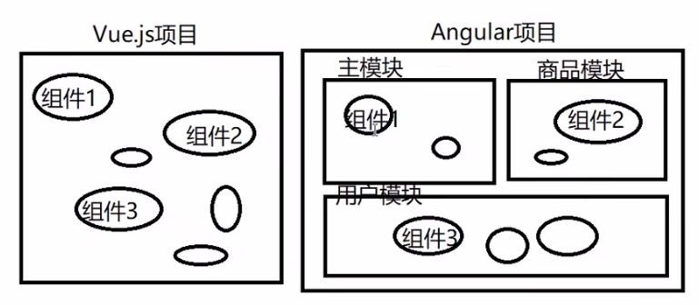
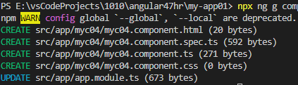
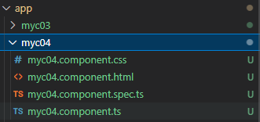
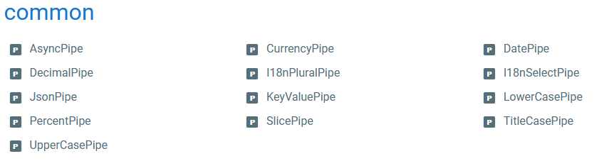
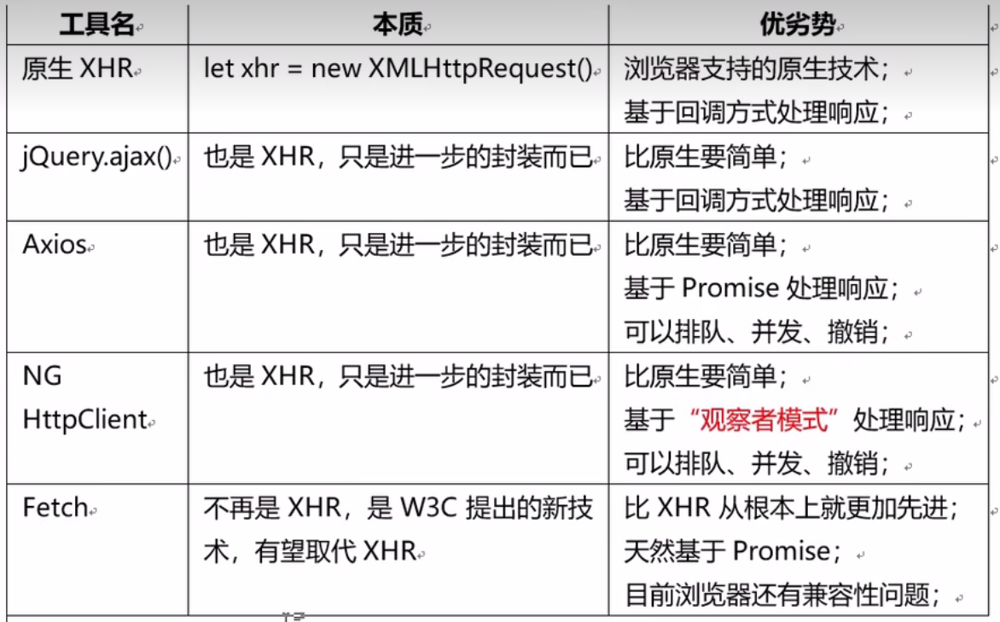
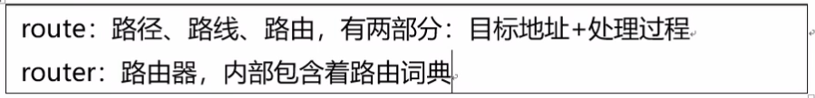
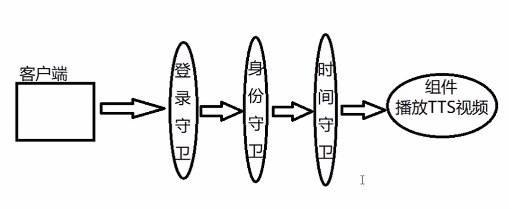
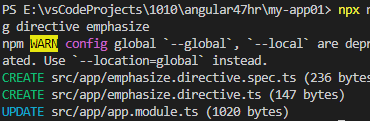
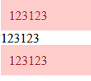

# Angular

This is a learning note refer to [Angular全套实战教程，零基础入门前端框架 P1-P60](https://www.bilibili.com/video/BV1R54y1J75g?p=95&vd_source=a788bdd4d7cdd9dfe02852346d523cb9)


Official Website: [en](https://angular.io/) | [cn](https://angular.cn/)

> MVVM 框架的组成
>
> - 数据绑定
> - 指令系统
> - 组件式编程
> - 路由和导航
> - 状态保持
> - 第三方组件库


**Tips: VScode **: 标签快捷键 key了后*再按tab, `key*`--》 `<key></key>`

# Setting up

> **Tips:** you can enable autosave in visual studio code : file > auto save

1. install node js

2. install 脚手架

   `npm i -g @angular/cli`

3. 利用脚手架工具create new project

   `ng new my-app01`

4. start run server

   `cd my-app01`

   `npm start` (ng serve)

5. visit page

   `http://127.0.0.1:port`

### Project Structure

```
- project
|-- angular.json # 定义入口(main), 
|-- package.json
|-- e2e (directory) # 测试
|-- src 
|	|-- index.html
|	|-- main.ts
```


### Angular boot analysis

（1）angular.json: NG项目配置
          index:./src/index.html    `<app-root></app-root>`
          main:./src/main.ts

（2）main.ts  > bootstrapModule(AppModule)

（3）app.module.ts > bootstrap:[AppComponent]

（4）app.component.ts > selector:'app-root'
                                           \> templateUrl: 'app.component.html'

（5）app.component.html > HTML片段




# 核心概念


### Angular核心概念之一：模块

Module：模块是一个抽象的容器，用语对组件进行分组
  **Tips: ** AppModule is the initial module when we build angular


### Angular核心概念之二：组件

> Component is a thing that can be used repeatedly eg header.
>
> Component = Template + Script + Style
>
> Component is inside module

**Steps to customize component: **

1. create component class

   > src/App/myc01.ts

   ```ts
   import { Component } from "@angular/core";
   
   // decorator ---- tell class usage
   @Component({
       selector: 'myc01' // [myTitle] <- with bracket = 属性, .myclass <- with . = class
       template: '<h2>my component C01</h2><hr>',
       // templateUrl: './myc02.component.html', // 不可有多个
       // styleUrls: ['./myc02.component.css'] // 可有多个
    })
   export class MyC01Component {
   
   }
   
   /*
   <div myTitle="xxx"></div>
   <myc01></myc01>
   */
   ```

   

2. register this component into module: declaration

   > src/app.module.ts

   ```typescript
   ...;
   import { MyC01Component } from './myc01';
   
   @NgModule({
     declarations: [
       ...
       MyC01Component
     ],
     ...
   })
   export class AppModule { }
   
   ```

   

3. use component: `<app-test></app-test>`

   > src/app.component.html

   ```html
   <h1>我的angular项目01</h1>
   <hr>
   <myc01></myc01>
   <app-myc03></app-myc03>
   ```


**Tips: ** Angular shortcut to create component: `npx ng generate component componentName` ==> short `npx ng g component componentName` (在项目根目录执行)

**Tips: ** npx use to execute the bin command in current project node_modules/.bin





> spec.ts is unit test --> can delete


### Angular核心概念之三：数据绑定

using component:

```typescript
import { Component } from '@angular/core';

@Component({
  selector: 'app-myc04',
  templateUrl: './myc04.component.html',
  styleUrls: ['./myc04.component.css']
})
export class Myc04Component {
  username = 'hello world'
  age = 18
  count = 0
  image = '1.jpg'
  empList = ['AA', 'BB', 'CC', 'DD']

  printUname() {
    console.log(this.username);
  }

  plus(): void {
    this.count++
  }

  minus(): void {
    this.count--
  }

}


```


#### HTML binding

> {{ NG expression }}
>
> **Test case of expression**
>
> ```html
> <div>Username: {{username}}</div>
> <div>Age: {{age}}</div>
> <div>next year age: {{age+1}}</div>
> <div>成年了吗： {{age>=18}}</div>
> <div>法定工作年龄： {{age >= 18 && age <= 60}}</div>
> <div>username length: {{username.length}}</div>
> <div>username upper case : {{username.toUpperCase()}}</div>
> <div>index of username: {{username[2]}}</div>
> <!-- cannot New :<div>current time: {{new Object()}}</div> -->
> <!-- cannot JSON <div>json serialize: {{JSON.stringify({})}}</div> -->
> ```

#### 属性 binding 

> in vue --> v-bind
>
> angular method 1: {{}} eg `<p title="{{msg}}">` **do not use this, js not supporting**
>
> angular method 2: [] eg `<p [title]="msg">` / `<p [title]=“‘current:’ + msg”`

#### 指令 binding

> in vue --> v-for, v-if
>
> angular : 
>
> ***ngFor**
>
> ```html
> 
> <ul>
>     <li *ngFor="let e of empList">{{e}}</li>
> </ul>
> <ul>
>     <li *ngFor="let e of empList; index as i">{{i}} - {{e}}</li> // or let i=index
> </ul>
> ```
>
> ***ngif**
>
> ```html
> <div *ngIf="isPayingUser"> // must be boolean
>     paid contents...
> </div>
> 
> ----------- if - else ----------
> <div *ngIf="isPayingUser; else payfirstBlock">
>     paid contents...
> </div>
> <!-- must be ng-template -->
> <ng-template #payfirstBlock> 
>     <div>
>         Please pay first
>     </div>
> </ng-template>
> ```
>
> **[ngStyle]** - example below not good, very high coupling
>
> ```html
> html
> ----
> <button [ngStyle]="myStyleObj" (click)="changeStyle()">加载更多</button>
> 
> ts
> --
> export class ExerciseForAndIfComponent {
>   myStyleObj = {
>     backgroundColor: '#583',
>     color: '#fff',
>     'border-color': '#252'
>   }
> 
>   changeStyle() {
>     this.myStyleObj.backgroundColor = '#f00'
>     this.myStyleObj["border-color"] = '#522'
>   }
> }
> ```
>
> **[ngClass]**
>
> ```html
> css
> ---
> .btn {
>     padding: 8px 15px;
>     border-radius: 3px;
>     color: #fff;
>     border-width: 1px;
> }
> 
> .btn-danger{
>     background-color: #a55;
>     border-color: #833;
> }
> 
> .btn-success{
>     background-color: #5a5;
>     border-color: #383;
> }
> 
> html
> ----
> <button [ngClass]="myClassObj" (click)="changeClass()">加载更多</button>
> 
> ts
> --
> export class ExerciseForAndIfComponent implements OnInit {
>  
>   myClassObj = {
>     btn: true,
>     'btn-danger': false,
>     // btnSuccess: true CANNOT
>     'btn-success': true
>   }
> 
>   changeClass() {
>     this.myClassObj['btn-success'] = false
>     this.myClassObj['btn-danger'] = true
>   }
> }
> ```
>
> **[ngSwitch] *ngSwitchCase *ngSwitchDefault
>
> ```html
> <container-element [ngSwitch]="switch_expression">
>    <some-element *ngSwitchCase="match_expression_1">...</some-element>
> ...
>    <some-element *ngSwitchDefault>...</some-element>
> </container-element>
> 
> -- example --
> <div [ngSwitch]="userLevel">
>     <p *ngSwitchCase="'normal'">欢迎您：普通用户</p>
>     <p *ngSwitchCase="'vip'">欢迎贵宾归来</p>
>     <p *ngSwitchCase="'blackgold'">黑金你好！可以为你服务吗</p>
>     <p *ngSwitchDefault>你尚未登入</p>
> </div>
> ```
>
> 

**Tips: **v-hide can refer [ngStyle] or [ngClass]

> **Angular指令分为3类**
>
> - 组件指令：NG中Component继承自Directive
>
> - 结构型指令： 会影响DOM树结构，必须使用\*开头，如\*ngFor, \*ngIf
> - 属性型指令： 不会影响DOM树结构，只是影响元素外观或行为，[ngClass], [ngStyle]


#### 事件 binding

> in vue: v-on
>
> angular : () eg`<button (click)="printUname()">` **必须有()** 

```
(click)
(ngModelChange)
()
```


#### 双向数据 binding

> in vue: v-model
>
> 方向1：Model=》View，模型变则视图变，**用[]绑定**
> 方向2：View=》Model，视图（表单元素）变则模型变，**用[()]绑定**
>  <**input/select/textarea** [(ngModle)]=" ">

**Must import FormsModule in app.module.ts**

```
import { FormsModule } from '@angular/forms';

@NgModule({
  ...
  imports: [
  	// 导入了CommonModule (includes: ngIf ... )
    BrowserModule,
    // 导入FormModule --> 提供ngModel指令
    FormsModule
  ],
  ...
})
export class AppModule { }
```

**Example**

```html
html
----
<input [(ngModel)]="uname" placeholder="your username"> 
<p>user: {{uname}}</p>

<input [(ngModel)]="uname" placeholder="your username" (ngModelChange)='doUnameChange()'>

ts
--
export class ModelbindComponent{
  	uname = "dingding"

	doUnameChange() {
    	console.log("uname changed..");
  	}

}
```


### Angular核心概念之四：过滤器

> Filter：过滤器，用于View中呈现数据时显示为另一种格式，过滤器的本质是一个函数接收原始数据转换为新的格式进行输出：function（oldVal）{处理…return newVal}
>
> eg `{{ e.salary | filterName/pipeName }}`
>
> eg `{{ e.salary | filterName/pipeName : arg1}}`
>
> **Tips: ** Angular2.x中，过滤器更名为“管道（Pipe）

**Steps** or `npx ng g pipe pipename`

1. create pipe class.ts

   > src/app/name.pipe.ts
   >
   > **Tips: **can implements PipeTransform also to double confirm no typo in 'transform' method. without it, it is ok also

   ```typescript
   import { Pipe } from '@angular/core';
   
   @Pipe({
       name: 'gender'
   })
   
   export class GenderPipe {
       transform(value: any, lang = 'en'): any {
           if (lang == 'en') {
               if (value == 1) {
                   return 'male'
               } else if (value == 0) {
                   return 'female'
               } else {
                   return 'unknown'
               }
           } else {
               if (value == 1) {
                   return '男'
               } else if (value == 0) {
                   return '女'
               } else {
                   return '未知'
               }
           }
       }
   }
   ```

2. Register pipe in module

   ```typescript
   ...
   import { GenderPipe } from './sex.pipe';
   
   @NgModule({
     declarations: [
       ...
       GenderPipe
     ],
     ...
   })
   export class AppModule { }
   
   ```

   

3. use pipe in template

   > eg {{ e.empSex | sex }}
   >
   > eg <p [title]="empSex | sex">

   ```html
    <td>{{emp.sex | gender : 'en'}}</td>
   ```


#### Angular预定义管道

https://angular.cn/api?type=pipe



```
{{ value_expression | lowercase }}
{{ value_expression | uppercase }}
{{ value_expression | titlecase }}
{{ value_expression | slice : start [ : end ] }} //从一个 Array 或 String 中创建其元素一个新子集（slice）。 eg {{emp.name | slice:0:1}}   
{{ value_expression | json }} // 把一个值转换成 JSON 字符串格式。在调试时很有用。

DecimalPipe: {{ value_expression | number [ : digitsInfo(default3) [ : locale ] ] }} // 设置小数点(四舍五入)，分隔符和其他特定于区域设置的配置。eg {{ 5000.12345 | number : '0.2-2' }} --> 800换800.20 ||| '4.1-4' --> 800换0,800.0, 5000.11111换5,000.1111

CurrencyPipe:
{{ value_expression | currency [ : currencyCode [ : display [ : digitsInfo [ : locale ] ] ] ] }} // default $ , currency : 'MYR' --> 1000换MYR1000

DatePipe:
{{ value_expression | date [ : format [ : timezone [ : locale ] ] ] }} //根据区域设置规则格式化日期值。0换Jan1,1970。 date: 'yyyy-MM-dd HH:mm:ss' 1970-01-01 07:30:00
```


### Angular核心概念之五：服务和依赖注入

>  Service and injection
>
> Angular认为：组件是与用户交互的一种对象，其中的内容都应该与用户操作有关系的；而与用户操作无关的内容都应该剥离出去，放在“服务对象”中，为组件服务；例如**日志记录、计时统计、数据服务器访问**.....

#### Provide Sigleton Service

1. create service.ts

   > **Two methods to register**
   >
   > 1. @Injectable({providedIn: 'root'}) **[!!! THIS IS SINGLETON]**
   >
   > 2. import in app.module.ts -> providers:[ xxxService] **[!!! THIS IS SINGLETON]**

   > src/app/log.service.ts

   ```typescript
   import { Injectable } from "@angular/core";
   
   @Injectable({
       // root:指定当前服务对象在“根模块”中提供-AppModule
       providedIn: 'root'
   })
   export class LogService {
       doLog(action: string) {
           let uname = 'admin4'
           let time = new Date().getTime()
           console.log(`${uname} [${time}]: ${action}`);
       }
   }
   
   ```

2. inject into another ts

   > src/app/myc/myc.ts

   ```typescript
   import { Component, OnInit } from '@angular/core';
   import { LogService } from '../log.service';
   
   @Component({
     selector: 'app-injection-depend',
     templateUrl: './injection-depend.component.html',
     styleUrls: ['./injection-depend.component.css']
   })
   export class InjectionDependComponent implements OnInit {
     //******** PAY ATTENTION
     log: LogService
     //******** PAY ATTENTION
     constructor(log: LogService) {
       this.log = log
     }
   
     doAdd() {
       console.log("adding...")
       this.log.doLog("adding")
     }
   
     doDelete() {
       console.log("delete...")
       this.log.doLog("deleting") //******** PAY ATTENTION
     }
   
     ngOnInit(): void {
     }
   
   }
   ```

3. html

   > src/app/myc/myc.html

   ```html
   <p>injection-depend works!</p>
   <button (click)="doAdd()">Add</button>
   <button (click)="doDelete()">Delete</button>
   
   ```


#### Provide separate service for component

1. create service.ts

   > **One method to register**
   >
   > 1. @Injectable() **[!!! inside bracket is empty]**

   > src/app/log.service.ts

   ```typescript
   import { Injectable } from "@angular/core";
   
   @Injectable()
   export class LogService {
       doLog(action: string) {
           let uname = 'admin4'
           let time = new Date().getTime()
           console.log(`${uname} [${time}]: ${action}`);
       }
   }
   
   ```

2. inject into another ts

   > Different with singleton: please take a look inside @Component, for singleton there is no need to have providers field

   > src/app/myc/myc.ts

   ```typescript
   import { Component, OnInit } from '@angular/core';
   import { LogService } from '../log.service';
   
   @Component({
     selector: 'app-injection-depend',
     templateUrl: './injection-depend.component.html',
     styleUrls: ['./injection-depend.component.css'],
     providers: [LogS]
   })
   export class InjectionDependComponent implements OnInit {
     //******** PAY ATTENTION
     log: LogService
     //******** PAY ATTENTION
     constructor(log: LogService) {
       this.log = log
     }
   
     doAdd() {
       console.log("adding...")
       this.log.doLog("adding")
     }
   
     doDelete() {
       console.log("delete...")
       this.log.doLog("deleting") //******** PAY ATTENTION
     }
   
     ngOnInit(): void {
     }
   
   }
   ```

3. html

   > src/app/myc/myc.html

   ```html
   <p>injection-depend works!</p>
   <button (click)="doAdd()">Add</button>
   <button (click)="doDelete()">Delete</button>
   
   ```


##### Angular 提供的服务对象 -- HttpClient Service

> 向指定的url发起异步请求， 使用步骤:
>
> 1. 在app.module.ts导入模块 HttpClientModule (@angular/common/http)
>
>    ```typescript
>    ...
>    declarations: [
>        ...
>      imports: [
>        ...
>        HttpClientModule
>      ],
>        ...
>    ```
>
>    
>
> 2. 在需要使用异步请求的组件中声明依赖与HttpClient服务对象，就可以使用该对象发起异步请求了
>
>    html
>
>    ```html
>    <button (click)="loadProduct()">加载电子商城的商品</button>
>    ```
>
>    typescript
>
>    ```typescript
>    import { HttpClient } from '@angular/common/http'; 
>    import { Component, OnInit } from '@angular/core';
>             
>    @Component({
>      selector: 'app-injection-depend',
>      templateUrl: './injection-depend.component.html',
>      styleUrls: ['./injection-depend.component.css']
>    })
>    export class InjectionDependComponent {
>      httpClient: HttpClient
>               
>      constructor(httpClient: HttpClient) {
>        this.httpClient = httpClient
>      }
>             
>      loadProduct() {
>        let url = "https://shopee.com.my/api/v4/search/search_items?by=relevancy&keyword=netflix%20account&limit=60&newest=0&order=desc&page_type=search&scenario=PAGE_GLOBAL_SEARCH&version=2"
>        this.httpClient.get(url).subscribe((res: any) => {
>          console.log(res.data)
>        })
>      }
>             
>    }
>             
>    ```
>
>    

**Extra Tips: 前端有哪些异步请求？各自的利弊？**




# 生命周期钩子

[Detail](https://v9.angular.cn/guide/lifecycle-hooks)

|                         | description                                                  |
| ----------------------- | ------------------------------------------------------------ |
| ngOnChange()            | 当属性有变                                                   |
| **ngOnInit()**          | 当组件初始化完毕 -- Vue.js的mounted                          |
| ngDoCheck()             | Angular 无法或不愿意自己检测的变化时作出反应,  紧跟在 `ngOnChanges()` 和 `ngOnInit()` 后面调用。 |
| ngAfterContentInit()    | 组件内容初始化完成, 第一次 `ngDoCheck()` 之后调用，只调用一次。 |
| ngAfterContentChecked() | 组件内容发生变化需要检查, `ngAfterContentInit()` 和每次 `ngDoCheck()` 之后调用. `<myc01><p>{{uname}}</p></myc01>` 里的`<p>...</p>` 是content |
| ngAfterViewInit()       | 组件的视图初始化完成，第一次 `ngAfterContentChecked()` 之后调用，只调用一次。 |
| ngAfterViewChecked()    | 组件的视图发生变化需要检查，`ngAfterViewInit()` 和每次 `ngAfterContentChecked()` 之后调用. template: '<.....' 的内容就是view |
| **ngOnDestroy()**       | 组件即将被从DOM树上卸载，适合执行一些资源释放性语句. 例如定时器销毁 |


# 组件数据传递

Vue.js和angular中的父子间消息传递原理是一样的，都可以用口诀：“Props Down, Events Up"


> **父组件->子组件**

1. Parent.ts

   ```typescript
   protected username = 'ABC'
   ```

2. Parent.html

   ```html
   <child [childname]="username"></child>
   ```

3. Child.ts

   ```typescript
   @Input() childname = '' //声明为输入型属性
   ```

4. Child.html

   ```html
   <p>{{childname}}</p>
   ```

   

> **子组件 -> 父组件**
>
> 孩子饿了只能哭，通过触发特定事件（其中携带着数据），把数据传递给父组件（父组件提供处理方法）

1. child.ts - 自定义发射器

   ```typescript
   @Output() emitEvent = new EventEmitter()
   ```

2. child.ts - 发射事件

   ```typescript
   doSubmit() {
       this.emitEvent.emit(this.myData)
   }
   ```

3. parent.html - 监听子组件的事件

   ```html
   <child1 (emitEvent)="parentDoSomething($event)"></child1>
   ```

4. parent.ts - 接收子组件传递的数据

   ```typescript
   parentDoSomething(data: string) {
       this.x = data
   }
   ```


> **子组件 -> 父组件**
>
> 简易方法-> 父亲直接用子元素, 谨慎使用，毕竟是别的组件的东西，破坏了封装，违反了“最少知识法则”

1. parent.html

   ```html
   <div #c0>
       <child #c1></child>
   </div>
   <button (click)="print()"></button>
   ```

2. parent.ts

   ```typescript
   @ViewChild('c0', {static: true})
   private c0: any; // object
   
   @ViewChild('c1', {static: true}) // 如果html是 #c1 *ngIf / *ngFor，那就得用static: false，意思是会有时有时无组件
   private c1: any; // object
   
   print() {
       console.log(this.c0);
       console.log(this.c1);
       this.username = this.c1.userInput
   }
   ```


> 兄弟: 子 -> 父 -> 子


# 路由和导航

> **多页面应用：** 一个项目中有多个完整HTML文件，用超链接跳转--销毁一个DOM树，同步请求另一棵，得到之后再重建DOM树。不足：DOM要反复重建，间隔会有空白
>
> **单页面应用：**称为SPA(Single Page Application), 整个项目中有且只有一个“完整的”HTML文件，其他的页面都是DIV片段，需要哪个“页面”就将其异步请求下来，“插入”到“完整的”HTML文件中。优势：整个项目中客户端只需要下载一个HTML页面，创建一个完整的DOM树，页面跳转都是一个DIV替换另一个DIV而已—能够实现过场动画; 不足：不利于SEO优化。如果不考虑营销首选



## 单页应用路由 -- Angular

1. 创建整个应用需要的路由组件

   example:

   ​	`ng g component index`

   ​	`ng g component product-list`

   ​	`ng g component product-detail`

   ​	`ng g component user-center`

2. 定义router词典 -- [(URL-组件),{URL-组件}]

   app-routing.module.ts //本来就有的，已自动导入到app.module.ts

   ```typescript
   ...
   const routes = [
       //匹配从上往下
       {path: 'index', component: componentClassName},
       {path: 'plist/:lid', component: componentClassName},
       {path: 'redirect', redirectTo: 'pdetail'}, //example of 路由重定向
       {path: '**', component: NotFoundComponent}
   ]
   
   @NgModule
   ...
   ```

   **Tips: ** path 不能以/开头, 中间允许有/

3. 注册router词典

   app-routing.module.ts

   ```typescript
   @NgModule({
     imports: [RouterModule.forRoot(routes)],
     exports: [RouterModule]
   })
   ```

   > forChild: 以后会用，例如商品模块...
   >
   > forRoot(routes)

4. 创建router组建的挂载点 --  称为"router-outlet"

   app.component.html

   ```html
   <h2>商场</h2>
   <hr>
   <router-outlet></router-outlet>
   ```

5. 访问测试

   `http://localhost:4200/`

   `http://localhost:4200/plist`


## 导航

> **Method 1: 使用模板跳转方法**

```html
<!-- 注意！以下是完全重建DOM，所以不要用！ -->
<a href="ucenter"></a>

<!-- 用我 -->
<a routerLink="/ucenter">go ucenter</a>
<div routerLink="/ucenter">go ucenter</div>
<button routerLink="/ucenter">go ucenter</button>

<!-- 如果用我的话会变到relative part which ../current/ucenter -->
<a routerLink="ucenter">go ucenter</a>
```

> **Method 2: 使用脚本跳转方法**

`this.route` //当前路由

`this.router` //路由器，一大堆的路由 // **用我**

index.ts

```typescript
router: Router
constructor(router: Router) {
    this.router = router
}

jump() {
    this.router.navigateByUrl('/pdetail')
}
```


## 路由RESTful path/{id}

for RESTful Get by ID, declare the path in routes { path:".../:id"...}, then in component ts:

```typescript
//HERE IS Route instead of Router!
constructor(private route: ActivatedRoute) {}

ngOnInit() {
    this.route.params.subscribe((data)=> {
        this.productId = data['id']
    })
}
```


## 路由嵌套

```typescript
const routes = [
    {path...},
    {
        path: 'user/center',
    	component: myComponent,
        children: [
            {path: '', component:...},
            {path: 'info', component:...},
            {path: 'avatar', component:...},
            {path: 'security', component:...}
        ]
    }
]
```

注意，挂载点应该在myComponent.html中

`<router-outlet></router-outlet>`


## 路由守卫 (Guard)

> 有些路由地址只能在特定条件下访问，例如：
>
>  	用户中心，只能登陆才能访问，（会话限制）
>  	TMOOC视频播放，只能在学校内播放（客户ip地址限制）
>  	VIP学员视频播放，只能在13:30-22:00时间播放
> 	后台所有页面，只能登录为管理员之后才能使用（权限限制）


Angular提供了“路由守卫（Guard）”来访问路由组件前的检查功能：**如果检查通过（return true）就放行，反之不放行**



1. 创建路由守卫class

   myGuard.ts

   ```typescript
   @Injectable({providedIn:'root'})
   export class LoginGuard{
       canActivate() {
           if (isValid) {
               return true
           } else {
               // 可以选择执行页面跳转
               return false
           }
       }
   }
   ```

2. 在路由词典中使用路由守卫

   app-routing.module.ts

   ```typescript
   {path: '', component:..., canActivate:[LoginGuard]}
   ```


### Example: Time Guard

```typescript
canActivate() {
    let hour = new Date().getHours()
    if (hour >= 6 && hour <= 23) {
        return true
    } else {
        // 可以选择执行页面跳转
        this.router.navigateByUrl('/index')
        return false
    }
}
```


# Exercise

>  ngModel for password restriction on length

```html
html
----
请输入密码: 
<input [(ngModel)]="password" type="password" (ngModelChange)="doPwdChange()">
<span>{{msg}}</span>

ts
--
export class ModelbindComponent {
  password = ''
  msg = 'length shall be between 6 - 12 character'

  doPwdChange(): void {
    if (this.password.length < 6 || this.password.length > 12) {
      this.msg = 'length shall be between 6 - 12 character'
    } else {
      this.msg = ''
    }
  }
}


```


> customize指令 (directive)
>
> `npx ng g directive directiveName`

`npx ng g directive emphasize` **Be noted the app.module.ts declarations will be auto-updated**



ts

```typescript
import { Directive, ElementRef } from '@angular/core';

@Directive({
  selector: '[appEmphasize]'
})
export class EmphasizeDirective {

  constructor(e: ElementRef) { 
    console.log(e);
    e.nativeElement.style.background = '#fcc'
    e.nativeElement.style.padding = '10px'
    e.nativeElement.style.color = '#a33'
  }

}

```

html

```html

<div id='d1' appEmphasize>123123</div>
<div id='d2' >123123</div>
<div id='d3' appEmphasize>123123</div>
```



## To-do list

html

```html
<p>To-do list</p>

<input [(ngModel)]="userInput" placeholder="请输入">
<button (click)="addItem()">添加事项</button>
<p *ngIf="list.length == 0; else isNotEmptyBlock">尚无待办事项</p>
<ng-template #isNotEmptyBlock>
    <ul *ngFor="let item of list; index as i">
        <li>
            {{i + 1}}-{{item}}
            <button (click)="deleteItem(i)">删除</button>
        </li>
    </ul>
</ng-template>
```

ts

```typescript
export class Myc01TodolistComponent implements OnInit {
  list = ['开会','上课','培训']
  userInput = ''

  addItem() {
    if (this.userInput.length > 0) {
      this.list.push(this.userInput)
      this.userInput = ''
    }
  }

  deleteItem(i: number) {
    this.list.splice(i, 1)
  }
  constructor() { 
  }

  ngOnInit(): void {
  }

}
```


# Extra knowledge

## YAGNI - You AreNot Gonna Need it

> 不写不惜要的代码


## DRY - Don't Repeat Yourself

> 不要重复自己的代码， 以后要改多次晕死你


## OCP - Open Close Principle

> 对扩展开放， 对修改封闭


## Low Coupling, High Cohesion

> 高聚合，低耦合
>
> 一个类里关系越紧密越好，不同类越低关系越好


## Demeter Law

> 最少知识法则, 一个对象或一个组件只负责必须的少量功能, 不要太重，可读性和可修改性都不好


## TypeScript get time 

`let now = new Date().getTime()` ==> from 1970 to now in ms

`let now = new Date().getDate()` ==> get dd
