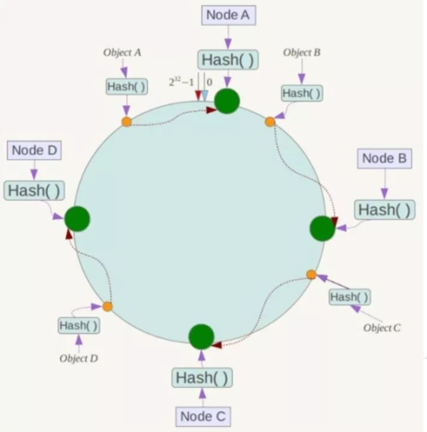

# DockerLearning + Docker Compose
This is a learning notes.

learning Docker from [狂神说](https://www.bilibili.com/video/BV1og4y1q7M4?p=1&vd_source=a788bdd4d7cdd9dfe02852346d523cb9)

Total video length : 8h 11m 41s

21.06.2022 - start

22.06.2022  - complete


reinforcement of knowledge + docker compose refer [尚硅谷-杨哥](https://www.bilibili.com/video/BV1gr4y1U7CY?p=95&vd_source=a788bdd4d7cdd9dfe02852346d523cb9)

11.09.2022 - start

11.09.2022 - complete


Environment: Linux


# What is Docker

Use for DevOps. to avoid situation :

person A : installed different environment and do coding

person B : installed different environment

a project works on A's computer but doesn't works on B's computer

.

.

Docker to solve as it is a image which store alot of layers of required software including the environment.

May including : mysql, redis, elastic search ....

In future, not handing jar --> handing docker image.

# Important Step for Docker:
DockerFile : Generate image from layer by layer of software.
DockerImages ：A product.
DockerContainer : Run an Image to provide services.


# Commands

Remember : systemctl start docker


## Help Command

```
docker version
docker info // returns a list of any containers, any images (the building blocks Docker uses to build containers), the execution and storage drivers Docker is using, and its basic configuration.
docker stats                        //status
docker networks ls
docker system df
docker help [command] // eg docker help run
```

```
docker [command] --help
```

**Tips:** Docker has a client-server architecture. It has two binaries, the Docker server provided via the dockerd binary and the docker binary, that acts as a client. As a client, the docker binary passes requests to the Docker daemon (e.g., asking it to return information about itself), and then processes those requests when they are returned. (Prior to Docker 1.12 all of this functionality was provided by a single binary: docker.)

## Image Command

```bash
docker [OPTIONS] images             //show downloaded images
       -a                           //show all
       -q                           //only show id
       
docker search imagename             //search image from docker hub. eg. docker search mysql
docker pull imagename[:version]     //download from docker hub. eg.docker pull mysql:5.7. version refer to docker hub website
docker rmi [OPTIONS] imageid        //remove image, eg. docker rmi -f $(docker -aq images) <-- delete all  
           -f                       //force
docker history imageId              //see how the image generated.   
docker tag SOURCE_IMAGE[:TAG] TARGET_IMAGE[:TAG]    //Create a tag TARGET_IMAGE that refers to SOURCE_IMAGE
docker image prune 					//delete <none>name <none>tag 虚悬镜像
docker create [OPTIONS] image [COMMAND] [ARG...] // create a new container but not run
```


##  Container Command

```
docker rm 
docker run [OPTION] image command   //run image in a container, eg. docker run -it ubuntu /bin/bash
            --name=?                //container name, else give random name. Name are unique, if we try to create 2 containers with same name, the command will fail
            -d                      //run in background
            -it                     //i(keeps STDIN open from the container, even if were not attached to it) + t(assign a pseudo-tty), thus provide an interative shell in the new container
            -p x:y                  //use localhost port x to visit container port y (expose port y)
            -P                      //publish all exposed ports to random ports
            --rm                    //when exit: delete container
            -e                      //[e]nvironment variable eg. -e ES_JAVA_OPTS="-Xms64m -Xmx512m" (elastic search) 
            -v a:b                  //mount localDir:containerDir
            --volumes-from ContainerIdOrName //share volume from ...
    while using:  exit              // stop the container
                  ctrl + p + q      //run in background
                                    //eg sudo docker run --name daemon_dave -d ubuntu /bin/sh -c "while true; do echo hello world; sleep 1; done"

docker ps [OPTIONS]                 //show currently 'up' container
          -a                        //all including 'exit' container
          -n=?                      //last n numbers
          -q                        //quiet - show only container id
          -l                        //last run container
```

```
docker start containerId // restart stopped container
docker restart containerId
docker stop containerId
docker kill containerId

docker commit [OPTIONS] containerId imageName:version   //commit and create your image in your images
              -m="?"                                    //description
              -a="?"                                    //author             
```

### Ways to identify containers
1. a short UUID (like f7cbdac22a02)
2. a longer UUID (like f7cbdac22a02e03c9438c729345e54db9d
20cfa2ac1fc3494b6eb60872e74778)
3. a name (like gray_cat)


## Volumes commands

```
docker volume ls
docker volume inspect
```


## Other useful commands

```
docker logs [OPTIONS] containerId   //show logs
            -ft                     //Follow logs output, Timestamp
            --tail number           //show only last [number]

docker top containerId              //show detail of process, shows the user who run it, and entry command
```

```
docker inspect containerId          //show container's detail
docker exec -it containerId  command//enter container (start from zero)
docker attach containerId/name           //reattach to started container session
docker cp containerId:path destPath //copy file from container to host
```


# Visualize (rarely use)

### Portainer

- portainer : Docker's visualize management tool

  
```
docker run -d -p 8000:8000 -p 9000:9000 --name portainer     --restart=always     -v /var/run/docker.sock:/var/run/docker.sock     -v portainer_data:/data     portainer/portainer
```

**Restart always : **docker重启后portainer也自动重启

visit port 9090


## CIG

> save the stat of docker container, provide health check
>
> - CAdvisor 监控收集 --- 默认存储2分钟数据 --> InfluxDB
> - InfluxDB 存储数据
> - Granfana 展示图表


> docker-compose.yml

```yaml
version: '3.1'
 
volumes:
  grafana_data: {}
 
services:
 influxdb:
  image: tutum/influxdb:0.9
  restart: always
  environment:
    - PRE_CREATE_DB=cadvisor
  ports:
    - "8083:8083"
    - "8086:8086"
  volumes:
    - ./data/influxdb:/data
 
 cadvisor:
  image: google/cadvisor
  links:
    - influxdb:influxsrv
  command: -storage_driver=influxdb -storage_driver_db=cadvisor -storage_driver_host=influxsrv:8086
  restart: always
  ports:
    - "8080:8080"
  volumes:
    - /:/rootfs:ro
    - /var/run:/var/run:rw
    - /sys:/sys:ro
    - /var/lib/docker/:/var/lib/docker:ro
 
 grafana:
  user: "104"
  image: grafana/grafana
  user: "104"
  restart: always
  links:
    - influxdb:influxsrv
  ports:
    - "3000:3000"
  volumes:
    - grafana_data:/var/lib/grafana
  environment:
    - HTTP_USER=admin
    - HTTP_PASS=admin
    - INFLUXDB_HOST=influxsrv
    - INFLUXDB_PORT=8086
    - INFLUXDB_NAME=cadvisor
    - INFLUXDB_USER=root
    - INFLUXDB_PASS=root

```

1. `docker-compose config -q`
2. `docker-compose up -d`
3. testing CAdvisor: visit ip:8080 (first time: might be slow)
4. testing InfluxDB: visit ip:8083
5. testing Grafana: visit ip:3000 (default user/pwd = admin/admin)
   - setting refer [here](https://www.bilibili.com/video/BV1gr4y1U7CY?p=93&spm_id_from=pageDriver&vd_source=a788bdd4d7cdd9dfe02852346d523cb9)


# About Image

- What : light-weight software package, which include the software itself and environments and development software used.
- How to get : Hub, copied from friends, selfmake 
- using UnionFs --> save file layer by layer --> avoid duplicate layer


## Base Image
`ubuntu` // hundreds mb
`alpine` // Alpine Linux, 5mb

# About Volume (Directories synchronize)


**Everything change in container directory reflect in local directory, vice versa. **

i) prevent the data lost when removing a container.
ii) prevent the needs to exec container to change data. 


- Method 1: docker run ...
  ```
  -v containerDir           #anonymous mount
  -v name:containerDir      #named mount
  -v localDir:containerDir  #path mount
  
  Q: -v juming-nginx:/etc/nginx:ro nginx <-- what is :ro? (eg rw...)
  read only. This dir cannot be modified using container, however it is allowed when using localDir.
  ```
- Method 2: DockerFile
  ```
  ###filename: dockerfile1
  
  FROM centos 
  
  VOLUME ["volume01","volume02"] # <--- anonymous mount
  
  CMD echo "----end----"
  CMD /bin/bash
  ```
  to build a image : docker build -f /..../dockerfile1 -t imageName:tag . ***there is a '.'at last**
  Tips: to share these volume
      docker run -it --name name2 **--volumes-from name1** imageName:tag
      * after remove name1, the shared volume still shared by name2. 


# About DockerFile

> **Steps:**
>
> 1. write DockerFile
> 2. docker build构建镜像 == >docker build -t centosjava8:1.5 . **[!! do not ignore '.']**
> 3. docker run


- What is DockerFile ? It is a shellscript, to generate an image. 
- create mounts everytime when building this dockerfile generated image.


```dockerfile
#Commands: ****MUST BE CAPITAL LETTER,
#<-- is comment

FROM centos:7
MAINTAINER jacksoon<abcdefg@gmail.com>

RUN -- 2 methods, 在DOCKER BUILD时运行
-----------------------------------
RUN <shell command>
RUN yum -y install vim
RUN ["可执行文件","参数1"，"参数2”]
RUN ["./test.php","dev","offline"] # equal RUN ./test.php dev offline

EXPOSE the current container port
---------------------------------
EXPOSE 80

WORKDIR 指定创建容器后默认登陆落脚点
--------------------------------
WORKDIR /usr/bin

USER 指定该镜像以什么样的用户去执行，如果都不指定，默认是root

ENV 用来在构建镜像过程中设置环境变量
-------------------------------
ENV MY_PATH /usr/mytest
# 这个环境变量可以在后续的任何RUN指令中使用，这就如同在命令前面指定了环境变量前缀一样；也可以在其它指令中直接使用这些环境变量，
# 比如：WORKDIR $MY_PATH

VOLUME 容器数据卷，用于数据保存和持久化工作，-v

ADD 将宿主机目录下的文件拷贝进镜像且会自动处理URL和解压tar压缩包,等于COPY+解压
COPY 类似ADD(COPY 不解压)，拷贝文件和目录到镜像中。 将从构建上下文目录中 <源路径> 的文件/目录复制到新的一层的镜像内的 <目标路径> 位置
 
CMD 指定容器启动后的要干的事情，在DOCKER RUN时运行
--------------------------------------------
# Dockerfile 中可以有多个 CMD 指令，但只有最后一个生效，CMD 会被 docker run 之后的参数替换，eg tomcat 本来dockerFile有CMD ["catalina.sh","run"]， 当你 docker run ... tomcat, 访问localhost:8080是没问题的，但当docker run ... tomcat /bin/bash 时就没有启动tomcat,因为覆盖了CMD ["catalina.sh","run"]
CMD <shell command>
CMD ["可执行文件","参数1"，"参数2”]

ENTRYPOINT 也是用来指定一个容器启动时要运行的命令
------------------------------------------
# 类似于 CMD 指令，但是ENTRYPOINT不会被docker run后面的命令覆盖， 而且这些命令行参数会被当作参数送给 ENTRYPOINT 指令指定的程序
ENTRYPOINT ["<executeable>","<param1>","<param2>"...]
#ENTRYPOINT可以和CMD一起用，一般是变参才会使用 CMD ，这里的 CMD 等于是在给 ENTRYPOINT 传参。
#当指定了ENTRYPOINT后，CMD的含义就发生了变化，不再是直接运行其命令而是将CMD的内容作为参数传递给ENTRYPOINT指令，他两个组合会变成 


ONBUILD                       # while building extended dockerfile, use this command
```


*IF named: Dockerfile, there is no need to use -f to mention it. build command will search for it automatically.


>My image example 1:
```dockerfile
FROM centos:7
MAINTAINER jacksoon<abcdefg@gmail.com>

ENV MYPATH /usr/local
WORKDIR $MYPATH

RUN yum -y install vim
RUN yum -y install net-tools

EXPOSE 80

CMD echo $MYPATH
CMD echo "----end----"
CMD /bin/bash
```
>My image example 2: (Tomcat + JDK)
```dockerfile
FROM centos:7
MAINTEINER jacksoon<abcdefg@gmail.com>

COPY readme.txt /usr/local/readme.txt
ADD jdk-8u331-linux-x64.tar.gz /usr/local/
ADD apache-tomcat-9.0.63.tar.gz /usr/local/

RUN yum -y install vim

ENV MYPATH /usr/local
WORKDIR $MYPATH

ENV JAVA_HOME /usr/local/jdk1.8.0_331
ENV CLASSPATH $JAVA_HOME/lib/dt.jar:$JAVA_HOME/lib/tools.jar
ENV CATALINA_HOME /usr/local/apache-tomcat-9.0.63
ENV CATALINA_BASE /usr/local/apache-tomcat-9.0.63
ENV PATH $PATH;$JAVA_HOME/bin;$CATALINA_HOME/lib;$CATALINA_HOME/bin

EXPOSE 8080

CMD /usr/local/apache-tomcat-9.0.63/bin/startup.sh && tail -F /usr/local/apache-tomcat-9.0.63/logs/catalina.out

```
example to run:
  docker run -d -p 9090:8080 -v /home/kuangshen/build/tomcat/test:/usr/local/apache-tomcat-9.0.63/webapps/test 
  -v /home/kuangshen/build/tomcat/tomcatlogs/:/usr/local/apache-tomcat-9.0.63/logs mytomcatjdk


> My image example 3:

```dockerfile
FROM centos
MAINTAINER zzyy<zzyybs@126.com>
 
ENV MYPATH /usr/local
WORKDIR $MYPATH
 
#安装vim编辑器
RUN yum -y install vim
#安装ifconfig命令查看网络IP
RUN yum -y install net-tools
#安装java8及lib库
RUN yum -y install glibc.i686
RUN mkdir /usr/local/java
#ADD 是相对路径jar,把jdk-8u171-linux-x64.tar.gz添加到容器中,安装包必须要和Dockerfile文件在同一位置
ADD jdk-8u171-linux-x64.tar.gz /usr/local/java/
#配置java环境变量
ENV JAVA_HOME /usr/local/java/jdk1.8.0_171
ENV JRE_HOME $JAVA_HOME/jre
ENV CLASSPATH $JAVA_HOME/lib/dt.jar:$JAVA_HOME/lib/tools.jar:$JRE_HOME/lib:$CLASSPATH
ENV PATH $JAVA_HOME/bin:$PATH
 
EXPOSE 80
CMD echo $MYPATH
CMD echo "success--------------ok"
CMD /bin/bash

```

`docker build -t centosjava8:1.5 . `


> My Image Example 4:

```dockerfile
FROM ubuntu
MAINTAINER zzyy<zzyybs@126.com>
 
ENV MYPATH /usr/local
WORKDIR $MYPATH
 
RUN apt-get update
RUN apt-get install net-tools
#RUN apt-get install -y iproute2
#RUN apt-get install -y inetutils-ping
 
EXPOSE 80
 
CMD echo $MYPATH
CMD echo "install inconfig cmd into ubuntu success--------------ok"
CMD /bin/bash
```


> My Image Example 5: Jar

```dockerfile
# 基础镜像使用java
FROM java:8
# 作者
MAINTAINER zzyy
# VOLUME 指定临时文件目录为/tmp，在主机/var/lib/docker目录下创建了一个临时文件并链接到容器的/tmp
VOLUME /tmp
# 将jar包添加到容器中并更名为zzyy_docker.jar
ADD docker_boot-0.0.1-SNAPSHOT.jar zzyy_docker.jar
# 运行jar包
RUN bash -c 'touch /zzyy_docker.jar' # some people said this is for update the modify date and time
ENTRYPOINT ["java","-jar","/zzyy_docker.jar"]
#暴露6001端口作为微服务
EXPOSE 6001

```

`docker build -t zzyy_docker:1.6 .`

`docker run -d -p 6001:6001 zzyy_docker:1.6`

`curl 127.0.0.1:6001/order/docker`


>Different between CMD and ENTRYPOINT

CMD ["ls","-a"] vs ENTRYPOINT ["ls","-a"]

docker run imageWithCMD -l --> error

docker run imageWithENTRYPOINT -l ---> became ls -al


# Push to DockerHub

- register in hub.docker.com
- login in docker using in terminal
```dockerfile
docker login [OPTIONS] [SERVER] //no server = default daemon
              -p passwd       //password [dont use this option, to use encryt in next line]
              -u username     //username 
```
- push to dockerhub
```
docker push name:tag
```


# Docker Network


ip addr --> found docker0


>check containers's ip:
>
>docker exec -it tomcat01 ip addr 
>
>*need to apt update && apt install -y iproute2 (inside container) <--- incase:
>
>

>noticed 20 and 21!
>
>

> main terminal ping 172.17.0.2 --> ok
>
> 

> main terminal ip addr became:, noticed 21 and 20! Tally with above mentioned --> veth-pair
>
> 


**veth-pair as a bridge to connect and transfer data**
- Openstac, Docker use veth-pair. 
- different container is **able** to ping pong each other.


## --link (NOT RECOMMENDED)


- we hope to ping each other by Name instead of Ip:

- eg. docker run -d -P --name tomcat01 --link tomcat02 tomcat

- tomcat01 record the tomcat02 ip into its' /etc/hosts

- **!!! the tomcat02 side cannot ping pong it since it did NOT record ip into its' hosts file.**

  

**.... As Docker0 Failed to do so... --> customize own network**


## Customize Network -- solve dynamic ip --> able to ping by Name


```dockerfile
docker network create --driver bridge --subnet 192.168.150.0/24 --gateway 192.168.150.1 mynet
```


```dockerfile
docker run -d --name tomcat01 --net mynet tomcat
docker run -d --name tomcat02 --net mynet tomcat
docker exec -it tomcat01 ping tomcat02 #OK!!!
docker exec -it tomcat02 ping tomcat01 #OK!!!
```


## Connection between Container & Network


```dockerfile
docker network connect [OPTIONS] NETWORK CONTAINER
```

--> docker network inspect mynet --> container is shown in mynet Containers;


# Exercise

## Exercise - Redis Cluster

3 master 3 slave model

```dockerfile
#create network
docker network create redis --subnet 172.38.0.0/16 
```

```shell
#shell to paste and make 6 settings for mentioned model
for port in $(seq 1 6); \
do \
mkdir -p /mydata/redis/node-${port}/conf
touch /mydata/redis/node-${port}/conf/redis.conf
cat << EOF >/mydata/redis/node-${port}/conf/redis.conf
port 6379
bind 0.0.0.0
cluster-enabled yes
cluster-config-file nodes.conf
cluster-node-timeout 5000
cluster-announce-ip 172.38.0.1${port}
cluster-announce-port 6379
cluster-announce-bus-port 16379
appendonly yes
EOF
done

```

```shell
#shell to paste and open 6 redis containers

for port in $(seq 1 6);
do \
docker run -p 637${port}:6379 -p 1637${port}:16379 --name redis-${port} \
-v /mydata/redis/node-${port}/data:/date \
-v /mydata/redis/node-${port}/conf/redis.conf:/etc/redis/redis.conf \
-d --net redis --ip 172.38.0.1${port} redis:5.0.9-alpine3.11 redis-server /etc/redis/redis.conf
done

#####################################################
docker run -p 6371:6379 -p 16371:16379 --name redis-1 \
-v /mydata/redis/node-1/data:/date \
-v /mydata/redis/node-1/conf/redis.conf:/etc/redis/redis.conf \
-d --net redis --ip 172.38.0.11 redis:5.0.9-alpine3.11 redis-server /etc/redis/redis.conf
```

```dockerfile
docker exec -it redis-1 /bin/sh #no /bin/bash

redis-cli --cluster create 172.38.0.11:6379 172.38.0.12:6379 172.38.0.13:6379 172.38.0.14:6379 172.38.0.15:6379 172.38.0.16:6379 --cluster-replicas 1
```

DONE !

test:

```shell
redis-cli -c 		#-c stands for cluster
..
: cluster info
: cluster nodes
```


## Exercise - SpringBoot Project Image


Package


Saw my jar


create Dockerfile & copy out jar from target


```
FROM java:8

COPY *.jar /app.jar

CMD ["--server.port=8080"]

EXPOSE 8080

ENTRYPOINT ["java","-jar","/app.jar"]
```

..

build

..

run

..

curl localhost:port/test/hello


succeed!

# Shortcut for future

```dockerfile
docker run -d --name elasticsearch -p 9200:9200 -p 9300:9300 -e "discovery.type=single-node" -e ES_JAVA_OPTS="-Xms64m -Xmx512m" elasticsearch:7.6.2

docker run -d --name mysql01 -p 3310:3306 -v /home/mysql/conf:/etc/mysql/conf.d -v /home/mysql/data:/var/lib/mysql -e MYSQL_ROOT_PASSWORD=123456 -e TZ=Asia/Kuala_Lumpur mysql

docker run -d --name mysql01 -p 8806:3306 -e MYSQL_ROOT_PASSWORD=123456 -e TZ=Asia/Kuala_Lumpur mysql
```

```
=======
tomcat
=======
docker pull tomcat
docker run -it -p 8080:8080 --name t1 tomcat
// tips: 404 is normal, maybe not expose firewall
// maybe inside /usr/local/tomcat/webapps is nothing
// --> rename: mv webapss.dist webapps (for new version tomcat) --> ok

=======
mysql
=======
docker pull mysql:5.7
docker run -p 3306:3306 --privileged=true -v /abc/mysql/log:/var/log/mysql -v /abc/mysql/data:/var/lib/mysql -v /abc/mysql/conf:/etc/mysql/conf.d -e MYSQL_ROOT_PASSWORD=345678 -d --name mysql mysql:5.7

/abc/mysql/conf: vim my.cnf // to solve latin1 problem
[client]
default_character_set=utf8
[mysqld]
collation_server = utf8_general_ci
character_set_server = utf8

docker exec -it containerID /bin/bash
mysql -u root -p

=======
redis
=======
docker pull redis:6.0.8

cp redis.conf /app/redis/ // my config file
-- update --
-- enable redis external connection: 注释掉#bind 127.0.0.1
-- enable demonize : daemonize yes
-- optional: appendonly yes
-- optional: requirepass 123
-- optional: protected-mode no

docker run -d -p 6379:6379 --privileged=true -v /app/redis/redis.conf:/etc/redis/redis.conf -v /app/redis/data:/data --name redis redis:6.0.8 redis-server /etc/redis/redis.conf //连在一起, 让redis-server去读 /etc/redis/redis.conf

docker exec -it .... /bin/bash
redis-cli
```

```bash
==========
MYSQL -主从
==========
主
==
docker run -p 3307:3306 --name mysql-master \
-v /mydata/mysql-master/log:/var/log/mysql \
-v /mydata/mysql-master/data:/var/lib/mysql \
-v /mydata/mysql-master/conf:/etc/mysql \
-e MYSQL_ROOT_PASSWORD=root  \
-d mysql:5.7

// 进入/mydata/mysql-master/conf目录下新建my.cnf
vim my.cnf

[mysqld]
## 设置server_id，同一局域网中需要唯一
server_id=101 
## 指定不需要同步的数据库名称
binlog-ignore-db=mysql  
## 开启二进制日志功能
log-bin=mall-mysql-bin  
## 设置二进制日志使用内存大小（事务）
binlog_cache_size=1M  
## 设置使用的二进制日志格式（mixed,statement,row）
binlog_format=mixed  
## 二进制日志过期清理时间。默认值为0，表示不自动清理。
expire_logs_days=7  
## 跳过主从复制中遇到的所有错误或指定类型的错误，避免slave端复制中断。
## 如：1062错误是指一些主键重复，1032错误是因为主从数据库数据不一致
slave_skip_errors=1062

docker restart mysql-master
docker exec -it mysql-master /bin/bash
mysql -uroot -proot
CREATE USER 'slave'@'%' IDENTIFIED BY '123456';
GRANT REPLICATION SLAVE, REPLICATION CLIENT ON *.* TO 'slave'@'%';

==
从
==
docker run -p 3308:3306 --name mysql-slave \
-v /mydata/mysql-slave/log:/var/log/mysql \
-v /mydata/mysql-slave/data:/var/lib/mysql \
-v /mydata/mysql-slave/conf:/etc/mysql \
-e MYSQL_ROOT_PASSWORD=root  \
-d mysql:5.7

# 进入/mydata/mysql-slave/conf目录下新建my.cnf
vim my.cnf

[mysqld]
## 设置server_id，同一局域网中需要唯一
server_id=102
## 指定不需要同步的数据库名称
binlog-ignore-db=mysql  
## 开启二进制日志功能，以备Slave作为其它数据库实例的Master时使用
log-bin=mall-mysql-slave1-bin  
## 设置二进制日志使用内存大小（事务）
binlog_cache_size=1M  
## 设置使用的二进制日志格式（mixed,statement,row）
binlog_format=mixed  
## 二进制日志过期清理时间。默认值为0，表示不自动清理。
expire_logs_days=7  
## 跳过主从复制中遇到的所有错误或指定类型的错误，避免slave端复制中断。
## 如：1062错误是指一些主键重复，1032错误是因为主从数据库数据不一致
slave_skip_errors=1062  
## relay_log配置中继日志
relay_log=mall-mysql-relay-bin  
## log_slave_updates表示slav
·	show master status;e将复制事件写进自己的二进制日志
log_slave_updates=1  
## slave设置为只读（具有super权限的用户除外）
read_only=1

docker restart mysql-slave
#在主:show master status; 注意看master_log_file. position
docker exec -it mysql-slave /bin/bash
mysql -uroot -proot

change master to master_host='192.168.149.130', master_user='slave', master_password='123456', master_port=3307, master_log_file='mall-mysql-bin.000001', master_log_pos=617, master_connect_retry=30;

show slave status \G; # \G show key -- value instead of table
#看到 Slave_IO_Running 和 Slave_SQL_Running 还没开始
start slave;
show slave status \G;

```

> master_host：主数据库的IP地址；
>
> master_port：主数据库的运行端口；
>
> master_user：在主数据库创建的用于同步数据的用户账号；
>
> master_password：在主数据库创建的用于同步数据的用户密码；
>
> master_log_file：指定从数据库要复制数据的日志文件，通过查看主数据的状态，获取File参数；
>
> master_log_pos：指定从数据库从哪个位置开始复制数据，通过查看主数据的状态，获取Position参数；
>
> master_connect_retry：连接失败重试的时间间隔，单位为秒。


> **Redis 3主3从**

```bash
关闭防火墙+启动docker后台服务

docker run -d --name redis-node-1 --net host --privileged=true -v /data/redis/share/redis-node-1:/data redis:6.0.8 --cluster-enabled yes --appendonly yes --port 6381
 
docker run -d --name redis-node-2 --net host --privileged=true -v /data/redis/share/redis-node-2:/data redis:6.0.8 --cluster-enabled yes --appendonly yes --port 6382
 
docker run -d --name redis-node-3 --net host --privileged=true -v /data/redis/share/redis-node-3:/data redis:6.0.8 --cluster-enabled yes --appendonly yes --port 6383
 
docker run -d --name redis-node-4 --net host --privileged=true -v /data/redis/share/redis-node-4:/data redis:6.0.8 --cluster-enabled yes --appendonly yes --port 6384
 
docker run -d --name redis-node-5 --net host --privileged=true -v /data/redis/share/redis-node-5:/data redis:6.0.8 --cluster-enabled yes --appendonly yes --port 6385
 
docker run -d --name redis-node-6 --net host --privileged=true -v /data/redis/share/redis-node-6:/data redis:6.0.8 --cluster-enabled yes --appendonly yes --port 6386

docker exec -it redis-node-1 /bin/bash

构建主从关系
-----------
# --cluster-replicas 1 表示为每个master创建一个slave节点
redis-cli --cluster create 192.168.111.147:6381 192.168.111.147:6382 192.168.111.147:6383 192.168.111.147:6384 192.168.111.147:6385 192.168.111.147:6386 --cluster-replicas 1

# ·	链接进入6381作为切入点，查看集群状态, 查看节点状态
redis-cli -p 6381 -c # -c (cluster)防止路由失效，which cannot save the data not in his slot
cluster info
cluster nodes

# 查看集群状态
redis-cli --cluster check 自己IP:6381

扩容 ==> 4主4从
--------------
docker run -d --name redis-node-7 --net host --privileged=true -v /data/redis/share/redis-node-7:/data redis:6.0.8 --cluster-enabled yes --appendonly yes --port 6387

docker run -d --name redis-node-8 --net host --privileged=true -v /data/redis/share/redis-node-8:/data redis:6.0.8 --cluster-enabled yes --appendonly yes --port 6388

redis-cli --cluster add-node 自己实际IP地址:6387 自己实际IP地址:6381
# 6387 就是将要作为master新增节点
# 6381 就是原来集群节点里面的领路人，相当于6387拜拜6381的码头从而找到组织加入集群

redis-cli --cluster check 真实ip地址:6381
# Result: 0 slots | 0 slaves。并没有槽号

# 重新分派槽号
redis-cli --cluster reshard IP地址:端口号
# redis-cli --cluster reshard 192.168.111.147:6381
##-- how many slots do you want to move (from 1 to 16384)
4096 #16384/4
##-- what is the receiving node ID?
asdfbh34hbadsf8y123hbakdf #新加入的node的ID
##-- Please enter the source node IDs
all

# 分配从
redis-cli --cluster add-node ip:新slave端口 ip:新master端口 --cluster-slave --cluster-master-id 新主机节点ID
#redis-cli --cluster add-node 192.168.111.147:6388 192.168.111.147:6387 --cluster-slave --cluster-master-id e4781f644d4a4e4d4b4d107157b9ba8144631451-------这个是6387的编号，按照自己实际情况

缩容 ==> 3主3从
--------------
#先删从
redis-cli --cluster del-node ip:从机端口 从机6388节点ID 
# redis-cli --cluster del-node 192.168.111.147:6388 5d149074b7e57b802287d1797a874ed7a1a284a8

#将6387的槽号清空，重新分配，本例将清出来的槽号都给6381
# if want to seperate balance, need to split three times for 6381, 6382, 6383
redis-cli --cluster reshard 192.168.111.147:6381
##--How many slots do you want to move (from 1 to 16384)?
4096
##--What is the receiving node ID? 
qewryhuiqweruu1239h # this is 6381 id, 让他接手空出来的slot
##-- Please enter the source node IDs
##-- Source node #1
basdhfkdasfihaifdh123 # this is 6387 id which to be deleted
##-- Source node #2
done

redis-cli --cluster del-node ip:端口 6387节点ID
# redis-cli --cluster del-node 192.168.111.147:6387 e4781f644d4a4e4d4b4d107157b9ba8144631451

```


**Tips:  **

- 如果一个master死了，再回来不会变成master，会变成slave先
- 如果扩展了, slot不是平均分。 eg 3machine: 0-5460 , 5461-10922, 10923-16383 ===> 1365-5460, 6827-10922, 12288-16383, {0-1364, 5461-6826...}

# Docker Compose

> 可以管理多个 Docker 容器组成一个应用。你需要定义一个 YAML 格式的配置文件docker-compose.yml，写好多个容器之间的调用关系。然后，只要一个命令，就能同时启动/关闭这些容器

> Official website documentation

https://docs.docker.com/compose/compose-file/compose-file-v3/


> Download links

https://docs.docker.com/compose/install/

1. `curl -SL https://github.com/docker/compose/releases/download/v2.10.2/docker-compose-linux-x86_64 -o /usr/local/bin/docker-compose`
2.  ` chmod +x  /usr/local/bin/docker-compose  `
3. `docker-compose --version`

999. uninstall `rm /usr/local/bin/docker-compose`


## command

```bash
docker-compose -h                           # 查看帮助
docker-compose up                           # 启动所有docker-compose服务
docker-compose up -d                        # 启动所有docker-compose服务并后台运行
docker-compose down                         # 停止并删除容器、网络、卷、镜像。
docker-compose exec  yml里面的服务id                 # 进入容器实例内部  docker-compose exec docker-compose.yml文件中写的服务id /bin/bash
docker-compose ps                      # 展示当前docker-compose编排过的运行的所有容器
docker-compose top                     # 展示当前docker-compose编排过的容器进程
 
docker-compose logs  yml里面的服务id     # 查看容器输出日志
dokcer-compose config     # 检查配置
dokcer-compose config -q  # 检查配置，有问题才有输出
docker-compose restart   # 重启服务
docker-compose start     # 启动服务
docker-compose stop      # 停止服务

```


## comparison

mysql > redis > jar

### without docker compose

```bash
docker exec -it mysql57 /bin/bash
mysql -uroot -p
create database db2021;
use db2021;
CREATE TABLE `t_user` (...),

docker run  -p 6379:6379 --name redis608 --privileged=true -v /app/redis/redis.conf:/etc/redis/redis.conf -v /app/redis/data:/data -d redis:6.0.8 redis-server /etc/redis/redis.conf

docker run -d -p 6001:6001 myjarservice1:1.6

```

**Be noted that in myjarservice1, the application.properties host is fixed ip**

> application.properties

```properties
server.port=6001
# ========================alibaba.druid相关配置=====================
spring.datasource.type=com.alibaba.druid.pool.DruidDataSource
spring.datasource.driver-class-name=com.mysql.jdbc.Driver
spring.datasource.url=jdbc:mysql://192.168.111.169:3306/db2021?useUnicode=true&characterEncoding=utf-8&useSSL=false
spring.datasource.username=root
spring.datasource.password=123456
spring.datasource.druid.test-while-idle=false
# ========================redis相关配置=====================
spring.redis.database=0
spring.redis.host=192.168.111.169
spring.redis.port=6379
spring.redis.password=
spring.redis.lettuce.pool.max-active=8
spring.redis.lettuce.pool.max-wait=-1ms
spring.redis.lettuce.pool.max-idle=8
spring.redis.lettuce.pool.min-idle=0
# ========================mybatis相关配置===================
mybatis.mapper-locations=classpath:mapper/*.xml
mybatis.type-aliases-package=com.atguigu.docker.entities
# ========================swagger=====================
spring.swagger2.enabled=true

```


### using docker compose

> application.properties

```properties
server.port=6001

# ========================alibaba.druid相关配置=====================
spring.datasource.type=com.alibaba.druid.pool.DruidDataSource
spring.datasource.driver-class-name=com.mysql.jdbc.Driver
#spring.datasource.url=jdbc:mysql://192.168.111.169:3306/db2021?useUnicode=true&characterEncoding=utf-8&useSSL=false
spring.datasource.url=jdbc:mysql://mysql:3306/db2021?useUnicode=true&characterEncoding=utf-8&useSSL=false
spring.datasource.username=root
spring.datasource.password=123456
spring.datasource.druid.test-while-idle=false

# ========================redis相关配置=====================
spring.redis.database=0
#spring.redis.host=192.168.111.169
spring.redis.host=redis
spring.redis.port=6379
spring.redis.password=
spring.redis.lettuce.pool.max-active=8
spring.redis.lettuce.pool.max-wait=-1ms
spring.redis.lettuce.pool.max-idle=8
spring.redis.lettuce.pool.min-idle=0

# ========================mybatis相关配置===================
mybatis.mapper-locations=classpath:mapper/*.xml
mybatis.type-aliases-package=com.atguigu.docker.entities

# ========================swagger=====================
spring.swagger2.enabled=true

```


> docker-compose.yml

```yaml
version: "3"
 
services:
  microService:
    image: zzyy_docker:1.6
    container_name: ms01 ## --name ms01
    ports: # -v 6001:6001
      - "6001:6001" 
    volumes:
      - /app/microService:/data
    networks:  # --network atguigu_net
      - atguigu_net 
    depends_on: 
      - redis
      - mysql
 
  redis: # default name: mydocker_redis
    image: redis:6.0.8
    ports:
      - "6379:6379"
    volumes:
      - /app/redis/redis.conf:/etc/redis/redis.conf
      - /app/redis/data:/data
    networks: 
      - atguigu_net
    command: redis-server /etc/redis/redis.conf
 
  mysql: # default name: mydocker_mysql
    image: mysql:5.7
    environment:
      MYSQL_ROOT_PASSWORD: '123456'
      MYSQL_ALLOW_EMPTY_PASSWORD: 'no'
      MYSQL_DATABASE: 'db2021'
      MYSQL_USER: 'zzyy'
      MYSQL_PASSWORD: 'zzyy123'
    ports:
       - "3306:3306"
    volumes:
       - /app/mysql/db:/var/lib/mysql
       - /app/mysql/conf/my.cnf:/etc/my.cnf
       - /app/mysql/init:/docker-entrypoint-initdb.d
    networks:
      - atguigu_net
    command: --default-authentication-plugin=mysql_native_password #解决外部无法访问
 
networks: 
   atguigu_net: # 会创建bridge # default name: mydocker_atguigu_net

```

`dokcer-compose config -q` # 检查配置，有问题才有输出

`docker-compose up -d`

`docker-compose stop`


**Tips: **10多20个的时候选择k8s


# Advance Knowledge to Learn (In future)


##  2. Docker Swarm

逐渐被K8s取代


## 3. CI/CD -- Jenkins

## 4. K8s

suggested 雷丰阳


# Extra knowledge:

> 亿级缓存算法

- 哈希取余分区, hash(key) % N个机器台数，计算出哈希值，用来决定数据映射到哪一个节点上

- 一致性哈希环, Object 顺时钟找到node，就算一个node死了会顺时钟找到活着的node。所以缺点就是数据倾斜。可是完成了扩展性和容错性

  

- **hash slot** 


# Problem face

> no ifconfig
>
> apt-get update
>
> apt-get install net-tools


> cannot open directory. : permission denied

--privileged=true


> Docker - mysql cannot display chinese
>
> Why? Show variables like 'character%' ==> latin1 instead of utf8
