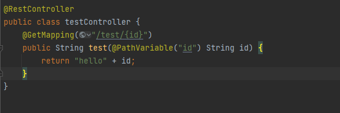
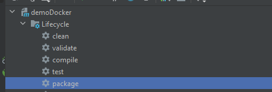
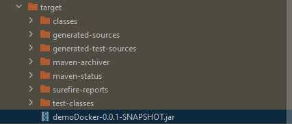
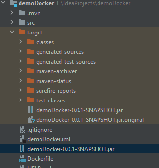
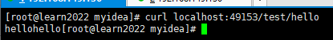

# Exercise - SpringBoot Project Image



Package



Saw my jar



create Dockerfile & copy out jar from target



```
FROM java:8

COPY *.jar /app.jar

CMD ["--server.port=8080"]

EXPOSE 8080

ENTRYPOINT ["java","-jar","/app.jar"]
```

..

build

..

run

..

curl localhost:port/test/hello



succeed!

