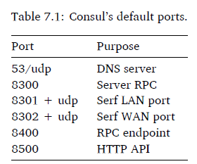

> Steps:

1. Create a Docker image for the Consul service.

- consul.json

    - `client_addr` variable to bind Consult to all interfaces inside our container

    - `ports` to configure on which ports various Consul services run

    - `recursor` option to specify a DNS server to use for resolution if Consult can't resolve a DNS request. 8.8.8.8 is one of the IP addresses of Google's public DNS service.

- Dockerfile

- `docker build -t jamtur01/consul .`

- test: `docker run -p 8500:8500 -p 53:53/udp -h node1 jamtur01/consul -server -bootstrap`

2. Build three hosts running Docker and then run Consul on each. The three hosts will provide us with a distributed environment to see how resiliency and failover works with Consul.

> Larry

- `PUBLIC_IP="$(ifconfig eth0 | awk '/inet / {print $2}')"`

- `docker run -d -h $HOST -p 8300:8300 -p 8301:8301 -p 8301:8301/udp -p 8302:8302 -p 8302:8302/udp -p 8400:8400 -p 8500:8500 -p 53:53/udp --name larry_agent jamtur01/consul -server -advertise $PUBLIC_IP -bootstrap-expect 3`

    - server flag tell agent to run in server mode

    - advertise flag tells tat server to advertise itself on the IP address specified in the $PUBLIC_IP

    - bootstrap-expect flag tells Consult how many agents to expect in this cluster

- `docker logs larry_agent`

> Other agent

- `JOIN_IP=[larry's public ip]`

- `docker run -d -h $HOST -p 8300:8300 -p 8301:8301 -p 8301:8301/udp -p 8302:8302 -p 8302:8302/udp -p 8400:8400 -p 8500:8500 -p 53:53/udp --name curly_agent jamtur01/consul -server -advertise $PUBLIC_IP -join $JOIN_IP`

> After

- use larry to `dig @[docker0 addr] consul.service.consul`

    - dig is a DNS lookup utility

    - consul is the host, and `service.consul` is the domain.

    - we can `dig @172.17.0.1 webservice.service.consul` to return all DNS for the service `webservice`

    - we can also query individual node `dig @172.17.0.1 curly.node.consul +noall +answer`

3. Build services that we'll register with Consul and then query the data from another service.

    - `distributed_app` on larry and curly nodes

    - `distributed_client` on moe node

## TODO: to do and review if there is a demand. We did not go through it seriously

 due to not setting up servers (node)
