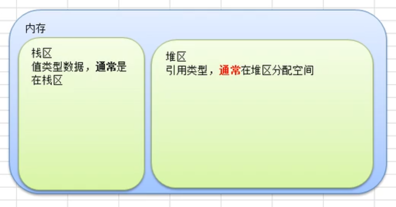
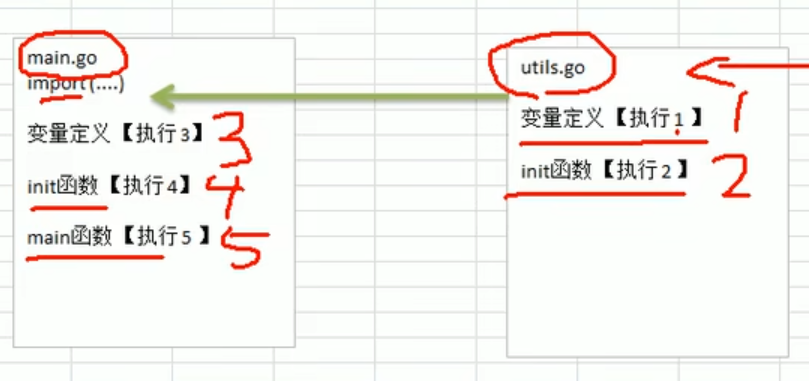
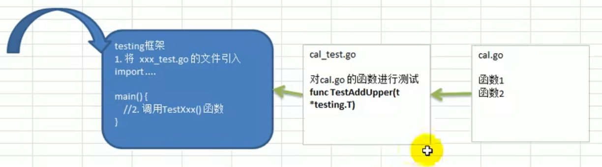
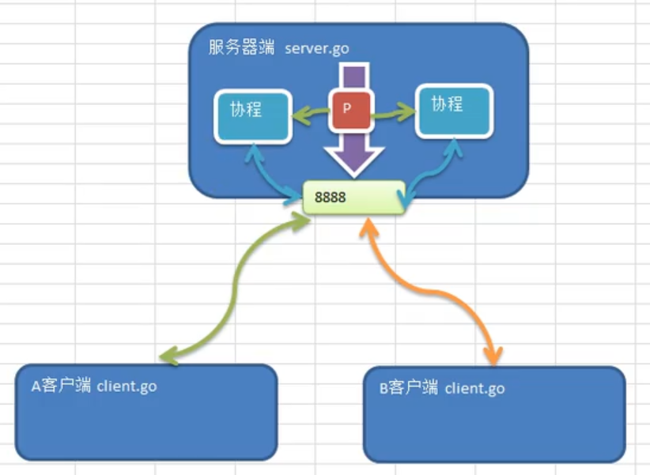
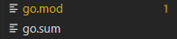
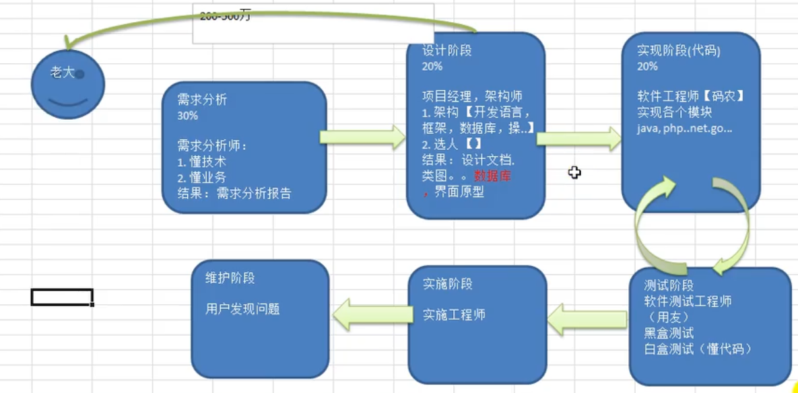
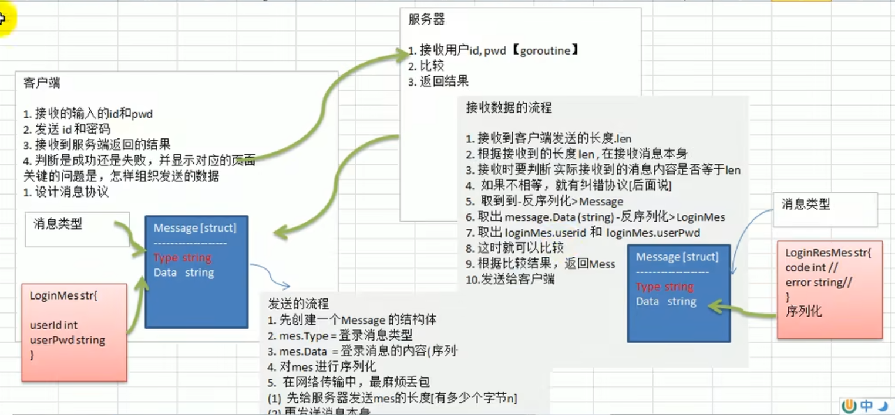
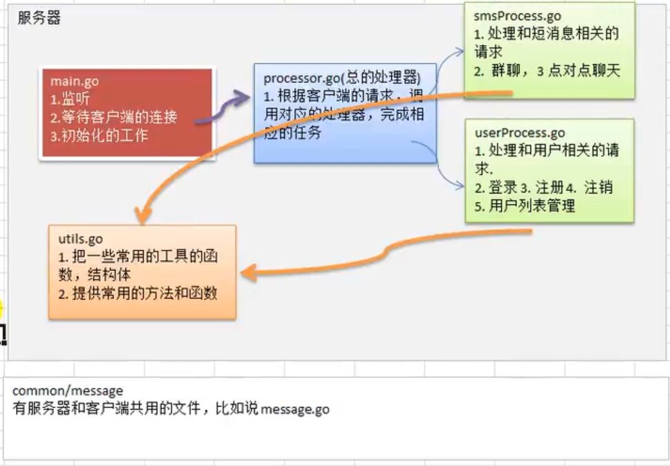
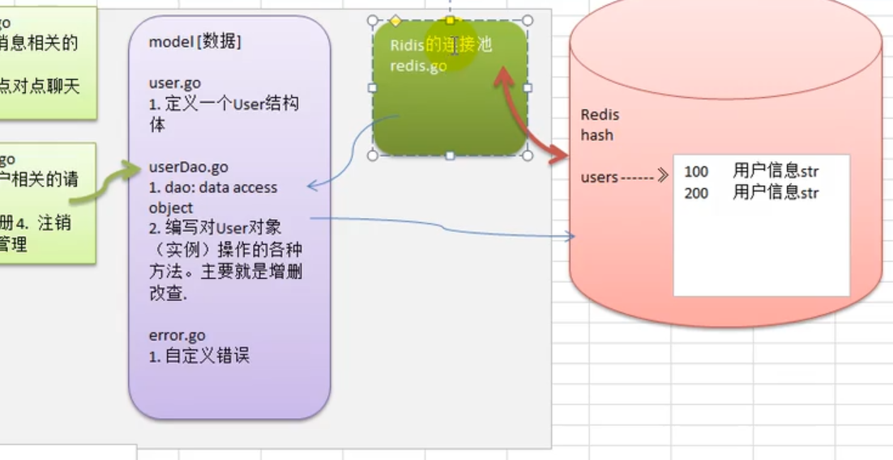
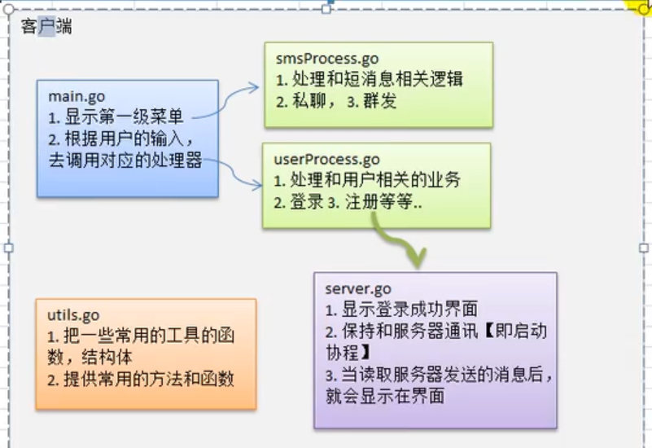

# Go

It is a learning note from [尚硅谷Golang入门到实战教程丨一套精通GO语言](https://www.bilibili.com/video/BV1ME411Y71o?p=1)


Start: 18/08/2022

End: 24/08/2022


> Check version: go version

>**Characteristic**
>
>- Module by "package"
>- 垃圾回收机制
>- **天然并发**，高效利用多核，实现大并发处理
>- function able to return multiple value
>- new knowledge: slice, defer


## Set up

### Developer tools

- **Visual Studio Code**
- Sublime Text
- Vim
- Emacs
- Eclipse
- LiteIDE
- JetBrains

> **VS Code**
>
> **suggest install "go" plugin**
>
> **setting**
>
> - File -> Preference -> Setting
>
> 
>
> **Code Shortcut** (File -> Preference -> Keyboard Shortcut)
>
> | press                                             | function            |
> | ------------------------------------------------- | ------------------- |
> | Alt + ↓或↑                                        | move line           |
> | Shift + Alt + ↓或↑ (for down, I changed to Ctrl+D | copy line up / down |
> | Ctrl+Shift+K (I changed to Ctrl+Y)                | delete line         |
> | Ctrl+/                                            | comment             |
> | Shift+tab                                         | decrease indent     |
> | Ctrl + Enter                                      | insert line below   |
> | Ctrl + Shift + Enter                              | insert line above   |
> | Shift + Alt + F (I changed to Ctrl + Alt + L)     | format              |
> | Ctrl + H                                          | replace             |
>
> 

### SDK

> - download SDK -- [go website](https://go.dev/dl/)
>
>   - My location: E:\Program Files\Go
>
>   - environment variable
>
>     | Environment Variable | Path                |
>     | -------------------- | ------------------- |
>     | GOROOT               | E:\Program Files\Go |
>     | Path                 | %GOROOT%\bin        |


### Example

1. program

```go
package main // put this test.go into main
import "fmt" // import package
func main() { // main is function, entry point of program
	// print "hello"
	fmt.Println("hello world")
}
```

2. `go build hello.go` : compile
3. `hello.exe` : execute


## Go Standards

### Go Rules

> - xx.go
>
> - main() is the entry point for go program
>
> - func is case sensitive
>
> - do **NOT** end sentence with ';' (golang auto add, so does not recommend)
>
> - compile line by line
>
> - if **variable** or **package imported** not being used => **compile failed**
>
>   ```go
>   if temporary ignore this rule (for package)
>   -------------------------------------------
>   import {
>       _ "fmt" // use '_'
>   }
>   ```
>
>   
>
> - use utf-8


### Go Popular Escape Char

>- \t  (tab)
>- \n
>- \\\
>- \\"
>- \r (return, replace the char from start eg: 12345\r45 -> 45345)


### Go Comment

>**Line(s):** // (recommended by go official)
>
>**Block:** /* .... */


### Go Format

> **indent by tab**  -- Tips: `gofmt -w hello.go` can format the go file
>
> **space before and after operator**
>
> **func name() {** -- instead of { in next line
>
> **restrict 80 char in one line**


### Go Naming

[go dev talks](https://go.dev/talks/2014/names.slide#9)

```go
count // RuneCount ...
i // index
b // buffer
r // reader
xxxYyyyyy // xxx_Yyyyyy

Function Param
--------------
Where the types are descriptive, they should be short:
func AfterFunc(d Duration, f func()) *Timer

Where the types are more ambiguous, the names may provide documentation:
func Unix(sec, nsec int64) Time

Receiver
--------
Receiver are one or two characters that reflect the receiver type, because they typically appear on almost every line:
func (b *Buffer) Read(p []byte) (n int, err error)
func (sh serverHandler) ServeHTTP(rw ResponseWriter, req *Request)
func (r Rectangle) Size() Point
Receiver names should be consistent across a type's methods.


Error
-----
Error types should be of the form FooError:
type ExitError struct {
    ...
}
Error values should be of the form ErrFoo:
var ErrFormat = errors.New("image: unknown format")

Package Path
------------
avoid using uppercase letter

```

> **Conclusion**
>
> Use short names.
>
> Think about context.
>
> Use your judgment.


### Go Commands

```go
go mod init name/name //creates a new module, initializing the go.mod file that describes it.
go mod tidy // cleans up unused dependencies
go doc package
go test // package-building command for test: add new dependencies to go.mod as needed
go build // package-building command:add new dependencies to go.mod as needed
go get package //@v?.?.? if needed, changes the required version of a dependency (or adds a new dependency)
go list -m all  // prints the current module’s dependencies.
go list -m abc/a... // list the package start with abc/a in current module’s dependencies
```


### Go Project Structure

```go
Project
|-- cmd // the apps
|	|-- app1
|	|	|-- main.go
|	|-- app2
|	 	|-- main.go
|-- internal // the codes which are not allowed to be import
|	|-- app
|		|-- myapp
|		|-- pkg // the codes that can be imported and used inside internal
|-- pkg // the codes that can be imported and used	
|	
```

> **Internal**
>
> .For example, a package `.../a/b/c/internal/d/e/f` can be imported only by code in the directory tree rooted at `.../a/b/c`. It cannot be imported by code in `.../a/b/g` or in any other repository.


## Standard Library (popular usage)

> https://pkg.go.dev/std
>
> Chinese: https://studygolang.com/pkgdoc

### go built in function

> `func len(v Type) int` ==> len of byte. "蛤" is 3
>
> `func new(Type) *Type`
>
> `func make(Type, size IntegerType, [optional: cap IntegerType]) Type` // size can be eliminated when making space for map => len(map) = 0 // 始化一个类型为切片、映射、或通道的对象
>
> `r := []rune(str)` ==> 处理中文遍历
>
> ```go
> var str0 string = "hello,world"
> str = []rune(str0)
> for i := 0; i < len(str); i++ {
> fmt.Printf("%c\n", str[i])
> }
> ```
>
> `string([]byte{97, 98, 99})` ===> "abc"
>
> `func cap(v Type) int` // the cap of slice and channel
>
> `func append(slice []Type, elems ...Type) []Type`  appen elem to that slice, if the cap is unable to append all, then a new array will be new.
>
> `func copy(dst, src []Type) int` copy slice from src to dst. return the len(src) or len(dst) -- whichever shorter. if len(src) > len(dst), then this copy few only copy partially into dst. both slices are independent.
>
> `func delete(m map[Type]Type1, key Type)` 
>
> `func close(c chan<- Type)` close关闭信道


### strconv

>`func Atoi(s string) (i int, err error)` ==> convert string to i
>
>```go
>n, err := strconv.Atoi("hello")
>if err != nil {
>    fmt.Println("failed", err)
>}
>```
>
>`func Itoa(i int) string` ===> int to string
>
>`func FormatInt(i int64, base int) string` == > change i to another base (进制), return string


### fmt

> `func Println(a ...interface{}) (n int, err error)` : print line
>
> `func Printf(format string, a ...interface{}) (n int, err error)` : print with format
>
> `func Sprintf(format string, a ...interface{}) string` : convert from interfaces to string
>
> `func Scanln(a ...interface{}) (n int, err error)` : input
>
> ```go
> var name string
> fmt.Scanln(&name)
> ```
>
> func **Scanf**(format string, a ...interface{}) (n int, err error)
>
> ```go
> fmt.Scanf("%s %d %f %t", &name, &age, &sal, &isPath)
> fmt.Printf("%s %d %f %t", name, age, sal, isPath)
> 
> *** IMPORTANT ***
> fmt.Scanf("%s\n", &name) <= so it receive also \r\n
> ```

```go
%d -- integer: 十进制
%f -- float
%t -- bool
%c -- unicode
%s -- string
%q -- "string"
%T -- type

%v -- value's default
```

### math

> `func Sqrt(x float64) float64`
>
> `func Cbrt(x float64) float64`
>
> `func Pow(x, y float64) float64`


### math/rand

> func (r *Rand) Intn(n int) int  <== return same value every time without time.Now().UnixNano()
>
> ```go
> rand.Seed(time.Now().UnixNano())
> n := rand.Intn(100) + 1 // [0 100]
> fmt.Println(n)
> ```


### Sort

>`func Ints(a []int)` accept slice
>
>


### time

> `func Sleep(d Duration)`
>
> `type Time` <== a type : time.Time
>
> - `func Now() Time` <== time.Now().Unix() return second from 1970/01/01 00:00:00 
>
> `type Duration`
>
> - myTime := time.Second * 6
>
>   ```go
>   const (
>       Nanosecond  Duration = 1
>       Microsecond          = 1000 * Nanosecond
>       Millisecond          = 1000 * Microsecond
>       Second               = 1000 * Millisecond
>       Minute               = 60 * Second
>       Hour                 = 60 * Minute
>   )
>   ```
>
>   `func Since(t Time) Duration`  // sub t from now


### Time (a Struct)

> `func (t Time) Year() int`
> `func (t Time) Month() Month` => int(Month) => digit
> `func (t Time) Day() int`
> `func (t Time) Hour() int`
> `func (t Time) Minute() int`
> `func (t Time) Second() int`
>
> `func (t Time) Add(d Duration) Time`
> `func (t Time) AddDate(years int, months int, days int) Time`
> `func (t Time) Sub(u Time) Duration`
>
> `func (t Time) String() string`
> `func (t Time) Format(layout string) string` *** The figure is fixed
>
> - ```go
>   now.format("2006/01/02 3:04:05pm")
>   now.format("2006/01/02 15:04:05")
>   now.format("2006/01/02")
>   now.format("15:04:05")
>                                 
>   Mon Jan 2 15:04:05 -0700 MST 2006
>        1  2  3  4  5             6
>   ```
>
> `func (t Time) Unix() int64` // the diff second from 1970 01 01 0 0 0
> `func (t Time) UnixNano() int64` // the diff nanosecond from 1970 01 01 0 0 0


### strings

> `func HasPrefix(s, prefix string) bool`
>
> `func HasSuffix(s, suffix string) bool`
>
> `func Contains(s, substr string) bool`
>
> `func Count(s, sep string) int` count how many sequence occured
>
> `func EqualFold(s, t string) bool` compare with case-insensitive, "abc" "ABC" => true
>
> `func Index(s, sep string) int` return -1 if not found
>
> `func LastIndex(s, sep string) int`
>
> `func Replace(s, old, new string, n int) string` <== n = -1 indicate all
>
> - ```go
>   str := strings.Replace("go go hello", "go", "come", 1)
>         
>   Result:
>   -------
>   come go hello
>   ```
>
> `func Split(s, sep string) []string`
>
> `func Fields(s string) []string` split by space
>
> `func Join(a []string, sep string) string`
>
> `func ToLower(s string) string`
>
> `func ToUpper(s string) string`
>
> `func TrimSpace(s string) string`  trim space from left & right of string`
>
> `func Trim(s string, cutset string) string` trim 2nd param (EVERY CHAR) from left & right of string`
>
> - ```go
>   strings.Trim("! hello! ", " !") ==> hello
>   ```
>
> `func TrimLeft(s string, cutset string) string`
>
> `func TrimRight(s string, cutset string) string`


### path

>`func Join(elem ...string) string` // eg ("./", a, b, c) => a/b/c


### encoding/json

> `func Marshal(v interface{}) ([]byte, error)` // can convert a **every type** into a json in byte, use string(result) to see json format
>
> `func Unmarshal(data []byte, v interface{}) error` // remember to accept address for 2nd param


### encoding/binary

> binary包实现了简单的数字与字节序列的转换以及变长值的编解码。

```go
var BigEndian bigEndian // implements ByteOrder
```

type **ByteOrder** interface 

```go
type ByteOrder interface {
    Uint16([]byte) uint16
    Uint32([]byte) uint32 // convert []byte to uint32
    Uint64([]byte) uint64
    PutUint16([]byte, uint16)
    PutUint32([]byte, uint32) // convert uint32 to []byte
    PutUint64([]byte, uint64)
    String() string
}
```


### os

```go
func Open(name string) (file *File, err error)
func OpenFile(name string, flag int, perm FileMode) (file *File, err error)
func Stat(name string) (fi FileInfo, err error)
// Stat(): err return nil if file / folder is exist.
// Stat(): err return os.IsNotExist(err) == true => file / folder is not exist.
// Stat(): err return other, not confirm if exist
func Exit(code int) // 状态码0表示成功，非0表示出错。程序会立刻终止，defer的函数不会被执行。
```

```go
Flag
----
const ( // can multiple usage by '|' eg O_WRONLY | O_CREATE
    O_RDONLY int = syscall.O_RDONLY // 只读模式打开文件
    O_WRONLY int = syscall.O_WRONLY // 只写模式打开文件
    O_RDWR   int = syscall.O_RDWR   // 读写模式打开文件
    O_APPEND int = syscall.O_APPEND // 写操作时将数据附加到文件尾部
    O_CREATE int = syscall.O_CREAT  // 如果不存在将创建一个新文件
    O_EXCL   int = syscall.O_EXCL   // 和O_CREATE配合使用，文件必须不存在
    O_SYNC   int = syscall.O_SYNC   // 打开文件用于同步I/O
    O_TRUNC  int = syscall.O_TRUNC  // 如果可能，打开时清空文件
)

FileMode (usable only for Unix / Linux --> RWX)
-----------------------------------------------
const (
    // 单字符是被String方法用于格式化的属性缩写。
    ModeDir        FileMode = 1 << (32 - 1 - iota) // d: 目录
    ModeAppend                                     // a: 只能写入，且只能写入到末尾
    ModeExclusive                                  // l: 用于执行
    ModeTemporary                                  // T: 临时文件（非备份文件）
    ModeSymlink                                    // L: 符号链接（不是快捷方式文件）
    ModeDevice                                     // D: 设备
    ModeNamedPipe                                  // p: 命名管道（FIFO）
    ModeSocket                                     // S: Unix域socket
    ModeSetuid                                     // u: 表示文件具有其创建者用户id权限
    ModeSetgid                                     // g: 表示文件具有其创建者组id的权限
    ModeCharDevice                                 // c: 字符设备，需已设置ModeDevice
    ModeSticky                                     // t: 只有root/创建者能删除/移动文件
    // 覆盖所有类型位（用于通过&获取类型位），对普通文件，所有这些位都不应被设置
    ModeType = ModeDir | ModeSymlink | ModeNamedPipe | ModeSocket | ModeDevice
    ModePerm FileMode = 0777 // 覆盖所有Unix权限位（用于通过&获取类型位）
)
```


type **File** struct

```go
func (f *File) Name() string
func (f *File) Stat() (fi FileInfo, err error) 
func (f *File) Read(b []byte) (n int, err error)
func (f *File) ReadAt(b []byte, off int64) (n int, err error)
func (f *File) Write(b []byte) (n int, err error)
func (f *File) WriteAt(b []byte, off int64) (n int, err error)
func (f *File) Seek(offset int64, whence int) (ret int64, err error)
func (f *File) Sync() (err error)
func (f *File) Close() error
```


type **FileInfo** interface

```go
type FileInfo interface {
    Name() string       // 文件的名字（不含扩展名）
    Size() int64        // 普通文件返回值表示其大小；其他文件的返回值含义各系统不同
    Mode() FileMode     // 文件的模式位
    ModTime() time.Time // 文件的修改时间
    IsDir() bool        // 等价于Mode().IsDir()
    Sys() interface{}   // 底层数据来源（可以返回nil）
}
```


**Variables**

```goo
var Args []string //Args保管了命令行参数，第一个是程序名。
```

> **Example**
>
> in dos : test.exe tom c://aaa/bbb/config.init 88

```go
import (
	"fmt"
	"os"
)

func main() {
	s := os.Args
	for i, v := range s {
		fmt.Printf("Index: %v, value: %v\n", i, v)
	}
}
```

> **Result**
>
> Index: 0, value: C:\Users\go-build1428137598\b001\exe\main.exe
> Index: 1, value: tom
> Index: 2, value: c://aaa/bbb/config.init
> Index: 3, value: 88


### bufio

```go
func NewReader(rd io.Reader) *Reader
func NewReaderSize(rd io.Reader, size int) *Reader
func NewWriter(w io.Writer) *Writer
```

**Tips:**

```go
rd io.Reader
------------
"e://..." // file name
os.Stdin // input from terminal
```


type **Reader** struct

```go
type Reader struct {
	buf          []byte
	rd           io.Reader // reader provided by the client
	r, w         int       // buf read and write positions
	err          error
	lastByte     int // last byte read for UnreadByte; -1 means invalid
	lastRuneSize int // size of last rune read for UnreadRune; -1 means invalid
}
```

```go
func (b *Reader) Reset(r io.Reader)
func (b *Reader) Buffered() int // return the current bytes
func (b *Reader) ReadString(delim byte) (line string, err error) // eg ..ReadString('\n') => return string stop with every \n
```


type **Write** struct

```go
type Writer struct {
	err error
	buf []byte
	n   int
	wr  io.Writer
}
```

```go
func (b *Writer) WriteString(s string) (int, error)
```


### io

```go
func Copy(dst Writer, src Reader) (written int64, err error)
```


### io/ioutil

```go
func ReadAll(r io.Reader) ([]byte, error)
```


### flag

```go
func StringVar(p *string, name string, value string, usage string)
func IntVar(p *int, name string, value int, usage string)
func Parse() // 从os.Args[1:]中解析注册的flag。必须在所有flag都注册好而未访问其值时执行。未注册却使用flag -help时，会返回ErrHelp。
```

> **Example**
>
> go run test.go -u testing123 -port 9999 -p 123321

```go
func main() {
	var user string
	var pwd string
	var port int
	flag.StringVar(&user, "u", "", "username, default empty string")
	flag.StringVar(&pwd, "p", "", "password, default empty string")
	flag.IntVar(&port, "port", 8080, "port, default 8080")

	flag.Parse()

	fmt.Printf("user=%v, pwd=%v, port=%v", user, pwd, port)
}

```

> **Result**
>
> user=testing123, pwd=123321, port=9999


### testing

> see unit test


### runtime

```go
func NumCPU() int
func GOMAXPROCS(n int) int // 设置可同时执行的最大CPU数，并返回先前的设置
```


### reflect

> Refer topic -- reflection


### **net**

> Refer topic -- network


### sql

**Type DB Struct**

```go
func Open(driverName, dataSourceName string) (*DB, error)
func (db *DB) Begin() (*Tx, error) //  uses context.Background internally, default isolation level is dependent on the driver.
func (db *DB) BeginTx(ctx context.Context, opts *TxOptions) (*Tx, error) // set ctx and isolation level, nil to default isolation level

```


### Third Party Package


> **golang.org/x/crypto/bcrypt**

```go
const (
	MinCost     int = 4  // the minimum allowable cost as passed in to GenerateFromPassword
	MaxCost     int = 31 // the maximum allowable cost as passed in to GenerateFromPassword
	DefaultCost int = 10 // the cost that will actually be set if a cost below MinCost is passed into GenerateFromPassword
)


Variables
var ErrHashTooShort = errors.New("crypto/bcrypt: hashedSecret too short to be a bcrypted password")

var ErrMismatchedHashAndPassword = errors.New("crypto/bcrypt: hashedPassword is not the hash of the given password")

func CompareHashAndPassword(hashedPassword, password []byte) error // Returns nil on success, or an error on failure.
func Cost(hashedPassword []byte) (int, error)
func GenerateFromPassword(password []byte, cost int) ([]byte, error)

```


## Variable

> variable has a **space in memory**
>
> **Syntax1:** `var [name] [type]` | multiple: `var [name], [name2], [nam3] [type]`
>
> **Syntax2: (type assumption) ** `var [name] = [value]` | `var [name] [type] = [value]`
>
> **Syntax3: (eliminating var)** `[name] := [value]`
>
> **Syntax4:** `var [name1], [name2], [name3] = [value1], [value2], [value3]` 
>
> ​				| `[name1], [name2], [name3] := [value1], [value2], [value3]`

> **Tips:**
>
> Default for type:
>
> - **int** 0
> - **小数** 0
> - **string** ""
> - **bool** false

```go
package main
import (
    "fmt"
)

// Tips: can put global variable here
var g1 = 100

g5 := 200 //THIS ONE IS WRONG, this actually is var g5 int; g5 = 200. Global Variable is not allowed assignment

var (
	g2 = 200
    g3 = 300
    g4 = "mary"
)

func main() {
    // Syntax1
    var i int
    i = 10
    fmt.Println("i=", i)
    
    // Syntax2
    var num = 11.11
    fmt.Println("num=", num)
    
    // Syntax3
    name := "tom"
    fmt。Println("name=", name)
    
    // Syntax4
    var n1, name1, n3 = 100, "tom", 888
    fmt.Println("n1=", n1,"n2=", name1, "n3=", n3)
}
```


**Tips:**

```go
a[i], a[j] = a[j], a[i] can replace

temp := a[i]
a[i] = a[j]
a[j] = a[i]
```


### Const

> inside golang, there is **no** standard of UPPER_CASE, so it is okay to be all lower-case
>
> first letter is still controlling the package range
>
> const
>
> must be initialized when declare
>
> value cannot be modified
>
> cannot use `:=`

```go
const name [type] = value
-------------------------
const name = "tom"
const tax float64 = 0.8
const num2 = num / 3 // wrong, num can be changed
const c = getVal() // wrong
```

**Other style**

```go
Professional:
-------------
func main() {
    const {
        a = iota // equal to 0
        b		// a + 1
        c		// b + 2
    }
}

---------------
Clean Way:
---------
func main() {
    const {
        a = 1
        b = 2
    }
}
```


**Trap**

```go
const {
    a = iota
    b = iota
    c, d = iota, iota
}
// a = 0, b = 1, c = 2, d = 2
```


## Type

>**primitive** **types**

- number
 - integer 
   - **int (Default when using var)**, int8, int16, int32, int64
   - uint, uint8, uint16, uint64  (unsigned, start from 0)
   - byte （0-255, same with unit8)
 - float
   - float32, **float64 (Default for 浮点)**
- char ( normal char use byte) [! able to use in calculation eg `var i = 10 + 'a'`]
- bool (1byte) **(Default false)**
- string (utf-8) **(Default "")**


>  **派生 / complex types**

- pointer (Default nil)
- array
- struct (class)
- channel
- function
- slice (dynamic array) (Default nil)
- interface  (Default nil)
- map  (Default nil)


> **Category : Value Types **


- primitive type (int, float, bool, string)
- array
- struct


>  **Category : Reference Types :**


- Pointer
- Slice
- Map
- Channel
- Interface





### Primitive Type

>**Tips**
>
>- error if not in range
>
>- check type: `fmt.Printf("n1 type is %T",  n1)`
>
>- check byte size and type `fmt.Printf("n1 type is %T and bytes %d",  n1, unsafe.Sizeof(n1))`
>
>- **character** tutorial:
>
> ```go
> var c1 byte = 'a'
> fmt.PrintLn("c1=", c1) // 97
> fmt.Printf("c1=%c", c1) // a
>
> var c2 int = '中' // 3 bytes
> fmt.Printf("c2=%c", c2) // 中
> ```
>
>- **string** tutorial:
>
>  ```go
>  IN CASE LONG SENTENCE
>  ---------------------
>  str := `I am able to use '"' ! `
>  
>  IN CASE COMBINING STRING
>  ------------------------
>  str := "hello" + "world"
>  
>  IN CASE COMBINING LONG STRING
>  -----------------------------
>  //not working
>  str := "hello" + "world"
>  		+ "NIHAO"
>  
>  //working
>  str := "hello" + "world" +
>  		"NIHAO"
>  ```
>
>  


#### string

> string base is a byte array. it can be used to create a  slice

```go
func main() {
    str := "Hello world"
    slice := str[:5]
    fmt.Println(slice) // Hello
    
    //string is final, which str[0] = 'z' is WRONG!
    str[0] = 'z'
    
    // in case wants to change the str
    // change string to []byte / []rune 
    // change
    // rewrite to convert into string
    arr1 := []byte(str)
    arr1[0] = 'z'
    str = string(arr1)
    fmt.Println(str)
    
    // above method has problem: chinese, use -> []rune
    arr2 := []rune(str)
    arr2[0] = '哈'
    str = string(arr2)
    fmt.Println(str)
}
```


#### Converting Type

> There is a **MUST** to convert type explicitly
>
> Be noted the overflow when converting bigger to smaller eg int64 -> int8

**Syntax:**`n1 = float32(i)`


> Converting from **other type** to **string**

- **fmt.Sprintf("%参数", 表达式) **

  ```go
  str := fmt.Sprintf("%d", num1) // num1 is type int64
  str = fmt.Sprintf("%f", num2) // float
  str = fmt.Sprintf("%t", b) // bool
  str = fmt.Sprintf("%c", ch) // char
  ```

- strconv

  ```go
  str = strconv.FormatInt(int64, [10] 进制) // num1 shall be int64, if other type need to convert
  str = strconv.FormatFloat(num2, 'f', decimalPlace eg [10], [64] means float64)
  str = strconv.FormatBool(b1)
  str = strconv.itoa(int)
  ```

  

> Converting from **string** to **other type**

- strconv

  ```go
  Return 1. value 2. err
  ------------------------
  b, _ = strconv.ParseBool(str) // this function return 2 values, '_' means this result we are not going to use.
  n1, _ = strconv.ParseInt(str, [10] 进制, [64] bitsize) // or ParseUint
  n2, _ = strconv.ParseFloat(str, [64] bitsize)
  ```

  **Tips:** if the converting failed, the result will be default value of the type


### Complex Type

#### Pointer

> It can be point to value type:
>
> - primitive types (int, float, bool, string)
> - array
> - struct
>
> . and [] priority is higher then *, thus
>
> - *ptr.Name <= WRONG , (\*ptr).Name
> - \*ptr\[0] <= WRONG!, (\*ptr)[0]

```go
var i int = 10
fmt.Println("address of i: ", &i) // 0xc00000e0a8

var ptr *int = &i
fmt.Println("ptr pointed to=%v\n", ptr) // 0xc00000e0a8
fmt.Println("ptr address=%v\n", &ptr) // 0xc00000a030
fmt.Println("ptr value=%v\n", *ptr) // 10
```

**Exercise**

```go
func main() {
    var num int = 9
    fmt.Printf("num address=%v\n", &num)

    var ptr *int
    ptr = &num
    *ptr = 10 // change the value of num
    fmt.Println("num = ", num)
}
```

```go
WRONG
-----
func main() {
    var a int = 300
    var ptr *int = a // X, cannot point to value
}
```

```go
WRONG
-----
func main() {
    var a int = 300
    var ptr *float32 = a // X, cannot point to different type
}
```

```go
func main() {
    var a int = 300
    var b int = 400
    var ptr *in = &a
    *ptr = 100
    ptr = &b
    *ptr = 200
}
------------------------
Result: a = 100, b = 200
========================
```

#### Array

> A collection of **same type**
>
> the length is **fixed**
>
> [n]int <= array, **[]int <= NOT Array, it is a slice**
>
> 值传递, when transfer into function, executing the copy of values to another memory address, the **data will not be changed**. (so, please tranfer pointer into it)

> `var hens [6]float64`
> `var hens [6]int = [3]int {1, 2, 3}`
> `var hens = [3]int {1, 2, 3}`
> `var hens = [...]int {6, 7, 8}` 
> `var hens = [...]string{1:"tom", 0:"jack", 2:"marry"}`
>
> **Other detail:**
>
> - `hens[0] = 3.0` to assign
>
> - `fmt.Println(hens)` => print all hens `[x x x x x x]`
>
> - `&intArr same with &intArr[0]`

```go
for i := 0; i < len(hens); i++ {
    ...
}
```

```
for index, val := range arr { // no ',' between range and arr
	fmt.Println(val)
}

for _, val := range arr { // no ',' between range and arr
	fmt.Println(val)
}
```

> go see [3]int and [4]int different types

**Set function parameter**

```go
func test01(arr [3]int) { // we cannot pass in the array with size not 3
    ...
}
```

**Set function parameter (pointer)**

```go
func test02(arr *[3]int) {
    (*arr)[0] = 88
}
```


> **Matrix**
>
> `var arr [x][y]int`
>
> `var arr [x][y]int = [x][y]int{{...},{...},{...},...}`
>
> `var arr [x][y]int = [...][y]int{{...},{...},{...},...}`
>
> `var arr = [x][y]int{{...},{...},{...},...}`
>
> `var arr = [...][y]int{{...},{...},{...},...}`

```go
var arr3 [4][4]int
arr3[1][2] = 3

fmt.Println(arr3)

fmt.Println(arr) // [[0 0 0 0] [0 0 3 0] [0 0 0 0] [0 0 0 0]]
```

```go
for i := 0; i < len(arr3); i++ {
    fmt.Println(arr3[i])
}
//[0 0 0 0]
//[0 0 3 0]
//[0 0 0 0]
//[0 0 0 0]
```

```go
for range
---------
for _, v := range arr3 {
    for _, v2 := range v {
        fmt.Print(v2, " ")
    }
    fmt.Println()
}
```


#### Slice

> It is a **reference type**
>
> **It is a struct:**
>
> 1. pointing address *[x]int
> 2. len int
> 3. cap int

> `var names []int` <= cannot use yet, need to make() or to refer arr to assign address
> `var arr slice = arr[x:y]` slice from array, x is array index start, y is end (exclusive thsi index)
>
> - arr[:x] <= from start to index x
>   arr[x:] <= from x to len(arr)
>   arr[:] <= all
>
> `var slice []int = make([]int, size int, [cap int])`
> `var slice []int = make([]int, size int)`
> `var slice []string = []string{"tom", "jack", "mary"}` // cap = 3


> **Append， copy, delete**

```go
append (involve in new array)
----------------------------
var slice []int = []int{100,200,300}
slice2 := append(slice,400,500,600)
fmt.Println(slice) // [100 200 300]
fmt.Println(slice2) // [100 200 300 400 500 600]

slice = append(slice,400,500,600)
fmt.Println(slice) // [100 200 300 400 500 600]
fmt.Println(slice2) // [100 200 300 400 500 600]

// not affect each other
slice[0] = 222
fmt.Println(slice) // [222 200 300 400 500 600]
fmt.Println(slice2) // [100 200 300 400 500 600]

// append to it selfves
slice2 = append(slice2, slice2...)
fmt.Println(slice2) // [100 200 300 400 500 600 100 200 300 400 500 600]
slice2[0] = 333
fmt.Println(slice2) // [333 200 300 400 500 600 100 200 300 400 500 600]
```

```go
copy
----

func main() {
    var slice1 []int = []int{100,200,300}

    slice2 := make([]int, 1, 5)
    fmt.Println(copy(slice2, slice1)) // 1 
    fmt.Println(slice1) // [100 200 300]
    fmt.Println(slice2) // [100]
}
```

```go
slice is reference type, when assign, then assign reference
-----------------------------------------------------------

func main() {
    var slice1 []int = []int{100,200,300}

    var slice2 = slice1
    slice2[0] = 1
    fmt.Println(slice1) // [1 200 300]
    fmt.Println(slice2) // [1 200 300]
}
```

```go
delete (delete index)
---------------------
this.customers = append(this.customers[:index], this.customers[index+1:]...)
```


>  **遍历**

```go
for i := 0; i < len(slice); i++ {
    fmt.Println(slice[i])
}
```

```go
for index, value := range slice {
    fmt.Println(value)
}
```


> **Simple Example**

```go
func main() {
    var intArr [5]int = [...]int{1,22,33,44,55}
    
    // slice from index 1 to 3 (exclusive 3)
    slice := intArr[1:3] 
    fmt.Println(intArr) 
    fmt.Println(slice) // 22, 33
    fmt.Println(len(slice)) // 2
    fmt.Println(cap(slice)) // 4, sometimes x 2, it can be adjusted automatically
    
    fmt.Println(&intArr[1]) // 0xc0000c8038
    fmt.Println(&slice[0]) // 0xc0000c8038
    slice[0] = 55
    fmt.Println(intArr) //[1 55 33 44 55]
}
```


> **Slice of Map**

```go
func main() {
    var monsters []map[string]string
    monsters = make([]map[string]string, 2) // prepare to insert 2
    if (monsters[0] == nil) {
        monsters[0] = make(map[string]string, 2)
        monsters[0]["name"] = "A"
        monsters[0]["age"] = "500"
    }

    if (monsters[1] == nil) {
        monsters[1] = make(map[string]string, 2)
        monsters[1]["name"] = "b"
        monsters[1]["age"] = "666"
    }

    // 数组越界
    // if (monsters[2] == nil) {
    //     monsters[2] = make(map[string]string, 2)
    //     monsters[2]["name"] = "A"
    //     monsters[2]["age"] = "500"
    // }
    newMonster := map[string]string {
        "name" : "C",
        "age" : "200",
    }

    monsters = append(monsters, newMonster)

    fmt.Println(monsters)
}
```


#### Map

> - is a reference type
>
> - auto adjust size
>
> - if no key found, then **return nil**
>
>   ```go
>   if users[name] != nil {
>       ...
>   }
>   or 
>                         
>   res, ok := users[name]
>   if !ok {
>       ...
>   }
>   ```
>
> 
>
> 
>
> **Key**
>
> support type except slice, map and function (because we cannot use == in these type), the most usage are **int, and string**
>
> keys are unique, will overwrite if duplicate
>
> keys are unsort with the insert sequence
>
> **Value**
>
> the most usage are **int, float, string, map, struct**

```go
var name map[keytype]valuetype
var a map[string]string
var a map[string]map[string]string
var a map[string]string = make(map[string]string, 5)
var a map[string]string = map[string]string {
    "no4": "abb", //**** MUST ',', and it is a ':'
}
```

**Tips:** declaration does not occupy space, use make to allocate space for usage

```go
var a map[string]string
a["no1"] = "abc" // WRONG

a = make(map[string]string, 10)
a["no1"] = "abc" // ok
a["no2"] = "abc" // ok

fmt.Println(a) // map[no1:abc no2:abc]
```


> **map[string]map[string]string**

```go
func main() {
    student := make(map[string]map[string]string)
    student["stu01"] = make(map[string]string)
    student["stu01"]["name"] = "tom"
    student["stu01"]["gender"] = "m"

    student["stu02"] = make(map[string]string)
    student["stu02"]["name"] = "mary"
    student["stu02"]["gender"] = "f"

    student["stu03"] = make(map[string]string)
    student["stu03"]["name"] = "gold"
    student["stu03"]["gender"] = "m"

    fmt.Println(student) //map[stu01:map[gender:m name:tom] stu02:map[gender:f name:mary] stu03:map[gender:m name:gold]]
    fmt.Println(student["stu02"]) //map[gender:f name:mary]
    fmt.Println(student["stu02"]["name"]) //mary
}
```


> **CRUD**

```go
C / U
-----
a["key"] = "value"

DELETE
------
CASE : delete 1
---------------
> if key is not exist, then nothing happen (no error)
func delete(m map[Type]Type1, key Type)
delete(a, "key")

CASE : delete ALL
-----------------
either for. either
map = make(...)


READ / FIND
-----------
val, ok := cities["a"]
if ok {
    fmt.Println(val) // if not found, val is map[]
}

```


> **遍历**

```go
ONLY FOR RANGE
--------------
for k, v := range a { // k is key, v is value
    fmt.Println(v, v)
}
```


> **Q: a sorted map?**
>
> 1. put into a slice
> 2. sort
> 3. print

```go
func main() {
	map1 := make(map[int]int)
    map1[10] = 10
    map1[1] = 13
    map1[4] = 55
    map1[5] = 90

    var keys []int
    for k, _ := range map1 {
        keys = append(keys, k)
    }

    sort.Ints(keys)
    
    for _, k := range keys {
        fmt.Println(k, map1[k])
    }
}
```

> **Result**
>
> 1 13
> 4 55
> 5 90
> 10 10


#### Struct

> It is a **value type**, no changes will happen when transferring into a function. Use * for using reference type.
>
> The fields are continuous in memory
>
> - pointer also (&), however the pointer pointing address might not be continuos, this is depends on the status of memory
>
> To convert a struct eg a = (A) b, conditions to fulfill:
>
> - fieldname is exactly same
> - field type is exactly same
> - field number are exactly same
> - the sequence of field are exactly same
> - means: the struct shall be exactly same with other struct
>
> **no constructor** in go, we use **factory method**

```go
type StructName struct { // "S" make it can be used in diff package
    Field1 type // "F" ditto
    field2 type
}
```

```go
Construct
---------
var person Person
person := Person{}
person := Person{"mary", 20} // MUST HAVE ALL FIELDS
var person *Person = new(Person)
 - 	(*person).Name = "smith" 
- same with : person.Name = "smith" // go do some operation for developer (only for struct)
var person *Person = &Person{} //ditto to upper case
var person *Person = &Person{"mary", 20}
person := Person { // can have incomplete field
    Name: "mary",
    Age: 20,
}
person := &Person {
    Name: "mary",
    Age: 20,
}
```


**Example**

```go
type Cat struct {
    Name string
    Age int
    Color string
}

func main() {
    var cat1 Cat
    cat1.Name = "aaa"
    cat1.Age = 3
    cat1.Color = "pink"
    fmt.Println("cat1=", cat1) // cat1= {aaa 3 pink}
    fmt.Println("cat1=", cat1.Name)
    fmt.Println("cat1=", cat1.Age)
    fmt.Println("cat1=", cat1.Color)
    
}
```


> **Work with Json**
>
> Attention to the struct fields tag 
>
> ​	Format: `json:"[custom]"`, the technique used is reflection

```go
type Cat struct {
    Name string `json:"name"`
    Age int `json:"age"`
    Color string `json:"color"`
}

func main() {
    var cat1 Cat
    cat1.Name = "A"
    cat1.Age = 129
    cat1.Color = "B"

    jsonStr, err := json.Marshal(cat1)

    if err == nil {
        fmt.Println(jsonStr)
        fmt.Println(string(jsonStr))
    }
    
}
```

> **Result**
>
> [123 34 110 97 109 101 34 58 34 65 34 44 34 97 103 101 34 58 49 50 57 44 34 99 111 108 111 114 34 58 34 66 34 125]
>
> {"name":"A","age":129,"color":"B"}
>
> ​	**tips:** it will result {"Name":"A","Age":129,"Color":"B"} without the tag behind the field.


> **Factory Method**

```go
package model

type student struct {
    name string
    score float64
}

func NewStudent(n string, s float64) *student {
    return &student{n,s}
}

func (s *student) GetScore() float64 {
    return s.score
}
```

```go
package main
import {
    "fmt"
    ".../model"
}

func main() {
    var stu = model.NewStudent("tom", 666)
    fmt.Println(*stu)
    fmt.Println(stu.GetScore())
}
```


> New a struct

```go
func main() {
    hello:= new(struct{string}) // *struct{string}
}
```


#### Function

> ```go
> func (receiver type) methodName (param) (return values) {
> 	...
>     return result
> }
> ```
>
> if hope to **change the data** inside receiver type, use pointer. Tips: this also have higher efficiency
>
> ```go
> func (person *Person) ...
> ```
>
> **type other than struct** also have function
>
> ```go
> type integer int
> func (num integer) printNum() {
>     fmt.Println(num)
> }
> func main() {
>     var num integer = 10
>     num.printNum() // 10
> }
> ```
>
> the use of function can accept both pointer or normal variable. go have done some operation to ease developing coding
>
> ```go
> func (num integer) printNum() {
>     fmt.Println(num)
> }
> func main() {
>     var num integer = 10
>     num.printNum() // 10
>     (&num).printNum() // 10 , however, this is still value transfer, depends on the function receiver type
> }
> ```
>
> 

```go
type A struct {
    Num int
}

func (a A) Test() {
    fmt.Println(a.Num)
}
```

> **String()**
>
> if a type have a method String(), then when calling fmt.Println(type) will call this function

```go
type Dog struct {
    Name string `json:"name"`
    Age int `json:"age"`
    Color string `json:"color"`
}

func (dog *Dog) String() string {
	return fmt.Sprintf("Name=[%v] Age=[%v] Color=[%v]", dog.Name, dog.Age, dog.Color)
}

func main() {
    var dog Dog
    dog.Name = "Wong"
    dog.Age = 129
    dog.Color = "Pink"

    fmt.Println(&dog) //Name=[Wong] Age=[129] Color=[Pink]
}
```


#### Interface

> is a **reference type**
>
> When a struct implements **ALL METHODS** in a interface. It means it implements the interface.
>
> will panic when calling the interface function if failing to achieve above condition ( see example 2 )
>
> **no field** is allowed
>
> **no function block** is allowed in functions in interface (no default function)
>
> can point to a struct that implement it, however, that interface cannot change the field of that struct or use the methods of that struct
>
> ```go
> var b aStruct
> var a aInterface = b
> ```
>
> every customized type can implements interface, not restricted to struct. eg. using 别名(alias)
>
> allowed **multi implementation**
>
> a interface is allowed to **inherit interfaces** (See Example 3), however, if one interface inherit 2 interfaces and both father have same method name => error
>
> ```go
> type AInterface interface {
> 	test01()
> }
> 
> type BInterface interface {
> 	test02()
> }
> 
> type CInterface interface {
> 	AInterface
> 	BInterface
> 	test03()
> }
> ... //The struct must have methods of A,B,CInterface
> ```
>
> interface{} <= every type implements this

```go
type name interface {
    method1(param) [returns]
    method2(param) [returns]
}
```


**Example**

```go
// interface
type Usb interface {
	Start()
	Stop()
}

type Computer struct {
}

// struct1 implements interface
type Phone struct {
}

func (phone *Phone) Start() {
	fmt.Println("Phone Start")
}

func (phone *Phone) Stop() {
	fmt.Println("Phone Stop")
}

// struct2 implements interface
type Camera struct {
}

func (camera *Camera) Start() {
	fmt.Println("Camera Start")
}
func (camera *Camera) Stop() {
	fmt.Println("Camera Stop")
}

// interface method
func (c *Computer) Working(usb Usb) {
	usb.Start()
	usb.Stop()
}

func main() {
	var computer Computer
	var phone Phone
	var camera Camera
	computer.Working(&phone)
	computer.Working(&camera)
}
```

> **Result**
>
> Phone Start
> Phone Stop
> Camera Start
> Camera Stop


**Example 2**

```go
// interface
type Usb interface {
	Start()
	Stop()
}

type Computer struct {
}

// struct1 did not implement Stop()
type Phone struct {
}

func (phone *Phone) Start() {
	fmt.Println("Phone Start")
}

// interface method
func (c *Computer) Working(usb Usb) {
	usb.Start()
	usb.Stop()
}

func main() {
	var computer Computer
	var phone Phone
	computer.Working(&phone) // FAIL
}
```


**Example 3**

```go
type AInterface interface {
	test01()
}

type BInterface interface {
	test02()
}

type CInterface interface {
	AInterface
	BInterface
	test03()
}

type AStruct struct {
}

func (a *AStruct) test01() {
	fmt.Println("test01")
}

func (a *AStruct) test02() {
	fmt.Println("test02")
}

func (a *AStruct) test03() {
	fmt.Println("test03")
}

func interfaceMethod(c CInterface) {
	fmt.Println("Succeed")
}

func main() {
	var a AStruct
	interfaceMethod(&a)
}
```


#### Channel

> is a **Queue** -- FIFO
>
> thread-safe, no need to add lock for it
>
> is a **reference type**
>
> **must make** before use eg. `make (chan int, 3)`
>
> the len must not more than cap
>
> - error when write while len == cap
>   - this error will occur only when go found there is no function to read. Error will not occur if the read is slow
>
> - error when read while len == 0
>
> built in function `close(chan)` :
>
> - stop write in channel
> - still able to read from channel
>
> only support **for-range** 遍历
>
> - if channel yet closed => error
> - else ok
>
> Read only or write only
>
> - read only: intChan <-chan int
>
> - write only: intChan chan<- int
>
> - these usage are found in functions parameter.
>
>   ```go
>   func send(ch chan<- int, exitChan chan struct{}) {
>       for i:= 0; i < 10; i++ {
>           ch <- i
>       }
>       close(ch)
>       var a struct{}
>       exitChan <- a
>   }
>                           
>   func recv(ch <-chan int, exitChan chan struct{}) {
>       for {
>           v, ok := <-ch
>           if !ok {
>               break
>           }
>           fmt.Println(v)
>       }
>       var a struct{}
>       exitChan <- a
>   }
>                           
>   func main() {
>       ch := make(chan int, 10)
>       exitChan := make(chan struct{}, 2)
>       go send(ch, exitChan)
>       go recv(ch, exitChan)
>       ...
>   }
>   ```
>
> we can use select to solve the channel blocking problem
>
> - ```go
>   func writeInt(intChan chan int) {
>   	for i := 0; i < 5; i++ {
>   		intChan <- i
>   	}
>   	// no close...
>   }
>                           
>   func writeString(stringChan chan string) {
>   	for i := 0; i < 5; i++ {
>   		stringChan <- "string " + fmt.Sprintf("%d", i)
>   	}
>   	// no close...
>   }
>                           
>   func main() {
>   	intChan := make(chan int, 3)
>   	stringChan := make(chan string, 3)
>                           
>   	go writeInt(intChan)
>   	go writeString(stringChan)
>                           
>   	for {
>   		select {
>   		case v := <-intChan:
>   			fmt.Println(v)
>   			time.Sleep(time.Second)
>   		case v := <-stringChan:
>   			fmt.Println(v)
>   			time.Sleep(time.Second)
>   		default:
>   			fmt.Println("nothing...")
>   			time.Sleep(time.Second)
>   		}
>   	}
>   }
>   ```
>
> - > **Result**
>   >
>   > 0
>   > 1
>   > 2
>   > string 0
>   > string 1
>   > string 2
>   > 3
>   > 4
>   > string 3
>   > string 4
>   > nothing...
>   > nothing...

```go
var name chan type
eg
--
var intChan chan int
var allChan chan interface{}
var mapChan chan map[int]string
var perChan chan Person
var perChan2 chan *Person
intChan = make(chan int, 3)

write
-----
intChan <- 10
intChan <- num

read
----
num = <- intChan
<- intChan
```

> **Example 1**
>
> intChan

```go
func main() {
	var intChan chan int
	intChan = make(chan int, 3)
	fmt.Println(intChan)  // its pointing address to 0xc0000240c0
	fmt.Println(&intChan) // its address 0xc00000a028

	// write into channel
	intChan <- 10
	num := 211
	intChan <- num

	fmt.Println(len(intChan)) // 2
	fmt.Println(cap(intChan)) // 3

	// read from channel
	num = <-intChan
	fmt.Println(num)          // 10
	fmt.Println(len(intChan)) // 1
	fmt.Println(cap(intChan)) // 3
}
```


> **Example 2**
>
> goroutine with channel case study: write and read simultaneously

```go
func writeData(intChan chan int) {
	for i := 0; i < 50; i++ {
		intChan <- i
	}
	close(intChan)
}

func readData(intChan chan int, exitChan chan bool) {

	for {
		v, ok := <-intChan
		if !ok { // once close
			break
		}

		fmt.Println(v)
	}

	exitChan <- true
	close(exitChan)
}

func main() {
	intChan := make(chan int, 50)
	exitChan := make(chan bool, 1)

	go writeData(intChan)
	go readData(intChan, exitChan)

	for {
		_, ok := <-exitChan
		if !ok { // onece exitChan closed
			break
		}
	}

	fmt.Println("Exit...")
}
```


> **Example 2 Extend**
>
> 8 routines to read

```go
func writeData(intChan chan int) {
	for i := 0; i < 100; i++ {
		intChan <- i
	}
	close(intChan)
}

func readData(intChan chan int, exitChan chan bool) {

	for {
		v, ok := <-intChan
		if !ok { // once close
			break
		}

		fmt.Println(v)
	}

	exitChan <- true
}

func main() {
	intChan := make(chan int, 50)
	exitChan := make(chan bool, 8)

	go writeData(intChan)

	for i := 0; i < 8; i++ {
		go readData(intChan, exitChan)
	}

	for {
		if len(exitChan) == 8 {
			break
		}
	}
	close(exitChan)

	fmt.Println("Exit...")
}
```


> **Example 3**
>
> find prime number

```go
func writeData(intChan chan int) {
	for i := 0; i < 80000; i++ {
		intChan <- i
	}
	close(intChan)
}

func readData(intChan chan int, primeChan chan int, exitChan chan bool) {

	var flag bool
	for {

		v, ok := <-intChan
		if !ok { // once close
			break
		}

		flag = true

		for i := 2; i < v; i++ {
			if v%i == 0 {
				flag = false
				break
			}
		}

		if flag {
			primeChan <- v
		}
	}

	exitChan <- true
}

func main() {
	intChan := make(chan int, 500)
	primeChan := make(chan int, 1000)
	exitChan := make(chan bool, 4)

	go writeData(intChan)

	for i := 0; i < 4; i++ {
		go readData(intChan, primeChan, exitChan)
	}

	go func() {
		for i := 0; i < 4; i++ {
			<-exitChan
		}

		close(exitChan)
		close(primeChan)
	}()

	for {
		res, ok := <-primeChan
		if !ok {
			break
		}
		fmt.Println(res)
	}

	fmt.Println("Exit...")
}
```


### 别名

> **Tips:** go will think that the alias and the origital type is two different types

```go
type myInt int

var num1 myInt
var num2 int

num1 = 40 //ok
num2 = num1 //WRONG
num2 = int(num1) // ok
```


## 命名规范

> **Package**

- recommend having same name with the folder
- do not use name of standard library


> **Variable, Function, Constant**

- Use camalCase

  `var stuName string = "tom"`

- If **the first letter** of variable, function, constrant is **capital letter**, it **can be visited by other package**, else only can be used in this package

  - var Hero string = "abc"  <== can be use in other package

    ```go
    import (
        "companyname.com/project/herogo" 
        "fmt"
    )
    
    func main() {
        fmt.Println(herogo.Hero)
    }
    
    ```

    

## Package

```go
package abc

method 1
--------
import "fmt"

method 2
--------
import (
	"fmt"
)

method 3
--------
import (
	abbr "fmt"
)
```

> **Details**

1. In your project `go mod init companyname.com/project`

2. way to import your package

   ```
   - project
   |-pkg1
   ||-mypkg
   |-pkg2
   ```

   pkg2

   ```go
   import (
   	"companyname.com/project/pkg1/mypkg"
   )
   
   func main() {
       mypkg.Function(..)
   }
   ```

3. package name **always same with folder name**, although it is still runnable

4. the **functions** and **variable** first letter must be **Upper Case** to expose to other package

5. **no multiple function or variable in a same package**, even if they are in different .go

## Operator

> **Calculation**
>
> `+ - * / % ++ --`
>
> **Tips:** -10 % 3 = -1, 10 % -3 = 1, -10 % -3 = -1

- ++ / -- can only be used individually, and only can be after of variable.

```go
WRONG
-----
a = i++

WRONG
-----
if i++ > 0 {
    ...
}

WRONG
-----
++i

CORRECT
-------
i++
```


> **Relationship**
>
> `== != < > <= >=`
>
> **Tips:** do not mistake == by =

```go
CORRECT
-------
flag := a > b
```


> **Logic**
>
> `&& || !`


> **Assignment**
>
> `= += -= *= /= %=`


> **位运算符**
>
> `& | ^ << >>`

```go
fmt.Println(2&3) // 与 11 & 10 = 10 = 2
fmt.Println(2|3) // 或 11 & 10 = 11 = 3
fmt.Println(2^3) // 异或 11 & 10 = 01 = 1
fmt.Println(-2&2) // -2 源码 1000 0010 => 反码 1111 1101 => 补码(+1) 1111 1110
				  // 2 补码 0000 0010
				  // 补码 1111 1100 => 反码(-1) 1111 1011 => 源码 1000 0100 => -4
```


> **Other**
>
> `&` -- return address
>
> `*` -- pointer variable


**Tips:**

Go does not support ?: operator 


## Control Structure

### If-else

```go
if a > b { // can with ( ), but NOT RECOMMENDED .{ must in this line
    statement
} else if condition {
    statement
} else { // must in same line
    statement
}
```


### Switch

>- case is unique
>- no break needed
>- switch {..} == switch true {...}

```go
switch expression {
	case expression1, expression2, ...:
    	statement
    case expression3, expression4, ...:
    	statement
	default:
    	statement
}
```

```go
var x interface{}
var y = 10.0
x = y

switch i := x.(type) {
    case nil:
        fmt.Printf("it is a %T", i)
    case int:
        fmt.Printf("it is an int")
    case float64:
        fmt.Printf("it is a float64") //This is the answer
    case func(int) float64:
        fmt.Printf("it is a func(int)")
    case bool, string:
        fmt.Printf("it is bool / string")
    default:
        fmt.Printf("unknown")
}
```


### For

```go
for i := 1; 1 <= 10; i++ {
    fmt.Println("Hello")
}
```

```go
i := 1
for i <= 10 {
    fmt.Println("Hello")
    i++
}
```

```go
endless
-------
for { // equal to for ;; {}
    statement
}
```

```go
string for
----------
method1 - conventional
--------------------
******除了ascii 会出乱码*************
var str string = "hello,world"
for i := 0; i < len(str); i++ {
    fmt.Printf("%c\n", str[i])
}

method1rev1 - conventional
--------------------
var str0 string = "hello,world"
str = []rune(str0)
for i := 0; i < len(str); i++ {
    fmt.Printf("%c\n", str[i])
}


method2 - for range
-------------------
var str string = "hello,world"
for index, val := range str {
    fmt.Printf("%d, %c \n", index, val) // 0 h ....
}
```

**Tips:** golang do not have **while** and **do..while**

- to achive while

  ```go
  i := 0
  for {
      if (expression) {
          break
      }
      statement
      i++
  }
  ```

- to achive do...while

  ```go
  i := 0
  for {
      statement
      i++
      if (expression) {
          break
      }
  }
  ```

  

### Break

```go
if .. {
    break
}
```

```go
using label
-----------
label1:
for ... {
    for ... {
        if ... {
            break lable1  ==>> this will break label1 for loop and continue to program
        }
    }
}
```


### Continue

> can be equiped with label, same with break


## Function

> - parameters of **primitive type** **and** **array** only transfer value into function, which means **no changes to the variable** outside the function will be done. 
>
>   ```go
>   func test03(n1 *int) {
>       *n1 = *n1 + 10
>   }
>   ```
>
> - Do **NOT** support overload (function with same name but with different parameter)
>
> - function is also a type
>
>   ```go
>   func getSum(n1 int, n2 int) int {
>       ...
>   }
>   
>   func main() {
>       a := getSum
>       fmt.Printf(" %T ", a) // func(int, int) int
>       
>       res := a(10, 40)
>       fmt.Printf("res =", res)
>   }
>   ```
>
> - function can be parameter of function
>
>   ```go
>   func myFunc(funvar func(int, int) int, num1 int, num2 int) {
>       return funvar(num1, num2)
>   }
>   ```
>
>   ```go
>   type myFunType func(int, int) int
>                                 
>   func myFunc(funvar myFunType, num1 int, num2 int) {
>       return funvar(num1, num2)
>   }
>   ```
>
>   

**Syntax**

```go
func name (parameter,..) (return values,..) {
    ...
    return [return values..]
} 
```

**Examples**

```go
func cal(n1 float64, n2 float64, operator byte) float64 { //(n1, n2 float32, operator byte) is ok too
    ..
    return res
}

func cal(n1 float64, n2 float64, operator byte) res float64 {
    ..
    res = ...
    return
}

// multi return value
func cal2(n1 int, n2 int) (sum int, sub int) {
    sub = n1 - n2
    sum = n1 + n2
    return
}

// args, args must be last param
func sum(n1 int, args... int) sum int {
    sum = ...
    return
}
call: sum(10, 0, -1, 90, 10, 100)
```

```go
result1, result2 := functionwith2return(..)
result1, _ := functionwith2return(..) // if to ignore second return value
```


### init() 

> in file with main(), the init() will be called before main() 
>
> **The sequence**
>
> 1. Local variable
>
> 2. init()
>
> 3. main()
>
>    ```go
>    func init() {
>        fmt.Println("init()") // 2
>    }
>                                                 
>    var age = test()
>    func test() int {
>        fmt.Println("test()") // 1
>        return 90
>    }
>                                                 
>    func main() {
>        fmt.Println("main()") // 3
>    }
>    ```
>
>    


### 匿名函数

> **Method 1** **[IMPORTANT]**

```go
func main() {
    res1 := func (n1 int, n2 int) int {
        return n1 + n2
    }(10,20)

    fmt.Println(res1) //30
}
```


> **Method 2**

```go
func main() {
    res1 := func (n1 int, n2 int) int {
        return n1 + n2
    }

    fmt.Println(res1(10,20)) //30
}
```


> **Method 3** : global variable

```go
var (
    Func1 = func (n1 int, n2 int) int { // BE NOTED THAT it is '=' instead of ':='
        return n1 + n2
    }
)

func main() {
    fmt.Println(Func1(10,20))
}
```


### 闭包

> Below case:
>
> 返回的是一个匿名函数， 但是这个匿名函数引用到函数外的n，因此这个匿名函数和外面的n形成一个整体，构成闭包

```go
//累加器 //看起来好像java的类
func AddUpper() func (int) int {
    var n int = 10
    return func (x int) int {
        n = n + x
        return n
    }
}

func main() {
    f := AddUpper()
    fmt.Println(f(1)) // 11
    fmt.Println(f(2)) // 13
    fmt.Println(f(3)) // 16
}
```

```java
look like java:
---------------

public class AddUpper {
    int n = 10;
    
    public int function(int i) {
        n += i;
        return n;
    }
}
```

**Exercise**

> client:
>
> a function makeSuffix(suffix string) to return a function, which that function to check whether file name have suffix, if have, then return name else name + suffix

```go
func makeSuffix(suffix string) func (string) string {
    
    return func (name string) string {
        if !strings.HasSuffix(name, suffix) {
            return name + suffix
        }
        
        return name
    }
}

func main() {
    function1 := makeSuffix(".psd")
    
    fmt.Println(function1("hello")) // hello.psd
    fmt.Println(function1("hello.psd")) // hello.psd
    
}
```


### Defer

> **imagine a stack**. the stack will be pop out to empty once function ends
>
> Used when:
>
> - releasing the source after use, eg file, datasource, connection
>
>   ```go
>   func test() {
>       file = openfile(filename)
>       defer file.close()
>       ....
>   }
>   ```
>
>   

```go
func sum(n1 int, n2 int) int {
    defer fmt.Println(n1)	//3
    defer fmt.Println(n2)	//2
    res := n1 + n2
    fmt.Println(res) 	//1
    return res
}

func main() {
    fmt.Println("result = "， sum(10, 20)) //4
}
```

> **Result**
>
> 30
> 20
> 10
> result =  30

> **Question**
>
> How about below function?

```go
func sum(n1 int, n2 int) int {
    defer fmt.Println(n1)	//3
    defer fmt.Println(n2)	//2
    n1++;
    n2++;
    res := n1 + n2
    fmt.Println(res) 	//1
    return res
}

func main() {
    fmt.Println("result = "， sum(10, 20)) //4
}
```

> As actually the value is copied and push to stack. Result:
>
> 32
> 20
> 10
> result =  32


## Error Handling

> no try...catch...finally
>
> `defer`
>
> `panic` // end program
>
> `recover`


**Method**

```go
func test() {
    defer func() { //匿名函数
        err := recover() //built in function, catch exception
        if err != nil { // some likes to use if err := recover(); err != nil {
            fmt.Println("err=", err)
        }
    }() //调用匿名函数
    num := 10
    num2 := 0
    res := num / num2
    fmt.Println(res)
}

func main() {
    test()
    //... below code will still work
    fmt.Println("AAA")
}
```


**Customized Error**

```go
import "errors"

func readConf(name string) (err error) {
    if name == "config.ini" {
        return nil
    } else {
        return errors.New("wrong file")
    }
}

func test02() {
    err := readConf("not") 
    if err != nil {
        panic(err) // print error and ends program
    }
}

func main() {
    test02()
    //... not working, if without panic => still working
    fmt.Println("AAA")
}
```


## Sort & Find

> Bubble Sort

```go
func BubbleSort(arr *[5]int) {
    temp := 0

    for i := 0; i < len(*arr) - 1; i++ {

        for j := 0; j < len(*arr) - i - 1; j++ {
            if (*arr)[j] > (*arr)[j + 1] {
                temp = (*arr)[j]
                (*arr)[j] = (*arr)[j + 1]
                (*arr)[j + 1] = temp
            }
        }
        
    }

}
```

> Binary Find

```go
func BinaryFind(arr *[6]int, leftIndex int, rightIndex int, findVal int) int{

    if leftIndex > rightIndex {
        return -1
    }

    middle := (leftIndex + rightIndex) / 2

    if (*arr)[middle] < findVal {
        // go right
        return BinaryFind(arr, middle + 1, rightIndex, findVal)
    } else if (*arr)[middle] > findVal {
        // go left
        return BinaryFind(arr, leftIndex, middle - 1, findVal)
    } else {
        return middle
    }

}
```


## OOP

> Achieving OOP characteristic
>
> - Encapsulation
> - Inheritance
> - Polymophism

### Encapsulation

> By **Factory Method**

```go
package model

type student struct {
    name string
    score float64
}

func NewStudent(n string, s float64) *student {
    return &student{n,s}
}

func (s *student) GetScore() float64 {
    return s.score
}

func (s *student) SetScore(score int) {
    s.score = score
}
```

```go
package main
import {
    "fmt"
    ".../model"
}

func main() {
    var stu = model.NewStudent("tom", 666)
    fmt.Println(*stu)
    fmt.Println(stu.GetScore())
}
```


### Inheritance

> struct is able to use every field in 匿名结构体, even if their first letter is lower-case
>
> if there is same function name or same field name in both struct and 匿名结构体, then it will call the struct function or field when calling: struct.field/function.
>
> if there same function name or same field name in both 匿名结构体1 and 匿名结构体2, then must declare which to use, else error
>
> if you delare the name for another struct in one struct, then there is a must to call this name every time
>
> ```go
> type Goods struct {
> 	Name  string
> 	Price int
> }
> 
> type Book struct {
> 	good Goods  //here Goods have name
> 	Writer string
> }
> 
> main() {
>     book.Name = "golang" //WRONG
>     book.good.Name = "golang" //ok
> }
> 
> ```
>
> use pointer to achieve higher efficiency [Seldom]
>
> ```go
> type Goods struct {
> 	Name  string
> 	Price int
> }
> 
> type Book struct {
> 	*Goods  //here
> 	Writer string
> }
> // when fmt.Printf --> *book.Goods
> ```
>
> ok to **multi-inheritance**, but is not recommended
>
> ```go
> type C struct {
>     A
>     B
> }
> ```
>
> 

```go
type Goods struct {
	Name  string
	Price int
}

func (g *Goods) highPrice() {
	fmt.Println("Goods Price: High")
}

type Book struct {
    Goods  //匿名结构体  (when convert into json, it is {"Name":"..","Price":..,"Writer":".."}). BUT, if you add `json` for this, this json will not work, it will be {"yourJson":{"Name":"..","Price":...},"Writer":".."}, same case if you add a name for this struct eg Goods Goods
	Writer string
}

func (b *Book) bookPage() {
	fmt.Println("Page 1")
}

func main() {
	book := &Book{}
	// book.Goods.Name = "golang"
	// book.Goods.highPrice()
	// book.bookPage()

	book.Name = "golang" // This is because go will look into Book first to search whether have field "Name"
	book.highPrice()
	book.bookPage()

	fmt.Println(*book)
}
```

> **Result**
>
> {{golang 0} }
> Goods Price: High
> Page 1


> **Other Tips**

```go
This also work:

type A struct {
	int
}

func main() {
	a := A{1}
	fmt.Println(a.int) //1
}
```


### Polymorphism

> - Interface
>
>   - polymorphism parameters
>
>     > we can call this method via computer.Work(phone), computer.Work(camera)
>
>     ```go
>     func (computer Computer) Work(usb Usb) {..}
>     ```
>
>   - polymorphism array
>
>     > Able to put the struct that implements interface  into that interface array
>
>     ```go
>     var usbs [6]USB
>     usbs[0] = Phone{}
>     usbs[1] = Camera{}
>     ```
>
>     

> **Question**
>
> how to convert an interface to a type (eg struct or primitive type)

```go
type Point struct {
	x int
	y int
}

func main() {
	var a interface{}
	var point Point = Point{1,2}
	a = point // ok
	
	var b Point
	//b = a // Not ok
	b = a.(Point) // ok, type assertion
	fmt.Println(b)
}

```


> **Question 2**
>
> how to do type assertion but do not panic when the type is not matching?

```go
func main() {
	var a interface{}
	b := 5.55
	a = b

	res, ok := a.(float32)
    if ok { // some developer : if res, ok := a.(float32); ok {
		fmt.Println("convert ok", res)
	} else {
		fmt.Println("convert failed")
	}
	fmt.Println("continue...")
}
```

> **Result**
>
> convert failed
> continue...


**Example**

```go
func TypeJudge(items ...interface{}) {
	for i, x := range items {
		switch x.(type) {
		case bool:
			fmt.Printf("param #%d is a bool, value is %v\n", i, x)
		case float64:
			fmt.Printf("param #%d is a float64, value is %v\n", i, x)
		case int, int64:
			fmt.Printf("param #%d is a int, value is %v\n", i, x)
		case nil:
			fmt.Printf("param #%d is a nil, value is %v\n", i, x)
		case string:
			fmt.Printf("param #%d is a string, value is %v\n", i, x)
		case Student:
			fmt.Printf("param #%d is a Student, value is %v\n", i, x)
		case *Student:
			fmt.Printf("param #%d is a Student, value is %v\n", i, x)    
		default:
			fmt.Printf("param #%d's type is unknown, value is %v\n", i, x)
		}
	}
}
```


## File IO


> **Example of open file**

```go
package main

import (
	"fmt"
	"os"
)

func main() {
	file, err := os.Open("e://testfile12345.txt")
	if err != nil {
		fmt.Println("open file err= ", err)
	}

	fmt.Printf("file=%v", file) // &{0xc000004a00}
	fmt.Printf("file=%v", *file) // &{0xc000004a00}
	fmt.Printf("file=%v", &file) // 0xc00000a028

	err = file.Close()
	
	if err != nil {
		fmt.Println("close file err= ", err)
	}
}
```

> **Example of read file and print in terminal (use buffer)**

```go
func main() {
	file, err := os.Open("e://testfile12345.txt")
	if err != nil {
		fmt.Println("open file err= ", err)
	}

	defer file.Close()

	reader := bufio.NewReader(file)

	for {
		str, err := reader.ReadString('\n')
		if err == io.EOF {
			break
		}
		fmt.Print(str)
	}

	fmt.Println("END...")
}

```

> **Example of read file and print in terminal (entire file)**
>
> - suitable when file size is small

```go
import (
	"fmt"
	"io/ioutil"
)

func main() {
	bytes, err := ioutil.ReadFile("e://testfile12345.txt")
	if err != nil {
		fmt.Println("open file err= ", err)
	}

	fmt.Println(string(bytes))
}

```

> **Example of write file (with buffer) ** 

```go
import (
	"bufio"
	"fmt"
	"os"
)

func main() {
	filepath := "e://testfileWriteIn.txt"
	file, err := os.OpenFile(filepath, os.O_WRONLY|os.O_CREATE, 0666)

	if err != nil {
		fmt.Println("open file err= ", err)
	}

	defer file.Close()

	str := "hello, 一二三\r\n" // some file recognize only \r

	writer := bufio.NewWriter(file)
	defer writer.Flush()

	for i := 0; i < 5; i++ {
		writer.WriteString(str)
	}

}

```


> **Exercise 1**
>
> Open an existing file and overide with 10 lines: "你好吗"

```go
func main() {
	filepath := "e://existingFile.txt"
	file, err := os.OpenFile(filepath, os.O_WRONLY | os.O_TRUNC, 0666)

	if err != nil {
		fmt.Println("open file err= ", err)
        return
	}

	defer file.Close()

	str := "你好吗\r\n"

	writer := bufio.NewWriter(file)
	defer writer.Flush()

	for i := 0; i < 10; i++ {
		writer.WriteString(str)
	}

}
```

> **Exercise 2**
>
> Append 'ABC! ENGLISH' to that existint file

```go
func main() {
	filepath := "e://existingFile.txt"
	file, err := os.OpenFile(filepath, os.O_WRONLY | os.O_APPEND, 0666)

	if err != nil {
		fmt.Println("open file err= ", err)
        return
	}

	defer file.Close()

	str := "ABC! ENGLISH!\r\n"

	writer := bufio.NewWriter(file)
	defer writer.Flush()

	writer.WriteString(str)

}

```


> **Exercise 3**
>
> Open an existing file and print in terminal. Append "Bye Bye!!" after that

```go
func main() {
	filepath := "e://existingFile.txt"
	file, err := os.OpenFile(filepath, os.O_RDWR|os.O_APPEND, 0666)

	if err != nil {
		fmt.Println("open file err= ", err)
        return
	}

	defer file.Close()

	reader := bufio.NewReader(file)
	for {
		str, err := reader.ReadString('\n')
		if err == io.EOF {
			break
		}
		fmt.Print(str)
	}

	str := "ByeBye!!\r\n"

	writer := bufio.NewWriter(file)
	defer writer.Flush()

	writer.WriteString(str)
}
```


> **Exercise 4**
>
> copy and write into another existing file (no buffer)

```go

func main() {
	b, err := ioutil.ReadFile("e://a.txt")
	if err != nil {
		fmt.Println("open file err= ", err)
        return
	}

	err2 := ioutil.WriteFile("e://b.txt", b, 0666)
	if err2 != nil {
		fmt.Println("Copy file failed: ", err)
        return
	}
}

```


> **Exercise 5**
>
> customize a function to check if the file exist

```go
func PathExist(path string) (bool, error) {
	_, err := os.Stat(path)
	if err == nil {
		return true, nil
	}
	if os.IsNotExist(err) {
		return false, nil
	}
	return false, err
}

```


> **Exercise 6**
>
> customize a function to copy file using io.Copy <= this use buffer in source code, so it is very okay to copy big files

```go
func CopyFile(dstPath string, srcPath string) (int64, error) {
	src, err := os.Open(srcPath)
	if err != nil {
		fmt.Println("open file err: ", err)
	}

	defer src.Close()

	r := bufio.NewReader(src)

	dst, err2 := os.OpenFile(dstPath, os.O_WRONLY|os.O_CREATE, 0666)
	if err2 != nil {
		fmt.Println("open file err: ", err2)
		return 0, err2
	}

	defer dst.Close()

	w := bufio.NewWriter(dst)

	return io.Copy(w, r)
}

func main() {
	CopyFile("e://c.txt", "e://a.txt")
}

```


> **Exercise 7**
>
> statistic of file data: digit, letter, space, and other

```go
func main() {
	file, err := os.Open("e://a.txt")
	if err != nil {
		fmt.Println("open file err: ", err)
		return
	}

	var count CharCount
	reader := bufio.NewReader(file)
	for {
		str, err2 := reader.ReadString('\n')
		if err2 == io.EOF {
			break
		}
		for _, v := range str {
			switch {
			case v == ' ':
				count.SpaceCount++
			case v >= 'a' && v <= 'z':
				fallthrough
			case v >= 'A' && v <= 'Z':
				count.ChCount++
			case v >= '0' && v <= '9':
				count.DigitCount++
			default:
				count.OtherCount++
			}
		}
	}

	fmt.Printf("letter: %v, digit: %v, space: %v, other: %v",
		count.ChCount, count.DigitCount, count.SpaceCount, count.OtherCount)
}

```

> a.txt
>
> 1234567890
> abcdefghij
>           
> 哈哈哈哈哈哈哈哈哈哈

> **Result**
>
> letter: 10, digit: 10, space: 10, other: 18
>
> Tips: 18 include \r and \n * 4


### DOS Command

> 1. use os.Args (refer standard library)
>    - Cons: need to follow the order
> 2. use flag package  (refer standard library)


## Json

### Serialize / Marshal

> **Struct**

> Attention to the struct fields tag 
>
> ​	Format: `json:"[custom]"`, the technique used is reflection

```go
type Cat struct {
    Name string `json:"name"`
    Age int `json:"age"`
    Color string `json:"color"`
}

func main() {
    var cat1 Cat
    cat1.Name = "A"
    cat1.Age = 129
    cat1.Color = "B"

    jsonStr, err := json.Marshal(cat1)

    if err == nil {
        fmt.Println(jsonStr)
        fmt.Println(string(jsonStr))
    }
}
```

> **Result**
>
> [123 34 110 97 109 101 34 58 34 65 34 44 34 97 103 101 34 58 49 50 57 44 34 99 111 108 111 114 34 58 34 66 34 125]
>
> {"name":"A","age":129,"color":"B"}
>
> ​	**tips:** it will result {"Name":"A","Age":129,"Color":"B"} without the tag behind the field.


> **Map**

```go
func main() {
	var a map[string]interface{}
	a = make(map[string]interface{})
	a["name"] = "ABC"
	a["age"] = "123"
	a["title"] = "Software Engineer"

	jsonStr, err := json.Marshal(a)

	if err == nil {
		fmt.Println(jsonStr)
		fmt.Println(string(jsonStr))
	}
}
```

> **Result**
>
> [123 34 97 103 101 34 58 34 49 50 51 34 44 34 110 97 109 101 34 58 34 65 66 67 34 44 34 116 105 116 108 101 34 58 34 83 111 102 116 119 97 114 101 32 69 110 103 105 110 101 101 114 34 125]
> {"age":"123","name":"ABC","title":"Software Engineer"}


> **Slice**

```go
func main() {
	var slice []map[string]interface{}

	var a map[string]interface{}
	a = make(map[string]interface{})
	a["name"] = "ABC"
	a["age"] = "123"
	a["title"] = "Software Engineer"

	var b map[string]interface{}
	b = make(map[string]interface{})
	b["name"] = "DEF"
	b["age"] = "321"
	b["title"] = "QS"

	slice = append(slice, a)
	slice = append(slice, b)

	jsonStr, err := json.Marshal(slice)

	if err == nil {
		fmt.Println(jsonStr)
		fmt.Println(string(jsonStr))
	}
}
```

> **Result**
>
> [91....] [{"age":"123","name":"ABC","title":"Software Engineer"},{"age":"321","name":"DEF","title":"QS"}]


### Deserialize / Unmarshal

> **Tips:** There is no need to make map first before deserialize into map 

```go
func main() {
	var cat1 Cat
	cat1.Name = "A"
	cat1.Age = 129
	cat1.Color = "B"

	jsonStr, err := json.Marshal(cat1)
	result := ""
	if err == nil {
		result = string(jsonStr)
	}

	var cat2 Cat
	err = json.Unmarshal([]byte(result), &cat2)

	if err == nil {
		fmt.Println(cat2)
	}
}
```

> **Result**
>
> {A 129 B}


## Unit Test



> testing file must be xxx**_test.go**
>
> above file includes **TestXxx** method**s**. 'X' must be uppercase letter.
>
> the methods are **same package** with testing file
>
> testing file will be ignored with command other than `go test`
>
> - `go test -v` // log even pass
> - `go test` // log when failed, do not log file when passed
> - `go test -v cal_test.go cal.go` // test only the specific test file, **the methods files must be in command too**
> - `go test -v cal_test.go TestAddUpper` // test only the specific method in that test file
> - `go test -v -coverprofile="coverage.out" ..` // output coverage profile
>
> the method parameter must be **(*testing.T)**
>
> in real development, usually there is a for each in the test case to test in every aspect

```go
var TestXxx(t *testing.T)
```

```go
t.Fatalf
--------
t.Fatalf("AddUpper(10) failed, expect %v, actual %v",a , b)

t.Logf
------
t.Fatalf("AddUpper(10) passed")

```

```go
type T
------
func (c *T) Error(args ...interface{})
func (c *T) Errorf(format string, args ...interface{})
func (c *T) Fail()
func (c *T) FailNow()
func (c *T) Failed() bool
func (c *T) Fatal(args ...interface{})
func (c *T) Fatalf(format string, args ...interface{}) // IMPORTANT
func (c *T) Log(args ...interface{})
func (c *T) Logf(format string, args ...interface{}) // IMPORTANT
func (c *T) Name() string
func (t *T) Parallel()
func (t *T) Run(name string, f func(t *T)) bool
func (c *T) Skip(args ...interface{})
func (c *T) SkipNow()
func (c *T) Skipf(format string, args ...interface{})
func (c *T) Skipped() bool
```

> **Example**

**monster.go**

```go
package monster

import (
	"encoding/json"
	"fmt"
	"io/ioutil"
)

type Monster struct {
	Name  string
	Age   int
	Skill string
}

func (this *Monster) Store() bool {
	b, err := json.Marshal(this)

	if err != nil {
		fmt.Println("failed to marshal: ", err)
		return false
	}

	err2 := ioutil.WriteFile("e://monster.dat", b, 0666)

	if err2 != nil {
		fmt.Println("open file err: ", err2)
		return false
	}

	return true
}

func (this *Monster) Restore() bool {
	b, err := ioutil.ReadFile("e://monster.dat")

	if err != nil {
		fmt.Println("open file err: ", err)
		return false
	}

	err = json.Unmarshal(b, this)

	if err != nil {
		fmt.Println("failed to Unmarshal: ", err)
		return false
	}

	return true
}

```

**monster_test.go**

```go
package monster

import (
	"testing"
)

func TestStore(t *testing.T) {
	monster1 := &Monster{"HAHA", 999, "Eat"}
	res := monster1.Store()

	if !res {
		t.Fatalf("monster.Store() failed, get false")
	}
	t.Logf("monster.Store() succeed")
}

func TestRestore(t *testing.T) {
	monster := &Monster{}
	res := monster.Restore()

	if !res {
		t.Fatalf("monster.Restore() failed, get false")
	}
	t.Logf("monster.Restore() succeed")
}

```


## Goroutine

> **Characteristic**
>
> - independent 栈空间
> - sharing 堆空间
> - user to control
> - is light-weight thread
>
> if go main ends, the goroutine will end too even though the mission yet completed.
>
> to avoid panic of single goroutine function, just add the error handling in the function (refer error handling)


> **Example 1**
>
> start a go routine, and prove it ends when main ends even though its mission yet completed.

```go
func test() {
	for i := 0; i < 100; i++ {
		fmt.Println("test hello, world" + strconv.Itoa(i))
		time.Sleep(time.Second)
	}
}

func main() {

	go test() // start a goroutine

	for i := 0; i < 10; i++ {
		fmt.Println("main hello, world" + strconv.Itoa(i))
		time.Sleep(time.Second)
	}
}
```

> **Result**
>
> main hello, world0
> test hello, world0
> test hello, world1
> main hello, world1
> main hello, world2
> test hello, world2
> PS E:\vsCodeProjects\goproject\goroutine> 


> **Example 2**
>
> concurrent map writes problem. 
>
> **Tips:** we can use `go run -race` to check which source is racing

```go
var (
	myMap = make(map[int]int)
)

func test(n int) {
	res := 1
	for i := 1; i <= n; i++ {
		res += i
	}

	myMap[n] = res
}

func main() {
	for i := 1; i <= 200; i++ {
		go test(i)
	}

	time.Sleep(5 * time.Second)
	for k, v := range myMap {
		fmt.Printf("map[%v]=%v\n", k, v)
	}
}

```

> **Example 2 Solution 1 : Lock**
>
> - Problem 1:  here time.Sleep is estimated, how if the go routine has not completed?

```go
var (
	myMap = make(map[int]int)
	lock sync.Mutex
)

func test(n int) {
	res := 1
	for i := 1; i <= n; i++ {
		res += i
	}

	lock.Lock()
	myMap[n] = res
	lock.Unlock()
}

func main() {
	for i := 1; i <= 200; i++ {
		go test(i)
	}

	time.Sleep(10 * time.Second)
	lock.Lock()
	for k, v := range myMap {
		fmt.Printf("map[%v]=%v\n", k, v)
	}
	lock.Unlock()
}
```


> **Example 2 Solution 2 : Channel** 

```go
var (
	mapChan = make(chan map[int]int, 100)
)

func test(n int) {
	res := 1
	for i := 1; i <= n; i++ {
		res += i
	}

	myMap := make(map[int]int, 1)
	myMap[n] = res
	mapChan <- myMap
}

func main() {
	for i := 1; i <= 200; i++ {
		go test(i)
	}

	for i := 0; i < 200; i++ {
		v := <-mapChan

		for k, v1 := range v {
			fmt.Printf("map[%v]=%v\n", k, v1)
		}
	}

	fmt.Println("Exit...")
}

```


## Reflection

>able to get variable information, such as type, and kind
>
>if it was a struct, we can get the info including fields, methods ...
>
>able to modify variable's data, able to call the methods too.
>
>import reflect

```go
func TypeOf(i interface{}) Type //<= interface
func ValueOf(i interface{}) Value //<= struct
```


### type Type interface 

```go
Field(i int) StructField // used to get information of field tag
```

```go
type Type interface {
    // Kind返回该接口的具体分类
    Kind() Kind
    // Name返回该类型在自身包内的类型名，如果是未命名类型会返回""
    Name() string
    // PkgPath返回类型的包路径，即明确指定包的import路径，如"encoding/base64"
    // 如果类型为内建类型(string, error)或未命名类型(*T, struct{}, []int)，会返回""
    PkgPath() string
    // 返回类型的字符串表示。该字符串可能会使用短包名（如用base64代替"encoding/base64"）
    // 也不保证每个类型的字符串表示不同。如果要比较两个类型是否相等，请直接用Type类型比较。
    String() string
    // 返回要保存一个该类型的值需要多少字节；类似unsafe.Sizeof
    Size() uintptr
    // 返回当从内存中申请一个该类型值时，会对齐的字节数
    Align() int
    // 返回当该类型作为结构体的字段时，会对齐的字节数
    FieldAlign() int
    // 如果该类型实现了u代表的接口，会返回真
    Implements(u Type) bool
    // 如果该类型的值可以直接赋值给u代表的类型，返回真
    AssignableTo(u Type) bool
    // 如该类型的值可以转换为u代表的类型，返回真
    ConvertibleTo(u Type) bool
    // 返回该类型的字位数。如果该类型的Kind不是Int、Uint、Float或Complex，会panic
    Bits() int
    // 返回array类型的长度，如非数组类型将panic
    Len() int
    // 返回该类型的元素类型，如果该类型的Kind不是Array、Chan、Map、Ptr或Slice，会panic
    Elem() Type
    // 返回map类型的键的类型。如非映射类型将panic
    Key() Type
    // 返回一个channel类型的方向，如非通道类型将会panic
    ChanDir() ChanDir
    // 返回struct类型的字段数（匿名字段算作一个字段），如非结构体类型将panic
    NumField() int
    // 返回struct类型的第i个字段的类型，如非结构体或者i不在[0, NumField())内将会panic
    Field(i int) StructField
    // 返回索引序列指定的嵌套字段的类型，
    // 等价于用索引中每个值链式调用本方法，如非结构体将会panic
    FieldByIndex(index []int) StructField
    // 返回该类型名为name的字段（会查找匿名字段及其子字段），
    // 布尔值说明是否找到，如非结构体将panic
    FieldByName(name string) (StructField, bool)
    // 返回该类型第一个字段名满足函数match的字段，布尔值说明是否找到，如非结构体将会panic
    FieldByNameFunc(match func(string) bool) (StructField, bool)
    // 如果函数类型的最后一个输入参数是"..."形式的参数，IsVariadic返回真
    // 如果这样，t.In(t.NumIn() - 1)返回参数的隐式的实际类型（声明类型的切片）
    // 如非函数类型将panic
    IsVariadic() bool
    // 返回func类型的参数个数，如果不是函数，将会panic
    NumIn() int
    // 返回func类型的第i个参数的类型，如非函数或者i不在[0, NumIn())内将会panic
    In(i int) Type
    // 返回func类型的返回值个数，如果不是函数，将会panic
    NumOut() int
    // 返回func类型的第i个返回值的类型，如非函数或者i不在[0, NumOut())内将会panic
    Out(i int) Type
    // 返回该类型的方法集中方法的数目
    // 匿名字段的方法会被计算；主体类型的方法会屏蔽匿名字段的同名方法；
    // 匿名字段导致的歧义方法会滤除
    NumMethod() int
    // 返回该类型方法集中的第i个方法，i不在[0, NumMethod())范围内时，将导致panic
    // 对非接口类型T或*T，返回值的Type字段和Func字段描述方法的未绑定函数状态
    // 对接口类型，返回值的Type字段描述方法的签名，Func字段为nil
    Method(int) Method
    // 根据方法名返回该类型方法集中的方法，使用一个布尔值说明是否发现该方法
    // 对非接口类型T或*T，返回值的Type字段和Func字段描述方法的未绑定函数状态
    // 对接口类型，返回值的Type字段描述方法的签名，Func字段为nil
    MethodByName(string) (Method, bool)
    // 内含隐藏或非导出方法
}
```


### **type Value struct**

```go
func (v Value) Interface() (i interface{})
func (v Value) Elem() Value // <- get value pointed by v
func (v Value) SetInt(x int64)
func (v Value) SetString(x string)

func (v Value) NumMethod() int
func (v Value) Method(i int) Value // the index is order by ascii ascending
func (v Value) Call(in []Value) []Value

func (v Value) NumField() int
func (v Value) Field(i int) Value // i = index
func (v Value) FieldByName(name string) Value
```


### type Kind uint

```go
const (
    Invalid Kind = iota
	...
    Slice
    String
    Struct
    UnsafePointer
)
```


### type StructField struct

```go
func (tag StructTag) Get(key string) string
```


> **Example 1**
>
> Basic use of reflection
>
> 

```go
type Cat struct {
	Name string
	Age  int
}

func reflectTest01(b interface{}) {

	rTyp := reflect.TypeOf(b)
	fmt.Println(rTyp) // int

	rVal := reflect.ValueOf(b)
	fmt.Println(rVal) // 100

	newNum := 20 + rVal.Int()
	fmt.Println(newNum) //120

	iV := rVal.Interface()
	oldNum := iV.(int)
	fmt.Println(oldNum) // 100

}

func reflectTest02(b interface{}) {
	rTyp := reflect.TypeOf(b)
	fmt.Println(rTyp) // *main.Cat

	rVal := reflect.ValueOf(b).Elem()
	fmt.Println(rVal) // &{Meow 12}

	iV := rVal.Interface()
	fmt.Printf("iv = %v type = %T\n", iV, iV) // iv = &{Meow 12} type = *main.Cat

	cat, ok := iV.(Cat)
	if ok {
		fmt.Println(cat.Name, cat.Age) // Meow 12
	}
}

func main() {
	num := 100
	reflectTest01(num)

	cat := &Cat{"Meow", 12}
	reflectTest02(cat)
}
```


> **Example 2**
>
> change the value. The use of Elem()

```go
func reflectTest01(b interface{}) {
	rVal := reflect.ValueOf(b).Elem()
	rVal.SetInt(200)
}

func main() {
	num := 100
	reflectTest01(&num)
	fmt.Println(num) // 200
}
```


> **Example 3**
>
> reflections of field, methods (read only)

```go
type Cat struct {
	Name   string `json:"name"`
	Age    int    `json:"age"`
	Color  string
	Gender string
}

func (s Cat) Print() {
	fmt.Println("---start---")
	fmt.Println(s)
	fmt.Println("---end---")
}

func (s Cat) GetSum(n1, n2 int) int {
	return n1 + n2
}

func TestStruct(a interface{}) {
	typ := reflect.TypeOf(a)
	val := reflect.ValueOf(a)
	kd := val.Kind()
	if kd != reflect.Struct {
		fmt.Println("expect struct")
		return
	}

	num := val.NumField()
	fmt.Printf("struct has %d fields\n", num)
	for i := 0; i < num; i++ {
		fmt.Printf("Field %d: value=%v\n", i, val.Field(i))
		tagVal := typ.Field(i).Tag.Get("json")
		if tagVal != "" {
			fmt.Printf("Field %d: tag:%v\n", i, tagVal)
		}
	}
	numOfMethod := val.NumMethod()
	fmt.Printf("struct has %d methods\n", numOfMethod)
	val.Method(1).Call(nil)

	var params []reflect.Value
	params = append(params, reflect.ValueOf(13))
	params = append(params, reflect.ValueOf(12))
	res := val.Method(0).Call(params)
	fmt.Println("res=", res[0].Int())

}

func main() {
	cat := Cat{"HAHA", 13, "Gold", "F"}
	TestStruct(cat)
}
```


## Network

>- TCP Socket 编程 eg. msn
>- Http 编程 eg. Shopee
>
>Port 
>
>- 0 is reserved port
>
>- 1 - 1024 is fixed. do not used
>- 1025 - 65535 is dynamic port, developer can use (recommend bigger)
>- `netstat -an` to check which port is listening
>- `netstat -anb` to check listening port's pid.
>- `telnet 127.0.0.1 8888` to connect, ctrl + ] to  quit
>
>package net

```go
func Dial(network, address string) (Conn, error) //network: tcp ...., address: the server we need to connect eg 0.0.0.0:8888 *** not yours！
func Listen(net, laddr string) (Listener, error)// net : tcp / tcp4 / tcp6 / unix / unixpacket. ladder host and port
```


### type Conn interface

```go
常用:
RemoteAddr() Addr // get client ip addr
Read(b []byte) (n int, err error) // need to prepare one buffer to read, make([]byte, 1024) ===> strint(buf[:n])
Write(b []byte) (n int, err error)
Close() error
```

```go
type Conn interface {
    // Read从连接中读取数据
    // Read方法可能会在超过某个固定时间限制后超时返回错误，该错误的Timeout()方法返回真
    Read(b []byte) (n int, err error)
    // Write从连接中写入数据
    // Write方法可能会在超过某个固定时间限制后超时返回错误，该错误的Timeout()方法返回真
    Write(b []byte) (n int, err error)
    // Close方法关闭该连接
    // 并会导致任何阻塞中的Read或Write方法不再阻塞并返回错误
    Close() error
    // 返回本地网络地址
    LocalAddr() Addr
    // 返回远端网络地址
    RemoteAddr() Addr
    // 设定该连接的读写deadline，等价于同时调用SetReadDeadline和SetWriteDeadline
    // deadline是一个绝对时间，超过该时间后I/O操作就会直接因超时失败返回而不会阻塞
    // deadline对之后的所有I/O操作都起效，而不仅仅是下一次的读或写操作
    // 参数t为零值表示不设置期限
    SetDeadline(t time.Time) error
    // 设定该连接的读操作deadline，参数t为零值表示不设置期限
    SetReadDeadline(t time.Time) error
    // 设定该连接的写操作deadline，参数t为零值表示不设置期限
    // 即使写入超时，返回值n也可能>0，说明成功写入了部分数据
    SetWriteDeadline(t time.Time) error
}
```


### type Listener interface

```go
type Listener interface {
    // Addr返回该接口的网络地址
    Addr() Addr
    // Accept等待并返回下一个连接到该接口的连接
    Accept() (c Conn, err error)
    // Close关闭该接口，并使任何阻塞的Accept操作都会不再阻塞并返回错误。
    Close() error
}
```


> **Example 1**
>
> 

```go
Server Side
-----------
package main

import (
	"fmt"
	"io"
	"net"
)

// go routine for each connection
func process(conn net.Conn) {
	defer conn.Close()

	for {
        // 1. prepare a buffer to store info
		buffer := make([]byte, 1024)
		// fmt.Printf("connection %v blocking...\n", conn.RemoteAddr())
        
        // 2. read from connection
		n, err := conn.Read(buffer)
        
        // if client close --> quit
		if err == io.EOF { 
			fmt.Printf("Client %v quit\n", conn.RemoteAddr())
			return
		}
		
        //3. print buffer
		fmt.Print(conn.RemoteAddr(), " said: ", string(buffer[:n]))
	}
}

func main() {
	fmt.Println("Server start listening...")
    
	listen, err := net.Listen("tcp", "0.0.0.0:8888") // 127.0.0.1 supports only IPV4, 0.0.0.0 supports IPV4 & IPV6
	if err != nil {
		fmt.Println("listen err =", err)
		return
	}

	defer listen.Close()
	
    
	for {
		//fmt.Println("Waiting for connection...")
        
        //1. start listening and build connection
		conn, err := listen.Accept()
		if err != nil {
			fmt.Println("Accept() err = ", err)
		} else {
			fmt.Printf("Client %v login\n", conn.RemoteAddr())
		}
        
        //2. if connection was made, start a routine for each connection
		go process(conn)
	}

	//fmt.Println(listen) // &{0xc000004c80 {<nil> 0}}
}

```

```go
Client side
-----------
package main

import (
	"bufio"
	"fmt"
	"net"
	"os"
	"strings"
)

func main() {
    
    // 1. connect to server
	conn, err := net.Dial("tcp", "192.168.149.1:8888")
	if err != nil {
		fmt.Println("failed to connect:", err)
	}

	defer conn.Close()
	
   	// 2. create a reader
	reader := bufio.NewReader(os.Stdin)

	for {
		
        // 3. read from terminal
		str, err := reader.ReadString('\n')
		if err != nil {
			fmt.Println("Reading fail: ", err)
		}

		if strings.Trim(str, "\r\n") == "exit" {
			fmt.Println("Exiting...")
			break
		}
		
        // 4. write and send to server
		_, err = conn.Write([]byte(str))
		if err != nil {
			fmt.Println("conn.write err=", err)
		}

		// fmt.Printf("client sent %v bytes successfully", n)

	}

}

```


## Connection to Redis

### Path 1:

Redis Library with Do(params)...

> **1. Install Redis Library**
>
> `go get github.com/gomodule/redigo/redis`
>
> 
>
> ```go
> go.mod
> -------
> module hello.com/go_code
> 
> go 1.19
> 
> require github.com/gomodule/redigo v1.8.9 // indirect
> 
> ```
>
> ```go
> go.sum
> ------
> github.com/davecgh/go-spew v1.1.0/go.mod h1:J7Y8YcW2NihsgmVo/mv3lAwl/skON4iLHjSsI+c5H38=
> github.com/gomodule/redigo v1.8.9 h1:Sl3u+2BI/kk+VEatbj0scLdrFhjPmbxOc1myhDP41ws=
> github.com/gomodule/redigo v1.8.9/go.mod h1:7ArFNvsTjH8GMMzB4uy1snslv2BwmginuMs06a1uzZE=
> github.com/pmezard/go-difflib v1.0.0/go.mod h1:iKH77koFhYxTK1pcRnkKkqfTogsbg7gZNVY4sRDYZ/4=
> github.com/stretchr/objx v0.1.0/go.mod h1:HFkY916IF+rwdDfMAkV7OtwuqBVzrE8GR6GFx+wExME=
> github.com/stretchr/testify v1.7.0/go.mod h1:6Fq8oRcR53rry900zMqJjRRixrwX3KX962/h/Wwjteg=
> gopkg.in/check.v1 v0.0.0-20161208181325-20d25e280405/go.mod h1:Co6ibVJAznAaIkqp8huTwlJQCZ016jof/cbN4VW5Yz0=
> gopkg.in/yaml.v3 v3.0.0-20200313102051-9f266ea9e77c/go.mod h1:K4uyk7z7BCEPqu6E+C64Yfv1cQ7kz7rIZviUmN+EgEM=
> 
> ```


> **2. Connection, set, get**

```go
import (
	"fmt"

	"github.com/gomodule/redigo/redis"
)

func main() {
    // 1. Connect to redis
	c, err := redis.Dial("tcp", "192.168.149.130:6379")
	if err != nil {
		fmt.Println("conn redis failed", err)
		return
	}
	defer c.Close()
    
    // 2. do Set
	_, err = c.Do("Set", "key1", 988)  // lowercase also can
	if err != nil {
		fmt.Println(err)
		return
	}
    
    // 3. do Get
	r, err := redis.Int(c.Do("Get", "key1"))
	if err != nil {
		fmt.Println(err)
		return
	}
	fmt.Println(r)
}

```


> **Redigo Methods**

```go
redis
-----
func Int(reply interface{}, err error) (int, error) 
func Ints(reply interface{}, err error) ([]int, error) 
func Int64(reply interface{}, err error) (int64, error) 
func String(reply interface{}, err error) (string, error) 
func Strings(reply interface{}, err error) ([]string, error)
```

```go
type Conn interface {
	// Close closes the connection.
	Close() error

	// Err returns a non-nil value when the connection is not usable.
	Err() error

	// Do sends a command to the server and returns the received reply.
	// This function will use the timeout which was set when the connection is created
	Do(commandName string, args ...interface{}) (reply interface{}, err error)

	// Send writes the command to the client's output buffer.
	Send(commandName string, args ...interface{}) error

	// Flush flushes the output buffer to the Redis server.
	Flush() error

	// Receive receives a single reply from the Redis server
	Receive() (reply interface{}, err error)
}
```


> **Example **
>
> HSet HGet

```go
func main() {
	c, err := redis.Dial("tcp", "192.168.149.130:6379")
	if err != nil {
		fmt.Println("conn redis failed", err)
		return
	}
	defer c.Close()
	_, err = c.Do("HSet", "user01", "name", "tom", "age", 28)
	if err != nil {
		fmt.Println(err)
		return
	}

	r, err := redis.Strings(c.Do("HMGET", "user01", "name", "age"))
	if err != nil {
		fmt.Println(err)
		return
	}

	fmt.Printf("user01 name:%v, age:%v", r[0], r[1])
}
```


### Path 2:

Redis Library with Set(...)

> **1. Install Library**
>
> `go get github.com/go-redis/redis/v8`
>
> Tutorial refer: [github](https://github.com/go-redis/redis/tree/v9)

```go
func main() {
	rdb := redis.NewClient(&redis.Options{
		Addr: "192.168.149.130:6379",
	})
	defer rdb.Close()

	ctx := context.Background()

	err := rdb.Set(ctx, "key", "value", 0).Err()
	if err != nil {
		panic(err)
	}

	val, err := rdb.Get(ctx, "key").Result()
	if err != nil {
		panic(err)
	}
	fmt.Println("key", val)

	val2, err := rdb.Get(ctx, "key2").Result()
	if err == redis.Nil {
		fmt.Println("key2 does not exist")
	} else if err != nil {
		panic(err)
	} else {
		fmt.Println("key2", val2)
	}
}
```


### Connection Pool

> conn will failed after pool close

> **For path1**

```go
pool := &redis.Pool{
    MaxIdle:     8,
    MaxActive:   0, //最大连接数， 0表示没限制
    IdleTimeout: 10 * time.Second,
    Dial: func() (redis.Conn, error) {
        return redis.Dial("tcp", "192.168.149.130:6379")
    },
}
defer pool.Close()

c := pool.Get()
defer c.Close()
```


> **For path2, automatically size with 10**


### Redis Error

> redis.ErrNil <= no result found


## Reference for Future

> **Routine of One Project**




> **Redis Commands**

[Redis Commands (Chinese)](http://redisdoc.com/)


## Chat System Project

> **Message Flow**




> **Structure -- Server**





1. add one user

   ```bash
   127.0.0.1:6379> hset users 100 "{\"userId\":100,\"userPwd\":\"123456\",\"userName\":\"tom\"}"
   ```

   


> **Structure -- Client**




### Functions

> **Achieved**

1. Login
2. Register
3. Show online users
4. Group send


> **To extend in future**

1. Single Chat
2. Delete offline user from online user map
3. Save message if user offline


# Go Debugger - Delve

`dlv connect localhost:4100 --api-version=2` to connect remote delve


**Delve Terminal**

`b` breakpoint

`b package.func`

`b x.go:number`

`bp` show all breakpoints

`clear number` delete breakpoint 

`clear all` delete all breakpoints 

`n` next

`s` step in

`so` step out

`restart`

`c` continue

`list package.func`

`list x.go:number`

`p variable`

`set` change variable content

`locals` see all variable content

`stack` show stack

