# Head First Design Patterns

***Someone has already solved your problems.***

Although this book examples applied with Java, however my examples were coded in Golang (Except Proxy Pattern which use Java library). You are welcomed to fork and correct or complete them :)

## The Strategy Pattern

> Defines a family of algorithms, encapsulates each other, and makes them
interchangeable. Strategy lets the algorithm **vary independently from clients that
use it**

### Design Principle

- Identify the aspects of your application that vary *(encapsulate them)* and separate them from what stays the same. **Encapsulates what varies**

- Program to an interface, not an implementation

- Favor composition over inheritance: Has-A can be better than Is-A

### Sharpen your pencil

> Which of the following are disadvantages of using subclassing to provide
specific Duck behavior?

- Code is duplicated across subclasses.

- Runtime behavior changes are difficult.

- It's hard to gain knowledge of all duck behaviors

- Changes can unintentionally affect other ducks

> Using our new design, what would you do if you need to add
rocket-powered flying to the SimUDuck app?

Create FlyRocketPowered class that implements the FlyBehavior interface

> Can you think of a class that might want to use the Quack behavior
that isn't a duck?

a duck call (a device that makes duck sounds)

### Brain Power

> A duck call is a device that hunters use to mimic the calls (quacks) of ducks. How would you implement
your own duck call that does not inherit from the Duck class?

```go
type DuckCall struct {
  quackBehavior QuackBehavior
}
```

### Design Puzzle

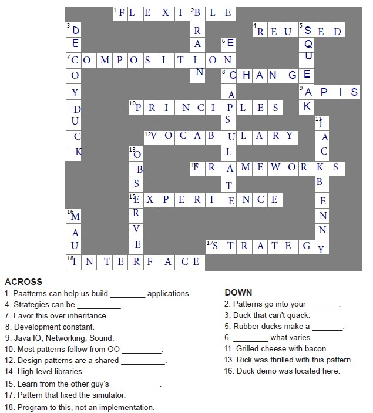

## The Observer Pattern

> Publishers + Subsribers = Observer Pattern

> Defines a one-to-many dependency between objects so that when one object changes
state, all of its dependents are notified and updated automatically

> Observers are loosely coupled in that subject knows nothing about them.

> Pulling data from Subject is considered more correct than Pushing.

### Design Principle

- Strive for loosely coupled designs between objects that interact

### Sharpen your pencil

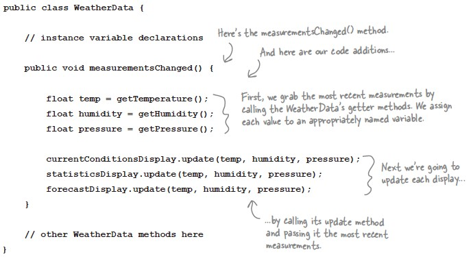

> Based on our first implementation, which of the following apply?

- We are coding to concrete implementation, not interfaces.

- For every new display we'll need to alter this code

- We have no way to add (or remove) display elements at runtime.

- We haven't encapsulated the part that changes.

> Sketching out the classes you'll need to implement the Weather Station,
Including the WeatherData class and its display elements.
Make sure your diagram show how all the pieces fit together and also
how another developer might implement her own display element.

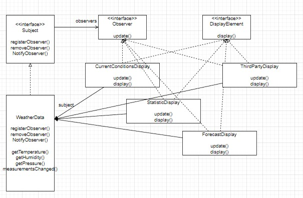

> Implement HeatIndexDisplay

```go
type HeatIndexDisplay struct {
 heatindex float64
}

func NewHeatIndexDisplay(weatherData *subject.WeatherData) *HeatIndexDisplay {
 display := &HeatIndexDisplay{}
 weatherData.RegisterObserver(display)
 return display
}

func (d *HeatIndexDisplay) Update(temperature, humidity, _ float64) {
 d.heatindex = d.computeHeatIndex(temperature, humidity)
 d.Display()
}

func (d *HeatIndexDisplay) Display() {
 fmt.Printf("Heat Index is %.5f\n", d.heatindex)
}

func (d *HeatIndexDisplay) computeHeatIndex(t, rh float64) float64 {
 index := (16.923 + (0.185212 * t) + (5.37941 * rh) - (0.100254 * t * rh) +
  (0.00941695 * (t * t)) + (0.00728898 * (rh * rh)) +
  (0.000345372 * (t * t * rh)) - (0.000814971 * (t * rh * rh)) +
  (0.0000102102 * (t * t * rh * rh)) - (0.000038646 * (t * t * t)) + (0.0000291583 *
  (rh * rh * rh)) + (0.00000142721 * (t * t * t * rh)) +
  (0.000000197483 * (t * rh * rh * rh)) - (0.0000000218429 * (t * t * t * rh * rh)) +
  0.000000000843296*(t*t*rh*rh*rh)) -
  (0.0000000000481975 * (t * t * t * rh * rh * rh))
 return index
}
```

### Brain Power

> Mary and Sue thought that passing the measurements directly to the observers was the most
straightforward method of updating state. Do you think this is wise? Can you think of other
ways to approach the problem of passing the updated state to the observers?

No, instead, let observers get what they want. No code changes for other observers is required in future.

### Code Magnet

> Reconstruct the ForecastDisplay code

```java

public ForecastDisplay implements Observer, DisplayElement {

  private float currentPressure = 29.92f;
  private float lastPressure;
  private WeatherData weatherData;

  public ForecastDisplay(WeatherData weatherData) {
    this.weatherData = weatherData
      weatherData.registerObserver(this);
  }

  public void update() {
    lastPressure = currentPressure;
    currentPressure = weatherData.GetPressure();
    display();
  }

  public void display() {

  }
}

```

### Design Puzzle

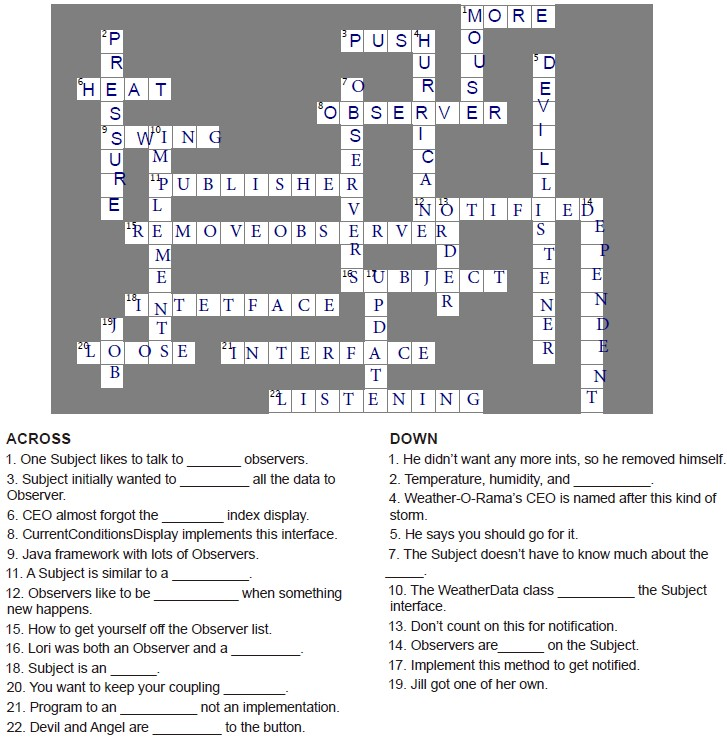

## Decorator

> attaches additional responsibilities to an object dynamically.
Decorators provide a flexible alternative to subclassing for extending functionality.

- Decorators have the same supertype as the objects they decorate.

- You can use one or more decorators to wrap the object.

- The decorator adds its own behavior before and/or after delegating to the object
it decorates to do the rest of the job.

- Objects can be decorated at any time, so we can decorate objects dynamically
at runtime with as many decorators as we like

- Decorators can result in many small objects in our design, and overuse can be complex.

### Design Principle

> The Open-Closed Principle

Classes should be open for extension but closed for modification

### Brain Power

> It's pretty obvious that starbuzz has created a maintenance nightmare
for themselves. What happens when the price of milk goes up? what do they
do when they add a caramel topping?
Thinking beyond the maintenance problem, which of the design principles that
we've covered so far they violating?

> Think about how you'd implement the cost() method of the coffees and the condiments. Also think about how you'd implement the getDescription() method of the condiments.

```java
double cost() {
    return this.beverage.cost() + this.cost
}

String getDescription() {
    return this.beverage.getDescription() + this.description
}
```

### Sharpen your pencil

> Write the cost() method for the following classes

```java
public class Beverage {
    public double cost() {
        double condimentCost = 0.0;
        if (hasMilk()) {
            condimentCost += milkCost;
        }
        if (hasSoy()) {
            condimentCost += soyCost;
        }
        if (hasMocha()) {
            condimentCost += mochaCost;
        }
        if (hasWhip()) {
            condimentCost += whipCost;
        }
        return condimentCost;
    }
}

public class DarkRoast extends Beverage {
    public DarkRoast() {
        description = "Most Excellent Dark Roast" ;
    }

    public double cost() {
        return 1.99 + super.cost();
    }
}
```

> What requirements or other factors might change that will impact this
design?

- Price changes for condiments will force us to alter existing code

- New condiments will force us to add new methods and alter the cost
method in the superclass.

- We may have new beverages. For some of these beverage (iced tea?), the condiments
may not be appropriate, yet the Tea subclass will still inherit methods like hasWhip()

- What if a customer wants a double mocha?

> Make a picture for what happens when the order is for a  "double mocha soy latte with whip" beverage.

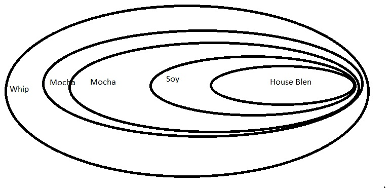

> Our friends at Starbuzz have introduced sizes to their menu. You can now order a coffee in tall, grande, and venti sizes.
> They'd also like efor the condiments to be charged according to size, so for instance,
> Soy costs 10c, 15c, and 20c, respectively, for tall, grande, and venti coffees
>
> How would you alter the decorator classes to handle this change in requirements?

```java
public abstract class Beverage {
    public enum Size { TALL, GRANDE, VENTI };
    Size size = Size.TALL;
    String description = "Unknown Beverage";
    public String getDescription() {
        return description;
    }

    public void setSize(Size size) {
        this.size = size;
    }

    public Size getSize() {
        return this.size;
    }

    public abstract double cost();
}

public abstract class CondimentDecorator extends Beverage {
    public Beverage beverage;
    public abstract String getDescription();

    public Size getSize() {
        return beverage.getSize();
    }
}

public class Soy extends CondimentDecorator {
    public Soy(Beverage beverage) {
        this.beverage = beverage;
    }

    public String getDescription() {
        return beverage.getDescription() + ", Soy";
    }

    public double cost() {
        double cost = beverage.cost();
        if (beverage.getSize() == Size.Tall) {
            cost += .10;
        } else if (beverage.getSize() == Size.GRANDE) {
            cost += .15; 
        } else if (beverage.getSize() == Size.VENTI) {
            cost += .20;
        }
        return cost;
    }
}
```

### Exercise

> Write and compile the code for other Soy and Whip condiments.
You'll need them to finish and test the application.

```go
type Soy struct {
 *CondimentDecorator
}

func NewSoy(beverage Beverage) *Soy {
 base := NewCondimentDecorator()
 soy := &Soy{base}
 soy.Beverage = beverage
 soy.CondimentDecorator.GetDescription = soy.GetDescription
 return soy
}

func (c *Soy) GetDescription() string {
 return c.Beverage.GetDescription() + ", Soy"
}

func (c *Soy) Cost() float64 {
 return c.Beverage.Cost() + .15
}

type Whip struct {
 *CondimentDecorator
}

func NewWhip(beverage Beverage) *Whip {
 base := NewCondimentDecorator()
 whip := &Whip{base}
 whip.Beverage = beverage
 whip.CondimentDecorator.GetDescription = whip.GetDescription
 return whip
}

func (c *Whip) GetDescription() string {
 return c.Beverage.GetDescription() + ", Whip"
}

func (c *Whip) Cost() float64 {
 return c.Beverage.Cost() + .10
}
```

## The Factory Pattern

> Defines an interface for creating an object, but lets subclasses decide which class
to instantiate. Factory Method lets a class defer instantiation to subclasses.

> Use me to decouple your client code from the concrete classes you need to instantiate.

- When you see "new", think "concrete"

- Again, identify the aspects that vary and separate them from what stays the same

### Brain Power

> How might you take all the parts of your application that instantiate concrete classes and separate
or encapsulate them from the rest of your application?

Create a class that in-charge to receive parameter for determine which concrete class to be instantiated
. Return an interface.

> We know that object composition allows us to change behavior dynamically at runtime
(among other things) because we can swap in and out implementations. How might we able to use
that in the PizzaStore? What factory implementations might we be able to swap in and out?

We don’t know about you, but we’re thinking New York, Chicago, and California style pizza factories (let’s not forget New Haven, too).

### Sharpen your pencil

> We've knocked out the NYPizzaStore; just two more to go and we'll be ready to
franchise! Write the Chicago-style and California-style Pizzastore

```go
type ChicagoStylePizzaStore struct {
 *abstractPizzaStore
}

func NewChicagoStylePizzaStore(factory factory.SimplePizzaFactory) *ChicagoStylePizzaStore {
 basePizzaStore := &abstractPizzaStore{}
 nyPizzaStore := &ChicagoStylePizzaStore{basePizzaStore}
 return nyPizzaStore
}

func (p *ChicagoStylePizzaStore) createPizza(typ string) model.Pizza {
 switch typ {
 case "cheese":
  return new(model.ChicagoStyleCheesePizza)
 case "veggie":
  return new(model.ChicagoStyleVeggiePizza
 case "clam":
  return new(model.ChicagoStyleClamPizza)
 case "pepperoni":
  return new(model.ChicagoStylePepperoniPizza)
 }
 panic(fmt.Sprintf("%s not implemented", typ))
}
```

### Design Puzzle

> We need another kind of pizza for those crazy Californians. Draw another
parallel set of classes that you'd need to add a new California region to
our PizzaStore

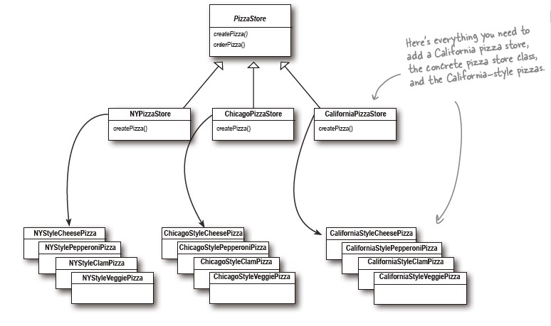

## Abstract Factory

> Provides an interface for creating families of related or dependent objects without specifying their concrete classes.

> Use whenever you have families of products you need to create and you want to make sure your clients
create products that belong together.

### Design Principle

> Dependency Inversion Principle: Depend upon abstractions. Do not depend upon concrete classes

High-level components should not depend on our low-level components; rather, they should both depend on abstractions.

Guidelines to avoid OO designs that violate this Principle:

- No variable should hold a reference to a concrete class.

- No class should derive from a concrete class

- No method should override an implemented method of any of its base classes.

### Sharpen your pencil

> Let's pretend you've never heard of an OO factory. Here's a "very dependent"
version of PizzaStore that does not use a factory. We need you to make a count
of number of concrete pizza classes this class is dependent on. If you added California-style
pizzas to this PizzaStore. How many classes would it be dependent on them?

Answer:
8 pizza classes DependentPizzaStore is dependent on
12 class would be dependent on California-style pizza (with California too)

```java
public class DependentPizzaStore {
  public Pizza createPizza(String style, String type) {
    Pizza pizza = null;
    if (style.equals("NY")) {
      if (type.equals("cheese")) {
        pizza = new NYStyleCheesePizza();
      } else if (type.equals("veggie")) {
        pizza = new NYStyleVeggiePizza();
      } else if (type.equals("clam")) {
        pizza = new NYStyleClamPizza();
      } else if (type.equals("pepperoni")) {
        pizza = new NYStylePepperoniPizza();
      }
    } else if (style.equals("Chicago")) {
      if (type.equals("cheese")) {
        pizza = new ChicagoStyleCheesePizza();
      } else if (type.equals("veggie")) {
        pizza = new ChicagoStyleVeggiePizza();
      } else if (type.equals("clam")) {
        pizza = new ChicagoStyleClamPizza();
      } else if (type.equals("pepperoni")) {
        pizza = new ChicagoStylePepperoniPizza();
      }
    } else {
      System.out.println("Error: invalid type of pizza");
      return null;
    }
    pizza.prepare();
    pizza.bake();
    pizza.cut();
    pizza.box();
    return pizza;
  }
}
```

> Write ChicagoPizzaIngredient Factory

```go
type ChicagoPizzaIngredientFactory struct{}

func (i *ChicagoPizzaIngredientFactory) CreateDough() model.Dough {
  return model.NewThickCrustDough()
}

func (i *ChicagoPizzaIngredientFactory) CreateSauce() model.Sauce {
  return model.NewPlumTomatoSauce()
}

func (i *ChicagoPizzaIngredientFactory) CreateCheese() model.Cheese {
  return model.NewMozzarellaCheese()

}

func (i *ChicagoPizzaIngredientFactory) CreateVeggies() []model.Veggies {
  var veggies []model.Veggies
  veggies = append(veggies, model.NewSpinach(), model.NewEggPlant(), model.NewMushroom(), model.NewBlackOlives())
  return veggies
}

func (i *ChicagoPizzaIngredientFactory) CreatePepperoni() model.Pepperoni {
  return model.NewSlicedPepperoni()

}

func (i *ChicagoPizzaIngredientFactory) CreateClam() model.Clams {
  return model.NewFrozenClams()
}

```

### Brain Power

> Compare this version of the createPizza() method to the one in the Factory Method implementation
earlier in the chapter

They are almost the same. The only different is Abstract Factory passed ingredientFactory when constructing Pizza. And this ingredientFactory decides what ingredient to be provided for this pizza instead of hardcoding (implementation earlier) in constructor.

### Design Patterns Crossword

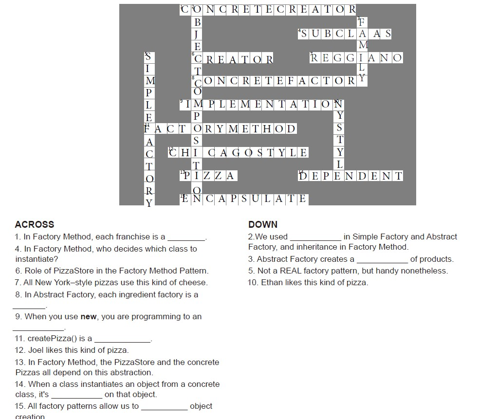

### Pizza Example Points

- In Factory Method, each franchise is concrete creator

- Pizza Store is creator in the factory method pattern

- In Abstract Factory, each ingredient factory is a concrete factory

- createPizza() is a Factory Method

## The Singleton Pattern

> Ensures a class has only one instance, and provides a global point of access to it

### Brain Power

> Cho-O-Holic has done a decent job of ensuring bad things don't happen, don't you think?
Then again, you probably suspect that if two Chocolate Boiler instances get loose,
some very bad things can happen.
>
> How might things go wrong if more than one instance of ChocolateBoiler is created in an application?

The operation result would be all wrong

### Sharpen your pencil

> Can you help Choc-O-Holic improve their Chocolate Boiler Class by turning it into a Singleton?

```java
public class Chocolate Boiler {
  private boolean empty;
  private boolean boiled;
  private static Chocolate uniqueInstance
    private ChocolateBoiler() {
      empty = true;
      boiled = false;
    }
  public static Chocolate getInstance() {
    if (uniqueInstance == null) {
      uniqueInstance = new Chocolate();
    }
    return uniqueInstance;
  }

  ...
}
```

> For each solution, describe its applicability to the problem of fixing the Chocolate Boiler code:

- Synchronize the getInstance() method:

A straightforward technique that is guaranteed to work. We don't seem to have any performance
concern with the chocolate boiler, so this would be a good choice.

- Eager instantiation:

We are always going to instantiate the chocolate boiler in our code, so statically initializing the instance
would cause no concerns. This solution would work as well as the synchronized method, although perhaps
be less obvious to a developer familiar with the standard pattern.

- Double-checked locking:

Given we have no performance concerns, double-checked locking seems like overkill. In addition,
we'd have to ensure that we are running at least Java 5

> Be the JVM
>
> We have two threads, each executing this code. Your job is to play the JVM and
determine whether there is a case in which two threads might get a hold of different boiler
objects.

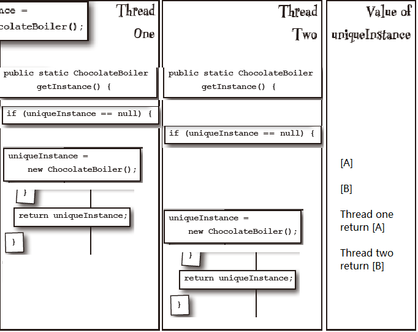

### Design Puzzle

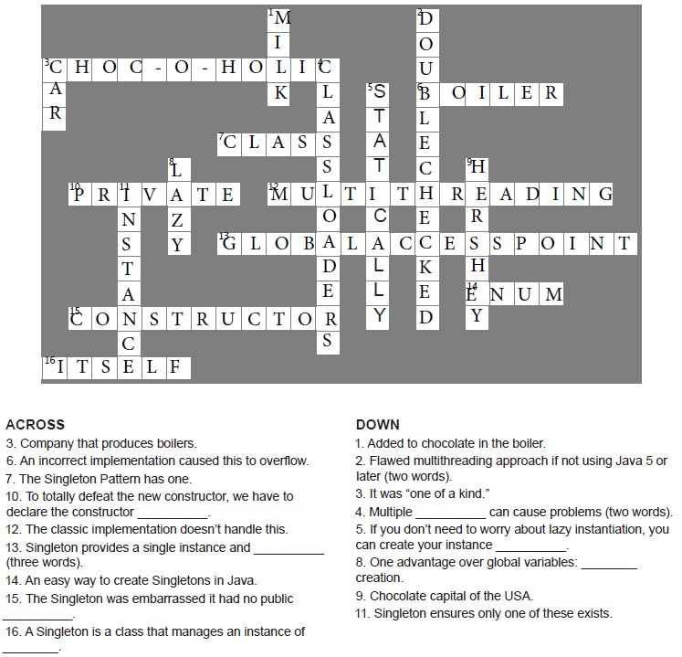

## The Command Pattern

> Encapsulates a request as an object, thereby letting you parameterize other
objects with different requests, queue or log requests, and support undoable operations.

> More uses of Command Pattern:

- Queuing requests

  - Imagine a job queue, you add commands to the queue on one end, and on
  the other end sits a group of threads

- Logging requests

  - store() and load()

  - As we execute commands, we store a history of them on disk. When a
  crash occurs, we reload the command objects and invoke their execute() methods
  in batch and in order

### Brain Power

> Before we move on, spend some time studying the diagram two pages back
along with Diner roles and responsibilities until you think you've got
a handle on the Objectville Diner objects and relationships. Once you've done that, get ready to nail the Command Pattern!

> How does the design of the Command Pattern support the decoupling of
the invoker of a request and the receiver of the request?

### Who Does What?


### Sharpen Your Pencil

> Okay, it's time for you to implement the GarageDoorOpenCommand class.
First, supply the code for the class below, You'll need GarageDoor class diagram.
>
> | Garage Door |
> | --- |
> | up() |
> | down() |
> | stop() |
> | lightOn() |
> | lightOff() |

```java
public class GarageDoorOpenCommand implements Command {
  private GarageDoor garagedoor;

  public GarageDoorOpenCommand(GarageDoor garagedoor) {
    this.garagedoor = garagedoor;
  }

  public void Execute() {
    garagedoor.up();
    garagedoor.lightOn();
  }
}
```

Output here:

```bash
%java RemoteControlTest
Garage door open
Garage door light on
```

> Here’s the code (the important bits anyway) for the little life-changing
application from Chapter 2. See if you can identify who is the Client, who are
the Commands, who is the Invoker, and who is the Receiver

```java
public class SwingObserverExample {
  // Set up ...
  JButton button = new JButton("Should I do it?");
  button.addActionListener(new AngelListener());
  button.addActionListener(new DevilListener());
  // Set frame properties here
}

class AngelListener implements ActionListener {
  public void actionPerformed(ActionEvent event) {
    System.out.println("Don't do it, you might regret it!");
  }
}

class DevilListener implements ActionListener {
  public void actionPerformed(ActionEvent event) {
    System.out.println("Come on, do it!");
  }
}
}
```

- Commands: AngelListener, DevilListener

- Invoker: button

- Client: Who set up the swing components and sets the commands

- Receiver: System.out.println

### Design Pattern Crossword

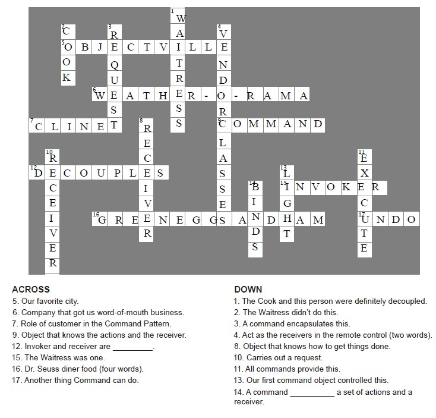

## The Adapter and Facade Pattern

> converts the interface of a class into another interface the clients expect.
Adapter lets classes work together that couldn't otherwise because of incompatible
interfaces.

> There are two kinds of adapter: object and class adapters. Class adapter use
multiple inheritance to implement it (which isn't possible in Java). Object adapters
use composition.

### Sharpen your pencil

> Let's say we also need an Adapter that converts a Duck to a Turkey.
Let's call it DuckAdapter. Write that class:

```java
public class DuckAdapter implements Turkey {

  Duck duck;

  Random rand;

  public DuckAdapter(Duck duck) {
    this.duck = duck;
  }

  public gobble() {
    this.duck.quack();
  }

  public fly() {
    if (rand.nextInt(5) == 0) {
      this.duck.fly();
    }
  }
}
```

### Brain Power

> Object adapters and class adapters use two different means of adapting the adaptee
(composition versus inheritance). How do these implementation differences affect the flexibility of the adapter?

Prefer composition over inheritance. Imagine there class adapters are used, and there is a
new requirement of a class to extends the existing adaptee. This class would not
be able to use this adapter method.

> Some AC adapters do more than just change the interface -- they add other features like surge protection,
indicator lights, and other bells and whistles.
>
> If you were going to implement these kinds of features, what pattern would you use?

Decorator pattern, it add new responsibilities to the design

### Duck Magnets

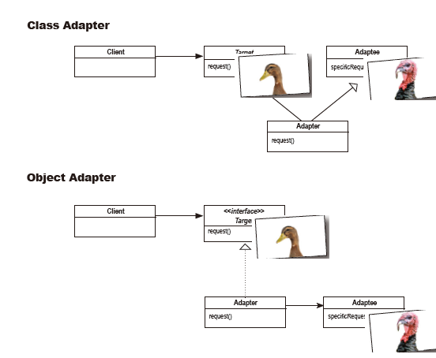

### Exercise

> While Java has gone in the direction of the iterator interface, there is nevertheless still legacy client code
that depends on the Enumeration interface, so an Adapter that converts an Iterator to an Enumeration could potentially
be useful.
Write an Adapter that adapts an Iterator to an Enumeration. You can test your code by adapting an ArrayList.
The ArrayList class supports the Iterator interface but doesn't support Enumerations.

```java
public class EnumerationAdapter implements Iterator <Object> {
  Enumeration<?> enumeration;

  public EnumerationAdapter (Enumeration<?> enumeration) {
    this.enumeration = enumeration;
  }

  public boolean hasNext() {
    return enumeration.hasMoreElements();
  }

  public Object next() {
    return enumeration.nextElement();
  }

  public void remove() {
    throw new UnsupportedOperationException();
  }
}
```

### Who Does What?

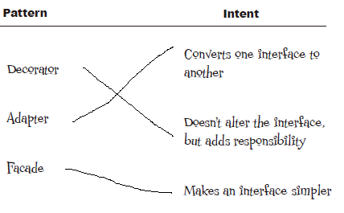

## The Facade Pattern

> Provides a unified interface to a set of interfaces in a subsystem. Facade defines
a higher level interface that makes the subsystem easier to use

> It avoid tight coupling between clients and subsystems

### Design Principle

> Principle of Least Knowledge / Law of Demeter: talk only to your immediate friends.

Invoke only methods that belongs to:

- The object itself

- The object passed in as a parameter to the method

- Any object the method creates or instantiates

- Any components of the object

Example without the principle

```java
public float getTemp() {
  Thermometer thermometer = station.getThermometer();
  return thermometer.getTemperature();
}
```

Example with the principle

```java
public float getTemp() {
  return station.getTemperature();
}
```

### Brain Power

> Think about the facades you've encountered in the Java API. Where would you
like to have a few new ones?

> How many classes is this code coupled to?
>
> ```java
> public float getTemp() {
>  return station.getThermometer().getTemperature();
> }
> ```

Three including itself

> Can you think of a common use of Java that violates the Principle of Least Knowledge?
Should you care?

System.out.println()

### Sharpen Your Pencil

> Do either of these classes violate the Principle of Least Knowledge? Why or why not?
>
> ```java
> public House {
>   WeatherStation station;
> 
>   // other methods and constructor
> 
>   public float getTemp() {
>     return station.getThermometer().getTemperature();
>   }
> }
> ```
>
> ```java
> public House {
>   WeatherStation station;
> 
>   // other methods and constructor
> 
>   public float getTemp() {
>     Thermometer thermometer = station.getThermometer();
>     return getTempHelper(thermometer);
>   }
> 
>   public float getTempHelper(Thermometer thermometer) {
>     return thermometer.getTemperature();
>   }
> }
> ```

- station.getThermometer().getTemperature() violates.

- second code doesn't violate. However, anything really changed since we just moved out the call to another method?

### Design Patterns Crossword

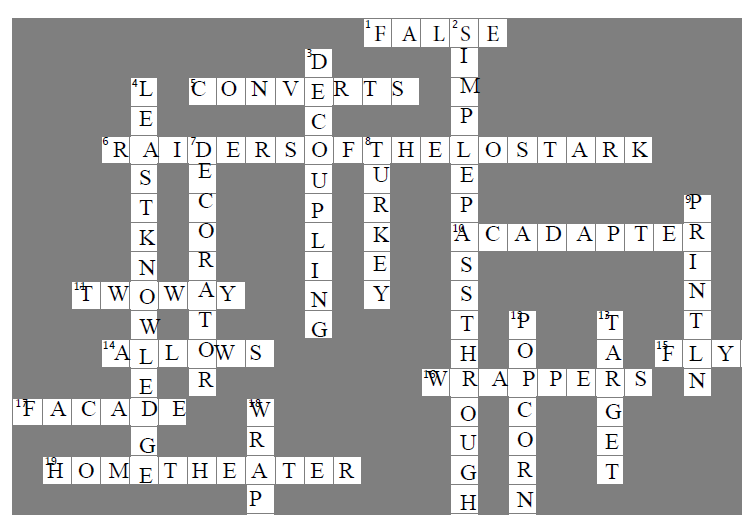

## The Template Method Pattern

> Defines the skeleton of an algorithm in a method, deferring some steps to
subclasses. The template method is usually defined in an abstract class

Template Method lets subclasses redefine certain steps of an algorithm without
changing the algorithm's structure

> A hook method can be used:

```java
public abstract class CaffeineBeverageWithHook {
  final void prepareRecipe() {
    boilWater();
    brew();
    pourInCup();
    if (customerWantsCondiments()) {
      addCondiments();
    }
  }

  // Subclass can choose whether to implement it
  boolean customerWantsCondiments() {
    return true;
  }
}
```

> Java's compareTo() use template pattern

We can implements Comparable and implement the compareTo so
Arrays.sort(..) can sort our objects based on our implementation

> Java's JFrame use template pattern

We can implement paint(Graphics graphics) to tell the JFrame
to draw what we want.

> Java's AbstractList use template pattern

We must implement the methods get(int index) and size()

### Design Principle

> The Hollywood Principle: Don't call us, we'll call you.

prevent dependency rot. Dependency rot happens when you have high-level components
depending on low-level components depending on high-level components

### Design Puzzle

> You've seen that the Coffee and Tea classes have a fair bit of code duplication. Take another
look at the Coffee and Tea classes and draw a class diagram showing how you'd redesign the
classes to remove redundancy

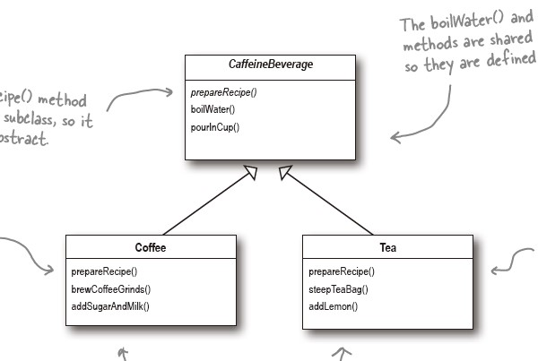

### Brain Power

> Did we do a good on the redesign? Hmmmm, take another
look. Are we overlooking some other commonality? What are
other ways that Coffee and Tea are similar?

> What other patterns make use of the Hollywood Principle?

The Factory Method and Observer, any others?

> We know that we should favor composition over inheritance, right? Well, the
implementers of the sort() template method decided not to use inheritance and
instead to implement sort() as a static method that is composed with a Comparable
at runtime. How is this better? How is it worse? How would you approach this
problem? Do Java arrays make this particularly tricky?

> Think of another pattern that is a specialization of the template method. In
this specialization, primitive operations are used to create and return objects.
What pattern is this?

Factory Pattern

### Sharpen you pencil

> Draw the new class diagram now we've moved the implementation of prepareRecipe()
into the CaffeineBeverage Class


### Who Does What?

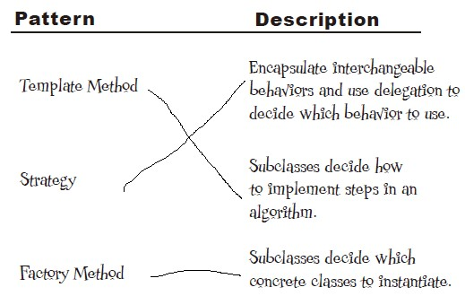

### Design Patterns Crossword

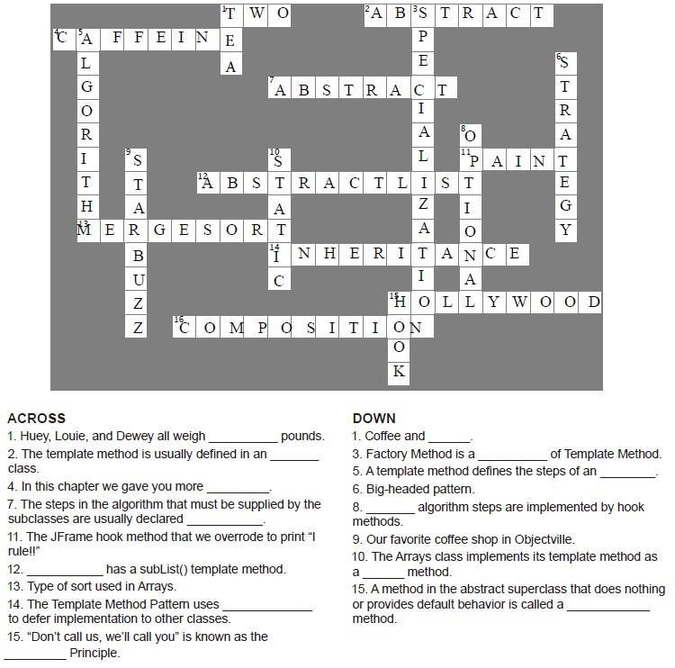

## The Iterator Pattern

> Provides a way to access the elements of an aggregate object sequentially
without exposing its underlying representation.

> Java's Iterable interface enables class enhanced for loop

```java
// if a list is an Iterable (e.g. ArrayList)
for (MenuItem item: menu) {
  System.out.print(...)
}

or 

menu.forEach(item -> System.out.println(...))
```

### Design Principle

> The Single Responsibility Principle: A class should have only one reason to change

### Sharpen Your Pencil

> Based on our implementation of printMenu(), which of the following apply?

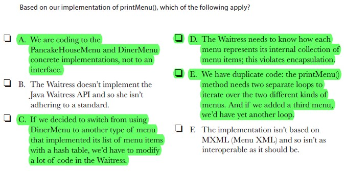

> Before looking at the next page, quickly jot down the three
things we have to do to this code to fit it into our framework:

- Implement the Menu Interface

- Get rid of getItems()

- add createIterator()

### Brain Power

> The class diagram for the Iterator Pattern looks very similar to another
pattern you’ve studied; can you think of what it is? Hint: a subclass
decides which object to create.

Factory Method Pattern

> Examine these classes and determine which ones have multiple responsibilities.


> Determine if these classes have low or high cohesion.

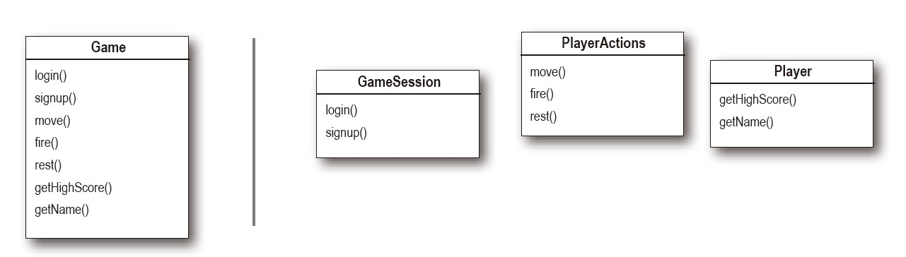

> The Waitress still needs to make three calls to printMenu(), one for each menu. Can you
think of a way to combine the menus so that only one call needs to be made? Or perhaps
so that one Iterator is passed to the Waitress to iterate over all the menus?

Put the menus into a list.

### Code Magnets

> The Chefs have decided that they want to be able to alternate their lunch menu items; in other words,
they will offer some items on Monday, Wednesday, Friday, and Sunday, and other items on Tuesday,
Thursday, and Saturday. Someone already wrote the code for a new “Alternating” DinerMenu Iterator so
that it alternates the menu items, but she scrambled it up and put it on the fridge in the Diner as a joke.
Can you put it back together? Some of the curly braces fell on the floor and they were too small to pick
up, so feel free to add as many of those as you need.

```java
import java.util.Iterator;
import java.util.Calendar;

public class AlternatingDinerMenuIterator implements Iterator<MenuItem> {

  MenuItem[] items;
  int position;

  public AlternatingDinerMenuIterator(MenuItem[] items) {
    this.items = items;
    position = Calendar.DAY_OF_WEEK % 2;
  }

  public boolean hasNext() {
    if (position >= items.length || items[position] = = null) {
      return false;
    } else {
      return true;
    }
  }

  public Object next() {
    MenuItem menuItem = items[position];
    position = position + 2;
    return menuItem;
  }

  public void remove() {
    throw new UnsupportedOperationException(
    "Alternating Diner Menu Iterator does not support remove()");
  }
}
```

## The Composite Pattern

> Allows you to compose objects into tree structures to represent part-whole
hierarchies.

Composite lets clients treat individual objects and compositions of objects uniformly.

> Takes the Single Responsibility Principle and trades it for transparency. -- classic case of tradeoff

By allowing the Component interface to contain the child management operations and
the leaf operations, **a client can treat both composites and leaves uniformly**.
So whether an element is a composite or leaf node becomes transparent to the client

### Who Does What?

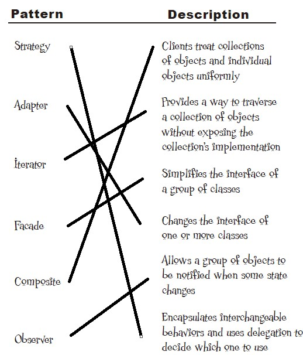

### Design Patterns Crossword

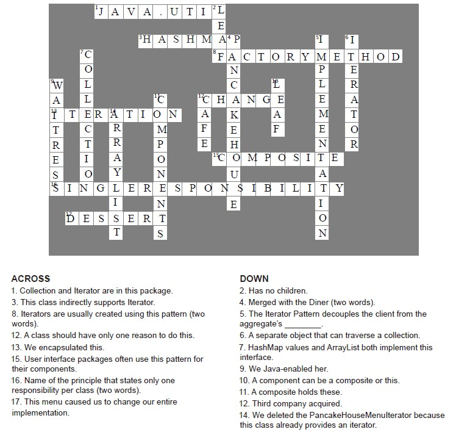

## The State Pattern

> Allows an object to alter its behavior when its internal state changes. The
object will appear to change its class.

### Design Puzzle

> Draw a state diagram for a Gumball Machine that handles the 1 in 10
contest. In this contest, 10% of the time the Sold state leads to two
balls being released, not one.

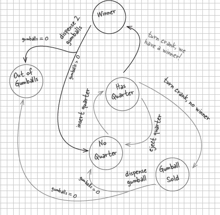

### Sharpen Your Pencil

> Which of the following describe the state of our implementation?

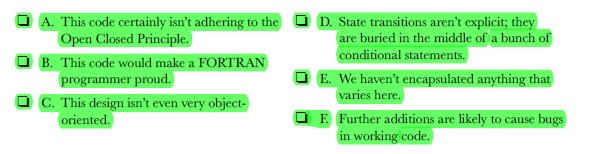

> To implement our states, we first need to specify the behavior of the
classes when each action is called. Annotate the diagram below with the
behavior of each action in each class; we’ve already filled in a few for you.

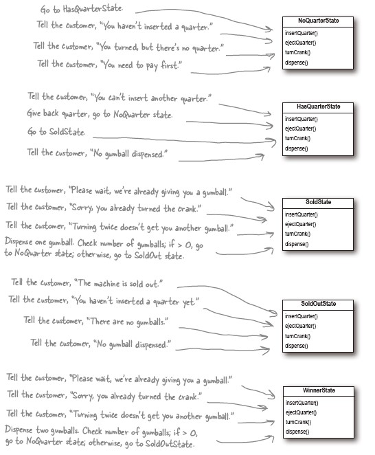

> We have one remaining class we haven’t implemented: SoldOutState.
Why don’t you implement it?

```java
public class SoldOutState implements State {
  GumballMachine gumballMachine;

  public SoldOutState(GumballMachine gumballMachine) {
    this.gumballMachine = gumballMachine;
  }

  public void insertQuarter() {
    System.out.println("You can't insert a quarter, the machine is sold out")
  }

  public void ejectQuarter() {
    System.out.println("You can't eject, you haven't inserted a quarter yet")
  }

  public void turnCrank() {
    System.out.println("You turned, but there are no gumballs")
  }

  public void dispense() {
    System.out.println("No gumball dispensed")
  }
}
```

> We need you to write the refill() method for the Gumball machine.
It has one argument -- the number of gumballs you're adding to the machine--
and should update the gumball machine count and reset the machine's state

```java
// Each State must implement refill
// below method to the SoldOutState
public void refill() {
  gumballMachine.setState(gumballMachine.getNoQuarterState())
}

// GumballMachine class
public void refill(int v) {
  this.count += v
  System.out.println("The gumball machine was just refilled; its new count is : " + this.count)
  this.state.refill();
}
```

### Brain Power

> Look back at the GumballMachine implementation. If the crank is turned and
not successful (say the customer didn’t insert a quarter first), we call dispense()
anyway, even though it’s unnecessary. How might you fix this?

### Who Does What?

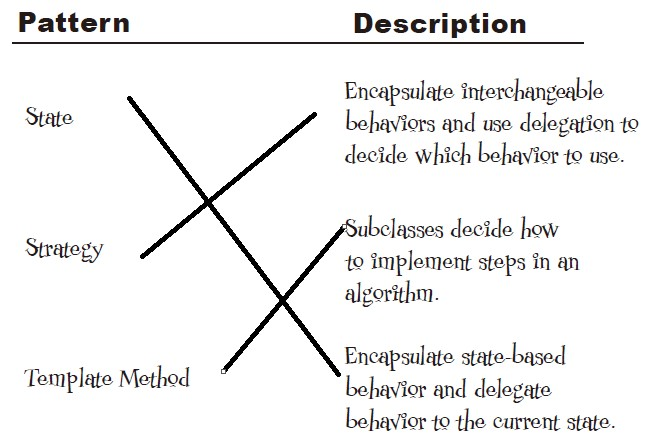

## The Proxy Pattern

> Provides a surrogate or place holder for another object to control access to it

> Few ways proxies control access:

- A remote proxy controls access to a remote object

- A virtual proxy controls access to a resource that is expensive to create

  - Example: displaying album cover

- A protection proxy controls access to a resource based on access rights.

> More variations:

- Firewall Proxy: controls access to a set of network resources

- Smart Reference Proxy: provides additional actions whenever a subject is referenced, such as counting the number

- Caching Proxy: provides temporary storage for results of operations that are expensive.
It can also allow multiple clients to share the result to reduce computation or network latency.

- Synchronization Proxy: provides safe access to a subject from multiple threads.

- Complexity Hiding Proxy: hides complexity of and controls access to a complex set of
classes. Sometime called Facade Proxy. It differs from the Facade Pattern in that
the proxy control access, while the Facade Pattern just provides an alternative interface.

- Copy-On-Write Proxy: controls the copying of an object by deferring the copying of an object until it is required by a client. This is a variant of Virtual Proxy

### Making the Remote Service Steps

> Step one:

make a remote interface: MyService.java

> Step two:

make a remote implementation: MyServiceImpl.java

> Step three:

start the RMI registry (rmiregistry).
It is like the white pages of a phone book. It's where the client goes to get the proxy

`rmiregistry`

> Step four:

start the remote service

`java MyServiceImpl`

#### Client side

> Client does a lookup on the RMI registry

```java
public class MyRemoteClient {
  public static void main(String[] args) {
    new MyRemoteClient().go();
  }

  private void go() {
    try {
      MyRemote service = (MyRemote) Naming.lookup("rmi://127.0.0.1/RemoteHello");
      String s = service.sayHello();
      System.out.println(s);
    } catch (Exception e) {
      e.printStackTrace();
    }
  }
}
```

### Brain Power

> Before going further, think about how you'd design a system to enable Remote Method
Invocation (RMI). How would you make it easy on the developer so that she has
to write little code as possible? How would you make the remote invocation look seamless?

> Should making remote calls be totally transparent? Is that a good idea? What
might be problem with that approach?

> Stop and think through how we're going to adapt the gumball machine code to
work with a remote proxy. Feel free to make some notes here about what needs to change and
what's going to be different than the previous version.

### Exercise

> The NonOwnerInvocationHandler works just like the OwnerInvocationHandler except
that it allows calls to setGeekRating() and it disallows calls to any other set method.
Go ahead and write this handler yourself.

```java
public class NonOwnerInvocationHandler implements InvocationHandler {
  Person person;

  public NonOwnerInvocationHandler(Person person) {
    this.person = person;
  }

  public Object invoke(Object proxy, Method method, Object[] args) throws IllegalStateException {
    try {
      if (method.getName().startsWith("get")) {
        return method.invoke(person, args);
      } else if (method.getName().equals("setGeekRating")) {
        return method.invoke(person, args);
      } else if (method.getName().startsWith("set")) {
        throw new IllegalAccessException();
      }
    } catch (Exception e) {
      e.printStackTrace();
    }
    return null;
  }

}
```

### What Does What?

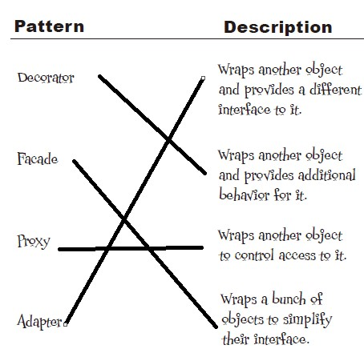

### Design Patterns Crossword

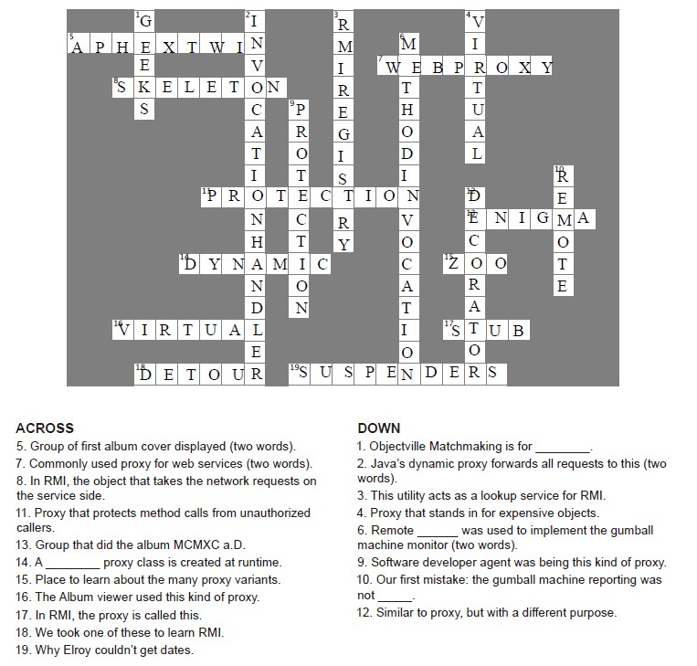

## MVC

> MVC is patterns put together

### Design Puzzle

> You've seen that the view and controller together make use of the Strategy
Pattern. Can you draw a class diagram of the two that represents this pattern?

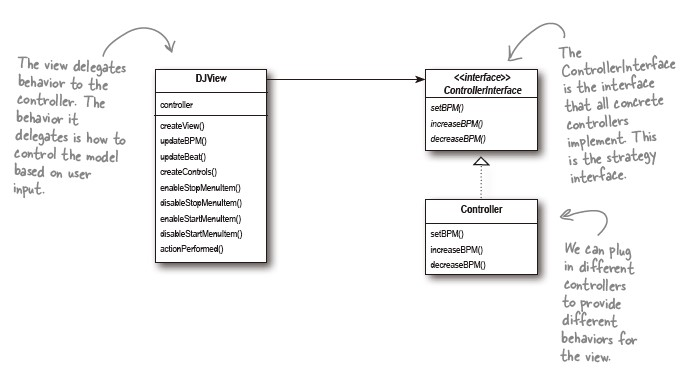

## Leftover Patterns

### Bridge

> to vary not only your implementations, but also your abstractions.

### Builder

> encapsulate the construction of a product and allow it to be constructed in steps.

### Chain of Responsibility

> use it when you want to give more than one object a chance to handle a request.

Each object in turn examines a request and either handles it or passes it on to the next
object in the chain.

### Flyweight

> Use when one instance of a class can be used to provide many virtual instances.

### Interpreter

> To build an interpreter for a language

It requires some knowledge of formal grammars.

### Mediator

> To centralize complex communications and control between related objects

### Memento

> Use it when you need to be able to return an object to one of its previous states

### Prototype

> Use it when creating an instance of a given class is either expensive or complicated

allows you to make new instances by copying existing instances. A key aspect of this pattern is that
the client code can make new instances without knowing which specific class is being instantiated

### Visitor

> Use it when you want to add capabilities to a composite of objects and encapsulation is not important.

## Patterns in the Real World

> **A Pattern** is a solution to a problem in a context.

### Pattern Categories

> Creational Patterns: object instantiation and all provide a way to decouple a client from the
object it needs to instantiate.

- Singleton

- Factory Method

- Abstract Factory

- Prototype

- Builder

> Behavioral: how classes and objects interact and distribute responsibility

- Template Method

- Strategy

- Command

- Observer

- State

- Iterator

- Visitor

- Mediator

- Memento

- Chain of Responsibility

- Interpretor

> Structural: compose classes or objects into larger structures.

- Proxy

- Composite

- Adapter

- Decorator

  - **Why?** allows you to compose objects by wrapping one object with another to provide new functionality.
  So the focus is on how you compose the objects dynamically to gain functionality, rather than on the
  communication and interconnection between objects, which is the purpose of behavioral patterns.

- Facade

- Flyweight

- Bridge

### Who Does What?

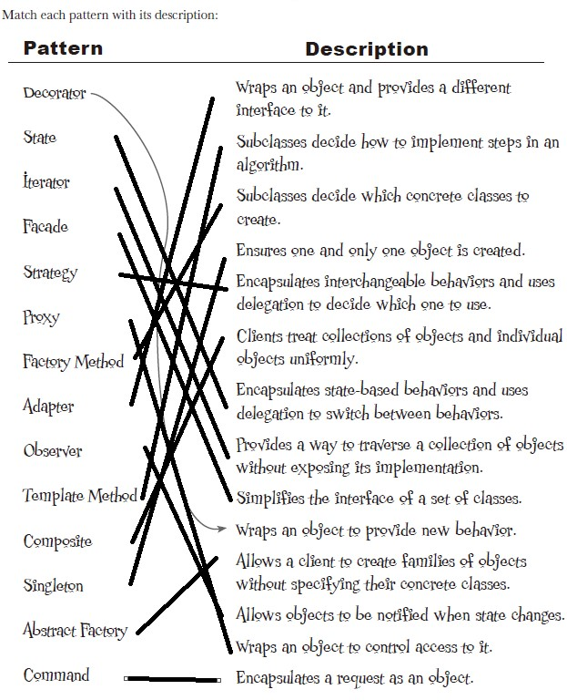

### Anti-Pattern

> An Anti-Pattern tells you how to go from a problem to a BAD solution.

...suggested to discover these patterns in future...
