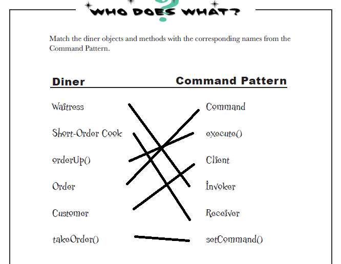

## Decorator

> attaches additional responsibilities to an object dynamically.
Decorators provide a flexible alternative to subclassing for extending functionality.

- Decorators have the same supertype as the objects they decorate.

- You can use one or more decorators to wrap the object.

- The decorator adds its own behavior before and/or after delegating to the object
it decorates to do the rest of the job.

- Objects can be decorated at any time, so we can decorate objects dynamically
at runtime with as many decorators as we like

- Decorators can result in many small objects in our design, and overuse can be complex.

### Design Principle

> The Open-Closed Principle

Classes should be open for extension but closed for modification

### Brain Power

> It's pretty obvious that starbuzz has created a maintenance nightmare
for themselves. What happens when the price of milk goes up? what do they
do when they add a caramel topping?
Thinking beyond the maintenance problem, which of the design principles that
we've covered so far they violating?

> Think about how you'd implement the cost() method of the coffees and the condiments. Also think about how you'd implement the getDescription() method of the condiments.

```java
double cost() {
    return this.beverage.cost() + this.cost
}

String getDescription() {
    return this.beverage.getDescription() + this.description
}
```

### Sharpen your pencil

> Write the cost() method for the following classes

```java
public class Beverage {
    public double cost() {
        double condimentCost = 0.0;
        if (hasMilk()) {
            condimentCost += milkCost;
        }
        if (hasSoy()) {
            condimentCost += soyCost;
        }
        if (hasMocha()) {
            condimentCost += mochaCost;
        }
        if (hasWhip()) {
            condimentCost += whipCost;
        }
        return condimentCost;
    }
}

public class DarkRoast extends Beverage {
    public DarkRoast() {
        description = "Most Excellent Dark Roast" ;
    }

    public double cost() {
        return 1.99 + super.cost();
    }
}
```

> What requirements or other factors might change that will impact this
design?

- Price changes for condiments will force us to alter existing code

- New condiments will force us to add new methods and alter the cost
method in the superclass.

- We may have new beverages. For some of these beverage (iced tea?), the condiments
may not be appropriate, yet the Tea subclass will still inherit methods like hasWhip()

- What if a customer wants a double mocha?

> Make a picture for what happens when the order is for a  "double mocha soy latte with whip" beverage.


> Our friends at Starbuzz have introduced sizes to their menu. You can now order a coffee in tall, grande, and venti sizes.
> They'd also like efor the condiments to be charged according to size, so for instance,
> Soy costs 10c, 15c, and 20c, respectively, for tall, grande, and venti coffees
>
> How would you alter the decorator classes to handle this change in requirements?

```java
public abstract class Beverage {
    public enum Size { TALL, GRANDE, VENTI };
    Size size = Size.TALL;
    String description = "Unknown Beverage";
    public String getDescription() {
        return description;
    }

    public void setSize(Size size) {
        this.size = size;
    }

    public Size getSize() {
        return this.size;
    }

    public abstract double cost();
}

public abstract class CondimentDecorator extends Beverage {
    public Beverage beverage;
    public abstract String getDescription();

    public Size getSize() {
        return beverage.getSize();
    }
}

public class Soy extends CondimentDecorator {
    public Soy(Beverage beverage) {
        this.beverage = beverage;
    }

    public String getDescription() {
        return beverage.getDescription() + ", Soy";
    }

    public double cost() {
        double cost = beverage.cost();
        if (beverage.getSize() == Size.Tall) {
            cost += .10;
        } else if (beverage.getSize() == Size.GRANDE) {
            cost += .15; 
        } else if (beverage.getSize() == Size.VENTI) {
            cost += .20;
        }
        return cost;
    }
}
```

### Exercise

> Write and compile the code for other Soy and Whip condiments.
You'll need them to finish and test the application.

```go
type Soy struct {
	*CondimentDecorator
}

func NewSoy(beverage Beverage) *Soy {
	base := NewCondimentDecorator()
	soy := &Soy{base}
	soy.Beverage = beverage
	soy.CondimentDecorator.GetDescription = soy.GetDescription
	return soy
}

func (c *Soy) GetDescription() string {
	return c.Beverage.GetDescription() + ", Soy"
}

func (c *Soy) Cost() float64 {
	return c.Beverage.Cost() + .15
}

type Whip struct {
	*CondimentDecorator
}

func NewWhip(beverage Beverage) *Whip {
	base := NewCondimentDecorator()
	whip := &Whip{base}
	whip.Beverage = beverage
	whip.CondimentDecorator.GetDescription = whip.GetDescription
	return whip
}

func (c *Whip) GetDescription() string {
	return c.Beverage.GetDescription() + ", Whip"
}

func (c *Whip) Cost() float64 {
	return c.Beverage.Cost() + .10
}
```
## The Command Pattern

### Brain Power

> Before we move on, spend some time studying the diagram two pages back
along with Diner roles and responsibilities until you think you've got
a handle on the Objectville Diner objects and relationships. Once you've done that, get ready to nail the Command Pattern!

### Who Does What?


