# JavaWeb


## Servlet

web.xml

```xml
<?xml version="1.0" encoding="UTF-8"?>
<web-app version="4.0" xmlns="http://xmlns.jcp.org/xml/ns/javaee"
   xmlns:xsi="http://www.w3.org/2001/XMLSchema-instance"
   xsi:schemaLocation="http://xmlns.jcp.org/xml/ns/javaee 
   http://xmlns.jcp.org/xml/ns/javaee/web-app_4_0.xsd">
    <servlet>
        <servlet-name>Demo01Servlet</servlet-name>
        <servlet-class>	com.atguigu.servlets.Demo01Servlet</servlet-class>
    </servlet>
    <servlet-mapping>
        <servlet-name>DemoServlet</servlet-name>
        <url-pattern>/demo01</url-pattern>
    </servlet-mapping>
</web-app>
```

visit: localhost:9090/soon/demo01 [soon is finalName in build in pom.xml]

> **Annotation (Since 3.0)**

`@WebServlet("/demo01")`

` your class ...`


### 乱码问题解决

> **Tomcat 8 and after**

doGet

- no need

doPost 

```java
request.setCharacterEncoding("utf-8");
** do this at first line
```


> **Before Tomcat 8**

doGet

```java
String fname = request.getParameter("fname");
byte[] bytes = fname.getBytes("iso-8859-1");
fname = new String(bytes, "UTF-8");
```

doPost

```java
request.setCharacterEncoding("utf-8");
** do this at first line
```


Response:

```java
resp.setCharacterEncoding("UTF-8");

```


## HttpServletRequest

```
getRequestURI(); // --> /shucheng/page.do
getQueryString(); // --> .... --> getRequestURI() + "?" + this = /shucheng/page.do?a=b
```


## 生命周期

- Constructor (One time) 

  **Tips:** 不能私有化，因为servlet底层用的是反射

- init() (One time)

- service() (Multiple times)

  ```java
  protected void service(HttpServletRequest req, HttpServletResponse resp)
          throws ServletException, IOException
      {
          String method = req.getMethod();
  
          if (method.equals(METHOD_GET)) {
              long lastModified = getLastModified(req);
              if (lastModified == -1) {
                  // servlet doesn't support if-modified-since, no reason
                  // to go through further expensive logic
                  doGet(req, resp);
              } else {
                  long ifModifiedSince = req.getDateHeader(HEADER_IFMODSINCE);
                  if (ifModifiedSince < lastModified) {
                      // If the servlet mod time is later, call doGet()
                      // Round down to the nearest second for a proper compare
                      // A ifModifiedSince of -1 will always be less
                      maybeSetLastModified(resp, lastModified);
                      doGet(req, resp);
                  } else {
                      resp.setStatus(HttpServletResponse.SC_NOT_MODIFIED);
                  }
              }
  
          } else if (method.equals(METHOD_HEAD)) {
              long lastModified = getLastModified(req);
              maybeSetLastModified(resp, lastModified);
              doHead(req, resp);
  
          } else if (method.equals(METHOD_POST)) {
              doPost(req, resp);
              
          } else if (method.equals(METHOD_PUT)) {
              doPut(req, resp);
              
          } else if (method.equals(METHOD_DELETE)) {
              doDelete(req, resp);
              
          } else if (method.equals(METHOD_OPTIONS)) {
              doOptions(req,resp);
              
          } else if (method.equals(METHOD_TRACE)) {
              doTrace(req,resp);
              
          } else {
              //
              // Note that this means NO servlet supports whatever
              // method was requested, anywhere on this server.
              //
  
              String errMsg = lStrings.getString("http.method_not_implemented");
              Object[] errArgs = new Object[1];
              errArgs[0] = method;
              errMsg = MessageFormat.format(errMsg, errArgs);
              
              resp.sendError(HttpServletResponse.SC_NOT_IMPLEMENTED, errMsg);
          }
      }
  
      protected void doPost(HttpServletRequest req, HttpServletResponse resp)
          throws ServletException, IOException
      {
          String protocol = req.getProtocol();
          String msg = lStrings.getString("http.method_post_not_supported");
          if (protocol.endsWith("1.1")) {
              resp.sendError(HttpServletResponse.SC_METHOD_NOT_ALLOWED, msg);
          } else {
              resp.sendError(HttpServletResponse.SC_BAD_REQUEST, msg);
          }
      }
  ```

  

- destroy() (One time)

**Tips:** servlet并不是线程安全的，尽量不要在servlet中定义成员变量，如果不得不定义成员变量，尽量不要对此变量做逻辑判断和修改


## Http

### Request

#### Request Body 3 of the types

> **Get**

- no request body
- Query string

> **Post**

- request body
- form data

> **Json Format**

- request body
- request payload


### Response

#### Response Header

> **状态行**

Protocol + Status Code + Status

example: HTTP/1.1 200 OK


### HTTP 是无状态的（server无法知道是不是同一个Client）

> Session 来记得用户

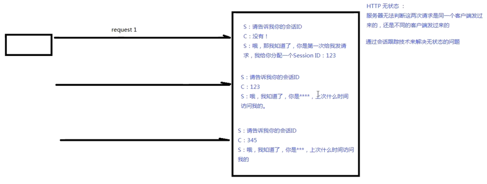

```java
  @Override
  protected void doGet(HttpServletRequest req, HttpServletResponse resp) throws ServletException, IOException {
    // 假如是第一次，会创建新的session req.getSession(false)则不会创建新的
    HttpSession session = req.getSession();
    System.out.println(session.getId());
    // session.isNew() boolean
    // session.setMaxInactiveInterval() -> default 1800s, 用来登出用户
    // session.getMaxInactiveInterval(int interval)
    // session.invalidate() -> 强制性失效
    // session.getCreationTime()
  }
```

> **第一次请求**
>
> - 服务端创建session
> - send this session to client
> - client save sessionid it in cookie

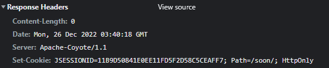

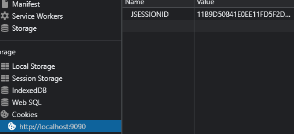

> **第二次请求**

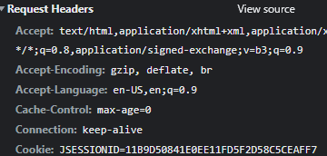


## Forward and Redirect

> **Forward**
>
> - One-time request, the client does not know how many internal forward occurred.
> - The URL was not changed.
> - request.getRequest...

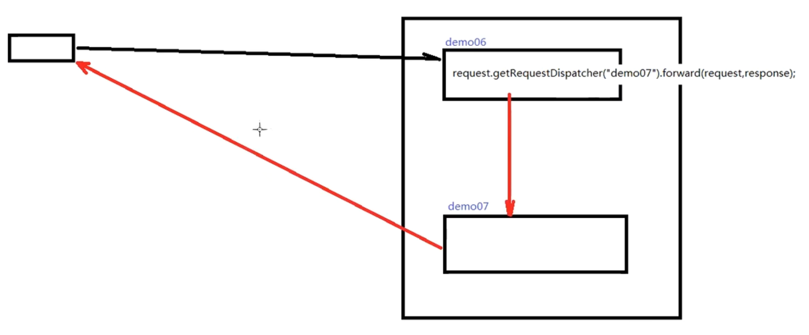

> **Redirect**
>
> - Two requests, the URL has been changed accordingly.
> - response.sendRedirect("demo7");

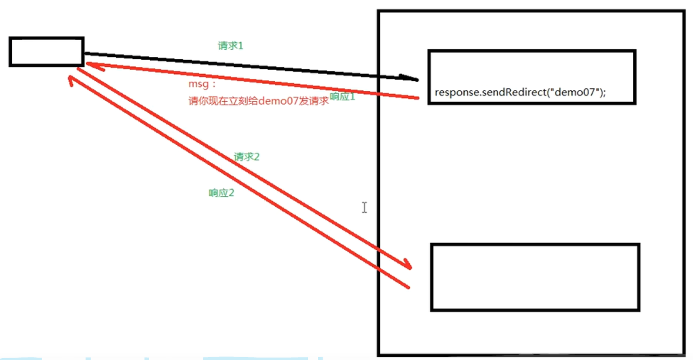


## Thymeleaf

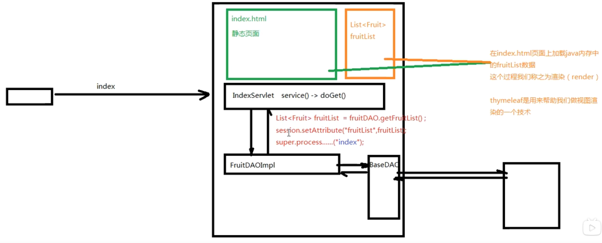

### Steps:

1. dependencies

   

   ```xml
   <dependency>
       <groupId>org.thymeleaf</groupId>
       <artifactId>thymeleaf</artifactId>
       <version>3.0.15.RELEASE</version>
   </dependency>
   ```

   **Issue**: 3.1.x some Class not found... ServletContextTemplateResolver

   

2. web.xml configuration

   ```xml
   <?xml version="1.0" encoding="UTF-8"?>
   <web-app version="4.0" xmlns="http://xmlns.jcp.org/xml/ns/javaee"
        xmlns:xsi="http://www.w3.org/2001/XMLSchema-instance"
        xsi:schemaLocation="http://xmlns.jcp.org/xml/ns/javaee 
        http://xmlns.jcp.org/xml/ns/javaee/web-app_4_0.xsd">
     <context-param>
       <param-name>view-prefix</param-name>
       <param-value>/</param-value>
     </context-param>
     <context-param>
       <param-name>view-suffix</param-name>
       <param-value>.html</param-value>
       </context-param>
   </web-app>
   
   ```

   

3. create new servlet: ViewBaseServlet

   ```java
   package com.atguigu.servlets;
   
   import java.io.IOException;
   
   import javax.servlet.ServletContext;
   import javax.servlet.ServletException;
   import javax.servlet.http.HttpServlet;
   import javax.servlet.http.HttpServletRequest;
   import javax.servlet.http.HttpServletResponse;
   
   import org.thymeleaf.TemplateEngine;
   import org.thymeleaf.context.WebContext;
   import org.thymeleaf.templatemode.TemplateMode;
   import org.thymeleaf.templateresolver.ServletContextTemplateResolver;
   
   public class ViewBaseServlet extends HttpServlet{
     private TemplateEngine templateEngine;
   
     @Override
     public void init() throws ServletException {
       ServletContext servletContext = this.getServletContext();
   
       ServletContextTemplateResolver templateResolver = new ServletContextTemplateResolver(servletContext);
       templateResolver.setTemplateMode(TemplateMode.HTML);
   
       String viewPrefix = servletContext.getInitParameter("view-prefix");
       templateResolver.setPrefix(viewPrefix);
   
       String viewSuffix = servletContext.getInitParameter("view-suffix");
       templateResolver.setSuffix(viewSuffix);
       
       templateResolver.setCacheTTLMs(60000L);
       templateResolver.setCacheable(true);
       templateResolver.setCharacterEncoding("UTF-8");
       
       templateEngine = new TemplateEngine();
       templateEngine.setTemplateResolver(templateResolver);
     }
   
     protected void processTemplate(String templateName, HttpServletRequest req, HttpServletResponse resp) throws IOException {
       resp.setContentType("text/html; charset=UTF-8");
       WebContext webContext = new WebContext(req, resp, getServletContext());
       templateEngine.process(templateName, webContext, resp.getWriter());
     }
   }
   ```

   

4. extend ViewBaseServlet

   ```java
   package com.atguigu.servlets;
   
   import java.io.IOException;
   import java.io.Serializable;
   import java.math.BigDecimal;
   import java.util.ArrayList;
   import java.util.List;
   
   import javax.servlet.ServletException;
   import javax.servlet.annotation.WebServlet;
   import javax.servlet.http.HttpServlet;
   import javax.servlet.http.HttpServletRequest;
   import javax.servlet.http.HttpServletResponse;
   import javax.servlet.http.HttpSession;
   
   import lombok.AllArgsConstructor;
   import lombok.Data;
   
   @WebServlet("/fruit")
   public class FruitServlet extends ViewBaseServlet {
     List<Fruit> fruits = new ArrayList<>();
   
     public FruitServlet() {
       fruits.add(new Fruit("Apple", 20f));
       fruits.add(new Fruit("Banana", 30f));
       fruits.add(new Fruit("Watermelon", 10f));
     }
   
     @Override
     protected void service(HttpServletRequest req, HttpServletResponse resp) throws ServletException, IOException {
       req.getSession().setAttribute("fruits", fruits);
       super.processTemplate("fruit", req, resp);
     }
   
   }
   
   @Data
   @AllArgsConstructor
   class Fruit implements Serializable {
     private String name;
     private Float price;
   }
   
   ```

   


### Thymeleaf HTML 语法

> [Thymeleaf Doc](https://www.thymeleaf.org/doc/tutorials/3.1/usingthymeleaf.html#conditional-evaluation)

```html
Expression objects
------------------
Basic
-----
#ctx: the context object.
#vars: the context variables.
#locale: the context locale.

Utility 
-------
#execInfo: information about the template being processed.
#messages: methods for obtaining externalized messages inside variables expressions, in the same way as they would be obtained using #{…} syntax.
#uris: methods for escaping parts of URLs/URIs
#conversions: methods for executing the configured conversion service (if any).
#dates: methods for java.util.Date objects: formatting, component extraction, etc.
#calendars: analogous to #dates, but for java.util.Calendar objects.
#temporals: for dealing with dates and times using the java.time API in JDK8+.
#numbers: methods for formatting numeric objects.
#strings: methods for String objects: contains, startsWith, prepending/appending, etc.
#objects: methods for objects in general.
#bools: methods for boolean evaluation.
#arrays: methods for arrays.
#lists: methods for lists. #lists.notEmpty
#sets: methods for sets.
#maps: methods for maps.
#aggregates: methods for creating aggregates on arrays or collections.
#ids: methods for dealing with id attributes that might be repeated (for example, as a result of an iteration).


```

**Tips:** [click here for functions for these objects](https://www.thymeleaf.org/doc/tutorials/3.1/usingthymeleaf.html#appendix-b-expression-utility-objects)


```html
IF ELSE
-------
th:if
th:unless
eg th:if="${#list.isEmpty(session.fruits)}"

LOOP
-----
tr th:each="fruit: ${fruits}"
td th:text="${fruit.name}"

HREF
----
<!-- Will produce 'http://localhost:8080/gtvg/order/details?orderId=3' (plus rewriting) -->
<a href="details.html" 
   th:href="@{http://localhost:8080/gtvg/order/details(orderId=${o.id})}">view</a>

<!-- Will produce '/gtvg/order/details?orderId=3' (plus rewriting) -->
<a href="details.html" th:href="@{/order/details(orderId=${o.id})}">view</a>

<!-- Will produce '/gtvg/order/3/details' (plus rewriting) -->
<a href="details.html" th:href="@{/order/{orderId}/details(orderId=${o.id})}">view</a>

**Relative URLs starting with / (eg: /order/details) will be automatically prefixed by the application context name.

OBJECT
------
<body th:object="${order}">

  ...

  <div th:object="*{customer}">
    <p><b>Name:</b> <span th:text="*{name}">Frederic Tomato</span></p>
    ...
  </div>

  ...
</body>
equal to
<p><b>Name:</b> <span th:text="${order.customer.name}">Frederic Tomato</span></p>

onclick
-------
<button type="button" th:onclick="|deleteById(${fruit.id})|"> **FAILED
     Delete
</button>
th:attr="onclick=|page(${pageCount})|"
** worked


```


**Example**

```html	
<!DOCTYPE html>
<html lang="en">


<head>
  <title></title>
  <meta charset="UTF-8">
  <meta name="viewport" content="width=device-width, initial-scale=1">
  <link href="css/style.css" rel="stylesheet">
</head>

<body>
  <table>
    <tr>
      <td>Fruit</td>
      <td>Price</td>
    </tr>
    <tr th:if="${#lists.isEmpty(session.fruits)}" colspan="2">
      <td>Sorry, no fruit available for now</td>
    </tr>
    <tr th:unless="${#lists.isEmpty(session.fruits)}" th:each="fruit : ${session.fruits}">
        <td th:text="${fruit.name}">It is default</td>
        <td th:text="${fruit.price}">It is default</td>
    </tr>
  </table>

</body>

</html>

```


### 保存作用域

- page (现在几乎不用)

- request - redirect的话attribute就没了

  ```html
  html: ${xxx}
  ```

- session

  ```html
  html: ${session.xxx}
  ```

- application - 不同的客户端都能得到

  ```java
  request.getServletContext().setAttribute(..)
  
  html: ${application.xxx}
  ```


## Pagination


Html

```html
<!DOCTYPE html>
<html lang="en">


<head>
  <title></title>
  <meta charset="UTF-8">
  <meta name="viewport" content="width=device-width, initial-scale=1">
  <link href="css/style.css" rel="stylesheet">
  <script>

    function deleteById(id) {
      if (confirm("Confirm delete?")) {
        window.location.href = "del?fid=" + id;
      }
    }
    function page(page, keyword) {
      let query = "page=" + page;
      let previous = '[[${keyword}]]'

      if (keyword == -1) {
        keyword = document.getElementById("search").value;
      } else if (previous != null && previous != '') {
        keyword = '[[${keyword}]]'
      }

      if (keyword != null && keyword != '') {
        query = query + "&search=" + keyword;
      }
      window.location.href = "fruit?" + query;
    }
  </script>
</head>

<body>
    <input type="text" id="search" th:value="${keyword}"/>
  <button th:onclick="|page(1,-1)|">Search</button>
  <table>
    <a th:href="@{/add.html}">Add New </a>
    <tr>
      <td>Fruit</td>
      <td>Price</td>
    </tr>
    <tr th:if="${#lists.isEmpty(session.fruits)}" colspan="2">
      <td>Sorry, no fruit available for now</td>
    </tr>
    <tr th:unless="${#lists.isEmpty(session.fruits)}" th:each="fruit : ${session.fruits}">
      <td><a th:text="${fruit.name}" th:href="@{/edit(fid=${fruit.id})}">It is default</a></td>
      <td th:text="${fruit.price}">It is default</td>
      <td><button type="button" th:data-id="${fruit.id}"
          th:onclick="|deleteById(this.getAttribute('data-id'))|">Delete</button></td>
    </tr>
    <button th:attr="onclick=|page(1)|" th:disabled="${page == 1}">First Page</button>
    <button th:attr="onclick=|page(${page - 1})|" th:disabled="${page == 1}">Previous</button>
    <button th:attr="onclick=|page(${page + 1})|" th:disabled="${page == pageCount}">Next</button>
    <button th:attr="onclick=|page(${pageCount})|" th:disabled="${pageCount == page}">Last Page</button>
  </table>

</body>

</html>

```

Servlet

```java
package com.atguigu.servlets;

import java.io.IOException;
import java.util.List;

import javax.servlet.ServletException;
import javax.servlet.annotation.WebServlet;
import javax.servlet.http.HttpServletRequest;
import javax.servlet.http.HttpServletResponse;

import com.atguigu.stub.Fruit;
import com.atguigu.stub.FruitsStub;
import com.atguigu.utils.StringUtils;

@WebServlet("/fruit")
public class FruitServlet extends ViewBaseServlet {

  @Override
  protected void service(HttpServletRequest req, HttpServletResponse resp) throws ServletException, IOException {
    String search = req.getParameter("search");

    String pageStr = req.getParameter("page");
    if (StringUtils.isEmpty(pageStr)) {
      pageStr = "1";
    }
    Integer page = Integer.parseInt(pageStr);

    String limitStr = req.getParameter("limit");
    if (StringUtils.isEmpty(limitStr)) {
      limitStr = "10";
    }
    Integer limit = Integer.parseInt(limitStr);

    List<Fruit> fruits = FruitsStub.getFruits(page, limit, search);
    int total = FruitsStub.getCount(search);
    int pageCount = (total + limit - 1) / limit;
    req.getSession().setAttribute("fruits", fruits);
    req.setAttribute("page", page);
    req.setAttribute("pageCount", pageCount);
    req.setAttribute("keyword", search);
    super.processTemplate("fruit", req, resp);
  }

}

```


## Servlet Refactor -> MVC

### 01 - Share servlet

> **Question:**
>
> If there are 2 modules: user and account, how to name the 'update' servlets for them?

> From

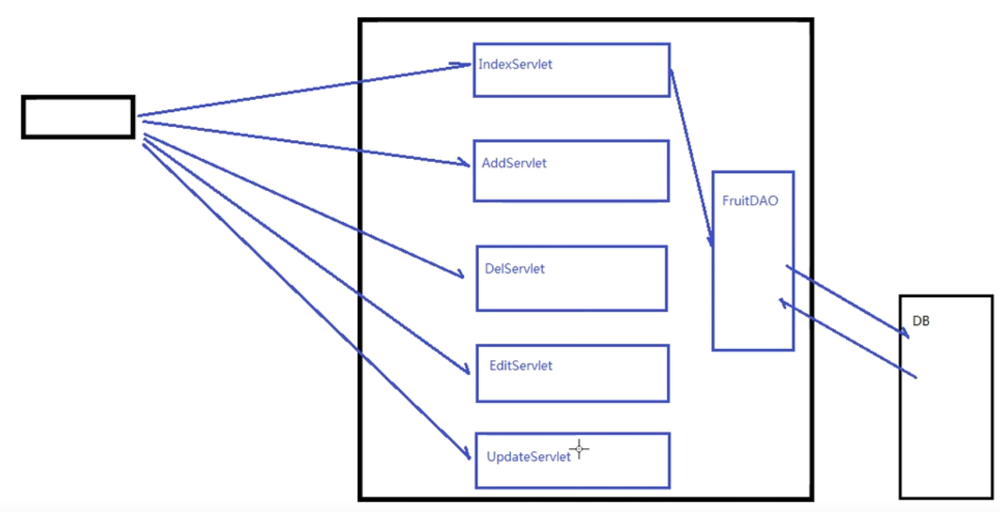

> To

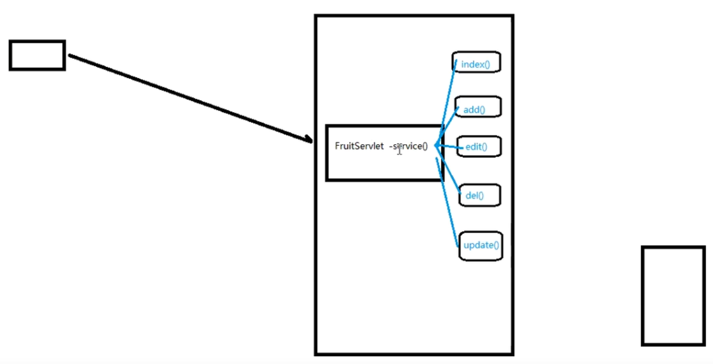

```java
package com.atguigu.servlets1;

import java.io.IOException;
import java.util.List;

import javax.servlet.ServletException;
import javax.servlet.annotation.WebServlet;
import javax.servlet.http.HttpServletRequest;
import javax.servlet.http.HttpServletResponse;

import com.atguigu.stub.Fruit;
import com.atguigu.stub.FruitsStub;
import com.atguigu.utils.StringUtils;

@WebServlet("/fruit1")
public class FruitServlet extends ViewBaseServlet {

  @Override
  protected void service(HttpServletRequest req, HttpServletResponse resp) throws ServletException, IOException {
    String operation = req.getParameter("operation");

    if (operation == null) {
      operation = "index";
    }

    switch (operation) {
      case "index":
        index(req, resp);
        break;
      case "add":
        add(req, resp);
        break;
      case "delete":
        delete(req, resp);
        break;
      case "editInfo":
        getEditInfo(req, resp);
        break;
      case "update":
        update(req, resp);
        break;
      default:
        throw new RuntimeException("No such operation!");

    }
  }

  protected void index(HttpServletRequest req, HttpServletResponse resp) throws ServletException, IOException {
    ..
  }

  protected void add(HttpServletRequest req, HttpServletResponse resp) throws ServletException, IOException {
    ..
  }

  protected void delete(HttpServletRequest req, HttpServletResponse resp) throws ServletException, IOException {
    ..
  }

  protected void editInfo(HttpServletRequest req, HttpServletResponse resp) throws ServletException, IOException {
    ..
  }

  protected void update(HttpServletRequest req, HttpServletResponse resp) throws ServletException, IOException {
    ..
  }

}

```


### 02 - Shorten Each Servlet

> **Question:**
>
> Isn’t it messy if there are lots of methods in one servlet?

> To

```java
package com.atguigu.servlets1;

..
    
@WebServlet("/fruit1")
public class FruitServlet extends ViewBaseServlet {

  @Override
  protected void service(HttpServletRequest req, HttpServletResponse resp) throws ServletException, IOException {
    String operation = req.getParameter("operation");

    if (operation == null) {
      operation = "index";
    }

    Method[] methods = this.getClass().getDeclaredMethods();

    for (Method method : methods) {
      if (method.getName().equals(operation)) {
        try {
          method.invoke(this, req, resp);
          return;
        } catch (IllegalAccessException e) {
          // TODO Auto-generated catch block
          e.printStackTrace();
        } catch (IllegalArgumentException e) {
          // TODO Auto-generated catch block
          e.printStackTrace();
        } catch (InvocationTargetException e) {
          // TODO Auto-generated catch block
          e.printStackTrace();
        }
      }
    }
    throw new RuntimeException("No such operation!");

    // switch (operation) {
    // case "index":
    // index(req, resp);
    // break;
    // case "add":
    // add(req, resp);
    // break;
    // case "delete":
    // delete(req, resp);
    // break;
    // case "editInfo":
    // editInfo(req, resp);
    // break;
    // case "update":
    // update(req, resp);
    // break;
    // default:
    // throw new RuntimeException("No such operation!");

    // }
  }

  ...

}

```


### 03 - Controller by name of path

> **Question:**
>
> Have a path handler to be redirected to specified controller, for example when we keyed in /hello, then it would visit HelloController.

> To

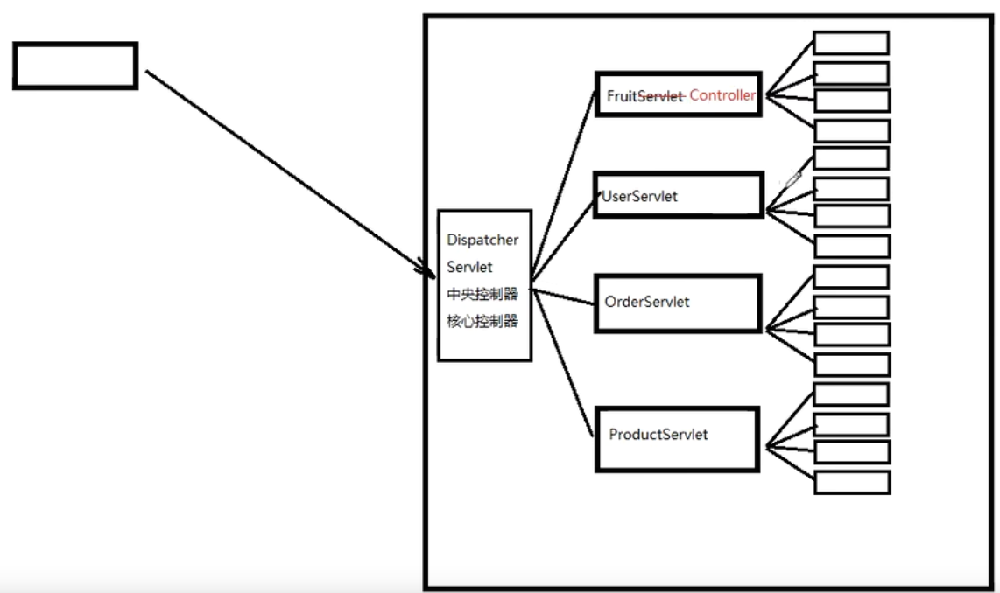

applicationContext.xml

```xml
<?xml version="1.0" encoding="UTF-8"?>

<beans>
  <bean id="fruit" class="com.atguigu.controller.FruitController"/>
</beans>

```

DispatcherServlet.class

```java
package com.atguigu.controller;

import java.io.IOException;
import java.io.InputStream;
import java.lang.reflect.Field;
import java.lang.reflect.InvocationTargetException;
import java.lang.reflect.Method;
import java.util.HashMap;
import java.util.Map;

import javax.servlet.ServletConfig;
import javax.servlet.ServletContext;
import javax.servlet.ServletException;
import javax.servlet.annotation.WebServlet;
import javax.servlet.http.HttpServletRequest;
import javax.servlet.http.HttpServletResponse;
import javax.xml.parsers.DocumentBuilder;
import javax.xml.parsers.DocumentBuilderFactory;
import javax.xml.parsers.ParserConfigurationException;

import org.w3c.dom.Document;
import org.w3c.dom.Element;
import org.w3c.dom.Node;
import org.w3c.dom.NodeList;
import org.xml.sax.SAXException;

import com.atguigu.utils.StringUtils;

@WebServlet("*.do")
public class DispatcherServlet extends ViewBaseServlet {

  private Map<String, Object> beanMap = new HashMap<>();

  @Override
  public void init() throws ServletException {
    try {
      InputStream inputStream = this.getClass().getClassLoader().getResourceAsStream("applicationContext.xml");
      DocumentBuilderFactory documentBuilderFactory = DocumentBuilderFactory.newInstance();
      DocumentBuilder documentBuilder = documentBuilderFactory.newDocumentBuilder();
      Document document = documentBuilder.parse(inputStream);
      NodeList nodeList = document.getElementsByTagName("bean");
      for (int i = 0; i < nodeList.getLength(); i++) {
        Node beanNode = nodeList.item(i);
        if (beanNode.getNodeType() == Node.ELEMENT_NODE) {
          Element beanElement = (Element) beanNode;
          String beanId = beanElement.getAttribute("id");
          String beanClassName = beanElement.getAttribute("class");
          Class<?> beanClass = Class.forName(beanClassName);
          Object beanObj = beanClass.newInstance();
          Method method = beanClass.getDeclaredMethod("setServletContext", ServletContext.class);
          method.setAccessible(true);
          method.invoke(beanObj, getServletContext());
          beanMap.put(beanId, beanObj);
        }
      }
    } catch (ParserConfigurationException e) {
      e.printStackTrace();
    } catch (SAXException e) {
      e.printStackTrace();
    } catch (IOException e) {
      e.printStackTrace();
    } catch (ClassNotFoundException e) {
      e.printStackTrace();
    } catch (InstantiationException e) {
      e.printStackTrace();
    } catch (IllegalAccessException e) {
      e.printStackTrace();
    } catch (SecurityException e) {
      e.printStackTrace();
    } catch (NoSuchMethodException e) {
      e.printStackTrace();
    } catch (IllegalArgumentException e) {
      e.printStackTrace();
    } catch (InvocationTargetException e) {
      e.printStackTrace();
    }
  }

  @Override
  protected void service(HttpServletRequest req, HttpServletResponse resp) throws ServletException, IOException {
    req.setCharacterEncoding("UTF-8");

    String servletPath = req.getServletPath(); // '/hello.do'
    servletPath = servletPath.substring(1); // 'hello.do'
    int lastDotIndex = servletPath.lastIndexOf(".do");
    servletPath = servletPath.substring(0, lastDotIndex);// 'hello'
    System.out.println(servletPath);

    Object controllerBeanObj = beanMap.get(servletPath);

    String operation = req.getParameter("operation");

    if (StringUtils.isEmpty(operation)) {
      operation = "index";
    }

    try {
      Method method = controllerBeanObj.getClass().getDeclaredMethod(operation, HttpServletRequest.class,
          HttpServletResponse.class);
      if (method != null) {
        method.setAccessible(true);
        method.invoke(controllerBeanObj, req, resp);
      } else {
        throw new RuntimeException("No such operation!");
      }
    } catch (IllegalAccessException e) {
      e.printStackTrace();
    } catch (InvocationTargetException e) {
      e.printStackTrace();
    } catch (NoSuchMethodException e) {
      e.printStackTrace();
    }
  }
}

```

FruitController.java

```java
package com.atguigu.controller;

import java.io.IOException;
import java.lang.reflect.InvocationTargetException;
import java.lang.reflect.Method;
import java.util.List;

import javax.servlet.ServletContext;
import javax.servlet.ServletException;
import javax.servlet.annotation.WebServlet;
import javax.servlet.http.HttpServletRequest;
import javax.servlet.http.HttpServletResponse;

import com.atguigu.stub.Fruit;
import com.atguigu.stub.FruitsStub;
import com.atguigu.utils.StringUtils;

public class FruitController extends ViewBaseServlet {
  private ServletContext servletContext;

  private void setServletContext(ServletContext servletContext) throws ServletException {
    this.servletContext = servletContext;
    super.init(servletContext);
  }
  ...

}

```

ViewBaseServlet

```java
package com.atguigu.controller;

import java.io.IOException;

import javax.servlet.ServletContext;
import javax.servlet.ServletException;
import javax.servlet.http.HttpServlet;
import javax.servlet.http.HttpServletRequest;
import javax.servlet.http.HttpServletResponse;

import org.thymeleaf.TemplateEngine;
import org.thymeleaf.context.WebContext;
import org.thymeleaf.templatemode.TemplateMode;
import org.thymeleaf.templateresolver.ServletContextTemplateResolver;

public class ViewBaseServlet extends HttpServlet {
  private TemplateEngine templateEngine;
  private ServletContext servletContext;

  // @Override
  public void init(ServletContext servletContext) throws ServletException {
    // ServletContext servletContext = this.getServletContext();
    this.servletContext = servletContext;
	...
  }

  protected void processTemplate(String templateName, HttpServletRequest req, HttpServletResponse resp)
      throws IOException {
    ...
    WebContext webContext = new WebContext(req, resp, servletContext);
    ...
  }

}

```


### 04 - Redundant Redirect / forward in Servlet

> **Question:**
>
> Every method has either redirect & forward, can we put it into our Dispatcher Servlet? 

DispatcherServlet.java

```java
package com.atguigu.controller1;

import java.io.IOException;
import java.io.InputStream;
import java.lang.reflect.InvocationTargetException;
import java.lang.reflect.Method;
import java.util.HashMap;
import java.util.Map;

import javax.servlet.ServletException;
import javax.servlet.annotation.WebServlet;
import javax.servlet.http.HttpServletRequest;
import javax.servlet.http.HttpServletResponse;
import javax.xml.parsers.DocumentBuilder;
import javax.xml.parsers.DocumentBuilderFactory;
import javax.xml.parsers.ParserConfigurationException;

import org.w3c.dom.Document;
import org.w3c.dom.Element;
import org.w3c.dom.Node;
import org.w3c.dom.NodeList;
import org.xml.sax.SAXException;

import com.atguigu.utils.StringUtils;

@WebServlet("*.do2")
public class DispatcherServlet extends ViewBaseServlet1 {

  private Map<String, Object> beanMap = new HashMap<>();

  @Override
  public void init() throws ServletException {
    super.init();
    try {
      InputStream inputStream = this.getClass().getClassLoader().getResourceAsStream("applicationContext.xml");
      DocumentBuilderFactory documentBuilderFactory = DocumentBuilderFactory.newInstance();
      DocumentBuilder documentBuilder = documentBuilderFactory.newDocumentBuilder();
      Document document = documentBuilder.parse(inputStream);
      NodeList nodeList = document.getElementsByTagName("bean");
      for (int i = 0; i < nodeList.getLength(); i++) {
        Node beanNode = nodeList.item(i);
        if (beanNode.getNodeType() == Node.ELEMENT_NODE) {
          Element beanElement = (Element) beanNode;
          String beanId = beanElement.getAttribute("id");
          String beanClassName = beanElement.getAttribute("class");
          Class<?> beanClass = Class.forName(beanClassName);
          Object beanObj = beanClass.newInstance();
          beanMap.put(beanId, beanObj);
        }
      }
    } catch (.) {
     ....
    }
  }

  @Override
  protected void service(HttpServletRequest req, HttpServletResponse resp) throws ServletException, IOException {
    req.setCharacterEncoding("UTF-8");

    String servletPath = req.getServletPath(); // '/hello.do'
    servletPath = servletPath.substring(1); // 'hello.do'
    int lastDotIndex = servletPath.lastIndexOf(".do2");
    servletPath = servletPath.substring(0, lastDotIndex);// 'hello'

    Object controllerBeanObj = beanMap.get(servletPath);

    String operation = req.getParameter("operation");

    if (StringUtils.isEmpty(operation)) {
      operation = "index";
    }

    try {
      Method method = controllerBeanObj.getClass().getDeclaredMethod(operation, HttpServletRequest.class);
      if (method != null) {
        method.setAccessible(true);
        Object returnObj = method.invoke(controllerBeanObj, req);
        String methodReturnStr = (String) returnObj;
          // PAY ATTENTION HERE
        if (methodReturnStr.startsWith("redirect:")) {
          String returnStr = methodReturnStr.substring("redirect:".length());
          resp.sendRedirect(returnStr);
        } else {
          super.processTemplate(methodReturnStr, req, resp);
        }
      } else {
        throw new RuntimeException("No such operation!");
      }
    } catch (IllegalAccessException e) {
      e.printStackTrace();
    } catch (InvocationTargetException e) {
      e.printStackTrace();
    } catch (NoSuchMethodException e) {
      e.printStackTrace();
    }
  }
}

```

FruitController.java

```
package com.atguigu.controller1;

import java.util.List;

import javax.servlet.http.HttpServletRequest;
import com.atguigu.stub.Fruit;
import com.atguigu.stub.FruitsStub;
import com.atguigu.utils.StringUtils;

public class FruitController1 {

  private String index(HttpServletRequest req) {
    ..
    return "fruit";
  }

  private String add(HttpServletRequest req) {
    ..
    return "redirect:fruit.do2";
  }

  private String delete(HttpServletRequest req) {
    ..
    return "redirect:fruit.do2";
  }

  private String editInfo(HttpServletRequest req) {
    String id = req.getParameter("fid");
    if (StringUtils.isNotEmpty(id)) {
      ..
      return "edit";
    }
    return "redirect:fruit.do2";
  }

  private String update(HttpServletRequest req) {
    ...
    return "redirect:fruit.do2";
  }

}

```


### 05 - Redundant getParameter

> **Question:**
>
> Can we get the request parameter by parameter name and pass this parameters into the methods?

```java
package com.atguigu.controller2;

import java.io.IOException;
import java.io.InputStream;
import java.lang.reflect.InvocationTargetException;
import java.lang.reflect.Method;
import java.lang.reflect.Parameter;
import java.util.HashMap;
import java.util.Map;

import javax.servlet.ServletException;
import javax.servlet.annotation.WebServlet;
import javax.servlet.http.HttpServletRequest;
import javax.servlet.http.HttpServletResponse;
import javax.xml.parsers.DocumentBuilder;
import javax.xml.parsers.DocumentBuilderFactory;
import javax.xml.parsers.ParserConfigurationException;

import org.w3c.dom.Document;
import org.w3c.dom.Element;
import org.w3c.dom.Node;
import org.w3c.dom.NodeList;
import org.xml.sax.SAXException;

import com.atguigu.utils.StringUtils;

@WebServlet("*.do5")
public class DispatcherServlet2 extends ViewBaseServlet2 {

  private Map<String, Object> beanMap = new HashMap<>();

  @Override
  public void init() throws ServletException {
    super.init();
    try {
      InputStream inputStream = this.getClass().getClassLoader().getResourceAsStream("applicationContext.xml");
      DocumentBuilderFactory documentBuilderFactory = DocumentBuilderFactory.newInstance();
      DocumentBuilder documentBuilder = documentBuilderFactory.newDocumentBuilder();
      Document document = documentBuilder.parse(inputStream);
      NodeList nodeList = document.getElementsByTagName("bean");
      for (int i = 0; i < nodeList.getLength(); i++) {
        Node beanNode = nodeList.item(i);
        if (beanNode.getNodeType() == Node.ELEMENT_NODE) {
          Element beanElement = (Element) beanNode;
          String beanId = beanElement.getAttribute("id");
          String beanClassName = beanElement.getAttribute("class");
          Class<?> beanClass = Class.forName(beanClassName);
          Object beanObj = beanClass.newInstance();
          beanMap.put(beanId, beanObj);
        }
      }
    } catch (ParserConfigurationException e) {
      e.printStackTrace();
    } catch (SAXException e) {
      e.printStackTrace();
    } catch (IOException e) {
      e.printStackTrace();
    } catch (ClassNotFoundException e) {
      e.printStackTrace();
    } catch (InstantiationException e) {
      e.printStackTrace();
    } catch (IllegalAccessException e) {
      e.printStackTrace();
    } catch (SecurityException e) {
      e.printStackTrace();
    } catch (IllegalArgumentException e) {
      e.printStackTrace();
    }
  }

  @Override
  protected void service(HttpServletRequest req, HttpServletResponse resp) throws ServletException, IOException {
    req.setCharacterEncoding("UTF-8");

    String servletPath = req.getServletPath(); // '/hello.do'
    servletPath = servletPath.substring(1); // 'hello.do'
    int lastDotIndex = servletPath.lastIndexOf(".do5");
    servletPath = servletPath.substring(0, lastDotIndex);// 'hello'

    Object controllerBeanObj = beanMap.get(servletPath);

    String operation = req.getParameter("operation");

    if (StringUtils.isEmpty(operation)) {
      operation = "index";
    }

    try {
      Method[] methods = controllerBeanObj.getClass().getDeclaredMethods();
      for (Method method : methods) {
        if (method.getName().equals(operation)) {
          method.setAccessible(true);
			
          // ------------- PAY ATTENTION HERE
          Parameter[] parameters = method.getParameters();
          Object[] parameterValues = new Object[parameters.length];
          for (int i = 0; i < parameters.length; i++) {
            Parameter parameter = parameters[i];
            String parameterName = parameter.getName();
            if ("req".equals(parameterName)) {
              parameterValues[i] = req;
            } else if ("resp".equals(parameterName)) {
              parameterValues[i] = resp;
            } else if ("session".equals(parameterName)) {
              parameterValues[i] = req.getSession();
            } else {
              String parameterValue = req.getParameter(parameterName);
              String parameterTypeName = parameter.getType().getName();
              Object parameterObj = parameterValue;
              if (parameterObj != null) {
                if ("java.lang.Integer".equals(parameterTypeName)) {
                  parameterObj = Integer.parseInt(parameterValue);
                } else if ("java.lang.Float".equals(parameterTypeName)) {
                  parameterObj = Float.parseFloat(parameterValue);
                }
              }
              parameterValues[i] = parameterObj;
            }
          }

          Object returnObj = method.invoke(controllerBeanObj, parameterValues);
          String methodReturnStr = (String) returnObj;
          if (methodReturnStr.startsWith("redirect:")) {
            String returnStr = methodReturnStr.substring("redirect:".length());
            resp.sendRedirect(returnStr);
          } else {
            super.processTemplate(methodReturnStr, req, resp);
          }
        } else {

        }
      }
      // if (method != null) {
      // } else {
      //   throw new RuntimeException("No such operation!");
      // }
    } catch (IllegalAccessException e) {
      e.printStackTrace();
    } catch (InvocationTargetException e) {
      e.printStackTrace();
    }
  }
}

```

 ```java
 package com.atguigu.controller2;
 
 import java.util.List;
 
 import javax.servlet.http.HttpServletRequest;
 import com.atguigu.stub.Fruit;
 import com.atguigu.stub.FruitsStub;
 import com.atguigu.utils.StringUtils;
 
 public class FruitController2 {
 
   // ------------- PAY ATTENTION ON PARAMETERS
   private String index(String search, Integer page, Integer limit, HttpServletRequest req) {
 
     if (page == null) {
       page = 1;
     }
 
     if (limit == null) {
       limit = 10;
     }
 
     List<Fruit> fruits = FruitsStub.getFruits(page, limit, search);
     int total = FruitsStub.getCount(search);
     int pageCount = (total + limit - 1) / limit;
     req.getSession().setAttribute("fruits", fruits);
     req.setAttribute("page", page);
     req.setAttribute("pageCount", pageCount);
     req.setAttribute("keyword", search);
     return "fruit1";
   }
 
   private String add(String fname, Float fprice) {
     FruitsStub.addFruit(new Fruit(null, fname, fprice));
     return "redirect:fruit2.do5";
   }
 
   private String delete(String fid) {
     if (StringUtils.isNotEmpty(fid)) {
       FruitsStub.deleteById(fid);
     }
     return "redirect:fruit2.do5";
   }
 
   private String editInfo(String fid, HttpServletRequest req) {
     if (StringUtils.isNotEmpty(fid)) {
       Fruit fruit = FruitsStub.getFruitById(fid);
       req.setAttribute("fruit", fruit);
       return "edit";
     }
     return "redirect:fruit2.do5";
   }
 
   private String update(String id, String fname, Float fprice) {
     FruitsStub.updateFruit(new Fruit(id, fname, fprice));
     return "redirect:fruit2.do5";
   }
 
 }
 
 ```

### 06 - Refer IOC


## Servlet Config and Servlet Context

> We can set some parameters in servlet config and servlet context

```java
Annotation Method
------------------
package com.atguigu.servlets;

import javax.jws.soap.InitParam;
import javax.servlet.ServletConfig;
import javax.servlet.ServletContext;
import javax.servlet.ServletException;
import javax.servlet.annotation.WebInitParam;
import javax.servlet.annotation.WebServlet;
import javax.servlet.http.HttpServlet;

@WebServlet(urlPatterns = {"/demo46"}, initParams = {
  @WebInitParam(name = "hello", value = "world"),
  @WebInitParam(name = "hello2", value = "world2"),
})
public class Demo46Servlet extends HttpServlet {
  @Override
  public void init() throws ServletException {
    ServletConfig servletConfig = this.getServletConfig();
    System.out.println(servletConfig.getInitParameter("hello"));  // world
    System.out.println(servletConfig.getInitParameter("hello4")); // null
    ServletContext servletContext = this.getServletContext();
    System.out.println(servletContext.getInitParameter("view-prefix")); // /
  }
  
}


```

```xml

XML Method (web.xml)
----------
<?xml version="1.0" encoding="UTF-8"?>
<web-app version="4.0" xmlns="http://xmlns.jcp.org/xml/ns/javaee"
  xmlns:xsi="http://www.w3.org/2001/XMLSchema-instance"
  xsi:schemaLocation="http://xmlns.jcp.org/xml/ns/javaee http://xmlns.jcp.org/xml/ns/javaee/web-app_4_0.xsd">
   
  <!-- THIS IS SERVLET CONTEXT PARAMS -->
  <context-param>
    <param-name>view-prefix</param-name>
    <param-value>/</param-value>
  </context-param>
  <context-param>
    <param-name>view-suffix</param-name>
    <param-value>.html</param-value>
  </context-param>
  <servlet>
    <servlet-name>Demo46Servlet2</servlet-name>
    <servlet-class>com.atguigu.servlets.Demo46Servlet2</servlet-class>
  	<!-- THIS IS SERVLET CONFIG PARAMS -->
    <init-param>
      <param-name>hello</param-name>
      <param-value>world222</param-value>
    </init-param>
  </servlet>
  <servlet-mapping>
    <servlet-name>Demo46Servlet2</servlet-name>
    <url-pattern>/demo462</url-pattern>
  </servlet-mapping>
</web-app>
```


## Inversion of Control (IOC)

> 我们能发现当我们把xxx xxxService = xxxImpl() 换成xxx xxxService; 时，其他的文件就会报错，能不能做到自动注入而不报错？降低耦合度？从而避免不必要的建立和销毁对象(如果我有两个controller都需要这个service的时候就会有两个service实例)？
>
> ===> 把组件放入一个容器中，启动时就从容器中拿组件 
>
> 控制反转的意思是把对象控制权交给BeanFactory, 程序员无需操心。
>
> 依赖注入是当IOC解析配置文件时就会去寻找某某实例来注入到需要此实例的Bean。

applicationContext.xml

```xml
<?xml version="1.0" encoding="UTF-8"?>

<beans>
  <bean id="fruitDAO" class="com.atguigu.dao.impl.FruitDAOImpl"/>
  <bean id="fruitService" class="com.atguigu.service.impl.FruitServiceImpl">
    <property name="fruitDAO" ref="fruitDAO"/>
  </bean>
  <bean id="fruit" class="com.atguigu.controller.FruitController">
    <property name="fruitService" ref="fruitService"/>
  </bean>
</beans>

```

DispatcherServlet.java

```java
package com.atguigu.controller;

import java.io.IOException;
import java.lang.reflect.InvocationTargetException;
import java.lang.reflect.Method;
import java.lang.reflect.Parameter;
import javax.servlet.ServletException;
import javax.servlet.annotation.WebServlet;
import javax.servlet.http.HttpServletRequest;
import javax.servlet.http.HttpServletResponse;
import com.atguigu.io.BeanFactory;
import com.atguigu.io.ClassPathXmlApplicationContext;
import com.atguigu.utils.StringUtils;

@WebServlet("*.do")
public class DispatcherServlet extends ViewBaseServlet {

  private BeanFactory beanFactory;

  @Override
  public void init() throws ServletException {
    super.init();
    beanFactory = new ClassPathXmlApplicationContext();
  }
  ...
}
```

BeanFactory.java

```java
package com.atguigu.io;


public interface BeanFactory {
  Object getBean(String name);
}

```

ClassPathXmlApplicationContext.java

```java
package com.atguigu.io;

import java.io.IOException;
import java.io.InputStream;
import java.lang.reflect.Field;
import java.util.HashMap;
import java.util.Map;

import javax.xml.parsers.DocumentBuilder;
import javax.xml.parsers.DocumentBuilderFactory;
import javax.xml.parsers.ParserConfigurationException;

import org.w3c.dom.Document;
import org.w3c.dom.Element;
import org.w3c.dom.Node;
import org.w3c.dom.NodeList;
import org.xml.sax.SAXException;

public class ClassPathXmlApplicationContext implements BeanFactory {
  private Map<String, Object> beanMap = new HashMap<>();

  public ClassPathXmlApplicationContext() {
    try {
      InputStream inputStream = this.getClass().getClassLoader().getResourceAsStream("applicationContext.xml");
      DocumentBuilderFactory documentBuilderFactory = DocumentBuilderFactory.newInstance();
      DocumentBuilder documentBuilder = documentBuilderFactory.newDocumentBuilder();
      Document document = documentBuilder.parse(inputStream);
      NodeList nodeList = document.getElementsByTagName("bean");
      for (int i = 0; i < nodeList.getLength(); i++) {
        Node beanNode = nodeList.item(i);
        if (beanNode.getNodeType() == Node.ELEMENT_NODE) {
          Element beanElement = (Element) beanNode;
          String beanId = beanElement.getAttribute("id");
          String beanClassName = beanElement.getAttribute("class");
          Class<?> beanClass = Class.forName(beanClassName);
          Object beanObj = beanClass.newInstance();
          beanMap.put(beanId, beanObj);
        }
      }

      for (int i = 0; i < nodeList.getLength(); i++) {
        Node beanNode = nodeList.item(i);
        if (beanNode.getNodeType() == Node.ELEMENT_NODE) {
          Element beanElement = (Element) beanNode;
          String beanId = beanElement.getAttribute("id");
          NodeList beanChildNodeList = beanElement.getChildNodes();
          for (int j = 0; j < beanChildNodeList.getLength(); j++) {
            Node childNode = beanChildNodeList.item(j);
            if (childNode.getNodeType() == Node.ELEMENT_NODE && "property".equals(childNode.getNodeName())){
              Element propertyElement = (Element) childNode;
              String propertyName = propertyElement.getAttribute("name");
              String propertyRef = propertyElement.getAttribute("ref");
              Object refObj = beanMap.get(propertyRef);
              Object beanObj = beanMap.get(beanId);
              Field field = beanObj.getClass().getDeclaredField(propertyName);
              field.setAccessible(true);
              field.set(beanObj, refObj);
            }
          }
        }
      }

    } catch (ParserConfigurationException e) {
      e.printStackTrace();
    } catch (SAXException e) {
      e.printStackTrace();
    } catch (IOException e) {
      e.printStackTrace();
    } catch (ClassNotFoundException e) {
      e.printStackTrace();
    } catch (InstantiationException e) {
      e.printStackTrace();
    } catch (IllegalAccessException e) {
      e.printStackTrace();
    } catch (SecurityException e) {
      e.printStackTrace();
    } catch (IllegalArgumentException e) {
      e.printStackTrace();
    } catch (NoSuchFieldException e) {
      // TODO Auto-generated catch block
      e.printStackTrace();
    }
  }

  @Override
  public Object getBean(String name) {
    return beanMap.get(name);
  }

  
}

```


## Filter

> init()
>
> doFilter()
>
> destroy()

XML method

```java
<?xml version="1.0" encoding="UTF-8"?>
<web-app version="4.0" xmlns="http://xmlns.jcp.org/xml/ns/javaee"
  xmlns:xsi="http://www.w3.org/2001/XMLSchema-instance"
  xsi:schemaLocation="http://xmlns.jcp.org/xml/ns/javaee http://xmlns.jcp.org/xml/ns/javaee/web-app_4_0.xsd">
  <filter>
    <filter-name>Demo01Filter</filter-name>
    <filter-class>com.atguigu.filter.Demo01Filter</filter-class>
  </filter>
  <filter-mapping>
    <filter-name>Demo01Filter</filter-name>
    <url-pattern>*</url-pattern>
  </filter-mapping>
</web-app>

```

Annotation Method

```java
package com.atguigu.filter;

import java.io.IOException;

import javax.servlet.Filter;
import javax.servlet.FilterChain;
import javax.servlet.FilterConfig;
import javax.servlet.ServletException;
import javax.servlet.ServletRequest;
import javax.servlet.ServletResponse;
import javax.servlet.annotation.WebFilter;

@WebFilter("*")
public class Demo01Filter implements Filter {
  @Override
  public void init(FilterConfig filterConfig) throws ServletException {
    System.out.println("Init");
  }

  @Override
  public void doFilter(ServletRequest request, ServletResponse response, FilterChain chain)
      throws IOException, ServletException { 
    System.out.println("Hello"); 
    chain.doFilter(request, response);
    System.out.println("Hello2"); 
  }

  @Override
  public void destroy() {
    System.out.println("Destroy");
  }
 
}
```

### Multiple Filter in one servlet

> If
>
> **Using Annotation:** Filter sequence is following Class Name.
>
> **Using XML:** Filter sequence is following First Come First Serve that listed in xml.

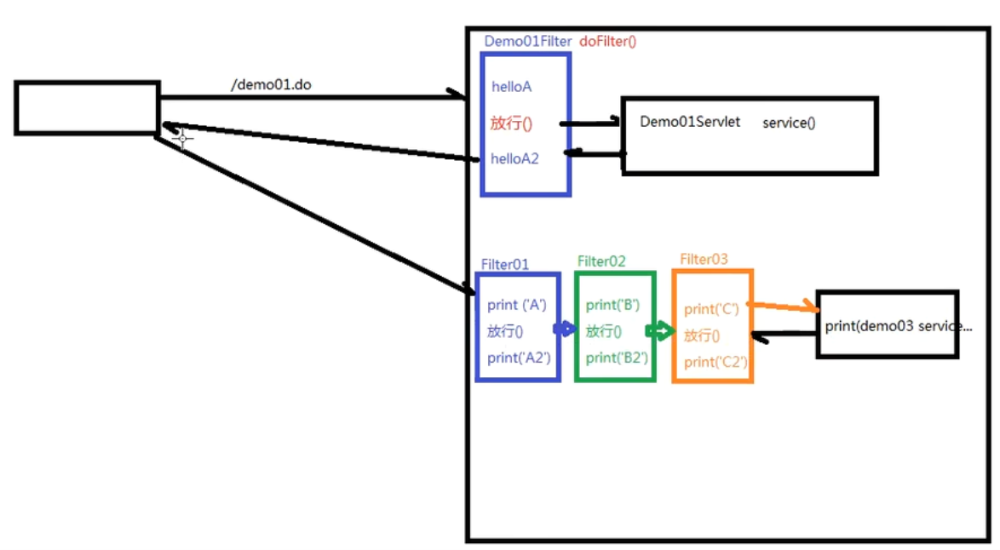


### Example - CharacterEncodingFilter

```java
package com.atguigu.filter;

import java.io.IOException;

import javax.servlet.Filter;
import javax.servlet.FilterChain;
import javax.servlet.FilterConfig;
import javax.servlet.ServletException;
import javax.servlet.ServletRequest;
import javax.servlet.ServletResponse;
import javax.servlet.annotation.WebFilter;
import javax.servlet.annotation.WebInitParam;
import javax.servlet.http.HttpServletRequest;

import com.atguigu.utils.StringUtils;

@WebFilter(urlPatterns = {"*"}, initParams = {@WebInitParam(name = "encoding", value = "UTF-8")})
public class CharacterEncodingFilter implements Filter {
  String encoding = "UTF-8";
  @Override
  public void init(FilterConfig filterConfig) throws ServletException {
    String encodingString = filterConfig.getInitParameter("encoding");
    if (StringUtils.isNotEmpty(encodingString)) {
      encoding = encodingString;
    }
  }

  @Override
  public void doFilter(ServletRequest request, ServletResponse response, FilterChain chain)
      throws IOException, ServletException {
    ((HttpServletRequest) request).setCharacterEncoding(encoding);
    chain.doFilter(request, response);

  }
}

```


## Transaction

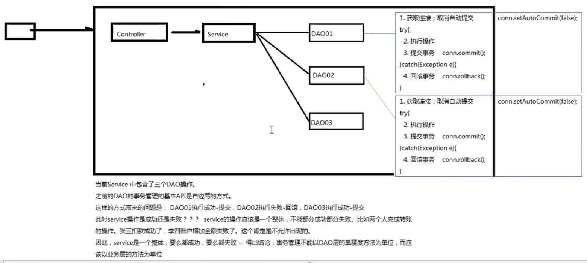

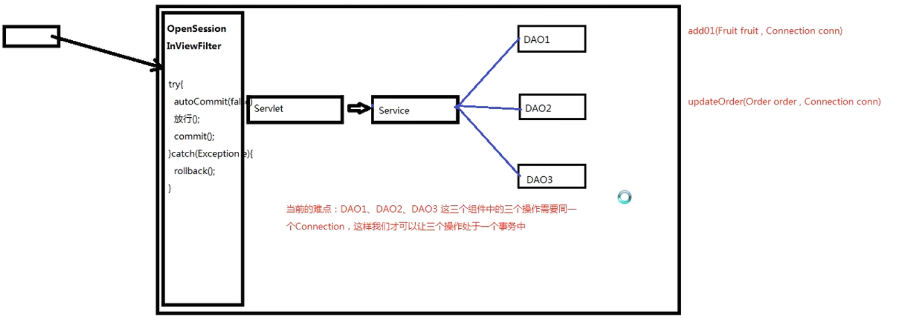

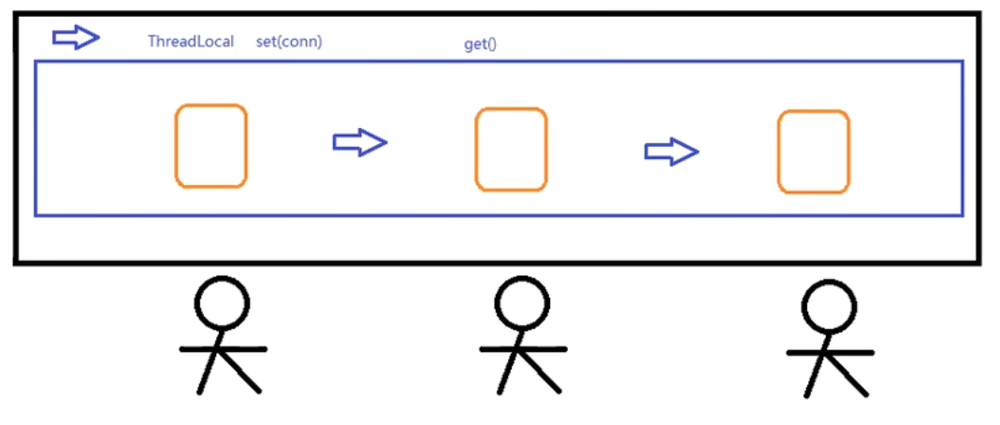

ConnUti.java

```java
package com.atguigu.utils;

import java.sql.Connection;
import java.sql.SQLException;

import javax.sql.DataSource;

import com.mchange.v2.c3p0.ComboPooledDataSource;

public class ConnUtil {
  private static ThreadLocal<Connection> threadLocal= new ThreadLocal<>();
  private static DataSource dataSource = new ComboPooledDataSource();

  private static Connection createConnection() throws SQLException {
      return dataSource.getConnection();
  }

  

  public static Connection getConnection() throws SQLException {
    Connection connection = threadLocal.get();
    if (connection == null) {
      connection = createConnection();
      threadLocal.set(connection); 
    }
    return connection;
  }

  public static void close() throws SQLException {
    Connection connection = threadLocal.get();
    if (connection != null && !connection.isClosed()) {
      connection.close();
      //threadLocal.set(null);
      threadLocal.remove();
    }
  }
}
```

TransactionManager.java

```java
package com.atguigu.transaction;

import java.sql.Connection;
import java.sql.SQLException;

import com.atguigu.utils.ConnUtil;

public class TransactionManager {
  public static void beginTransaction() throws SQLException {
    ConnUtil.getConnection().setAutoCommit(false);
  }

  public static void commit() throws SQLException {
    Connection conn = ConnUtil.getConnection();
    conn.commit();
    ConnUtil.close();
  }
  
  public static void rollback() throws SQLException {
    Connection conn = ConnUtil.getConnection();
    conn.rollback();
    ConnUtil.close();
  }
}
```

OpenSessionInViewFilter

```java
package com.atguigu.filter;

import java.io.IOException;
import java.sql.SQLException;

import javax.servlet.Filter;
import javax.servlet.FilterChain;
import javax.servlet.FilterConfig;
import javax.servlet.ServletException;
import javax.servlet.ServletRequest;
import javax.servlet.ServletResponse;
import javax.servlet.annotation.WebFilter;

import com.atguigu.transaction.TransactionManager;

@WebFilter("*")
public class OpenSessionInViewFilter implements Filter {
  @Override
  public void init(FilterConfig filterConfig) throws ServletException {
  }

  @Override
  public void doFilter(ServletRequest request, ServletResponse response, FilterChain chain)
      throws IOException, ServletException {
    try {
      TransactionManager.beginTransaction();
      chain.doFilter(request, response);
      TransactionManager.commit();
      System.out.println("commit");
    } catch (Exception e) {
      try {
        TransactionManager.rollback();
        System.out.println("rollback");
      } catch (SQLException e1) {
        e1.printStackTrace();
      }
    }
  }
}

```

**Tips:** Remember to throw instead of try_catch in services, dao ...


## ThreadLocal（本地线程）

- 主要方法：get() , set(obj)，remove()
- ThreadLocal称之为本地线程 。 我们可以通过set方法在当前线程上存储数据、通过get方法在当前线程上获取数据

set方法源码分析：

```java
public void set(T value) {
    Thread t = Thread.currentThread(); //获取当前的线程
    ThreadLocalMap map = getMap(t);    //每一个线程都维护各自的一个容器（ThreadLocalMap）
    if (map != null)
    	map.set(this, value);          //这里的key对应的是ThreadLocal，因为我们的组件中需要传输（共享）的对象可能会有多个（Connection）
    else
    	createMap(t, value);           //默认情况下map是没有初始化的，那么第一次往其中添加数据时，会去初始化
}
```

get方法源码分析：

```
public T get() {
    Thread t = Thread.currentThread(); //获取当前的线程
    ThreadLocalMap map = getMap(t);    //获取和这个线程（企业）相关的ThreadLocalMap（也就是工作纽带的集合）
    if (map != null) {
        ThreadLocalMap.Entry e = map.getEntry(this);   //this指的是ThreadLocal对象，通过它才能知道是哪一个工作纽带
        if (e != null) {
            @SuppressWarnings("unchecked")
            T result = (T)e.value;     //entry.value就可以获取到工具箱了
            return result;
    	}
	}
return setInitialValue();
}
```

remove方法源码分析：

```java
public void remove() {
    ThreadLocalMap m = getMap(Thread.currentThread()); //获取当前的线程
    if (m != null)
        m.remove(this);//删除此线程
}
```


## Listener

常用Listener
    　　1) ServletContextListener - 监听ServletContext对象的创建和销毁的过程
    　　2) HttpSessionListener - 监听HttpSession对象的创建和销毁的过程
    　　3) ServletRequestListener - 监听ServletRequest对象的创建和销毁的过程

​    　　4) ServletContextAttributeListener - 监听ServletContext的保存作用域的改动(add,remove,replace)
​    　　5) HttpSessionAttributeListener - 监听HttpSession的保存作用域的改动(add,remove,replace)
​    　　6) ServletRequestAttributeListener - 监听ServletRequest的保存作用域的改动(add,remove,replace)

​    　　7) HttpSessionBindingListener - 监听某个对象在Session域中的创建与移除
​    　　8) HttpSessionActivationListener - 监听某个对象在Session域中的序列化和反序列化

 

> XML

```xml
<listener>
  <listener-class>com.atguigu.listener.ContextLoaderListener</listener-class> -->
</listener>
```


> Annotation

```java
@WebListener
```


> **Example**
>
> inject BeanFactory when Initiating Servlet Context instead of the call of DispatcherServlet

```java
package com.atguigu.listener;

import javax.servlet.ServletContext;
import javax.servlet.ServletContextEvent;
import javax.servlet.ServletContextListener;
import javax.servlet.annotation.WebListener;

import com.atguigu.io.BeanFactory;
import com.atguigu.io.ClassPathXmlApplicationContext;

@WebListener
public class ContextLoaderListener implements ServletContextListener{

  @Override
  public void contextDestroyed(ServletContextEvent sce) {
    // TODO Auto-generated method stub
    ServletContextListener.super.contextDestroyed(sce);
  }

  @Override
  public void contextInitialized(ServletContextEvent sce) {

    ServletContext sc = sce.getServletContext();
    String contextConfigPath = sc.getInitParameter("contextConfigLocation");
    BeanFactory beanFactory = new ClassPathXmlApplicationContext(contextConfigPath);
    sc.setAttribute("beanFactory", beanFactory);
  }
  
}
```

```java
package com.atguigu.io;

import java.io.IOException;
import java.io.InputStream;
import java.lang.reflect.Field;
import java.util.HashMap;
import java.util.Map;

import javax.xml.parsers.DocumentBuilder;
import javax.xml.parsers.DocumentBuilderFactory;
import javax.xml.parsers.ParserConfigurationException;

import org.w3c.dom.Document;
import org.w3c.dom.Element;
import org.w3c.dom.Node;
import org.w3c.dom.NodeList;
import org.xml.sax.SAXException;

import com.atguigu.utils.StringUtils;

public class ClassPathXmlApplicationContext implements BeanFactory {
  private Map<String, Object> beanMap = new HashMap<>();

  public ClassPathXmlApplicationContext() {
    this("applicationContext.xml");
  }

  public ClassPathXmlApplicationContext(String path) {
    if (StringUtils.isEmpty(path)) {
      throw new RuntimeException("IOC config path is not specified..");
    }
    try {
      InputStream inputStream = this.getClass().getClassLoader().getResourceAsStream(path);
      ...
  }

  @Override
  public Object getBean(String name) {
    return beanMap.get(name);
  }

  
}

```

```java
package com.atguigu.controller;

import java.io.IOException;
import java.lang.reflect.Method;
import java.lang.reflect.Parameter;

import javax.servlet.ServletContext;
import javax.servlet.ServletException;
import javax.servlet.annotation.WebServlet;
import javax.servlet.http.HttpServletRequest;
import javax.servlet.http.HttpServletResponse;
import com.atguigu.io.BeanFactory;
import com.atguigu.utils.StringUtils;

@WebServlet("*.do")
public class DispatcherServlet extends ViewBaseServlet {

  private BeanFactory beanFactory;

  @Override
  public void init() throws ServletException {
    super.init();
    // beanFactory = new ClassPathXmlApplicationContext();
    ServletContext servletContext = getServletContext();
    Object beanFactoryObj = servletContext.getAttribute("beanFactory");
    if (beanFactoryObj != null) {
      beanFactory = (BeanFactory) beanFactoryObj;
    } else {
      throw new RuntimeException("Failed to get IOC Container");
    }
  }

  @Override
  protected void service(HttpServletRequest req, HttpServletResponse resp) throws ServletException, IOException {
    ...
  }
}

```

```xml
<?xml version="1.0" encoding="UTF-8"?>
<web-app version="4.0" xmlns="http://xmlns.jcp.org/xml/ns/javaee"
  xmlns:xsi="http://www.w3.org/2001/XMLSchema-instance"
  xsi:schemaLocation="http://xmlns.jcp.org/xml/ns/javaee http://xmlns.jcp.org/xml/ns/javaee/web-app_4_0.xsd">
  <context-param>
    <param-name>view-prefix</param-name>
    <param-value>/</param-value>
  </context-param>
  <context-param>
    <param-name>view-suffix</param-name>
    <param-value>.html</param-value>
  </context-param>
  <context-param>
    <param-name>contextConfigLocation</param-name>
    <param-value>applicationContext.xml</param-value>
  </context-param>
  <!-- <listener> -->
  <!--   <listener-class>com.atguigu.listener.ContextLoaderListener</listener-class> -->
  <!-- </listener> -->
</web-app>

```


## XML

> Node eg `<sname>jin</sname`
>
> - Element 元素节点 ===> sname (会显示 "[sname:null]")
> - Text 文本节点 ===> jin (会显示"[#text:...]")

**Tips:**

```xml
<a>
	<property id="fruitDAO" ref="fruitDAO"/>
</a>
```

a有3个子节点:

- [#text: \n]
- [#comment: property]
- [#text: \n]


**Tips: **

> \<!DOCTYPE 来设定规则, 其实这段可以另外成为一个DTD

```xml
<?xml version="1.0" encoding="UTF-8"?>
<!DOCTYPE beans [
  <!ELEMENT beans (bean*)>   -- beans has bean(s)
  <!ELEMENT bean (property*)> -- bean has property(s)
  <!ELEMENT property (#PCDATA)> -- property has data
  <!ATTLIST bean id ID #REQUIRED> -- bean id is ID and is required
  <!ATTLIST bean class CDATA #IMPLIED> -- bean class is CDATA and not neccesary
  <!ATTLIST property name CDATA #IMPLIED> -- property name is CDATA and not neccesary
  <!ATTLIST property ref IDREF #IMPLIED> -- property ref is ID-R and not neccesary
]>

<beans>
  <!-- <bean id="HostReplyDAO" class="com.atguigu.qqzone.dao.impl.ReplyDAOImpl"/> -->
  <!-- <bean id="ReplyDAO" class="com.atguigu.qqzone.dao.impl.ReplyDAOImpl"/> -->
  <bean id="topicDAO" class="com.atguigu.qqzone.dao.impl.TopicDAOImpl" />
  <bean id="topicService" class="com.atguigu.qqzone.service.impl.TopicServiceImpl">
    <property name="topicDAO" ref="topicDAO" />
  </bean>
  <!-- <bean id="topicService" class="com.atguigu.qqzone.service.impl.TopicServiceImpl"> -->
  <!-- <property name="topicDAO" ref="topicDAO"/> -->
  <!-- </bean> -->

  <bean id="userBasicDAO" class="com.atguigu.qqzone.dao.impl.UserBasicDAPImpl" />
  <bean id="userService" class="com.atguigu.qqzone.service.impl.UserServiceImpl">
    <property name="userBasicDAO" ref="userBasicDAO" />
  </bean>
  <bean id="userController" class="com.atguigu.controller.userController">
    <property name="userService" ref="userService" />
    <property name="topicService" ref="topicService" />
  </bean>
</beans>

```


## 配置文件

> 把你的配置定在jdbc_dev.properties

ConnUtil.java

```java
static {
    InputStream is = ConnUtil.class.getClassLoader().getResourceAsStream("jdbc.properties");
    Properties properties = new Properties();
    try {
    	properties.load(is);
        DRIVER = properties.getProperty("jdbc.driver");
        URL = ..
        USER = ..
        PWD = ..
    } catch (IOException e) {
        e.printStackTrace();
    }
}
```


## Cookie

> 在客户端保存一些数据

```java
package com.atguigu.controller;

import javax.servlet.http.Cookie;
import javax.servlet.http.HttpServletResponse;

public class CookieController {

  public String cookie(HttpServletResponse resp) {
    System.out.println("enterHere?");
    Cookie cookie = new Cookie("hello", "world");
    // cookie.setMaxAge(20); // life, second, default session
    // cookie.setDomain(String); // get this cookie only if the uri match (seldom use)
    resp.addCookie(cookie);
    return "empty";
  }
  public String cookie2() {
    return "empty";
  }
  
}

```


### 应用

- 记住用户名和密码 - setMaxAge
- 免登录 事件 - 先找cookie有没有用户名和密码-》登录-》如果失败才去登录页面
- 


## Kaptcha

[重新看的话听我](https://www.bilibili.com/video/BV1AS4y177xJ?p=78&spm_id_from=pageDriver&vd_source=a788bdd4d7cdd9dfe02852346d523cb9)

> 防止恶意的发送请求，识别不是机器而是人为的请求，因为有人可以通过爬虫来发送一大堆的请求
>
> - 拉活动条
> - rotate
> - 选汉字
> - 找出哪些是红绿灯

pom.xml

```xml
<!-- https://mvnrepository.com/artifact/com.github.penggle/kaptcha -->
<dependency>
    <groupId>com.github.penggle</groupId>
    <artifactId>kaptcha</artifactId>
    <version>2.3.2</version>
</dependency>

```


web.xml

```xml
...
<servlet>
    <servlet-name>KaptchaServlet</servlet-name>
    <servlet-class>com.google.code.kaptcha.servlet.KaptchaServlet</servlet-class>
    <init-param>
      <param-name>kaptcha.border.color</param-name>
      <param-value>red</param-value>
    </init-param>
</servlet>
<servlet-mapping>
    <servlet-name>KaptchaServlet</servlet-name>
    <url-pattern>/kaptcha.jpg</url-pattern>
</servlet-mapping>

...
```


html

```html

```


> KaptchaServlet在生成验证码时会同时将验证码信息保存到session中。
>
> 所以，我们在注册请求时，
>
> - 将用户input的验证码和服务器的session保存的值进行比较
> - 相等则进行注册


## Regex

[看我](https://www.bilibili.com/video/BV1AS4y177xJ?p=79&spm_id_from=pageDriver&vd_source=a788bdd4d7cdd9dfe02852346d523cb9)

**Tips:**

| 需求     | 正则表达式                                            |
| -------- | ----------------------------------------------------- |
| 用户名   | /^\[a-zA-Z\_][a-zA-Z_\-0-9]{5,9}$/                    |
| 密码     | /^[a-zA-Z0-9_\-\@\#\&\*]{6,12}$/                      |
| 前后空格 | /^\s+\|\s+$/g                                         |
| 电子邮箱 | /^[a-zA-Z0-9_\.-]+@([a-zA-Z0-9-]+[\.]{1})+[a-zA-Z]+$/ |


## Ajax

> **目的：** 用来发送异步的请求，然后当服务器给我响应的时候再进行回调操作
> **好处：** 提高用户体验；局部刷新：降低服务器负担、减轻浏览器压力、减轻网络带宽压力
>
> 在回调函数中需要判断XMLHttpRequest对象的状态: **readyState(0-4)** , **status(200)**
>
> 　　　　　　    0 － （未初始化）还没有调用send()方法
>     　　　　　　1 － （载入）已调用send()方法，正在发送请求
>     　　　　　　2 － （载入完成）send()方法执行完成，已经接收到全部响应内容
>     　　　　　　3 － （交互）正在解析响应内容
>     　　　　　　4 － （完成）响应内容解析完成，可以在客户端调用了

> 以下的以后不会写，这是原生的，后面一般用Ajax都用框架，例如Axios

[watch me](https://www.bilibili.com/video/BV1AS4y177xJ/?p=82&spm_id_from=pageDriver&vd_source=a788bdd4d7cdd9dfe02852346d523cb9)

var xmlHttpRequest

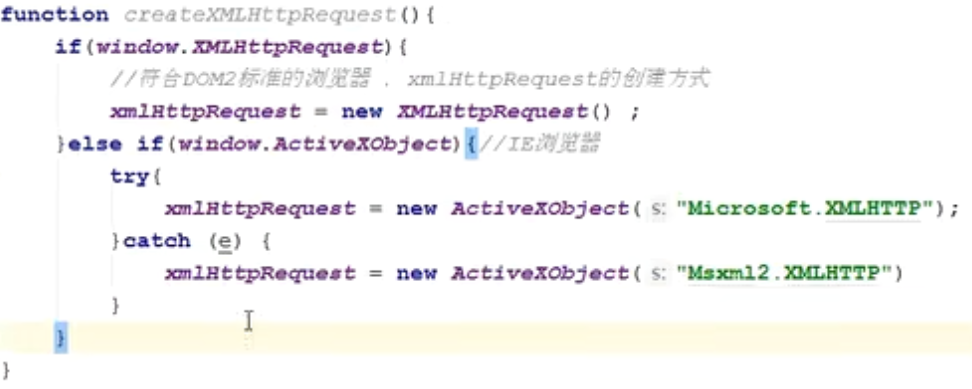!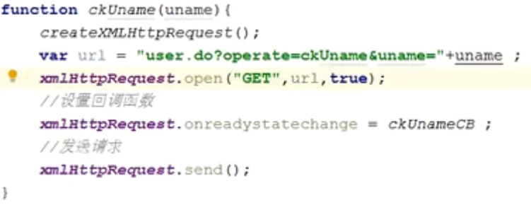

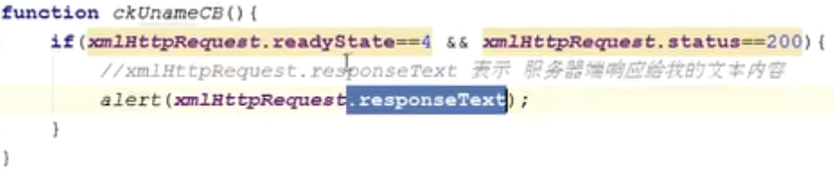

>  java dispatcher servlet：

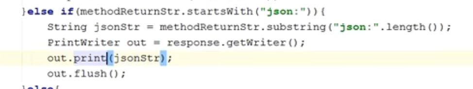


## Axios

[Watch me and next video for Json request](https://www.bilibili.com/anime/?spm_id_from=333.788.0.0)

[Read me](https://heavy_code_industry.gitee.io/code_heavy_industry/pro001-javaweb/lecture/chapter12/verse02.html)

## Issue faced

> tomcat a child container failed during start

1. Check web.xml, if there are any typo in name of the servlets

> Reflect method getParameters -> getName() showing arg0

1. You may add the following parameter to your maven compiler plugin

   ```xml
   <plugin>
       <artifactId>maven-compiler-plugin</artifactId>
       <version>3.8.0</version>
       <configuration>
           <parameters>true</parameters>
       </configuration>
   </plugin>
   ```

   


# QQZone Exercise

## Database design

[watch me](https://www.bilibili.com/video/BV1AS4y177xJ?p=56&vd_source=a788bdd4d7cdd9dfe02852346d523cb9)

1. Entity

2. Field

3. Relationship

4. ERD

5. 3NF

   > **数据库的范式：**
   >
   > 第一范式：列不可再分
   > 第二范式：一张表只表达一层含义（只描述一件事情）
   > 第三范式：表中的每一列和主键都是直接依赖关系，而不是间接依赖
   >
   > 数据库设计的范式和数据库的查询性能很多时候是相悖的，我们需要根据实际的业务情况做一个选择：
   >
   > 查询频次不高的情况下，我们更倾向于提高数据库的设计范式，从而提高存储效率
   >
   > 查询频次较高的情形，我们更倾向于牺牲数据库的规范度，降低数据库设计的范式，允许特定的冗余，从而提高查询的性能


**Tips:** 可以看到表主人回复中的作者不符合第三范式，因为它可以通过 - 回复 + 日志 进行三表联查查询到主人。但基于查询频次高的原因，选择不提高范式。


**Step 1**

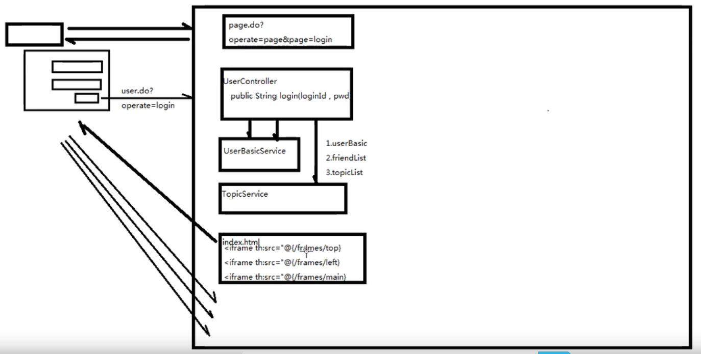


## Issue Faced

1. cannot cast database type into our pojo

   - Change pojo to java.time.LocalDate / LocalDateTime

1. Dispatcher的invoke抛nullExeption

   - 你忘记配置applicationContext了

3. Keep return null from DAO

   - Bro do not forget to check whether you  made the return statement correctly or not

4. if my sql has "select y as x", how to get x?

   - ResultSetMetaData rsmd = rs.getMetaData() 
   - => use getColumnLabel(index) instead of getColumnName(index)

5. Cannot start @Test by method

   - Your parameter must be nothing

6. HTML iframe: how to click a href but trigger parent?

   ```html
   <!-- I AM IFRAME -->
   <a th:href="@{..}" th:text="${..}" target="_top"/>
   
   *** PAY ATTENTION TO TARGET="_top" ***
   ```

7. XML file注释没用

   - 不知道为什么

8. 可以在自己的service调用自己的DAO，**不调用**别人的DAO(但可以调用别人的Service)，因为这样做可以避免深入考虑人家内部的实现

9. 如果在DispatchServlet出现InvocatonTargetException

   - 请看看自己的applicationContext.xml里有没有没有property有正确的name)field)和ref

10. Session里的对象拿不到？不能强转类型的吗？

   - 是能的，请看看你是不是把attribute的小字母写成大字母了

11. java.lang.NoSuchFieldException

   - 你是不是在xml注入多余了？这种情况是你的class没有你xml里面注入的field
   - 还是不行的话，重试save bean factory和子类和xml吧

11. DAOException第一时间去检查sql语句，而不是其他先

12. Debug第一时间看Caused By，而不是什么error

13. Thymeleaf 的#dates.format 不能用在java.time。。

    - ```xml
      <dependency>
          <groupId>org.thymeleaf.extras</groupId>
          <artifactId>thymeleaf-extras-java8time</artifactId>
          <version>3.0.4.RELEASE</version>
      </dependency>
      ```

    - ​    templateEngine.addDialect(new Java8TimeDialect());

    - ${#temporals.format(yourdatetime, 'yyyy-MM-dd HH:mm:ss')

14. 修改全部文件

    `:args *.java`

    `:argdo %s/a/b/ge`
    
15. BigDecimal.valueOf(Double) 和 New BigDecimal(Double)

    - valueOf 用 New BigDecimal("")， 把double换成字符串再new， 而直接New BigDecimal(Double)你会发现非常精准。

16.    java.sql.SQLException: Parameter index out of range (1 > number of parameters, which is 0).

    - Check你的insertSQL是不是没有放到 VALUES (?,?,?,?)

17. 是可以在response打入script的，试了resp.sendRedirect 是成功的

    ```java
    PrintWriter writer = response.getWriter();
    writer.write("<script language='javascript'>alert('helloworld')</script>");
    ```

    


# ShuCheng

## Database design

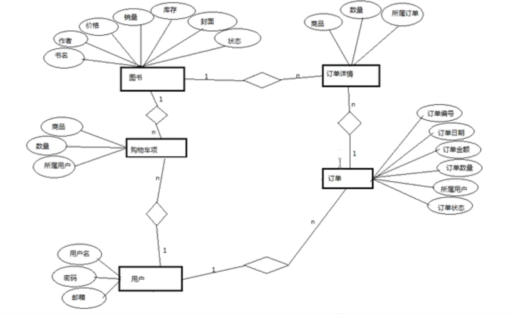


## Issues faced

1. filter设定的白名单进入不到
   - 不止要登入页面，还要用登入请求url
