### Jenkins

This is a learning note from Shang Gui Gu (尚硅谷) from  P287 - P294.
https://www.bilibili.com/video/BV1dQ4y1A75e?p=296&spm_id_from=pageDriver&vd_source=a788bdd4d7cdd9dfe02852346d523cb9

14.07.2022


> Manual:
>
> 1. install maven and set env variable 
>
>    
>
> 2. in your project => cmd => `mvn clean package`
>
> 3. the jar is in your target
>
> 4. in jar location => cmd => java -jar name.jar 


> Jenkins
>
> Automatic done packaging by shell script

1. In linux:

   1. Install jdk

      - cd /usr/local

      - tar -zxvf jdk-8u121-linux-x64.tar.gz

      - ln -s /usr/local/....121 /usr/local/jdk  <==soft link

      - change environment variable

        - vim /etc/profile

        ```shell
        export JAVA_HOME=/usr/local/jdk
        export JRE_HOME=$JAVA_HOME/jre
        export CLASSPATH=.:$CLASSPATH:$JAVA_HOME/lib:$JRE_HOME/lib
        export PATH=$PATH:$JAVA_HOME/bin:$JRE_HOME/bin
        ```

      - source /etc/profile <= effective immediately
      - java -version <= to test

   2. Install maven

      - cd /usr/local

      - tar -zxvf apache-maven-3.6.1.tar.gz

      - ln -s /usr/local/....3.6.1/usr/local/maven  <==soft link OR rename to maven

      - change environment variable

        - vim /etc/profile

        ```shell
        export MAVEN_HOME=/usr/local/maven
        export PATH=$PATH:$MAVEN_HOME/bin
        ```

      - source /etc/profile <= effective immediately
      - mvn -v <= to test

   3. Install Git

      `yum -y install git`

   4. Install Docker

      - System utils

        `yum install -y yum-utils device-mapper-persisent-data lvm2`

      - update and install docker-ce

        `yum makecache fast`

        `yum -y install docker-ce`

      - service docker start

      - docker -v

   5. Install Jenkins 

      > stop? kill pid

      1.  jenkins.war (to put in tomcat to run)

      2. cd /usr/local/jenkins

      3. jenkins.war

      4. nohup java -jar /usr/local/jenkins/jenkins.war > /usr/local/jenkins/jenkins.out &

         > start background (without showing the log)
         >
         > 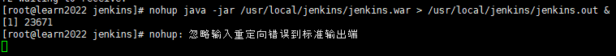
         >
         > - enter

      5. ps -ef | grep jenkins

      6. http://ip:8080

         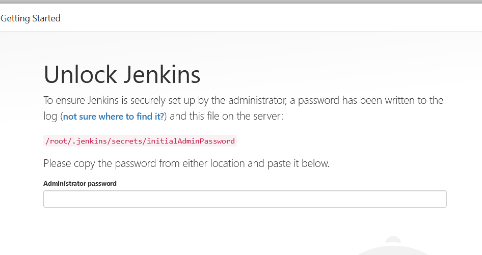

         7. get password : cat /root/.jenkins/secrets/initialAdminPassword

            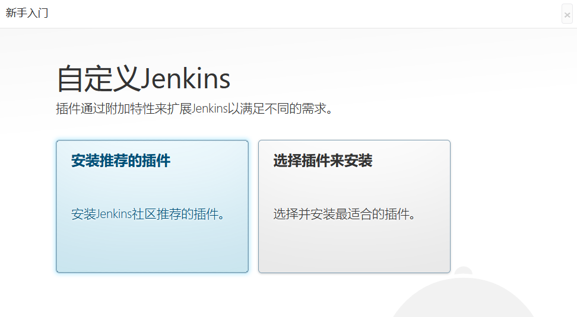

            > Tips: download is slow in China, please set country mirror site
            >
            > my case: 
            >
            > cd /root/.jenkins/updates
            >
            > sed -i 's/http:\/\/updates.jenkins-ci.org\/download/https:\/\/mirrors.tuna.tsinghua.edu.cn\/jenkins/g' default.json && sed -i 's/https:\/\/www.google.com/https:\/\/www.baidu.com/g' default.json

            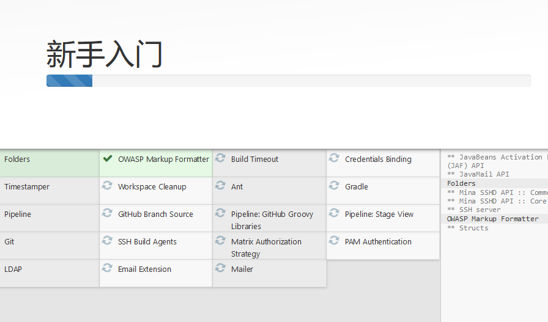

         8. create user eg mysql

         9. 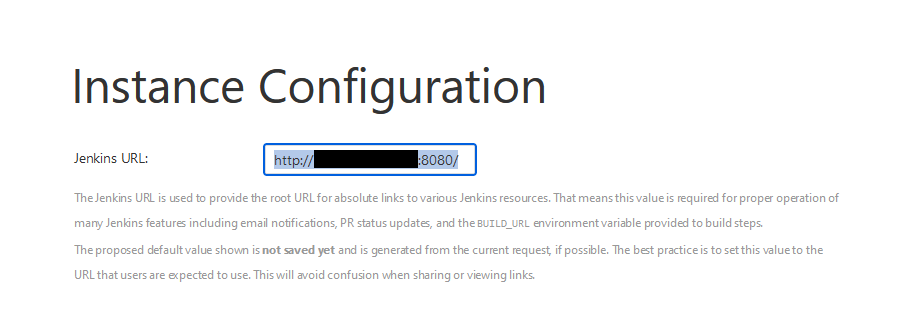

         10. 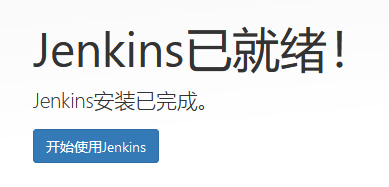

#### Settings

- Global Tool Configuration
  - JDK - uncheck install automatically
    - which jdk
    - 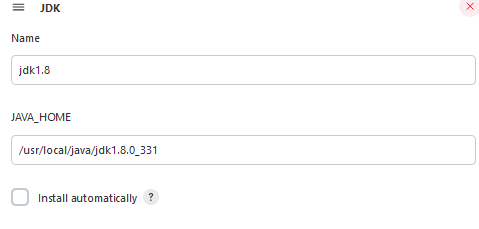
  - Maven
    - which maven
    - 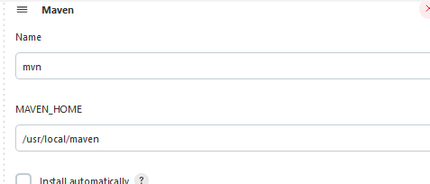
  - Git
    - which git
    - 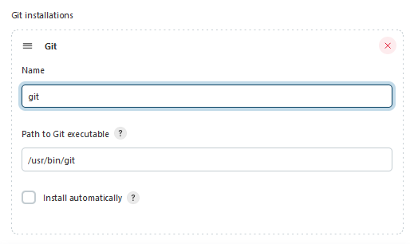

#### Start Automation

1. Create a 'Dockerfile' in your project

   ```dockerfile
   FROM openjdk:8-jdk-alpine
   VOLUME /tmp
   COPY ./target/demoJenkins.jar demoJenkins.jar
   ENTRYPOINT ["java","-jar","/demoJenkins.jar","&"]
   ```

2. In your pom, add

   ```xml
   <packaging>jar</packaging>
   ...
   <build>
   	<finalName>demojenkins</finalName>
       <plugins>
       	<plugin>
           	<groupId>org.springframework.boot</groupId>
               <artifactId>spring-boot-maven-plugin</artifactId>
           </plugin>
       </plugins>
   </build>

3. In jenkin dashboard => new item => choose freesyle project

   

   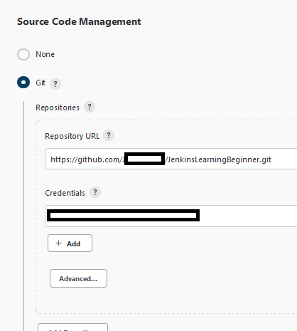

4. Choose Build => shell

   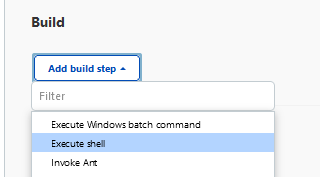

   ```shell
   #!/bin/bash
   #maven package
   mvn clean package
   echo 'package ok!'
   echo 'build start'
   cd ./ #project path (this case is at project there)#**********
   service_name="demojenkins" #**********
   service_port=8111 #***********
   #check image id
   IID=$(docker images | grep "$service_name" | awk '{print $3}')
   echo "IID $IID"
   if [ -n "$IID" ]
   then
   	echo "exist $SERVER_NAME image, IID=$IID"
   	#delete image
   	docker rmi -f $service_name
   	echo "delete $SERVER_NAME image"
   	#build image
   	docker build -t $service_name .
   	echo "build $SERVER_NAME image"
   else
   	echo "no exist $SERVER_NAME image, build docker"
   	#build image
   	docker build -t $service_name . #REMEMBER DOT
   	echo "build $SERVER_NAME image"
   fi
   #check container id
   CID=$(docker ps | grep "$SERVER_NAME" | awk '{print $1}')
   echo "CID $CID"
   if [ -n "$CID" ]
   then 
   	echo "exist $SERVER_NAME container, CID=$CID"
   	#Stop container
   	docker stop $service_name
   	#Delete container
   	docker rm $service_name
   else
   	echo "no exist $SERVER_NAME container"
   fi
   #Start container
   docker run -d --name $service_name --net=host -p $service_port:$service_port $service_name
   #show docker log
   #docker logs -f $service_name
   ```

   

   Another example ((detail))

   ```shell
   #!bin/bash
   #maven package
   mvn clean package
   echo 'package ok!'
   echo 'build start'
   cd ./infrastructure/eureka_server
   service_name="eureka-server"
   service_port=8761
   #check image id
   IID=$(docker images | grep "$service_name" | awk '{print $3}')
   echo "IID $IID"
   if [ -n "$IID"]
   then
   	echo "exist $SERVER_NAME image, IID=$IID"
   	#delete image
   	docker rmi -f $service_name
   	echo "delete $SERVER_NAME image"
   	#build image
   	docker build -t $service_name
   	echo "build $SERVER_NAME image"
   else
   	echo "no exist $SERVER_NAME image, build docker"
   	#build image
   	docker build -t $service_name
   	echo "build $SERVER_NAME image"
   fi
   #check container id
   CID=$(docker ps | grep "$SERVER_NAME" | awk '{print $1}')
   echo "CID $CID"
   if [ -n "$CID"]
   then 
   	echo "exist $SERVER_NAME container, CID=$CID"
   	#Stop container
   	docker stop $service_name
   	#Delete container
   	docker rm $service_name
   else
   	echo "no exist $SERVER_NAME container"
   fi
   #Start container
   docker run -d --name $service_name --net=host -p $service_port:$service_port $service_name
   #show docker log
   #docker logs -f $service_name
   ```

   

5. save

6. dashboard:

   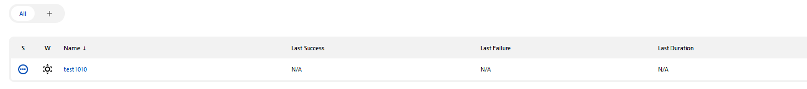

7. `service docker start` and Build to work now

   

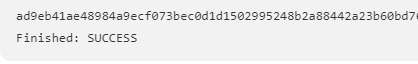

