# JUC Learning
This is a learning notes.

learning JUC from 狂神说 in https://www.bilibili.com/video/BV1B7411L7tE?p=1

Total video length : 8h 36m 29s

23.06.2022 - start

24.06.2022 - complete


# java.util.concurrent

java.util.concurrent

java.util.concurrent.atomic

java.util.concurrent.locks


## Process and Thread

Process : 

- is a program
- can contain threads
- java default : main thread, gc thread


Thread :

- eg. Typora -> write, auto save...


** Thread not start by java -> c++ started it.


### Concurrent | Parallel

Concurrent 并发 : 

- CPU 1 core： Thread exchanges rapidly, human cannot noticed.

  

Parallel 并行 :

- eg. you and your friend walk together

- CPU multi core: multi threads runs together

- ```java
  Runtime.getRuntime().availableProcessors();
  ```


Why? Use cpu efficiently.


## Callable\<V>

- return value \<V> <-- result saved in FutureTask, use .get() to get //blocked to wait until state != 0 (NEW)

- throw exception

- .call() (Runnable -> .run())

- ```java
  FutureTask<String> futureTask = new FutureTask<>(new MyThread());
  new Thread(futureTask).start();
  ```

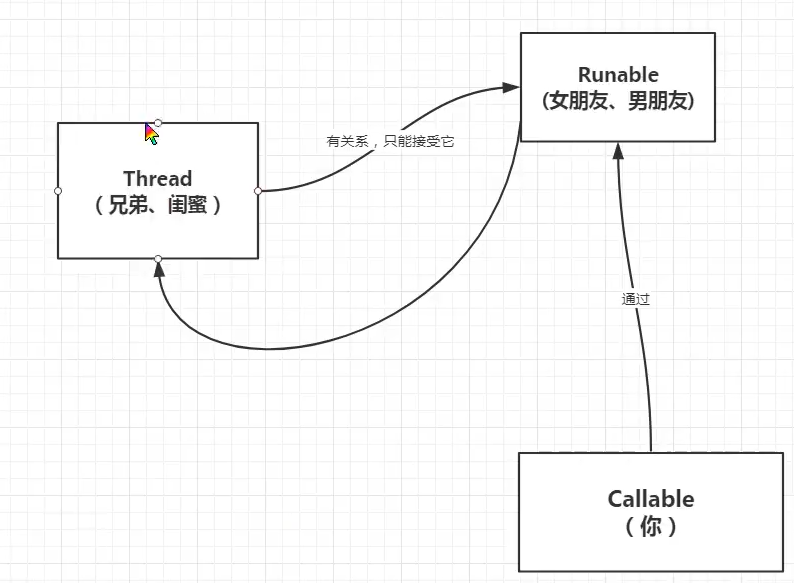

Thread(Runnable runnable)

Runnable implemented by:

- FutureTask 

  ```java
  FutureTask(Runnable runnable, V result)
  FutureTask(Callable<V> callable)
  ```


## Thread's State

```java
public enum State {
        //new and not start
        NEW,

    	//runnable, may be waiting resource
        RUNNABLE,

    	//blocked and wait for a monitor lock (to enter synchronized block / method)
        BLOCKED,
		
    	//waiting for another thread to perform a particular action
        WAITING,
		
    	//eg Thread.sleep, .wait with timeout, LockSupport.parkUntil...
    	//wait because of time
        TIMED_WAITING,
    
        // The thread has completed execution.
        TERMINATED;
    }
```

#### wait | sleep

wait :

- Object.wait(.)

- release lock

- be in parallel block

  

sleep :

- Thread.sleep(.)

- java.util.concurrent.TimeUnit.DAYS.sleep(.)
- time related
- can be used everywhere


## Collection and Map is unsafe

> _ConcurrentModificationException_

### List

ArrayList.add() -> no synchronized and lock.

Solution:

```java
List<String> list = new Vector<>(); //use synchronized keyword
List<String> list = Collections.synchronizedList(new ArrayList<>()); //use synchronized(mutex)
List<String> list = new CopyOnWriteArrayList<>() //use reentrantlock
```


### Set

Solution:

```java
Set<String> set = Collections.synchronizedSet(new HashSet<>());
Set<String> set = new CopyOnWriteArraySet<>();
```

*Tips : What is hashset? 

```
private static final Object PRESENT = new Object();
public HashSet() { map = new HashMap<>();}
public boolean add(E e) {return map.put(e, PRESENT)==null;}
```


### Map

Solution:

```java
Map<Object, Object> map = Collections.synchronizedMap(new HashMap<>());
Map<Object, Object> map = new ConcurrentHashMap<>(); //noticed synchronized()
```

*Tips : Hashmap

initial: 

- loadFactor:  0.75f; 

- DEFAULT_INITIAL_CAPACITY = 1 << 4; // aka 16

other: 

- newCapacity = oldCap << 1 // *2
- newThresHold = oldThresHold <<1 //*2


eg 1st time capacity = 16, threshold = 12

	few times add when array len more than 12

	new capacity = 32 .. so on

	newThreshold = 24 .. so on


if linkList >= 8  **&&** arrayLength >= 64 --> treeifyBin

```java
if (binCount >= TREEIFY_THRESHOLD - 1) //8 - 1
>>
if (tab == null || (n = tab.length) < MIN_TREEIFY_CAPACITY) resize() //64 (if not exceed 64, use resize instead of replaceTreeNode)
```


## Lock

```java
private Lock lock = new ReentrantLock();
private Condition condition = lock.newCondition();

condition.await();
condition.signal();
condition.signalAll();
```


**Different between Synchronized & Lock**


|                synchronized                 |                      lock                       |
| :-----------------------------------------: | :---------------------------------------------: |
|                java keyword                 |                   java class                    |
|                auto release                 |               manual release lock               |
|     the thread waiting will be blocked      |  can use tryLock()  to choose whether to wait   |
| reentrantLock, unfair (lock given randomly) | lock - reentrantlock, can choose fair or unfair |
|        suitable for small area code         |          suitable for large area code           |

### A) Synchronized

public synchronized void method1() <-- object is lock

public static synchronized void method2() <-- class is lock

both methods can be in one class, but there is two different lock while new this object.

```java
public class SynchronizedEg {
    public static void main(String[] args) {
        Ticket ticket = new Ticket();

        new Thread(() -> {
            for (int i = 0; i < 30; i++) {
                ticket.sell();
            }
        }, "Thread A").start();

        new Thread(() -> {
            for (int i = 0; i < 30; i++) {
                ticket.sell();
            }
        }, "Thread B").start();

        new Thread(() -> {
            
        }, "Thread C").start();
    }

}

class Ticket {
    private int number = 5;

    public void sell() {
        if (number > 0) {
            try {
                Thread.sleep(50);
            } catch (InterruptedException e) {
                throw new RuntimeException(e);
            }
            System.out.println(Thread.currentThread().getName() + " bought, ticket no left: " + --number);
        }
    }
}
```

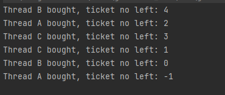

after synchronized : 

```java
public synchronized void sell() ...
```

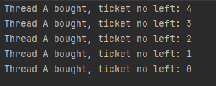

### B) ReentrantLock 可重入锁 (***)

> Refer to java documentations:
>
> ```java
> Lock l = ...;
> l.lock();
> try {
> // access the resource protected by this lock
> } finally {
> l.unlock();
> }
> ```


#### 1. Constructor -> Fair | Unfair

Fair -> FIFO

Unfair (Default) -> Can cut queue 

```java
    /**
     * Creates an instance of {@code ReentrantLock}.
     * This is equivalent to using {@code ReentrantLock(false)}.
     */
    public ReentrantLock() {
        sync = new NonfairSync();
    }

    /**
     * Creates an instance of {@code ReentrantLock} with the
     * given fairness policy.
     *
     * @param fair {@code true} if this lock should use a fair ordering policy
     */
    public ReentrantLock(boolean fair) {
        sync = fair ? new FairSync() : new NonfairSync();
    }
```


**Amended Ticket Class**

```java
class Ticket {
    private int number = 5;

    private Lock l = new ReentrantLock();

    public void sell() {
        l.lock();
        try {
            if (number > 0) {
                try {
                    Thread.sleep(50);
                } catch (InterruptedException e) {
                    throw new RuntimeException(e);
                }
                System.out.println(Thread.currentThread().getName() + " bought, ticket no left: " + --number);
            }
        } finally {
            l.unlock();
        }
    }
}
```


### C) ReentrantReadWriteLock 读写锁

1) .readLock()
2) .writeLock()

- suitable for case that high frequency of read and low frequency of write
- avoid the incident of read dirty
- write write mutex, write read mutex, read read not mutex. (means allowed multi thread to use read locks while there is no write locks being use).

**Read Read case **

```java
public static void main(String[] args) throws Exception {
        ReentrantReadWriteLock rwLock = new ReentrantReadWriteLock();
        ReentrantReadWriteLock.ReadLock readLock = rwLock.readLock();
        ReentrantReadWriteLock.WriteLock writeLock = rwLock.writeLock();
		
        new Thread(() -> {
            readLock.lock();
            try {
                System.out.println(Thread.currentThread().getName() + " start reading");
                Thread.sleep(2000);
                System.out.println(Thread.currentThread().getName() + " finish reading");
            } catch (Exception e) {
                e.printStackTrace();
            } finally {
                readLock.unlock();
            }
        }, "T1").start();

        new Thread(() -> {
            readLock.lock();
            try {
                System.out.println(Thread.currentThread().getName() + " start reading");
                Thread.sleep(2000);
                System.out.println(Thread.currentThread().getName() + " finish reading");
            } catch (Exception e) {
                e.printStackTrace();
            } finally {
                readLock.unlock();
            }
        }, "T2").start();

    }
```

Result of read-read

>T1 start reading
>T2 start reading
>T1 finish reading
>T2 finish reading


**Read Write case**

```java
...		
		new Thread(() -> {
            readLock.lock();
            ...
            } catch (Exception e) {
                e.printStackTrace();
            } finally {
                readLock.unlock();
            }
        }, "T1").start();

        new Thread(() -> {
            writeLock.lock();
            ...
            } catch (Exception e) {
                e.printStackTrace();
            } finally {
                writeLock.unlock();
            }
        }, "T2").start();
```

Result of read-write

>T1 start reading
>T1 finish reading
>T2 start reading
>T2 finish reading


**Write Write case**

```java
...		
		new Thread(() -> {
            writeLock.lock();
            ...
            } catch (Exception e) {
                e.printStackTrace();
            } finally {
                writeLock.unlock();
            }
        }, "T1").start();

        new Thread(() -> {
            writeLock.lock();
            ...
            } catch (Exception e) {
                e.printStackTrace();
            } finally {
                writeLock.unlock();
            }
        }, "T2").start();
```

Result of write-write

>T1 start reading
>T1 finish reading
>T2 start reading
>T2 finish reading


### Case Study

#### Producer and Consumer 

```java
public class ProducerConsumer {
    public static void main(String[] args) {
        Data data = new Data();

        new Thread(() -> {
            for (int i = 0; i < 5; i++) {
                data.increment();
            }
        }, "Thread A").start();

        new Thread(() -> {
            for (int i = 0; i < 5; i++) {
                data.decrement();
            }
        }, "Thread B").start();

    }

}

class Data {
    private int number = 0;

    public synchronized void increment() {
        if (number != 0) {
            //wait
            myWait();
        }
        number++;
        System.out.println(Thread.currentThread().getName() + " - number now: " + number);
        //notify other
        notifyAll();
    }

    public synchronized void decrement() {
        if (number == 0) {
            //wait
            myWait();
        }
        number--;
        System.out.println(Thread.currentThread().getName() + " - number now: " + number);
        //notify other
        notifyAll();
    }

    public void myWait() {
        try {
            wait();
        } catch (InterruptedException e) {
            throw new RuntimeException(e);
        }
    }
}
```

Result: 

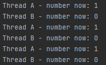

Q: how about Thread C and Thread D? ---> Result is unsure. Because of [if] -> two threads stucked in if block which cause the operation duplicate after wakeup.

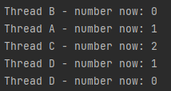

```java
API Note:
The recommended approach to waiting is to check the condition being awaited in a while loop around the call to wait, as shown in the example below. Among other things, this approach avoids problems that can be caused by spurious wakeups.

     synchronized (obj) {
         while (<condition does not hold> and <timeout not exceeded>) {
             long timeoutMillis = ... ; // recompute timeout values
             int nanos = ... ;
             obj.wait(timeoutMillis, nanos);
         }
         ... // Perform action appropriate to condition or timeout
     }
 
```

replaced [if] with [while]

 ```java
public synchronized void increment() {
        while (number != 0) {
            ..
        }..
    }

    public synchronized void decrement() {
        while (number == 0) {
            ..
        }
        ..
    }
 ```

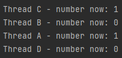

using Lock instead of Synchronized:

```java
class Data {
    private int number = 0;
    private Lock lock = new ReentrantLock();
    private Condition condition = lock.newCondition();


    public void increment() {
        lock.lock();
        try {

            while (number != 0) {
                //wait
                myWait();
            }
            number++;
            System.out.println(Thread.currentThread().getName() + " - number now: " + number);
            incrementCase++;
            //notify other
            condition.signalAll();
        } finally {
            lock.unlock();
        }
    }

    public void decrement() {
        lock.lock();
        try {
            while (number == 0) {
                //wait
                myWait();
            }
            number--;
            System.out.println(Thread.currentThread().getName() + " - number now: " + number);
            decrementCase++;
            //notify other
            condition.signalAll();
        } finally {
            lock.unlock();
        }
    }

    public void myWait() {
        try {
            condition.await();
        } catch (InterruptedException e) {
            throw new RuntimeException(e);
        }
    }
}
```


#### Lock's Condition

```
public class findCode {
    public static void main(String[] args) {
        Print print = new Print();
        new Thread(() -> {
            for (int i = 0; i < 5; i++) {
                print.printA();
            }
        }, "Thread A ").start();
        new Thread(() -> {
            for (int i = 0; i < 5; i++) {
                print.printB();
            }
        }, "Thread B ").start();
        new Thread(() -> {
            for (int i = 0; i < 5; i++) {
                print.printC();
            }
        }, "Thread C ").start();

    }

}

class Print {
    private int number = 1;
    private Lock lock = new ReentrantLock();
    private Condition condition1 = lock.newCondition();
    private Condition condition2 = lock.newCondition();
    private Condition condition3 = lock.newCondition();

    public void printA() {
        lock.lock();
        try {
            while (number != 1) {
                myWait(condition1);
            }
            System.out.println(Thread.currentThread().getName() + " - AAAAAAAAAA");
            number = 2;
            condition2.signal();
        } finally {
            lock.unlock();
        }
    }

    public void printB() {
        lock.lock();
        try {
            while (number != 2) {
                myWait(condition2);
            }
            System.out.println(Thread.currentThread().getName() + " - BBBBBBBBBB");
            number = 3;
            condition3.signal();
        } finally {
            lock.unlock();
        }
    }

    public void printC() {
        lock.lock();
        try {
            while (number != 3) {
                myWait(condition3);
            }
            System.out.println(Thread.currentThread().getName() + " - CCCCCCCCCC");
            number = 1;
            condition1.signal();
        } finally {
            lock.unlock();
        }
    }

    public void myWait(Condition condition) {
        try {
            condition.await();
        } catch (InterruptedException e) {
            throw new RuntimeException(e);
        }
    }
}
```

Result: 

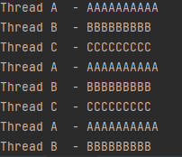


## Aid Class (\**\***)

### 1. CountDownLatch

A synchronization aid that allows one or more threads to wait until a set of operations being performed in other threads completes.

 ```java
public CountDownLatch(int count)
public void await()
public boolean await(long timeout, TimeUnit unit)
public void countDown()
public long getCount()
    
 ```

```java
public static void main(String[] args) throws ExecutionException, InterruptedException {
        CountDownLatch countDownLatch = new CountDownLatch(6);
        for (int i = 0; i < 6; i++) {
            new Thread(() -> {
                System.out.println(Thread.currentThread().getName() + " went out.");
                countDownLatch.countDown();
            },"T" + i).start();
        }
        System.out.println("check point");
        countDownLatch.await();
        System.out.println("close door");
    }
```

Result:

>T0 went out.
>T4 went out.
>T2 went out.
>check point
>T1 went out.
>T5 went out.
>T3 went out.
>close door


### 2. CyclicBarrier

A synchronization aid that allows a set of threads to all wait for each other to reach a common barrier point

```java
public CyclicBarrier(int parties, Runnable barrierAction)
public CyclicBarrier(int parties)
public int getParties()
public int await()
public int await(long timeout, TimeUnit unit)
public boolean isBroken()
public void reset()
public int getNumberWaiting()
```

```java
CyclicBarrier barrier = new CyclicBarrier(6, () -> {
            System.out.println("barrier is broken");
        });
        for (int i = 0; i < 6; i++) {
            new Thread(() -> {
                System.out.println(Thread.currentThread().getName() + " is waiting.");
                try {
                    barrier.await();
                } catch (InterruptedException e) {
                    throw new RuntimeException(e);
                } catch (BrokenBarrierException e) {
                    throw new RuntimeException(e);
                }
            },"T" + i).start();
        }
```

Result:

>T0 is waiting.
>T5 is waiting.
>T3 is waiting.
>T2 is waiting.
>T1 is waiting.
>T4 is waiting.
>barrier is broken


### 3. Semaphore

A counting semaphore. Conceptually, a semaphore maintains a set of permits. Each acquire blocks if necessary until a permit is available, and then takes it

eg. carpark -->

carpark space :6

6 car came in ->  123 parked, 456 wait --> no.3 left, no.4 parked, 5 & 6 are still waiting.

```java
public Semaphore(int permits) //default unfair
public Semaphore(int permits, boolean fair)
public void acquire() //block until one is available OR this thread is interrupted
public void acquireUninterruptibly() //block until one is available
public boolean tryAcquire()
public void release()
    
public int availablePermits()
public int drainPermits()	//Acquires and returns all permits that are immediately available.
public boolean isFair()
public final boolean hasQueuedThreads()
public final int getQueueLength()
public final Collection<Thread> getQueuedThreads()
```

```java
 public static void main(String[] args) throws Exception {
        Semaphore semaphore = new Semaphore(1);

        for (int i = 0; i < 3; i++) {
            new Thread(() -> {
                System.out.println(Thread.currentThread().getName() + " is waiting.");
                try {
                    semaphore.acquire();
                    System.out.println(Thread.currentThread().getName() + " parked.");
                    TimeUnit.SECONDS.sleep(1);
                } catch (InterruptedException e) {
                    throw new RuntimeException(e);
                }
                semaphore.release();
                System.out.println(Thread.currentThread().getName() + " left.");
            },"T" + i).start();
        }
    }
```


Result

>T0 is waiting.
>T1 is waiting.
>T2 is waiting.
>T0 parked.
>T0 left.
>T1 parked.
>T1 left.
>T2 parked.
>T2 left.


## Blocking Queue | Deque

> ArrayBlockingQueue<>(int);
>
> SynchronousQueue() --> TransferQueue (if fair), TransferStack if unfair --> endless loop found. the thread (T1) which perform put() only can continue once item have been take() out. AND the other threads which perform put() after T1 performed blocked until T1 continue.


**4 sets of API** 

|               | throw exception | no exception (return value) | blocking | timeout                                          |
| ------------- | --------------- | --------------------------- | -------- | ------------------------------------------------ |
| add member    | add             | offer                       | put      | offer(value, long ,TimeUnit-put after this time) |
| remove member | remove          | poll                        | take     | offer(long ,TimeUnit-put after this time)        |
| peek member   | element         | peek                        |          |                                                  |


## Thread Pool (\**\***)

- Faster --> no need to construct and destroy
- Easy to manage

3 main method :: 7 Parameters :: 4 RejectedExecutionHandler 

### Methods

**Not recommended to use Executors as might face OOM because of **

**- unsettle task** **(Interger.MAXVALUE in workQueue)**

**- peak thread (Integer.MAXVALUE used for maximumPoolSize for newCachedThreadPool())**

**Recommend use ThreadPoolExecutor(params[] ...)**

> 
>
> ```
> return ExecutorService
> ------------------------------------
> Executors.newSingleThreadExecutor(); //single thread
> Executors.newFixedThreadPool(int Thread); //thread pool with pool size 5
> Executors.newCachedThreadPool(); // Creates a thread pool that creates new threads as needed, but will reuse previously constructed threads when they are available.
> ```


> ExecutorService Methods:
>
> ```
> void execute(Runnable command)
> void shutdown()
> boolean isShutdown()
> <T> Future<T> submit(Callable<T> task)
> <T> Future<T> submit(Runnable task, T result)
> Future<?> submit(Runnable task)
> <T> List<Future<T>> invokeAll(Collection<? extends Callable<T>> tasks)
> ```

### Parameters

Noticed above mentioned methods :

> return new ThreadPoolExecutor(....);

```java
public static ExecutorService newSingleThreadExecutor() {
        return new FinalizableDelegatedExecutorService
            (new ThreadPoolExecutor(1, 1,
                                    0L, TimeUnit.MILLISECONDS,
                                    new LinkedBlockingQueue<Runnable>()));
    }

public static ExecutorService newFixedThreadPool(int nThreads) {
        return new ThreadPoolExecutor(nThreads, nThreads,
                                      0L, TimeUnit.MILLISECONDS,
                                      new LinkedBlockingQueue<Runnable>());
    }

public static ExecutorService newCachedThreadPool() {
        return new ThreadPoolExecutor(0, Integer.MAX_VALUE,				//!!! OOM
                                      60L, TimeUnit.SECONDS,
                                      new SynchronousQueue<Runnable>());
    }

public ThreadPoolExecutor(int corePoolSize,
                              int maximumPoolSize,
                              long keepAliveTime,
                              TimeUnit unit,
                              BlockingQueue<Runnable> workQueue,
                              ThreadFactory threadFactory,
                              RejectedExecutionHandler handler)
```

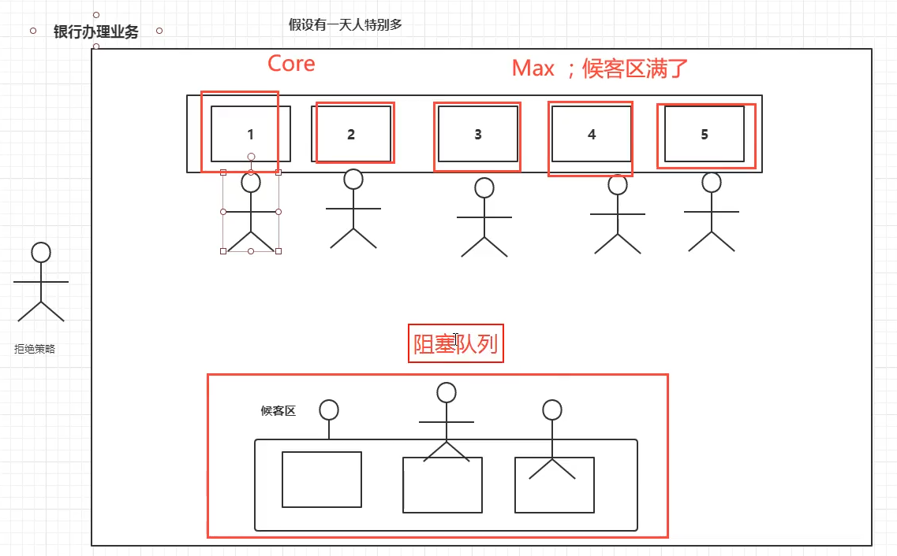

> corePoolSize : the number of threads to keep in the pool, even if they are idle
>
> keepAliveTime : when the number of threads is greater than the core, this is the maximum time that excess idle threads will wait for new tasks before terminating
>
> workQueue : the queue to use for holding tasks before they are executed
>
> handler : to use when execution is blocked **because the thread bounds and queue capacities are reached**


### RejectedExecutionHandler


_Default: AbortPolicy_

>DiscardOldestPolicy : discards the oldest unhandled request and then retries execute
>
>AbortPolicy: throws a RejectedExecutionException
>
>CallerRunsPolicy: runs the rejected task directly in the calling thread of the execute method
>
>DiscardPolicy: silently discards the rejected task


### Question: 

1. **How do you decide the maximumPoolSize?**

   >1. CPU - number of available Processer Size
   >2. IO - set the number bigger than the programs that is heavy IO usage. eg. x 2


## 4 Functional Interface

They can be found in source code everywhere. It makes clean code. We shall master it.

> Function : 1 param and return result
>
> ```cjava
> Function<String, String> function = (str) -> str + " hello";
> ```
>
> Predicate :  1 param and return boolean (do some compare inside )
>
> ```java
> Predicate<String> isNull = str -> str == null;
> ```
>
> Supplier : no param and return result
>
> ```java
> Supplier<String> print = () -> "print...";
> ```
>
> Consumer : 1 param and return void
>
> ```java
> Consumer<String> print = str -> System.out.println(str);
> or
> Consumer<String> print = System.out::println;
> ```


## Stream

- To do with collections : update, filter ...

```java
public static void main(String[] args) throws Exception {
    //Q: given 5 users, please filter and print:
    //  1. id is odd number
    //  2. older than 23 years old.
    //  3. replace name to Capital Letter.
    //  4. Decreasing order by name.
    //  5. show only one user

    User u1 = new User(1,"a",21);
    User u2 = new User(2,"b",22);
    User u3 = new User(3,"c",23);
    User u4 = new User(5,"d",24);
    User u5 = new User(7,"e",25);

    List<User> users = Arrays.asList(u1, u2, u3, u4, u5);

    users.stream()
            .filter(u -> (u.id & 1) == 1)
            .filter(u -> u.age > 23)
            .map(u -> u.name.toUpperCase())
            .sorted(Comparator.reverseOrder()) //equal to Comparator.reverseOrder()
            .limit(1)
            .forEach(System.out::println);
}
```


## ForkJoin

- What is ForkJoin?

  - JDK 1.7
  - Split heavy mission into small mission
  - *Steal workload from different thread after its part completed ==> efficient
  - Deque! (use array in source code but deque technique)

  

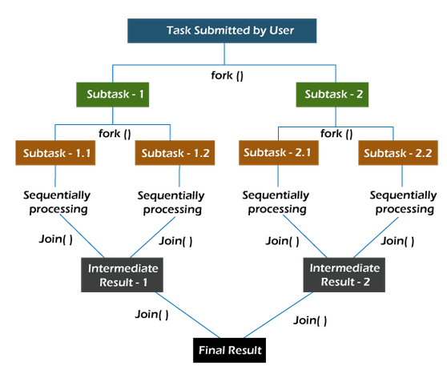

_Image from : https://www.javatpoint.com/fork-join-in-java_


> public class ForkJoinPool extends AbstractExecutorService {
>
> ```java
> public void execute(ForkJoinTask<?> task) {
>  if (task == null)
>      throw new NullPointerException();
>  externalPush(task);
> }
> ```

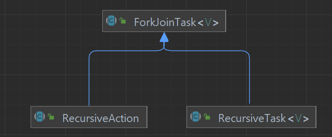


### Case Study

count 1 to 40_0000_0000L

stream > forkJoin > fori

```java
public class Demo {

    @Test
    public void test1() {
        long sum = 0L;
        long timeStart = System.currentTimeMillis();
        for (long i = 0L; i <= 40_0000_0000L; i++) {
            sum += i;
        }
        long timeEnd = System.currentTimeMillis();
        System.out.println(sum + " -- " + (timeEnd - timeStart)); //1031
    }

    @Test
    public void fork1() throws Exception {
        ForkJoinPool forkJoinPool = new ForkJoinPool();
        myForkTask task = new myForkTask(1L, 40_0000_0000L);

        long timeStart = System.currentTimeMillis();
        ForkJoinTask<Long> submit = forkJoinPool.submit(task);
        Long sum = submit.get();
        long timeEnd = System.currentTimeMillis();

        System.out.println(sum + " -- " + (timeEnd - timeStart)); //398
    }

    @Test
    public void stream1() {
        long timeStart = System.currentTimeMillis();
        long sum = LongStream.rangeClosed(1L, 40_0000_0000L).parallel().reduce(0, Long::sum);
        long timeEnd = System.currentTimeMillis();

        System.out.println(sum + " -- " + (timeEnd - timeStart)); //301
    }

}

class myForkTask extends RecursiveTask<Long> {

    Long start;
    Long end;

    public myForkTask(Long start, Long end) {
        this.start = start;
        this.end = end;
    }

    @Override
    protected Long compute() {
        long sum = 0L;
        if (end - start <= 10000L) {
            for (long i = start; i <= end; i++) {
                sum += i;
            }
        } else {
            long middle = (end - start)/2 + start;
            myForkTask task1 = new myForkTask(start, middle);
            task1.fork();
            myForkTask task2 = new myForkTask(middle + 1, end);
            task2.fork();
            sum += task1.join() + task2.join();
        }
        return sum;
    }
}
```

_what is parallel() in LongStream? https://www.geeksforgeeks.org/longstream-parallel-java/_


## Asynchronous Call

>  Future
>
>  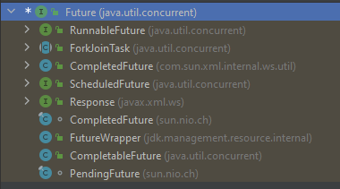

```
CompletableFuture()
public static <U> CompletableFuture<U> supplyAsync(Supplier<U> supplier)
public static CompletableFuture<Void> runAsync(Runnable runnable)
public T get()
public CompletableFuture<T> whenComplete(BiConsumer<? super T, ? super Throwable> action)
```

### Example

```java
public static void main(String[] args) throws Exception {
        CompletableFuture<Void> completableFuture = CompletableFuture.runAsync(() -> {
            try {
                TimeUnit.SECONDS.sleep(2);
            } catch (InterruptedException e) {
                throw new RuntimeException(e);
            }
            System.out.println(Thread.currentThread().getName() +  " - Asynchronous completed.");
        });
        System.out.println(Thread.currentThread().getName() + " - main");
        completableFuture.get();

        System.out.println("=========================");

        CompletableFuture<Integer> completableFuture2 = CompletableFuture.supplyAsync(() -> {
            try {
                TimeUnit.SECONDS.sleep(2);
            } catch (InterruptedException e) {
                throw new RuntimeException(e);
            }
            System.out.println(Thread.currentThread().getName() +  " - Asynchronous completed.");
            // int i = 10/0;
            return 1024;
        });
        System.out.println(Thread.currentThread().getName() + " - main");

        System.out.println(completableFuture2.whenComplete((t,u) -> {
            System.out.println("what is t? - " + t); //result : 1024 | when exception : null
            System.out.println("what is u? - " + u); //exception : java.util.concurrent.CompletionException: java.lang.ArithmeticException: / by zero
        }).exceptionally(e -> {
            System.out.println(e.getMessage());
            return 404;
        }).get());
    }
```

>main - main
>
>ForkJoinPool.commonPool-worker-9 - Asynchronous completed.
>
>=========================
>
>main - main
>ForkJoinPool.commonPool-worker-9 - Asynchronous completed.
>what is t? - 1024
>what is u? - null
>1024


## JMM

> **What is JMM? Java Memory Model**

- describes how threads in the Java programming language interact through memory

  - thread copy the latest variable from main memory into its cache before lock

  - thread **must write and store shared variable immediately (once it updated variable)** into main memory from its thread cache before release lock

  - lock and release lock is same lock

    

>内存交互操作有8种，虚拟机实现必须保证每一个操作都是原子的，不可在分的（对于double和long类型的变量来说，load、store、read和write操作在某些平台上允许例外）
>
>- lock   （锁定）：作用于主内存的变量，把一个变量标识为线程独占状态
>- unlock （解锁）：作用于主内存的变量，它把一个处于锁定状态的变量释放出来，释放后的变量才可以被其他线程锁定
>- read  （读取）：作用于主内存变量，它把一个变量的值从主内存传输到线程的工作内存中，以便随后的load动作使用
>- load   （载入）：作用于工作内存的变量，它把read操作从主存中变量放入工作内存中
>- use   （使用）：作用于工作内存中的变量，它把工作内存中的变量传输给执行引擎，每当虚拟机遇到一个需要使用到变量的值，就会使用到这个指令
>- assign （赋值）：作用于工作内存中的变量，它把一个从执行引擎中接受到的值放入工作内存的变量副本中
>- store  （存储）：作用于主内存中的变量，它把一个从工作内存中一个变量的值传送到主内存中，以便后续的write使用
>- write 　（写入）：作用于主内存中的变量，它把store操作从工作内存中得到的变量的值放入主内存的变量中


> JMM对这八种指令的使用，制定了如下规则：
>
> - 不允许read和load、store和write操作之一单独出现。即使用了read必须load，使用了store必须write
>
> - 不允许线程丢弃他最近的assign操作，即工作变量的数据改变了之后，必须告知主存
> - 不允许一个线程将没有assign的数据从工作内存同步回主内存
> - 一个新的变量必须在主内存中诞生，不允许工作内存直接使用一个未被初始化的变量。就是怼变量实施use、store操作之前，必须经过assign和load操作
> - 一个变量同一时间只有一个线程能对其进行lock。多次lock后，必须执行相同次数的unlock才能解锁
> - 如果对一个变量进行lock操作，会清空所有工作内存中此变量的值，在执行引擎使用这个变量前，必须重新load或assign操作初始化变量的值
> - 如果一个变量没有被lock，就不能对其进行unlock操作。也不能unlock一个被其他线程锁住的变量
> - 对一个变量进行unlock操作之前，必须把此变量同步回主内存

_refer to https://www.cnblogs.com/null-qige/p/9481900.html_


## Volatile

>**What is volatile?**

- Visible -  a read of a volatile variable always returns the most recent write by any thread.

- Not atomic - atomic is the operation cannot be divided further more

- Variable is shared and that operation on it should **not **be reordered with other memory operations


### Case Study Visibility

```java
public static int i = 0;
public static void main(String[] args) throws Exception {
    new Thread(() -> {
        while (i == 0) {

        }
        System.out.println(Thread.currentThread().getName() + "--end--");
    },"Thread1").start();

    TimeUnit.SECONDS.sleep(1);
    i = 1;
    System.out.println(i);
}
```

result remains same after few seconds:

> 1

```java
//modify
public static volatile int i = 0;
```

result:

>1
>Thread1--end--


### Case Study Atomic

```java
public static volatile int i = 0;

public static void add() {
    i++;
}
public static void main(String[] args) throws Exception {

    for (int j = 0; j < 20; j++) {
        new Thread(() -> {
            for (int k = 0; k < 1000; k++) {
                add();
            }
        },"Thread" + j).start();
    }

    while(Thread.activeCount() > 2) {
        Thread.yield();
    }
    
    System.out.println(i); // expected answer is 20000
}

```

result, expected 20*1000 = 20000:

> 18650 


**Question: How to achieve atomic without using lock and synchronized?**

Atomic Class. The use of CAS 

\* looking into the Atomic methods -> found Unsafe class -> a lot of native methods.

```java
public static volatile AtomicInteger i = new AtomicInteger();

public static void add() {
    i.incrementAndGet();
}
```

Result:

> 20000


### Case Study Memory Reorder

> CPU's ability to reorder memory operations in order to fully utilize the bus-bandwidth of different types of memory such as caches and memory banks. 
>
> To avoid problems, memory barriers can be used in these cases. 

_refer to https://en.wikipedia.org/wiki/Memory_ordering_


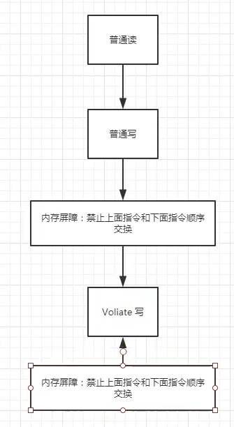

_Above image show the concept of memory barrier_


#### Example 1:


#### Example 2:

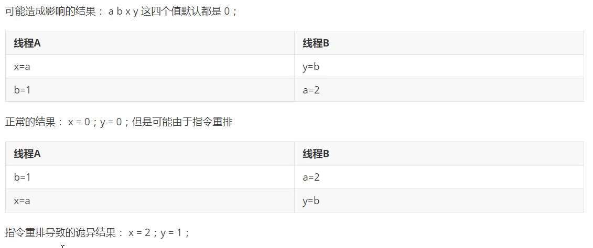


## Singleton

volatile is always found in:

- DCLSingleton (DoubleCheck Lock / Lazy Singleton)

  - new a Object involve 3 stages. volatile used to prevent reorder of operation which avoid the possibility that another thread read an incorrect value by reading an uninitialized fields.

  - > 主要问题在于 single = new LazySingle(); 这句，这并非一个原子操作，这段代码其实是分为三步执行：
    >
    >  为 LazySingle 分配内存空间，对内存清零
    >  执行 LazySingle 的构造函数，初始化对象
    >  将 single 指向分配的内存地址（执行完这步 single就为非 null 了）
    >
    > 看起来并没有问题，想想，在多线程下也没有问题，但这里有个坑，那就是指令重排序的问题。
    >
    > 由于CPU运行速度远比内存快，所以为了优化Java运行速度，在没有数据依赖性的前提下，编译器可能对指令重排序，先执行CPU自己就可以执行的指令。这种优化对单线程没有影响，对多线程可能产生影响。
    >
    > 也就是说这三步发生的前后顺序不能保证，不符合先行发生原则。执行顺序有可能变成 1>3>2。
    >
    > 例如，线程 T1 执行了 1 和 3，此时线程 T2 调用 getInstance() 后发现 single 不为空，因此返回 single，但此时 single 还未被初始化。（因为 Lazysingle 的构造函数还未执行）
    >
    > 解决方法就是将 single 变量声明成 volatile ，让其符合JMM中先行发生原则的 volatile 变量规则。
    > ————————————————
    > 版权声明：本文为CSDN博主「OOC_ZC」的原创文章，遵循CC 4.0 BY-SA版权协议，转载请附上原文出处链接及本声明。
    > 原文链接：https://blog.csdn.net/OOC_ZC/article/details/78477565 


### Methods of Singleton:

```
public class Demo {
    public static void main(String[] args) throws Exception {
        for (int j = 0; j < 20; j++) {
            new Thread(() -> HungrySingleton.getInstance(), "Thread " + j).start();
        }
        for (int j = 0; j < 20; j++) {
            new Thread(() -> LazySingleton.getInstance(), "Thread " + j).start();
        }
        for (int j = 0; j < 20; j++) {
            new Thread(() -> InnerClassSingleton.getInstance(), "Thread " + j).start();
        }
        for (int j = 0; j < 20; j++) {
            new Thread(() -> EnumSingleton.getInstance(), "Thread " + j).start();
        }
    }
}

class HungrySingleton {
    private static final HungrySingleton single = new HungrySingleton();

    private HungrySingleton() {
        System.out.println(Thread.currentThread().getName() + " created hungrySingleton");
    }

    public static HungrySingleton getInstance() {
        return single;
    }
}

class LazySingleton {
    private static volatile LazySingleton lazySingleton;

    private LazySingleton() {
        System.out.println(Thread.currentThread().getName() + " created lazySingleton");
    }

    public static LazySingleton getInstance() {
        if (lazySingleton == null) {
            synchronized (LazySingleton.class) {
                if (lazySingleton == null) {
                    lazySingleton = new LazySingleton();
                }
            }
        }
        return lazySingleton;
    }
}

class InnerClassSingleton {
    private InnerClassSingleton(){
        System.out.println(Thread.currentThread().getName() + " created innerClassSingleton");
    }

    public static InnerClassSingleton getInstance() {
        return InnerClass.singleton;
    }

    private static class InnerClass {
        private static final InnerClassSingleton singleton = new InnerClassSingleton();
    }
}

enum EnumSingleton {
    INSTANCE;

    EnumSingleton() {
        System.out.println(Thread.currentThread().getName() + " created enumSingleton");
    }

    public static EnumSingleton getInstance() {
        return INSTANCE;
    }
}

```

result:

>Thread 10 created hungrySingleton
>Thread 0 created lazySingleton
>Thread 19 created innerClassSingleton
>Thread 3 created enumSingleton


**Tips**

Only enumeration method can avoid reflection cheat.

> **throw new IllegalArgumentException("Cannot reflectively create enum objects");**

> ```java
> @CallerSensitive
> public T newInstance(Object ... initargs)
>  throws InstantiationException, IllegalAccessException,
>         IllegalArgumentException, InvocationTargetException
> {
>  if (!override) {
>      if (!Reflection.quickCheckMemberAccess(clazz, modifiers)) {
>          Class<?> caller = Reflection.getCallerClass();
>          checkAccess(caller, clazz, null, modifiers);
>      }
>  }
>  if ((clazz.getModifiers() & Modifier.ENUM) != 0)
>      throw new IllegalArgumentException("Cannot reflectively create enum objects");
>  ConstructorAccessor ca = constructorAccessor;   // read volatile
>  if (ca == null) {
>      ca = acquireConstructorAccessor();
>  }
>  @SuppressWarnings("unchecked")
>  T inst = (T) ca.newInstance(initargs);
>  return inst;
> }
> ```


## CAS (Compare-and-swap)

Java use Unsafe Class to use native methods (C++) to do with memory. There is spin-lock found in AtomicInteger.getAndIncrement(), and CAS found inside this lock ==> spin until the latest value taken from memory matched my 'expect' ==> 'update' the value into memory, otherwise keep spinning.

*_much faster than a synchronized block_. 

```java
//In Unsafe Class
public final native boolean compareAndSwapObject(Object this, long offset, Object expect, Object update);
```

Explanation: if this item current value is 'expect', then update this value to 'update'


**<ins>CAS Weakness </ins>**

- Spin lock consume time    

- Atomic for only one field 

- face ABA problem    

> **ABA Problem**
>
> a data initial 2000
>
> A changed it to be 2200, and changed it back to 2000
>
> B wants it to be 6666.
>
> ==================
>
> A and B start together, but B stucked and A finished, then B only finish. Although the result is 6666, but B has never noticed the problem that which data A has been modified in between B's operation.
>
> We shall use *optimistic lock* to solve this.


### Case Study : Optimistic Lock to Solve ABA Problem

**Integer is built before used in parameter as the Object is being new >= 128 -----> which cause failed in comparing 'expect' and what took from memory**

```java
public static void main(String[] args) throws Exception {

        Integer initial = 2000;
        AtomicStampedReference<Integer> integer = new AtomicStampedReference<>(initial, 1);
        System.out.println(Thread.currentThread().getName() + " - initialStamp " + integer.getStamp() 
                           + " - reference: " + integer.getReference());

        new Thread(() -> {
            int stamp = integer.getStamp();
            try {
                TimeUnit.SECONDS.sleep(1);
            } catch (InterruptedException e) {
                throw new RuntimeException(e);
            }

            Integer trouble = 3333;
            System.out.println(Thread.currentThread().getName() +  " operation: " 
                               + integer.compareAndSet(initial, trouble, integer.getStamp(), integer.getStamp() + 1));
            System.out.println(Thread.currentThread().getName() + " - currentstamp " 
                               +  integer.getStamp() + " - reference: " + integer.getReference());
            System.out.println(Thread.currentThread().getName() +  " operation: " 
                               + integer.compareAndSet(trouble, initial, integer.getStamp(), integer.getStamp() + 1));
            System.out.println(Thread.currentThread().getName() + " - currentstamp " 
                               +  integer.getStamp() + " - reference: " + integer.getReference());

        }, "T1").start();
        new Thread(() -> {
            int stamp = integer.getStamp();
            try {
                TimeUnit.SECONDS.sleep(3);
            } catch (InterruptedException e) {
                throw new RuntimeException(e);
            }
            Integer update = 6666;
            System.out.println(Thread.currentThread().getName() +  " operation: " 
                               + integer.compareAndSet(initial, update, stamp, stamp++));
            System.out.println(Thread.currentThread().getName() + " - currentstamp " 
                               + integer.getStamp() + " - reference: " + integer.getReference());
        }, "T2").start();
    }
```

Result:

>main - initialStamp 1 - reference: 2000
>T1 operation: true
>T1 - currentstamp 2 - reference: 3333
>T1 operation: true
>T1 - currentstamp 3 - reference: 2000
>T2 operation: false
>T2 - currentstamp 3 - reference: 2000


## Types of Lock

### Fair and Unfair Lock

- Fair - cannot cut queue
- Unfair - can cut queue (default in ReendrantLock)


### Reentrant mutex / recursive mutex

- eg owner of outer lock and access inner door


### Spin lock

- spin until able to compareAndSet

```java
public class Demo {

    public static void main(String[] args) throws Exception {

        MyLock myLock = new MyLock();

        new Thread(() -> {
            myLock.lock();
            try {
                TimeUnit.SECONDS.sleep(3);
            } catch (InterruptedException e) {
                throw new RuntimeException(e);
            }
            myLock.unlock();
        },"T1").start();

        new Thread(() -> {
            myLock.lock();
            myLock.unlock();
        },"T2").start();
        
    }
}


class MyLock {
    private AtomicReference<Thread> atomicReference = new AtomicReference<>();

    public void lock() {
        Thread thread = Thread.currentThread();
        System.out.println(thread.getName() + " ===> lock" );
        while(!atomicReference.compareAndSet(null, thread)) {
        }
    }

    public void unlock() {
        Thread thread = Thread.currentThread();
        System.out.println(thread.getName() + " ===> unlock" );
        atomicReference.compareAndSet(thread, null);
    }
}
```

Result:

>Thread[T1,5,main] ===> lock
>Thread[T2,5,main] ===> lock
>Thread[T1,5,main] ===> unlock
>Thread[T2,5,main] ===> unlock


### DeadLock

```java
public class DemoDeadLock {

    public static void main(String[] args) throws Exception {
        String strA = "a";
        String strB = "b";
        new Thread(new MyDeadThread(strA, strB), "T1").start();
        new Thread(new MyDeadThread(strB, strA), "T2").start();
    }

}

class MyDeadThread implements Runnable {

    private String lockA = "lockA";
    private String lockB = "lockB";

    public MyDeadThread(String lockA, String lockB) {
        this.lockA = lockA;
        this.lockB = lockB;
    }

    @Override
    public void run() {
        synchronized (lockA) {
            System.out.println(Thread.currentThread().getName() + " entered " + lockA);
            try {
                Thread.sleep(3000);
            } catch (InterruptedException e) {
                throw new RuntimeException(e);
            }
            synchronized (lockB) {
                System.out.println(Thread.currentThread().getName() + " exited " + lockB);
            }
        }
    }
}
```

Result:

>T2 entered b
>T1 entered a


How to find where is the problem? 

By jps (Java Virtual Machine Process Status Tool)

1. `jps -l` to track the process

   ```java
   PS E:\IdeaProjects\juc> jps -l
   10680 sun.tools.jps.Jps
   10984 
   9144 org.jetbrains.jps.cmdline.Launcher
   13372 com.jpu.DemoDeadLock
   20364 org.jetbrains.idea.maven.server.RemoteMavenServer36
   ```

2. `jstack` to look into detail

   ```java
   PS E:\IdeaProjects\juc> jstack 13372
   2022-06-24 16:30:15
   Full thread dump Java HotSpot(TM) 64-Bit Server VM (25.331-b09 mixed mode):
   .
   .
   .
   "T2":
           at com.jpu.MyDeadThread.run(MyDeadThread.java:24)
           - waiting to lock <0x000000076b01b850> (a java.lang.String)
           - locked <0x000000076b01b880> (a java.lang.String)
           at java.lang.Thread.run(Thread.java:750)
   "T1":
           at com.jpu.MyDeadThread.run(MyDeadThread.java:24)
           - waiting to lock <0x000000076b01b880> (a java.lang.String)
           - locked <0x000000076b01b850> (a java.lang.String)
           at java.lang.Thread.run(Thread.java:750)
   
   Found 1 deadlock.
   
   ```


**Tips**

Interview: how you look out for the problem?

1. look into logs
2. look into stack (jstack)
