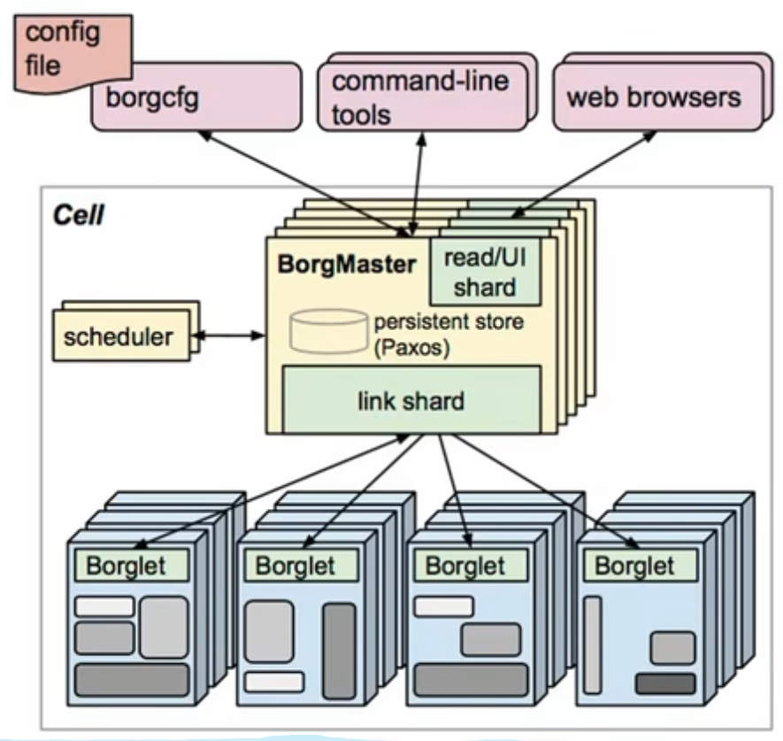
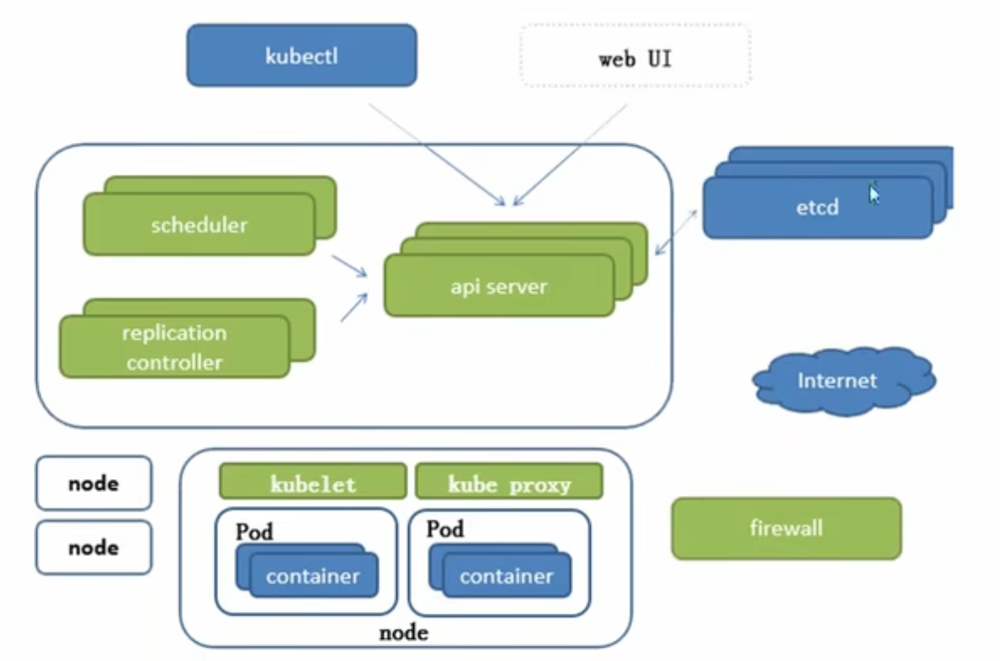
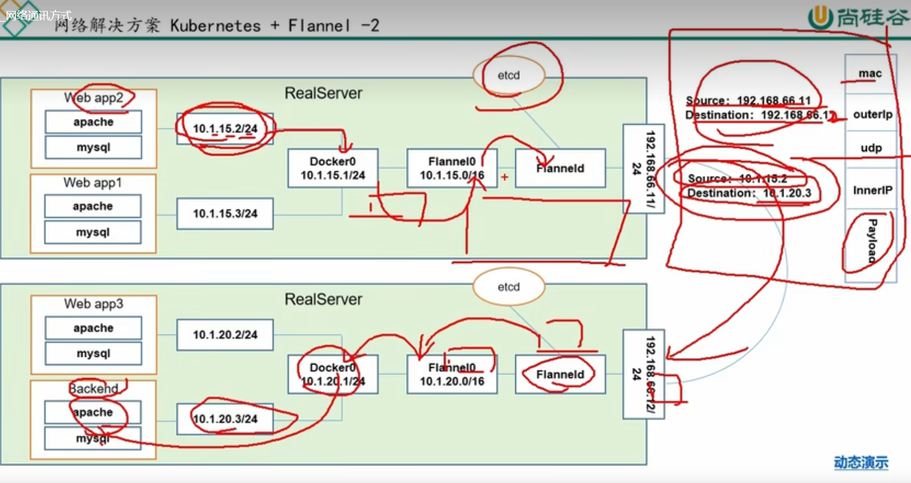
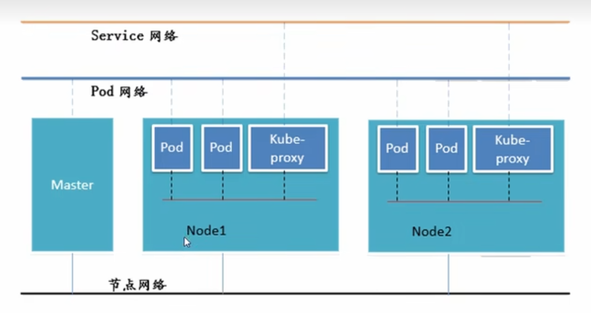
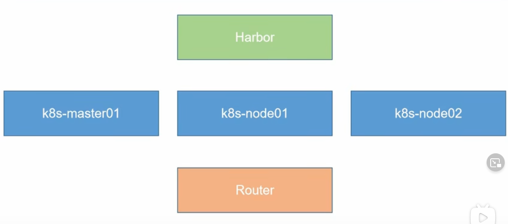
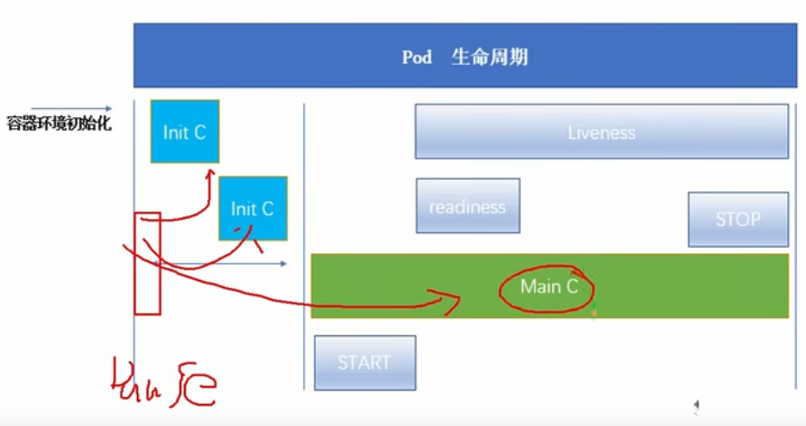
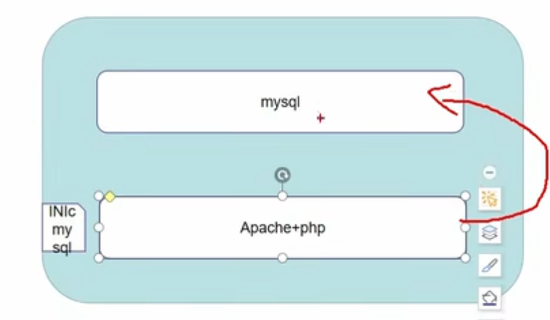

# Kubernetes

**2019的视频**

> **特点**

- 轻量级 -- 消耗资源少
- 开源
- 弹性伸缩
- 模块之间的负载均衡：IPVS


> **Borg 结构**



- Borgle对Paxos(Key-Value的存储空间)监听有没有自己的请求
- Scheduler会把数据写入Paxos


> **K8S 结构**



- Node是工人
- Scheduler会把请求写入ApiServer，选择合适的节点进行分配任务，ApiServer再写入到ETCD
- Replication Controller控制副本的期望值，假如不满足期望值会想办法创建对应pod
- Api Server是一切服务的访问的入口
- ETCD是一个分布式的key value存储服务（持久化），是天生支持集群的。为整个分布式集群存储一些关键数据，协助分布式集群的正常运转
  - v3 -> 存入Database
  - v2 -> 存入Memory，已在k8s v1.11中弃用
- Kubelet跟Container Runtime Interface (Docker)进行交互，操作Docker 去创建对应的容器（生命周期管理）
- Kubeproxy负责负载均衡, 操作防火墙进行Pod的映射，新版本还支持IPVS组件
- CoreDNS可以为集群中的SVC创建一个域名IP的对应关系解析
- DASHBOARD给K8s集群提供一个B/S结构的访问体系
- INGRESS Controller： 官方只能实现4层代理，INGRESS可以实现7层代理
- FEDETATION：提供一个可以跨集群中心多k8s统一管理功能
- Prometheus提供一个k8s集群的监控能力
- ELK：提供k8s集群日志统一分析介入平台


## Command


`kubectl get ns` get namespace

`kubectl apply -f xx.yaml` 运行

`kubectl describe pod <name>`查看你的pod

`kubectl get pod` list pods

`kubectl get pod -w`  list pods and watch

`kubectl get pod --show-labels`  list pods and show labels

`kubectl get pods[or services] -l <tagName>=<tagValue>` get pod or services that has label

`kubectl label pod <podname> tier=?` modify label of pod

`kubectl label pod <podname> tier=? overwrite=true` modify label of pod if tier is exist

`kubectl get svc` list service

`kubectl get pod -o wide` 详细信息包括IP，可用curl x.x.x.x访问了

`kubectl get pod name -o yaml` 输出格式为yaml

`kubectl get pod -o name` show name only

`kubectl get node --show-labels`

`kubectl get hpa`

`kubectl delete -f <xx.yaml>` Delete following yaml

`kubectl delete pod <podname>` 删除pod

`kubectl delete deployment --all` 删除全部deployment，默认default命名空间

`kubectl delete service -l <labelName>=<labelValue>` delete service with specified label

`kubectl replace --force -f xxx.yaml` delete your old Kubernetes deployment then deploy your updated deployment 

`kubectl wait --for-condition=ready pod -l <labelname>=<labelValue>` wait until ready in terminal

`kubectl set image deployments/<name> <name>=<image>:<tag>` change image

 `kubectl rollout status` 命令查看 Deployment 是否完成

`kubectl rollout undo deployments/<name>` undo

`kubectl log <podname> -c <container name>` 查看log，如果只有一个容器的话就不用-c

`kubectl exec <podname> -c <container name> -it -- /bin/sh` 进入容器，如果只有一个容器就不用-c 

`kubectl exec <podname> -c <container name> -it -- rm -rf /usr/share/nginx/html/index.html`

`kubectl exec <podname> -- env` exec commands directly, it lists environment variables`

`kubectl exec -ti <podname> -- bash` exec commands directly, it starts bash session

`exit` to quit bash session

`kubectl expose deploymen/<podname> --type="NodePort" --port 8080` create a new service and expose it to external traffic

`kubectl expose deployment hello-world --type=LoadBalancer --name=my-service` 创建公开 Deployment 的 Service 对象

`kubectl describe services/<podname>` to get NodePort

`curl minikube:${NodePort}`

`kubectl create configmap <configName> --from-literal <key>=<value>` This command deploys a ConfigMap named `configName` to your cluster. It has a key called `key` with a value of `value`. The `--from-literal` flag allows you to specify individual key-value pairs to store in this ConfigMap. Other available options, such as `--from-file` and `--from-env-file`, provide more versatility as to how to configure.

```yaml
containers:
      - name: system-container
        image: system:1.0-SNAPSHOT
        ports:
        - containerPort: 9080
        # Set the APP_NAME environment variable
        env:
        - name: APP_NAME
          valueFrom:
            configMapKeyRef:  # ConfigMap
              name: sys-app-name #ConfigMap Name
              key: name #key to get value
```


`kubectl create secret generic <name> --from-literal <key>=<value> --from-literal password=absdf`  It means that you’re creating a secret that is `generic`, which means it is not a specialized type of secret. There are different types of secrets, such as secrets to store Docker credentials and secrets to store public/private key pairs.

```yaml
containers:
      - name: inventory-container
        image: inventory:1.0-SNAPSHOT
        ports:
        - containerPort: 9080
        env:
        - name: SYSTEM_APP_USERNAME # Set the SYSTEM_APP_USERNAME and SYSTEM_APP_PASSWORD environment variables
          valueFrom:
            secretKeyRef: #secret
              name: sys-app-credentials # secret name
              key: username # key
        - name: SYSTEM_APP_PASSWORD
          valueFrom:
            secretKeyRef:
              name: sys-app-credentials
              key: password
```


## 控制器

> Kubernetes 中内建了很多 controller（控制器），这些相当于一个状态机，用来控制 Pod 的具体状态和行为。


### ReplicationController 和 ReplicaSet

> `kubectl get rs`
>
> - *DESIRED* displays the desired number of replicas of the application, which you define when you create the Deployment. This is the desired state.
> - *CURRENT* displays how many replicas are currently running.
>
> **Tips:** Notice that the name of the ReplicaSet is always formatted as `[DEPLOYMENT-NAME]-[RANDOM-STRING]`. The random string is randomly generated and uses the pod-template-hash as a seed.

> `kubectl create`

- Replication Controller，按照期望值来销毁或创建pods
- Replication Set，k8s recommend using this instead of RC，和RC一样，RS支持集合式的selector（每个pod有tag，RS可按照他们来指定要干嘛干嘛而RC不行）

```yaml
apiVersion: extensions/v1beta1
kind: ReplicaSet
metadata:
  name: frontend
  # these labels can be applied automatically
  # from the labels in the pod template if not set
  # labels:
    # app: guestbook
    # tier: frontend
spec:
  # this replicas value is default
  # modify it according to your case
  replicas: 3
  # selector can be applied automatically
  # from the labels in the pod template if not set,
  # but we are specifying the selector here to
  # demonstrate its usage.
  selector:
    matchLabels:
      tier: frontend
    matchExpressions:
      - {key: tier, operator: In, values: [frontend]}
  template:
    metadata:
      labels:
        app: guestbook
        tier: frontend
    spec:
      containers:
      - name: php-redis
        image: gcr.io/google_samples/gb-frontend:v3
        resources:
          requests:
            cpu: 100m
            memory: 100Mi
        env:
        - name: GET_HOSTS_FROM
          value: dns
          # If your cluster config does not include a dns service, then to
          # instead access environment variables to find service host
          # info, comment out the 'value: dns' line above, and uncomment the
          # line below.
          # value: env
        ports:
        - containerPort: 80
```

[Watch me for demo](https://www.bilibili.com/video/BV1w4411y7Go?p=26&spm_id_from=pageDriver&vd_source=a788bdd4d7cdd9dfe02852346d523cb9)


#### 命令

`kubectl create -f rs.yaml`

`kubectl get rs`


### Deployment

> **Tips:** 
>
> 命令式编程：命令“机器”如何去做事情(how)，这样不管你想要的是什么(what)，它都会按照你的命令实现。 `kubectl create`
>
> 声明式编程：告诉“机器”你想要的是什么(what)，让机器想出如何去做(how) `kubectl apply`
>
> **Tips:**
>
> 当`kubectl get deployments`时
>
> - *NAME* lists the names of the Deployments in the cluster.
> - *READY* shows the ratio of CURRENT/DESIRED replicas
> - *UP-TO-DATE* displays the number of replicas that have been updated to achieve the desired state.
> - *AVAILABLE* displays how many replicas of the application are available to your users.
> - *AGE* displays the amount of time that the application has been running.

Deployment 为 Pod 和 ReplicaSet 提供了一个声明式定义（declarative）方法，用来替代以前的 ReplicationController 来方便的管理应用。典型的应用场景包括：

- 定义 Deployment 来创建 Pod 和 ReplicaSet
- 滚动升级和回滚应用
- 扩容和缩容
- 暂停和继续 Deployment

Deployment，虽然RS可以独立使用，但一般还是建议用Deployment来自动管理RS，那么就不用担心跟其他机制的不兼容eg.RS不支持rolling-updates但Deployment支持

- Rollingupdate的意思： 当两个pods为v1版本但我们要更新成v2，那么可以先创建一个pod再删除，再创建一个pod再删除
- 
- [Watch me](https://www.bilibili.com/video/BV1w4411y7Go/?p=7&spm_id_from=pageDriver&vd_source=a788bdd4d7cdd9dfe02852346d523cb9) and [me too](https://www.bilibili.com/video/BV1w4411y7Go?p=24&spm_id_from=pageDriver&vd_source=a788bdd4d7cdd9dfe02852346d523cb9)

```yaml
apiVersion: extensions/v1beta1
kind: Deployment
metadata:
  name: nginx-deployment
spec:
  replicas: 3
  template:
    metadata:
      labels:
        app: nginx
    spec:
      containers:
      - name: nginx
        image: nginx:1.7.9
        ports:
        - containerPort: 80
```

[Watch me for demo](https://www.bilibili.com/video/BV1w4411y7Go?p=26&spm_id_from=pageDriver&vd_source=a788bdd4d7cdd9dfe02852346d523cb9) and [me](https://www.bilibili.com/video/BV1w4411y7Go?p=27&spm_id_from=pageDriver&vd_source=a788bdd4d7cdd9dfe02852346d523cb9)


#### 更新

Deployment 可确保在更新时仅关闭一定数量的 Pod。默认情况下，它确保至少所需 Pod 的 75% 处于运行状态（最大不可用比例为 25%）。

Deployment 还确保仅所创建 Pod 数量只可能比期望 Pod 数高一点点。 默认情况下，它可确保启动的 Pod 个数比期望个数最多多出 125%（最大峰值 25%）。


#### 翻转

当 Deployment 正在上线时被更新，Deployment 会针对更新创建一个新的 ReplicaSet 并开始对其扩容，之前正在被扩容的 ReplicaSet 会被翻转，添加到旧 ReplicaSets 列表 并开始缩容。

例如，假定你在创建一个 Deployment 以生成 `nginx:1.14.2` 的 5 个副本，但接下来 更新 Deployment 以创建 5 个 `nginx:1.16.1` 的副本，而此时只有 3 个 `nginx:1.14.2` 副本已创建。在这种情况下，Deployment 会立即开始杀死 3 个 `nginx:1.14.2` Pod， 并开始创建 `nginx:1.16.1` Pod。它不会等待 `nginx:1.14.2` 的 5 个副本都创建完成后才开始执行变更动作。


#### 回退

`kubectl rollout undo deployment/<metadata.name（deploymentName）>` 回滚

`kubectl rollout undo deployment/<metadata.name（deploymentName）--to-revision=2>` 指定某个历史版本

您可以用 `kubectl rollout status` 命令查看 Deployment 是否完成。如果 rollout 成功完成，`kubectl rollout status` 将返回一个 0 值的 Exit Code。

```bash
$ kubectl rollout status deploy/nginx
Waiting for rollout to finish: 2 of 3 updated replicas are available...
deployment "nginx" successfully rolled out
$ echo $?
0
```


#### 清理policy

你可以在 Deployment 中设置 `.spec.revisionHistoryLimit` 字段以指定保留此 Deployment 的多少个旧有 ReplicaSet。其余的 ReplicaSet 将在后台被垃圾回收。 默认情况下，此值为 10。

**注意：**显式将此字段设置为 0 将导致 Deployment 的所有历史记录被清空，因此 Deployment 将无法回滚。


#### 命令

`kubectl apply -f deployment.yaml --record`

--record 参数可以记录命令，我们可以很方便的查看每次revision的变化

`kubectl get deployment`

`kubectl scale deployment <deploymentName> --replicas 10` 扩容

`kubectl autoscale deployment <deploymentName> --min=10 --max=15 --cpu-percent=80` (如果集群支持horizontal pod autoscaling)

`kubectl set image deployment/<dmetadata.name（deploymentName）> <container.name>=<container.image>` 更新镜像也比较容易

`kubectl rollout undo deployment/<metadata.name（deploymentName）>` 回滚

`kubectl rollout undo deployment/<metadata.name（deploymentName）--to-revision=2>` 指定某个历史版本

`kubectl rollout status deployment/<metadata.name（deploymentName）>` 查看回滚状态

`kubectl rollout history deployment/<metadata.name（deploymentName）>` 查看历史

`kubectl rollout pause deployment/<metadata.name（deploymentName）>` 暂停更新


### DaemonSet

**DaemonSet** 确保全部（或者一些）Node 上运行一个 Pod 的副本。当有 Node 加入集群时，也会为他们新增一个 Pod 。当有 Node 从集群移除时，这些 Pod 也会被回收。删除 DaemonSet 将会删除它创建的所有 Pod。

使用 DaemonSet 的一些典型用法：

- 运行集群存储 daemon，例如在每个 Node 上运行 `glusterd`、`ceph`。
- 在每个 Node 上运行日志收集 daemon，例如`fluentd`、`logstash`。
- 在每个 Node 上运行监控 daemon，例如 [Prometheus Node Exporter](https://github.com/prometheus/node_exporter)、`collectd`、Datadog 代理、New Relic 代理，或 Ganglia `gmond`。

```yaml
apiVersion: apps/v1
kind: DaemonSet
metadata:
  name: fluentd-elasticsearch
  namespace: kube-system
  labels:
    k8s-app: fluentd-logging
spec:
  selector:
    matchLabels:
      name: fluentd-elasticsearch
  template:
    metadata:
      labels:
        name: fluentd-elasticsearch
    spec:
      tolerations:
      # 这些容忍度设置是为了让该守护进程集在控制平面节点上运行
      # 如果你不希望自己的控制平面节点运行 Pod，可以删除它们
      - key: node-role.kubernetes.io/control-plane
        operator: Exists
        effect: NoSchedule
      - key: node-role.kubernetes.io/master
        operator: Exists
        effect: NoSchedule
      containers:
      - name: fluentd-elasticsearch
        image: quay.io/fluentd_elasticsearch/fluentd:v2.5.2
        resources:
          limits:
            memory: 200Mi
          requests:
            cpu: 100m
            memory: 200Mi
        volumeMounts:
        - name: varlog
          mountPath: /var/log
      terminationGracePeriodSeconds: 30
      volumes:
      - name: varlog
        hostPath:
          path: /var/log
```

[watch me](https://www.bilibili.com/video/BV1w4411y7Go?p=28&vd_source=a788bdd4d7cdd9dfe02852346d523cb9)


### Job

- Job 负责[批处理](https://so.csdn.net/so/search?q=批处理&spm=1001.2101.3001.7020)任务，即仅执行一次的任务，它保证批处理任务的一个或多个 Pod 成功结束

```yaml
apiVersion: batch/v1
kind: Job
metadata:
  name: pi
spec:
  template:
    spec:
      containers:
      - name: pi
        image: perl:5.34.0
        command: ["perl",  "-Mbignum=bpi", "-wle", "print bpi(2000)"]
      restartPolicy: Never
  backoffLimit: 4
```

`kubectl apply -f https://kubernetes.io/examples/controllers/job.yaml`


#### Job Spec

对于Job有一些特殊说明, 具体如下:

- spec.template格式同Pod
- RestartPolicy仅支持Never或OnFailure. 这个是重启策略, 也就是重来都不重启,或者失败重启. 只有这两个选项.
- 单个Pod时，默认Pod成功运行后Job即结束 
- .spec.completions 标志Job结束需要成功运行的Pod个数，默认为1
- .spec.parallelism 标志并行运行的Pod的个数，默认为1 并行运行的个数是1. 举个例子: job结束需要成功运行5个pod, 每次并行运行1个, 那么这5个pod就是一个运行结束了另一个在运行,一直到5个.而job结束的条件是要成功运行5个pod,才算结束.
- spec.activeDeadlineSeconds`标志失败Pod的重试最大时间，超过这个时间不会继续重试


### CronJob

Cron Job 管理基于时间的 Job，即：

- 在给定时间点只运行一次
- 周期性地在给定时间点运行
- 前提条件
  - 当前使用的 Kubernetes 集群，版本 >= 1.8（对 CronJob）。对于先前版本的集群，版本 < 1.8，启动 API Server（参考 [为集群开启或关闭 API 版本](https://kubernetes.io/docs/admin/cluster-management/#turn-on-or-off-an-api-version-for-your-cluster) 获取更多信息）时，通过传递选项 `--runtime-config=batch/v2alpha1=true` 可以开启 batch/v2alpha1 API。

- 典型的用法如下所示：

  - 在给定的时间点调度 Job 运行

  - 创建周期性运行的 Job，例如：数据库备份、发送邮件。

```yaml
apiVersion: batch/v1
kind: CronJob
metadata:
  name: hello
spec:
  schedule: "* * * * *"
  jobTemplate:
    spec:
      template:
        spec:
          containers:
          - name: hello
            image: busybox:1.28
            imagePullPolicy: IfNotPresent
            command:
            - /bin/sh
            - -c
            - date; echo Hello from the Kubernetes cluster
          restartPolicy: OnFailure
```


#### Cron 时间表语法[ ](https://kubernetes.io/zh-cn/docs/concepts/workloads/controllers/cron-jobs/#cron-schedule-syntax)

```
# ┌───────────── 分钟 (0 - 59)
# │ ┌───────────── 小时 (0 - 23)
# │ │ ┌───────────── 月的某天 (1 - 31)
# │ │ │ ┌───────────── 月份 (1 - 12)
# │ │ │ │ ┌───────────── 周的某天 (0 - 6)（周日到周一；在某些系统上，7 也是星期日）
# │ │ │ │ │                          或者是 sun，mon，tue，web，thu，fri，sat
# │ │ │ │ │
# │ │ │ │ │
# * * * * *
```


#### CronJob Spec

- `.spec.schedule`：**调度**，必需字段，指定任务运行周期，格式同 [Cron](https://en.wikipedia.org/wiki/Cron)

- `.spec.jobTemplate`：**Job 模板**，必需字段，指定需要运行的任务，格式同 [Job](https://jimmysong.io/kubernetes-handbook/concepts/job.html)

- `.spec.startingDeadlineSeconds` ：**启动 Job 的期限（秒级别）**，该字段是可选的。如果因为任何原因而错过了被调度的时间，那么错过执行时间的 Job 将被认为是失败的。如果没有指定，则没有期限

- `.spec.concurrencyPolicy`：**并发策略**，该字段也是可选的。它指定了如何处理被 Cron Job 创建的 Job 的并发执行。只允许指定下面策略中的一种：

  - `Allow`（默认）：允许并发运行 Job
  - `Forbid`：禁止并发运行，如果前一个还没有完成，则直接跳过下一个
  - `Replace`：取消当前正在运行的 Job，用一个新的来替换

  注意，当前策略只能应用于同一个 Cron Job 创建的 Job。如果存在多个 Cron Job，它们创建的 Job 之间总是允许并发运行。

- `.spec.suspend` ：**挂起**，该字段也是可选的。如果设置为 `true`，后续所有执行都会被挂起。它对已经开始执行的 Job 不起作用。默认值为 `false`。

- `.spec.successfulJobsHistoryLimit` 和 `.spec.failedJobsHistoryLimit` ：**历史限制**，是可选的字段。它们指定了可以保留多少完成和失败的 Job。

  默认情况下，它们分别设置为 `3` 和 `1`。设置限制的值为 `0`，相关类型的 Job 完成后将不会被保留。

[Watch me](https://www.bilibili.com/video/BV1w4411y7Go?p=29&spm_id_from=pageDriver&vd_source=a788bdd4d7cdd9dfe02852346d523cb9)


#### Cron Job 限制

Cron Job 在每次调度运行时间内 *大概* 会创建一个 Job 对象。我们之所以说 *大概* ，是因为在特定的环境下可能会创建两个 Job，或者一个 Job 都没创建。我们尝试少发生这种情况，但却不能完全避免。因此，创建 Job 操作应该是 *幂等的*。

Job 根据它所创建的 Pod 的并行度，负责重试创建 Pod，并就决定这一组 Pod 的成功或失败。Cron Job 根本就不会去检查 Pod。


### StatefulSet

StatefulSet 作为 Controller 为 Pod 提供唯一的标识。它可以保证部署和 scale 的顺序。

必须创建一个无头服务(Headless Service)

StatefulSet是为了解决有状态服务的问题（对应Deployments和ReplicaSets是为无状态服务而设计），其应用场景包括：

- 稳定的**持久化存储**，**即Pod重新调度后还是能访问到相同的持久化数据**，基于PVC来实现
- 稳定的**网络标志**，**即Pod重新调度后其PodName和HostName不变**，基于Headless Service（即没有Cluster IP的Service）来实现
- 有序部署，有序扩展，即Pod是有顺序的，在部署或者扩展的时候要依据定义的顺序依次依次进行（即从0到N-1，在下一个Pod运行之前所有之前的Pod必须都是Running和Ready状态），基于init containers来实现 （例如Mysql一定要先前Apache处理，而Apache要在Nginx前处理)
- 有序收缩，有序删除（即从N-1到0）


### Horizontal Pod AutoScaling

Horizontal Pod Auto Scaling： 在v1可以设定CPU使用率，MaxPods，MinPods，当CPU太空闲就加pod(Max = max pods)。v1alpha可以对内存或自定义的metric扩缩


## 网络通讯模式

- 同一个Pod内的多个容器之间：lo（通过localhost回环地址） -- pause
- 各Pod之间的通讯：overlay Network （覆盖网络）
- Pod与 Service之间的通讯：各节点的 Iptables规则


>  **各Pod之间的网络解决方案，通过Flannel访问**

- Flannel是CoreOS团队针对 Kubernetes设计的一个网络规划服务，简单来说，它的功能是让集群中的不同节点主机创建的 Docker容器都具有全集群唯一的虚拟IP地址。而且它还能在这些IP地址之间建立一个覆盖网络（overlay Network），通过这个覆盖网络，将数据包原封不动地传递到目标容器内

- ETCD在这里的作用：为Flannel提供说明
  - 存储管理 Flannel可分配的IP地址段资源
  - 监控ETCD中每个Pod的实际地址，并在内存中建立维护Pod节点路由表



**Tips:** 在Flannel数据会被封装多一次


> **K8S里的三层网络**



**Tips:** 真实的物理网络只有一个：节点网络；Pod和Service网络都是虚拟网络


### Summary:

>  **同一个Pod内部通讯**

- 同一个Pod共享同一个网络命名空间，共享同一个 Linux协议栈 (pause)

  

>  **pod1和pod2通讯–在同一台机器：**

- Pod1与Pod2不在同一台主机，Pod的地址是与 docker0在同一个网段的，但doke0网段与宿主机网卡是两个完全不同的IP网段，并且不同Node之间的通信只能通过宿主机的物理网卡进行。将Pod的IP和所在Node的IP关联起来，通过这个关联让Pod可以互相访问

  

>  **pod1和pod2通讯–不在同一台机器**：

- Pod1与Pod2在同一台机器，由 Docker0网桥直接转发请求至Pod2，不需要经过 Flanne1


>  **Pod至 Service的网络**

-  目前基于性能考虑，全部为 iptables（现在版本都是通过LVS）维护和转发


> **Pod到外网**

- Pod向外网发送请求，查找路由表，转发数据包到宿主机的网卡，宿主网卡完成路由选择后， iptables执行 Masquerade，把源IP更改为宿主网卡的IP，然后向外网服务器发送请求


>  **外网访问Pod**

- 外网访问Pod通过Service


**Tips:** NAT?


## 集群安装

> **前期准备**




...

**Tips:** 为什么集群要奇数？因为偶数会出现不知道谁要当老大的情况


## Resource

> k8s中所有的内容都抽象为资源，资源实例化之后，叫做对象。


### **集群资源分类**

- 名称空间级别 - 只在本名称空间下生效；kube-system
  - 工作负载型资源： Pod、ReplicaSet、Deployment、StatefulSet、DaemonSet、Job\CronJob
  - 服务发现型以及负载均衡资源： Service、Ingress
  - 配置与存储资源：Volume、CSI（容器存储接口）
  - 特殊类型的存储卷：ConfigMap（当配置中心来使用的资源类型）、Secret（保存敏感数据）、DownWardAPI（把外部环境中的信息输出给容器
- 集群级别 - role，在定义时未指定名称空间
  - NameSpace、Node、Role、ClusterRole、RoleBinding、ClusterRoleBinding
- 元数据型 - 通过指标进行操作
  - HPA、PodTemplate、LimitRange


###  **Definition**

**必须存在的属性**

| 参数名                  | 字段类型 | 说明                                                         |
| ----------------------- | -------- | ------------------------------------------------------------ |
| version                 | String   | 这里指的是K8s API的版本，目前基本上是v1，可以用kubectl api-version命令查询 |
| kind                    | String   | 这里指的是yaml文件定义的资源类型和角色，比如：Pod (**必须大写P**) |
| metadata                | Object   | 元数据对象，固定值就写 metadata                              |
| metadata.name           | String   | 元数据对象的名字，这里由我们编写，比如命令Pod的名字          |
| metadata.namespace      | String   | 元数据对象的命名空间，由我们自身定义。没定义则是Default命名空间 |
| spec                    | Object   | 详细定义对象，固定值就写 Spec                                |
| spec.containers[]       | list     | 这里是Spec对象的容器列表定义，是个列表                       |
| spec.containers[].name  | String   | 这里定义容器的名字                                           |
| spec.containers[].image | String   | 这里定义要用到的镜像名称                                     |

**主要对象：** (不写也可以，但会保存默认值)

| 参数名                                               | 字段类型 | 说明                                                         |
| ---------------------------------------------------- | -------- | ------------------------------------------------------------ |
| spec.containers[].name                               | String   | 定义容器的名字，默认随机创建一个名                           |
| spec.containers[].imagePullRolicy                    | String   | 定义镜像拉取策略，有Always、Never、IfNotPresent三个选项； Always：每次都尝试重新拉取镜像，默认Always（从远程拉取，不使用本地） Never：仅使用本地镜像，没有的话就不用 **IfNotPresent**：如果本地有镜像就使用本地就像，如果没有就拉取在线镜像； |
| spec.containers[].command[]                          | List     | 指定容器启动命令，因为是数组可以指定多个，不指定则使用镜像打包时使用的启动命令。 |
| spec.containers[].args[]                             | List     | 指定容器启动命令参数，因为是数组可以指定多个。eg ls          |
| spec.containers[].workingDir                         | String   | 指定容器的工作目录。                                         |
| spec.containers[].volumeMounts[]                     | List     | 指定容器内部的存储卷配置                                     |
| spec.containers[].volumeMounts[].name                | String   | 指定可以被容器挂载的存储卷的名称                             |
| spec.containers[].volumeMounts[].mountPath           | String   | 指定可以被容器挂载的存储卷的路径                             |
| spec.containers[].volumeMounts[].readOnly            | String   | 设置存储卷路径的读写模式，true或者false，默认为读写模式      |
| spec.containers[].ports[]                            | List     | 指定容器需要用到的端口列表                                   |
| spec.containers[].ports[].name                       | String   | 指定端口名称                                                 |
| spec.containers[].containerPort                      | String   | 指定容器需要监听的端口号                                     |
| spec.containers[].ports[].hostPort                   | String   | 指定容器所在主机需要监听的端口号，默认跟上面containerPort相同；注意设置了hostPort同一台主机无法启动该容器的相同副本（因为主机的端口号不能相同，这样会冲突） |
| spec.containers[].ports[].protocol                   | String   | 指定端口协议，支持TCP和UDP，默认为TCP                        |
| spec.containers[].env[]                              | List     | 指定容器运行前需设置的环境变量列表                           |
| spec.containers[].readinessProbe / livenessProbe     | Object   | 就绪检测 / 生存检测                                          |
| spec.containers[].readinessProbe.httpGet             | Object   | httpGet方法                                                  |
| spec.containers[].readinessProbe.httpGet.path        | String   |                                                              |
| spec.containers[].readinessProbe.httpGet.port        | str/no   | (如果填http的话就是80)                                       |
| spec.containers[].readinessProbe.exec                |          |                                                              |
| spec.containers[].readinessProbe.exec.command        | array    |                                                              |
| spec.containers[].readinessProbe.tcpSocket           |          |                                                              |
| spec.containers[].readinessProbe.tcpSocket.port      |          |                                                              |
| spec.containers[].readinessProbe.initialDelaySeconds | number   | 启动后几秒才检测                                             |
| spec.containers[].readinessProbe.periodSeconds       | number   | 重试检测时间                                                 |
| spec.containers[].readinessProbe.failureThreshold    | number   | Number of requests that should be failed in order to treat container unhealth |
| spec.containers[].readinessProbe.timeoutSeconds      | number   | 最大超时时间                                                 |
| spec.containers[].lifecycle                          | Object   |                                                              |
| spec.containers[].lifecycle.postStart \| preStop     | Object   |                                                              |
| spec.containers[].lifecycle.postStart.exec           | Object   |                                                              |
| spec.containers[].lifecycle.postStart.exec.command   | array    |                                                              |

**额外的参数项**

| 参数名                | 字段类型 | 说明                                                         |
| --------------------- | -------- | ------------------------------------------------------------ |
| spec.restartPolicy    | String   | **定义Pod的重启策略**，可选值为Always、OnFailure，默认值为Always； 1.**Always**：pod一旦终止运行，则无论容器是如何终止的，kubelet服务都将重启它。(但如果太多次失败还是会不再重启的) 2.**OnFailure**：只有pod以非零退出码终止时，kubelet才会重启该容器；如果容器正常退出(退出码为0)，则kubelet将不会重启它； 3.**Never**：pod终止后，kubelet将退出码报告给master，不会重启pod。 |
| spec.nodeSelector     | Object   | 定义Node的Label过滤标签，以key: value格式指定                |
| spec.imagePullSecrets | Object   | 定义pull镜像时使用sercet名称，以name: secretkey格式指定      |
| spec.hostNetwork      | Boolean  | 定义是否使用主机网络模式，默认值false；设置true表示使用宿主机网络，不使用docker网桥，同时设置了true将无法再同一台宿主机上启动第二个副本。 |

**Tips:** `kubectl explain pod.spec` to know more

**Tips:** port 80 会找 /usr/share/nginx/html/index.html 


### **Lifecycle**

> Client -> API Server - (ETCD) -> kubelet -> CRI -> Pause -> init.. -> start -(main)-(readiness)-(liveness)-> STOP



>  **Init**容器

Pod能够具有多个容器，应用运行在容器里面，但是它也可能有一个或多个先于应用容器启动的Init容器

Init容器与普通的容器非常像，除了如下两点：

- Init容器总是运行到成功完成为止

- 每个Init容器都必须在下一个Init容器启动之前成功完成

如果Pod的Init容器失败，Kubernetes会不断地重启该Pod，直到Init容器成功为止。然而，如果Pod对应的restartPolicy为Never，它不会重新启动

因为Init容器具有与应用程序容器分离的单独镜像，所以它们的启动相关代码具有如下优势：

- 它们可以包含并运行实用工具，但是出于安全考虑，是不建议在应用程序容器镜像中包含这些实用工具的

- 应用程序镜像可以分离出创建和部署的角色，而没有必要联合它们构建一个单独的镜像

- Init容器使用Linux Namespace，所以相对应用程序容器来说具有不同的文件系统视图。因此，它们能够具有访问Secret的权限，而应用程序容器则不能

- 它们必须在应用程序容器启动之前运行完成，而应用程序容器是并行运行的，所以Init容器能够提供了一种简单的阻塞或延迟应用容器的启动的方法，直到满足了一组先决条件

  - 例子： Apache 要mysql后才启动，所以可以在apache的initc来等mysql ok后才启动apache。不过没人会这样做，应该用readinessprobe来完成这项任务。把init 用在初始化一些环境即可

  

特殊说明：

- 在Pod启动过程中，Init容器会按顺序在**网络和数据卷初始化之后启动 (pause之后）**。每个容器必须在下一个容器启动之前成功退出

- 如果由于运行时或失败退出，将导致容器启动失败，它会根据Pod的restartPolicy指定的策略进行重试。然而，如果Pod的restartPolicy设置为Always，Init容器失败会使用RestartPolicy策略

- 在所有的Init容器没有成功之前，Pod将不会变成Ready状态。Init容器的端口将不会在Service中进行聚集。正在初始化中的Pod处于Pending状态，但应该会将Initializing状态设置为true

- 如果Pod重启，所有Init容器必须重新执行

- 对Init容器spec的修改被限制在容器image字段，修改其他字段都不会生效。更改Init容器的image字段，等价于重启该Pod

- Init容器具有应用容器的所有字段。除了readinessProbe，因为Init容器无法定义不同于完成（completion）的就绪（readiness）之外的其他状态。这会在验证过程中强制执行

- 在Pod中的每个app和Init容器的名称必须唯一；与任何其他容器共享同一个名称，会在验证时抛出错误（但port可以，因为该容器完成了就会退出了)


> **探针 Probe**

- 探针是**由kubelet对容器执行（每个node所在的kubelet发起的）**的定期诊断。要执行诊断，kubelet调用由容器实现的Handler。有三种类型的处理程序：

  - ExecAction：在容器内执行指定命令。如果命令退出时返回码为0则认为诊断成功。

  - TCPSocketAction：对指定端口上的容器的IP地址进行TCP检查。如果端口打开，则诊断被认为是成功的。

  - HTTPGetAction：对指定的端口和路径上的容器的IP地址执行HTTP Get请求。如果响应的状态码大于等于200且小于400，则诊断被认为是成功的

- 每次探测都将获得以下三种结果之一：

  - 成功：容器通过了诊断

  - 失败：容器未通过诊断

  - 未知：诊断失败，因此不会采取任何行动


> **Readiness**: 就绪检测

可以根据命令，TCP连接，HTTP连接获取状态判断服务是不是可用了，如果可用才会READY。

指示容器是否准备好服务请求。如果就绪探测失败，端点控制器将从与Pod匹配的所有Service的端点中删除该Pod的IP地址。初始延迟之前的就绪状态默认为Failure。如果容器不提供就绪探针，则默认状态为Success。**不会重启**


> **Liveness**: 生存检测

指示容器是否正在运行。如果存活探测失败，则**kubelet会杀死容器**，并且容器将受到其重启策略的影响。如果容器不提供存活探针，则默认状态为Success


> **Init Example**

init template

```yaml
apiVersion: v1
kind: Pod
metadata:
  name: myapp-pod
  labels:
    app: myapp
spec:
  containers:
  - name: myapp-container
    image: busybox:1.34.1
    command: ['sh', '-c', 'echo The app is running! && sleep 3600']
  initContainers:
  - name: init-myservice
    image: busybox:1.34.1
    command: ['sh', '-c', 'until nslookup myservice; do echo waiting for myservice; sleep 2; done;']
  - name: init-mydb
    image: busybox:1.34.1
    command: ['sh', '-c', 'until nslookup mydb; do echo waiting for mydb; sleep 2; done;']

```

```yaml
apiVersion: v1
kind: Service
metadata:
  name: myservice
spec:
  ports:
    - protocol: TCP
      port: 80
      targetPort: 9376
---
apiVersion: v1
kind: Service
metadata:
  name: mydb
spec:
  ports:
    - protocol: TCP
      port: 80
      targetPort: 9377

```


> **Probing Example**

**ReadinessProbe**

- httpget

```yaml
apiVersion: v1
kind: Pod
metadata:
  name: readiness-httpget-pod
  namespace: default
  labels: 
    app: myapp
spec:
  containers:
  - name: readiness-httpget-container
    image: wangyanglinux/myapp:v1
    imagePullPolicy: IfNotPresent
    readinessProbe:
      httpGet:
        port: 80
        path: /index1.html
      initialDelaySeconds: 1
      periodSeconds: 3
```


**LivenessProbe**

- execAction

  ```yaml
  apiVersion: v1
  kind: Pod
  metadata:
    name: liveness-exec-pod
    namespace: default
  spec:
    containers:
    - name: liveness-exec-container
      image: busybox:1.34.1
      imagePullPolicy: IfNotPresent
      command: ["/bin/sh", "-c", "touch /tmp/live; sleep 60; rm -rf /tmp/live; sleep 3600"]
      livenessProbe:
        exec:
          command: ["test", "-e", "/tmp/live"] #if this file exist?
        initialDelaySeconds: 1
        periodSeconds: 3
  ```

- tcp

  ```yaml
  apiVersion: v1
  kind: Pod
  metadata:
    name: probe-tcp
  spec:
    containers:
    - name: nginx
      image: wangyagnlinux/myapp:v1
      livenessProbe:
        initialDelaySeconds: 5
        timeoutSeconds: 1
        tcpSocket:
          port: 80
  ```

- httpget

  ```yaml
  apiVersion: v1
  kind: Pod
  metadata:
    name: liveness-httpget-pod
    namespace: default
  spec:
    containers:
    - name: liveness-httpget-container
      image: wangyanglinux/myapp:v1
      imagePullPolicy: IfNotPresent
      ports:
      - name: http
        containerPort: 80
      livenessProbe:
        httpGet:
          port: 80
          path: /index.html
        initialDelaySeconds: 1
        periodSeconds: 3
        timeoutSeconds: 3
  ```

  


## YAML

```yaml
name: Steve
age: 18

# ---------------

hash: { name: Steve, age: 18}

# ---------------
# Array
# ---------------

animal:
- label: Cat
  name: coco
- label: Dog
  name: melon

animal : [Cat, Dog]

# ---------------
# 纯量
# ---------------
# boolean
isSet: true

# null
parent: ~

#Time (ISO8601)
iso8601: 2001-12-14t21:59:43.10-05:00

#Date (ISO8601)
date: 1976-07-31

#强制转换: !!
e: !!str 123

```

> **string**

```yaml
str: ThisIsAString
str: 'This is a string'
str: 'this is a\nstring'
str: "this is a\nstring"
# if there is a ' in string: use '' to 转义
str: 'labor''s day'
# Below case: line break is a space instead of line break
str: this
 is
 a
 line
 
```

多行字符串可以使用|保留换行符，也可以使用>折叠换行

```
this: |
Foo
Bar
that: >
Foo
Bar
```

\+ 号表示保留文字块末尾的换行，- 号表示删除字符串末尾的换行

```
s1: |
 Foo
 
s2: |+
 Foo
 
s3: |-
 Foo
```


## Pod

> 自主式Pod

死了没人帮

> 控制器管理的Pod

这种 Pod 会被管理起来，始终要维持 Pod 副本的数量，即当 Pod 删除之后会被自动创建。

### Pod 阶段

Pod 的 `status` 字段是一个 [PodStatus](https://kubernetes.io/docs/reference/generated/kubernetes-api/v1.26/#podstatus-v1-core) 对象，其中包含一个 `phase` 字段。

Pod 的阶段（Phase）是 Pod 在其生命周期中所处位置的简单宏观概述。 该阶段并不是对容器或 Pod 状态的综合汇总，也不是为了成为完整的状态机。

Pod 阶段的数量和含义是严格定义的。 除了本文档中列举的内容外，不应该再假定 Pod 有其他的 `phase` 值。

下面是 `phase` 可能的值：

| 取值                | 描述                                                         |
| :------------------ | :----------------------------------------------------------- |
| `Pending`（悬决）   | Pod 已被 Kubernetes 系统接受，但有一个或者多个容器尚未创建亦未运行。此阶段包括等待 Pod 被调度的时间和通过网络下载镜像的时间。 |
| `Running`（运行中） | Pod 已经绑定到了某个节点，Pod 中所有的容器都已被创建。至少有一个容器仍在运行，或者正处于启动或重启状态。 |
| `Succeeded`（成功） | Pod 中的所有容器都已成功终止，并且不会再重启。               |
| `Failed`（失败）    | Pod 中的所有容器都已终止，并且至少有一个容器是因为失败终止。也就是说，容器以非 0 状态退出或者被系统终止。 |
| `Unknown`（未知）   | 因为某些原因无法取得 Pod 的状态。这种情况通常是因为与 Pod 所在主机通信失败。 |


## Service

> Round Robin选replicas


[Refer here](https://www.bilibili.com/video/BV1w4411y7Go?p=33&vd_source=a788bdd4d7cdd9dfe02852346d523cb9)

Kubernetes Service 定义了这样一种抽象：逻辑上的一组 Pod，一种可以访问它们的策略 —— 通常称为微服务。 Service 所针对的 Pod 集合通常是通过`Label Selector`


Kubernetes `ServiceTypes` 允许指定你所需要的 Service 类型。

`Type` 的取值以及行为如下：

- `ClusterIP`：自动分配一个仅Cluster内部可以访问的虚拟IP。默认值。

  

- [`NodePort`](https://kubernetes.io/zh-cn/docs/concepts/services-networking/service/#type-nodeport)：在ClusterIP基础上为Service在每台机器上绑定一个端口，这样就可以通过: NodePort来访问该服务。

  ```yaml
  apiVersion: v1
  kind: Service
  metadata:
    name: myapp
  spec:
    ports:
      - name: http
        port: 80
        targetPort: 80
    selector:
      app: myapp 
    type: NodePort
  ```

  

  

- [`LoadBalancer`](https://kubernetes.io/zh-cn/docs/concepts/services-networking/service/#loadbalancer)：使在 NodePort 的基础上，借助 cloud provider 创建一个外部负载均衡器，并将请求转发到: NodePort

  

- [`ExternalName`](https://kubernetes.io/zh-cn/docs/concepts/services-networking/service/#externalname)：通过返回 `CNAME` 记录和对应值，可以将服务映射到 `externalName` 字段的内容（例如，`foo.bar.example.com`）。 无需创建任何类型代理。[好文章](https://juejin.cn/post/7157862853599297550):

  - ExternalName是没有调度器的, 这是4中类型中最特殊的一种.它的创建不会新建ipvs规则, 只会新建一个dns解析规则. dns怎么解析呢? 假设这个svc的名字叫做tomcatSvc, 我们要想访问外部的mysql, 还需要在svc中配置mysql的地址192.168.17.11, 那么在每一个web服务器配置里只需要写上tomcatSvc.default.svc.clusterlocal就可以访问到mysql了. 解析一下:
    - tomcatSvc是svc的名称
    - default: 是svc所在的名称空间
    - svc: 这是一个固定值
    - clusterLocal: 是我们在初始化集群时指定的域名.


  ```yaml
  kind: Service
  apiVersion: v1
  metadata：
    name: my-service-1
    namespace: default
  spec:
    type: ExternalName
    externalName: my.database.example.com
  ```

  

  

- `Headless service`: 有时不需要或不想要负载均衡，以及单独的 Service IP。 遇到这种情况，可以通过指定 Cluster IP（spec.clusterIP）的值为 "None" 来创建 Headless Service。无头 Service 并不会分配 Cluster IP，kube-proxy 不会处理它们， 而且平台也不会为它们进行负载均衡和路由。

  ```yaml
  apiVersion: v1
  kind: Service
  metadata:
    name: nginx-service-headless
  spec:
    ports:
      - port: 80
        protocol: TCP
        targetPort: 80
    clusterIP: None # 无头服务
    selector:
      app: nginx # 定义此Service关联的Pod对应的标签
    type: ClusterIP # 此Service类型为ClusterIP
  ```


> 在 Kubernetes 集群中，每个 Node 运行一个 kube-proxy 进程。kube-proxy 负责为 Service 实现了一种 VIP（虚拟 IP）的形式，而不是 ExternalName 的形式。 在 Kubernetes v1.0 版本，代理完全在  userspace。在 Kubernetes v1.1 版本，新增了 iptables 代理，但并不是默认的运行模式。 从 Kubernetes v1.2 起，默认就是 iptables 代理。在Kubernetes v1.8.0-beta.0中，添加了ipvs代理。
>
> 在  Kubernetes v1.0 版本，Service 是 “4层”（TCP/UDP over IP）概念。 在 Kubernetes v1.1  版本，新增了 Ingress API（beta 版），用来表示 “7层”（HTTP）服务。

**Tips:** 不适用RR DNS的原因是DNS有缓存，不会自动清除会有问题

**Tips:** [代理模式eg IPVS 点我了解](https://www.bilibili.com/video/BV1w4411y7Go/?p=31&spm_id_from=pageDriver&vd_source=a788bdd4d7cdd9dfe02852346d523cb9)


## Ingress

[传送门](https://www.bilibili.com/video/BV1w4411y7Go/?p=35&spm_id_from=pageDriver&vd_source=a788bdd4d7cdd9dfe02852346d523cb9)

> 以下Nginx是NodePort 


### **Ingress HTTP 代理访问**

- deployment
- service
- ingress

```yaml
apiVersion: extensions/v1beta1
kind: Deployment
metadata:
    name: nginx-dm
spec:
    replicas: 2
    template:
    metadata:
        labels:
            name: nginx
    spec:
    containers:
    - name: nginx
      image: wangyanglinux/myapp:v1
      imagePullPolicy: IfNotPresent
      ports:
    	- containerPort: 80
---
apiVersion: v1
kind: Service
metadata:
    name: nginx-svc
spec:
    ports:
        - port: 80
          targetPort: 80
    	  protocol: TCP
    selector:
    	name: nginx
---
apiVersion: extensions/v1beta1
kind: Ingress
metadata:
	name: nginx-test
spec:
    rules:
        - host: www1.atguigu.com
          http:
            paths:
            - path: /
                backend:
                    serviceName: nginx-svc
                    servicePort: 80
```

**Tips:** 这yaml会创建相应的nginx.conf

`kubectl get pod -n ingress-nginx` 

`kubectl get svc -n ingress-nginx` to get port

`kubectl get ingress`


### **Ingress HTTPS 代理访问**

创建证书，以及 cert 存储方式

```
openssl req -x509 -sha256 -nodes -days 365 -newkey rsa:2048 -keyout tls.key -out tls.crt -subj
"/CN=nginxsvc/O=nginxsvc"
kubectl create secret tls tls-secret --key tls.key --cert tls.crt
```

deployment、Service、Ingress Yaml 文件

```yaml
apiVersion: extensions/v1beta1
kind: Ingress
metadata:
    name: nginx-test
spec:
    tls:
        - hosts:
            - foo.bar.com
              secretName: tls-secret
    rules:
        - host: foo.bar.com
            http:
                paths:
                    - path: /
                      backend:
                        serviceName: nginx-svc
                        servicePort: 80
```

**Tips:** 当`kubectl get svc -n ingress-nginx`找https的port时，用443:xx的port，不要用80:xx的port


### Nginx 进行 BasicAuth

```bash
yum -y install httpd
htpasswd -c auth foo # 创建文件auth
kubectl create secret generic basic-auth --from-file=auth
```

```yaml
apiVersion: extensions/v1beta1
kind: Ingress
metadata:
    name: ingress-with-auth
    annotations:
        nginx.ingress.kubernetes.io/auth-type: basic
        nginx.ingress.kubernetes.io/auth-secret: basic-auth
        nginx.ingress.kubernetes.io/auth-realm: 'Authentication Required - foo'
    spec:
        rules:
        - host: foo2.bar.com
            http:
                paths:
                - path: /
                  backend:
                    serviceName: nginx-svc
                    servicePort: 80
```


### Nginx 进行重写

| Name                                          | Description                                                  | DataType |
| --------------------------------------------- | ------------------------------------------------------------ | -------- |
| nginx.ingress.kubernetes.io/rewritetarget     | 必须重定向流量的目标URI                                      | String   |
| nginx.ingress.kubernetes.io/sslredirect       | 指示位置部分是否仅可访问SSL（当Ingress包含证书时默认为True） | Boolean  |
| nginx.ingress.kubernetes.io/forcessl-redirect | 即使Ingress未启用TLS，也强制重定向到HTTPS                    | Boolean  |
| nginx.ingress.kubernetes.io/approot           | 定义Controller必须重定向的应用程序根，如果它在'/'上下文中    | String   |
| nginx.ingress.kubernetes.io/useregex          | 指示Ingress上定义的路径是否使用正则表达式                    | Boolean  |

```yaml
apiVersion: extensions/v1beta1
kind: Ingress
metadata:
    name: nginx-test
    annotations:
        nginx.ingress.kubernetes.io/rewrite-target: http://foo.bar.com:31795/hostname.html
spec:
    rules:
    - host: foo10.bar.com
        http:
            paths:
            - path: /
              backend:
                serviceName: nginx-svc #既然已经要redirect了，这边可以乱命名
                servicePort: 80
```


## 存储类型


### ConfigMap

ConfigMap 功能在 Kubernetes1.2 版本中引入，许多应用程序会从配置文件、命令行参数或环境变量中读取配置信息。ConfigMap API 给我们提供了向容器中注入配置信息的机制，ConfigMap 可以被用来保存单个属性，也可以用来保存整个配置文件或者 JSON 二进制大对象


`kubectl get cm`

`kubectl get cm <name>`

`kubectl get cm <name> -o yaml` to get detail

`kubectl describe cm <name>` to get detail

#### ConfigMap 的创建

Ⅰ、使用目录创建

```bash
$ ls docs/user-guide/configmap/kubectl/
game.properties
ui.properties

$ cat docs/user-guide/configmap/kubectl/game.properties
enemies=aliens
lives=3
enemies.cheat=true
enemies.cheat.level=noGoodRotten
secret.code.passphrase=UUDDLRLRBABAS
secret.code.allowed=true
secret.code.lives=30

$ cat docs/user-guide/configmap/kubectl/ui.properties
color.good=purple
color.bad=yellow
allow.textmode=true
how.nice.to.look=fairlyNice

$ kubectl create configmap game-config --from-file=docs/user-guide/configmap/kubectl
```

`—from-file` 指定在目录下的**所有文件**都会被用在 ConfigMap 里面创建一个键值对，键的名字就是文件名，值就是文件的内容


Ⅱ、使用文件创建

```bash
$ kubectl create configmap game-config-2 --from-file=docs/userguide/configmap/kubectl/game.properties
$ kubectl get configmaps game-config-2 -o yaml
```

`—from-file` 这个参数可以使用多次，你可以使用两次分别指定上个实例中的那两个配置文件，效果就跟指定整个
目录是一样的


Ⅲ、使用字面值创建

使用文字值创建，利用 —from-literal 参数传递配置信息，该参数可以使用多次，格式如下

```bash
$ kubectl create configmap special-config --from-literal=special.how=very --fromliteral=
special.type=charm
$ kubectl get configmaps special-config -o yaml
```


#### Pod 中使用 ConfigMap

Ⅰ、使用 ConfigMap 来替代环境变量

```yaml
apiVersion: v1
kind: ConfigMap
metadata:
    name: special-config
    namespace: default
data:
    special.how: very
    special.type: charm
```

```yaml
apiVersion: v1
kind: ConfigMap
metadata:
    name: env-config
    namespace: default
data:
    log_level: INFO
```

```yaml
apiVersion: v1
kind: Pod
metadata:
    name: dapi-test-pod
spec:
    containers:
    - name: test-container
      image: hub.atguigu.com/library/myapp:v1
      command: [ "/bin/sh", "-c", "env" ]
      env:
        - name: SPECIAL_LEVEL_KEY
          valueFrom:
            configMapKeyRef:
                name: special-config
                key: special.how
     	- name: SPECIAL_TYPE_KEY
		  valueFrom:
            configMapKeyRef:
                name: special-config
                key: special.type
      envFrom:
        - configMapRef:
          	name: env-config
    restartPolicy: Never
```

Ⅱ、用 ConfigMap 设置命令行参数

```yaml
apiVersion: v1
kind: ConfigMap
metadata:
    name: special-config
    namespace: default
data:
    special.how: very
    special.type: charm
```

```yaml
apiVersion: v1
kind: Pod
metadata:
    name: dapi-test-pod
spec:
    containers:
    - name: test-container
      image: hub.atguigu.com/library/myapp:v1
      command: [ "/bin/sh", "-c", "echo $(SPECIAL_LEVEL_KEY) $(SPECIAL_TYPE_KEY)" ]
    env:
    - name: SPECIAL_LEVEL_KEY
      valueFrom:
          configMapKeyRef:
              name: special-config
              key: special.how
    - name: SPECIAL_TYPE_KEY
      valueFrom:
          configMapKeyRef:
              name: special-config
              key: special.type
    restartPolicy: Never
```


Ⅲ、通过数据卷插件使用ConfigMap

```yaml
apiVersion: v1
kind: ConfigMap
metadata:
    name: special-config
    namespace: default
data:
    special.how: very
    special.type: charm
```

在数据卷里面使用这个 ConfigMap，有不同的选项。最基本的就是将文件填入数据卷，在这个文件中，键就是文件名，键值就是文件内容

```yaml
apiVersion: v1
kind: Pod
metadata:
    name: dapi-test-pod
spec:
    containers:
      - name: test-container
        image: hub.atguigu.com/library/myapp:v1
        command: [ "/bin/sh", "-c", "cat /etc/config/special.how" ]
        volumeMounts:
          - name: config-volume
            mountPath: /etc/config
    volumes:
      - name: config-volume
        configMap:
          name: special-config
    restartPolicy: Never
```


#### ConfigMap 的热更新

```yaml
apiVersion: v1
kind: ConfigMap
metadata:
    name: log-config
    namespace: default
data:
    log_level: INFO
---
apiVersion: extensions/v1beta1
kind: Deployment
metadata:
    name: my-nginx
spec:
    replicas: 1
        template:
            metadata:
                labels:
                    run: my-nginx
        spec:
            containers:
                - name: my-nginx
                  image: hub.atguigu.com/library/myapp:v1
                  ports:
                    - containerPort: 80
                  volumeMounts:
                    - name: config-volume
                      mountPath: /etc/config
            volumes:
                - name: config-volume
                  configMap:
                    name: log-config
```

```bash
$ kubectl exec `kubectl get pods -l run=my-nginx -o=name|cut -d "/" -f2` cat /etc/config/log_level
INFO
```

修改 ConfigMap

```bash
$ kubectl edit configmap log-config
```

修改 log_level 的值为 DEBUG 等待大概 10 秒钟时间，再次查看环境变量的值

```bash
$ kubectl exec `kubectl get pods -l run=my-nginx -o=name|cut -d "/" -f2` cat /tmp/log_level
DEBUG
```

**Tips:** before cut : pod/xxx , after cut : xxx 


ConfigMap 更新后滚动更新 Pod

> 更新 ConfigMap 目前并不会触发相关 Pod 的滚动更新，可以通过修改 pod annotations 的方式强制触发滚动更新

```bash
$ kubectl patch deployment my-nginx --patch '{"spec": {"template": {"metadata": {"annotations":
{"version/config": "20190411" }}}}}'
```

这个例子里我们在 .spec.template.metadata.annotations 中添加 version/config ，每次通过修改
version/config 来触发滚动更新


**！！！ 更新 ConfigMap 后：**
	**使用该 ConfigMap 挂载的 Env 不会同步更新**
	**使用该 ConfigMap 挂载的 Volume 中的数据需要一段时间（实测大概10秒）才能同步更新**


### Secret

Secret 解决了密码、token、密钥等敏感数据的配置问题，而不需要把这些敏感数据暴露到镜像或者 Pod Spec中。Secret 可以以 Volume 或者环境变量的方式使用

`kubectl get secret`


**Secret 有三种类型**

- Service Account ：用来访问 Kubernetes API，由 Kubernetes 自动创建，并且会自动挂载到 Pod 的`/run/secrets/kubernetes.io/serviceaccount` 目录中
- Opaque ：base64编码格式的Secret，用来存储密码、密钥等
- kubernetes.io/dockerconfigjson ：用来存储私有 docker registry 的认证信息


#### Service Account

Service Account 用来访问 Kubernetes API，由 Kubernetes 自动创建，并且会自动挂载到 Pod的`/run/secrets/kubernetes.io/serviceaccount` 目录中

```bash
$ kubectl run nginx --image nginx
deployment "nginx" created
$ kubectl get pods
NAME READY STATUS RESTARTS AGE
nginx-3137573019-md1u2 1/1 Running 0 13s
$ kubectl exec nginx-3137573019-md1u2 ls /run/secrets/kubernetes.io/serviceaccount
ca.crt
namespace
token
```


#### Opaque Secret

**Ⅰ、创建说明**

Opaque 类型的数据是一个 map 类型，要求 value 是 base64 编码格式

```bash
$ echo -n "admin" | base64
YWRtaW4=
$ echo -n "1f2d1e2e67df" | base64
MWYyZDFlMmU2N2Rm
```

secrets.yml

```yaml
apiVersion: v1
kind: Secret
metadata:
    name: mysecret
type: Opaque
data:
    password: MWYyZDFlMmU2N2Rm
    username: YWRtaW4=
```


**Ⅱ、使用方式**

1、将 Secret 挂载到 Volume 中

```yaml
apiVersion: v1
kind: Pod
metadata:
    labels:
        name: seret-test
    name: seret-test
spec:
    volumes:
        - name: secrets
          secret:
          	secretName: mysecret
    containers:
        - image: hub.atguigu.com/library/myapp:v1
          name: db
          volumeMounts:
            - name: secrets
              mountPath: "
     		  readOnly: true
```

2、将 Secret 导出到环境变量中

```yaml
apiVersion: extensions/v1beta1
kind: Deployment
metadata:
    name: pod-deployment
spec:
    replicas: 2
    template:
    	metadata:
    		labels:
    			app: pod-deployment
    	spec:
    		containers:
    			- name: pod-1
    			  image: hub.atguigu.com/library/myapp:v1
    			  ports:
    				- containerPort: 80
    			  env:
    				- name: TEST_USER
    				  valueFrom:
    				  secretKeyRef:
    					name: mysecret
    					key: username
    				- name: TEST_PASSWORD
    			  	  valueFrom:
    				  secretKeyRef:
    					name: mysecret
    					key: password
```


#### kubernetes.io/dockerconfigjson

使用 Kuberctl 创建 docker registry 认证的 secret

```bash
$ kubectl create secret docker-registry myregistrykey --docker-server=DOCKER_REGISTRY_SERVER(hub.atguigu.com) --docker-username=DOCKER_USER(admin) --docker-password=DOCKER_PASSWORD(Harbor123) --docker-email=DOCKER_EMAIL(abc@a.com) 
secret "myregistrykey" created.

```

在创建 Pod 的时候，通过 imagePullSecrets 来引用刚创建的 `myregistrykey`

```yaml
apiVersion: v1
kind: Pod
metadata:
    name: foo
spec:
    containers:
        - name: foo
          image: roc/awangyang:v1
    imagePullSecrets:
        - name: myregistrykey
```


### Volume

容器磁盘上的文件的生命周期是短暂的，这就使得在容器中运行重要应用时会出现一些问题。首先，当容器崩溃时，kubelet 会重启它，但是容器中的文件将丢失——容器以干净的状态（镜像最初的状态）重新启动。其次，在Pod 中同时运行多个容器时，这些容器之间通常需要共享文件。Kubernetes 中的 Volume 抽象就很好的解决了这些问题

#### 背景

Kubernetes 中的卷有明确的寿命 —— 与封装它的 Pod 相同。所f以，卷的生命比 Pod 中的所有容器都长，当这个容器重启时数据仍然得以保存。当然，当 Pod 不再存在时，卷也将不复存在。也许更重要的是，Kubernetes支持多种类型的卷，Pod 可以同时使用任意数量的卷

[watch me](https://www.bilibili.com/video/BV1w4411y7Go/?p=35&spm_id_from=pageDriver&vd_source=a788bdd4d7cdd9dfe02852346d523cb 9)

#### 卷的类型

Kubernetes 支持以下类型的卷：
`awsElasticBlockStore` `azureDisk` `azureFile` `cephfs` `csi` `downwardAPI` `emptyDir`
 `fc` `flocker` `gcePersistentDisk` `gitRepo` `glusterfs` `hostPath` `iscsi` `local` `nfs`
`persistentVolumeClaim` `projected` `portworxVolume` `quobyte` `rbd` `scaleIO` `secret`
`storageos` `vsphereVolume`

##### **emptyDir**

当 Pod 被分配给节点时，首先创建 emptyDir 卷，并且只要该 Pod 在该节点上运行，该卷就会存在。正如卷的名字所述，它最初是空的。Pod 中的容器可以读取和写入 emptyDir 卷中的相同文件，尽管该卷可以挂载到每个容器中的相同或不同路径上。当出于任何原因从节点中删除 Pod 时， emptyDir 中的数据将被永久删除


`emptyDir` 的用法有：

- 暂存空间，例如用于基于磁盘的合并排序
- 用作长时间计算崩溃恢复时的检查点
- Web服务器容器提供数据时，保存内容管理器容器提取的文件

```yaml
apiVersion: v1
kind: Pod
metadata:
    name: test-pd
spec:
    containers:
        - image: k8s.gcr.io/test-webserver
          name: test-container
          volumeMounts:
            - mountPath: /cache
              name: cache-volume
    volumes:
    	- name: cache-volume
    	  emptyDir: {}
```


##### hostPath

`hostPath` 卷将主机节点的文件系统中的文件或目录挂载到集群中

`hostPath` 的用途如下：

- 运行需要访问 Docker 内部的容器；使用 `/var/lib/docker` 的 `hostPath`
- 在容器中运行 cAdvisor；使用 `/dev/cgroups` 的 `hostPath `
- 允许 pod 指定给定的 `hostPath` 是否应该在 pod 运行之前存在，是否应该创建，以及它应该以什么形式存在

除了所需的 `path` 属性之外，用户还可以为 hostPath 卷指定 `type`

| 值                | 行为                                                         |
| ----------------- | ------------------------------------------------------------ |
|                   | 空字符串（默认）用于向后兼容，这意味着在挂载 hostPath 卷之前不会执行任何检查。 |
| DirectoryOrCreate | 如果在给定的路径上没有任何东西存在，那么将根据需要在那里创建一个空目录，权限设置为 0755，与 Kubelet 具有相同的组和所有权。 |
| Directory         | 给定的路径下必须存在目录                                     |
| FileOrCreate      | 如果在给定的路径上没有任何东西存在，那么会根据需要创建一个空文件，权限设置为 0644，与 Kubelet 具有相同的组和所有权。 |
| File              | 给定的路径下必须存在文件                                     |
| Socket            | 给定的路径下必须存在 UNIX 套接字                             |
| CharDevice        | 给定的路径下必须存在字符设备                                 |
| BlockDevice       | 给定的路径下必须存在块设备                                   |

使用这种卷类型是请注意，因为：

- 由于每个节点上的文件都不同，具有相同配置（例如从 podTemplate 创建的）的 pod 在不同节点上的行为可能会有所不同
- 当 Kubernetes 按照计划添加资源感知调度时，将无法考虑 hostPath 使用的资源在底层主机上创建的文件或目录只能由 root 写入。您需要在特权容器中以 root 身份运行进程，或修改主机上的文件权限以便写入 hostPath 卷

```yaml
apiVersion: v1
kind: Pod
metadata:
    name: test-pd
spec:
    containers:
        - image: k8s.gcr.io/test-webserver
          name: test-container
          volumeMounts:
            - mountPath: /test-pd
              name: test-volume
    volumes:
        - name: test-volume
          hostPath:
              # directory location on host
              path: /data
              # this field is optional
              type: Directory
```


### Persistent Volume

`kubectl get pv`


[Watch me](https://www.bilibili.com/video/BV1w4411y7Go/?p=44&spm_id_from=pageDriver&vd_source=a788bdd4d7cdd9dfe02852346d523cb9)

**`PersistentVolume` （PV）**

是由管理员设置的存储，它是群集的一部分。就像节点是集群中的资源一样，PV 也是集群中的资源。 PV 是Volume 之类的卷插件，但具有独立于使用 PV 的 Pod 的生命周期。此 API 对象包含存储实现的细节，即 NFS、iSCSI 或特定于云供应商的存储系统

**`PersistentVolumeClaim` （PVC）**

是用户存储的请求。它与 Pod 相似。Pod 消耗节点资源，PVC 消耗 PV 资源。Pod 可以请求特定级别的资源（CPU 和内存）。声明可以请求特定的大小和访问模式（例如，可以以读/写一次或 只读多次模式挂载）


**静态 pv**
集群管理员创建一些 PV。它们带有可供群集用户使用的实际存储的细节。它们存在于 Kubernetes API 中，可用于消费


**动态**
当管理员创建的静态 PV 都不匹配用户的 PersistentVolumeClaim 时，集群可能会尝试动态地为 PVC 创建卷。此配置基于 StorageClasses ：PVC 必须请求 [存储类]，并且管理员必须创建并配置该类才能进行动态创建。声明该类为 "" 可以有效地禁用其动态配置

要启用基于存储级别的动态存储配置，集群管理员需要启用 API server 上的 DefaultStorageClass [准入控制器]。例如，通过确保 DefaultStorageClass 位于 API server 组件的 --admission-control 标志，使用逗号分隔的有序值列表中，可以完成此操作


**绑定**
master 中的控制环路监视新的 PVC，寻找匹配的 PV（如果可能），并将它们绑定在一起。如果为新的 PVC 动态调配 PV，则该环路将始终将该 PV 绑定到 PVC。否则，用户总会得到他们所请求的存储，但是容量可能超出要求的数量。一旦 PV 和 PVC 绑定后， PersistentVolumeClaim 绑定是排他性的，不管它们是如何绑定的。 PVC 跟PV 绑定是一对一的映射


#### 持久化卷声明的保护

PVC 保护的目的是确保由 pod 正在使用的 PVC 不会从系统中移除，因为如果被移除的话可能会导致数据丢失当启用PVC 保护 alpha 功能时，如果用户删除了一个 pod 正在使用的 PVC，则该 PVC 不会被立即删除。PVC 的删除将被推迟，直到 PVC 不再被任何 pod 使用


#### 持久化卷类型

PersistentVolume 类型以插件形式实现。Kubernetes 目前支持以下插件类型：

- `GCEPersistentDisk` `AWSElasticBlockStore` `AzureFile AzureDisk` `FC (Fibre Channel)`
- `FlexVolume` `Flocker` `NFS` `iSCSI` `RBD` `(Ceph Block Device)` `CephFS`
- `Cinder (OpenStack block storage)` `Glusterfs` `VsphereVolume` `Quobyte Volumes`
- `HostPath` `VMware` `Photon` `Portworx Volumes` `ScaleIO Volumes` `StorageOS`


```yaml
apiVersion: v1
kind: PersistentVolume
metadata:
    name: pv0003
spec:
    capacity:
        storage: 5Gi
    volumeMode: Filesystem
    accessModes:
        - ReadWriteOnce
    persistentVolumeReclaimPolicy: Recycle
    storageClassName: slow
    mountOptions:
        - hard
        - nfsvers=4.1
    nfs:
        path: /tmp
        server: 172.17.0.2
```


#### PV 访问模式

PersistentVolume 可以以资源提供者支持的任何方式挂载到主机上。如下表所示，供应商具有不同的功能，每个PV 的访问模式都将被设置为该卷支持的特定模式。例如，NFS 可以支持多个读/写客户端，但特定的 NFS PV 可能以只读方式导出到服务器上。每个 PV 都有一套自己的用来描述特定功能的访问模式

- ReadWriteOnce——该卷可以被单个节点以读/写模式挂载
- ReadOnlyMany——该卷可以被多个节点以只读模式挂载
- ReadWriteMany——该卷可以被多个节点以读/写模式挂载

在命令行中，访问模式缩写为：

- RWO - ReadWriteOnce
- ROX - ReadOnlyMany
- RWX - ReadWriteMany


#### 回收策略

- Retain（保留）——手动回收
- Recycle（回收）——基本擦除（ rm -rf /thevolume/* ）(已经被废弃了)
- Delete（删除）——关联的存储资产（例如 AWS EBS、GCE PD、Azure Disk 和 OpenStack Cinder 卷）
  将被删除

当前，只有 NFS 和 HostPath 支持回收策略。AWS EBS、GCE PD、Azure Disk 和 Cinder 卷支持删除策略


#### 状态

卷可以处于以下的某种状态：
- Available（可用）——一块空闲资源还没有被任何声明绑定
- Bound（已绑定）——卷已经被声明绑定
- Released（已释放）——声明被删除，但是资源还未被集群重新声明
- Failed（失败）——该卷的自动回收失败

命令行会显示绑定到 PV 的 PVC 的名称


#### 持久化演示说明 - NFS


Ⅰ、安装 NFS 服务器

```bash
$ yum install -y nfs-common nfs-utils rpcbind
$ mkdir /nfsdata
$ chmod 666 /nfsdata
$ chown nfsnobody /nfsdata
$ cat /etc/exports
	/nfsdata *(rw,no_root_squash,no_all_squash,sync)
$ systemctl start rpcbind
$ systemctl start nfs
```

Ⅱ、部署 PV

```yaml
apiVersion: v1
kind: PersistentVolume
metadata:
    name: nfspv1
spec:
    capacity:
        storage: 1Gi
    accessModes:
        - ReadWriteOnce
    persistentVolumeReclaimPolicy: Recycle
    storageClassName: nfs
    nfs:
        path: /data/nfs
        server: 10.66.66.10
```

Ⅲ、创建服务并使用 PVC

```yaml
apiVersion: v1
kind: Service
metadata:
    name: nginx
    labels:
        app: nginx
spec:
    ports:
        - port: 80
    	  name: web
    clusterIP: None
    selector:
    	app: nginx
---
apiVersion: apps/v1
kind: StatefulSet
metadata:
    name: web
spec:
    selector:
        matchLabels:
            app: nginx
    serviceName: "nginx"
    replicas: 3
    template:
        metadata:
            labels:
                app: nginx
        spec:
            containers:
                - name: nginx
                  image: k8s.gcr.io/nginx-slim:0.8
                  ports:
                    - containerPort: 80
                      name: web
                      volumeMounts:
                        - name: www
                          mountPath: /usr/share/nginx/html
    volumeClaimTemplates:
        - metadata:
          	name: www
          spec:
          	accessModes: [ "ReadWriteOnce" ]
        	storageClassName: "nfs"
        	resources:
        		requests:
        			storage: 1Gi
```


#### 关于 StatefulSet

- 匹配 Pod name ( 网络标识 ) 的模式为：$(statefulset名称)-$(序号)，比如上面的示例：web-0，web-1，web-2
- StatefulSet 为每个 Pod 副本创建了一个 DNS 域名，这个域名的格式为： $(podname).(headless servername)，也就意味着服务间是通过Pod域名来通信而非 Pod IP，因为当Pod所在Node发生故障时， Pod 会被飘移到其它 Node 上，Pod IP 会发生变化，但是 Pod 域名不会有变化
- StatefulSet 使用 Headless 服务来控制 Pod 的域名，这个域名的 FQDN 为：$(servicename).$(namespace).svc.cluster.local，其中，“cluster.local” 指的是集群的域名
- 根据 volumeClaimTemplates，为每个 Pod 创建一个 pvc，pvc 的命名规则匹配模式：(volumeClaimTemplates.name)-(pod_name)，比如上面的 volumeMounts.name=www， Podname=web-[0-2]，因此创建出来的 PVC 是 www-web-0、www-web-1、www-web-2
- 删除 Pod 不会删除其 pvc，手动删除 pvc 将自动释放 pv


**Statefulset的启停顺序：**

- 有序部署：部署StatefulSet时，如果有多个Pod副本，它们会被顺序地创建（从0到N-1）并且，在下一个Pod运行之前所有之前的Pod必须都是Running和Ready状态。
- 有序删除：当Pod被删除时，它们被终止的顺序是从N-1到0。
- 有序扩展：当对Pod执行扩展操作时，与部署一样，它前面的Pod必须都处于Running和Ready状态。


**StatefulSet使用场景：**

- 稳定的持久化存储，即Pod重新调度后还是能访问到相同的持久化数据，基于 PVC 来实现。
- 稳定的网络标识符，即 Pod 重新调度后其 PodName 和 HostName 不变。
- 有序部署，有序扩展，基于 init containers 来实现。
- 有序收缩。


## 集群调度

Scheduler 是 kubernetes 的调度器，主要的任务是把定义的 pod 分配到集群的节点上。听起来非常简单，但有很多要考虑的问题：

- 公平：如何保证每个节点都能被分配资源
- 资源高效利用：集群所有资源最大化被使用
- 效率：调度的性能要好，能够尽快地对大批量的 pod 完成调度工作
- 灵活：允许用户根据自己的需求控制调度的逻辑

Scheduler 是作为**单独的程序**运行的，启动之后会一直坚挺 API Server，获取 PodSpec.NodeName 为空的 pod，
对每个 pod 都会创建一个 binding，表明该 pod 应该放到哪个节点上


### 调度过程

调度分为几个部分：首先是**过滤掉不满足条件的节点**，这个过程称为 `predicate` ；然后对通过的节点按照优先级排序，这个是 `priority` ；最后从中选择优先级最高的节点。如果中间任何一步骤有错误，就直接返回错误

`Predicate` 有一系列的算法可以使用：

- `PodFitsResources` ：节点上剩余的资源是否大于 pod 请求的资源
- `PodFitsHost` ：如果 pod 指定了 NodeName，检查节点名称是否和 NodeName 匹配
- `PodFitsHostPorts` ：节点上已经使用的 port 是否和 pod 申请的 port 冲突
- `PodSelectorMatches` ：过滤掉和 pod 指定的 label 不匹配的节点
- `NoDiskConflict` ：已经 mount 的 volume 和 pod 指定的 volume 不冲突，除非它们都是只读

**Tips:** predicate 过程中没有合适的节点，pod 会一直在 pending 状态，不断重试调度，直到有节点满足条件。


优先级由一系列键值对组成，键是该优先级项的名称，值是它的权重（该项的重要性）。这些优先级选项包括：

- `LeastRequestedPriority` ：通过计算 CPU 和 Memory 的使用率来决定权重，使用率越低权重越高。换句话说，这个优先级指标倾向于资源使用比例更低的节点
- `BalancedResourceAllocation` ：节点上 CPU 和 Memory 使用率越接近，权重越高。这个应该和上面的一起使用，不应该单独使用
- `ImageLocalityPriority` ：倾向于已经有要使用镜像的节点，镜像总大小值越大，权重越高

通过算法对所有的优先级项目和权重进行计算，得出最终的结果


### 自定义调度器

除了 kubernetes 自带的调度器，你也可以编写自己的调度器。通过`spec:schedulername` 参数指定调度器的名字，可以为 pod 选择某个调度器进行调度。比如下面的 pod 选择 `my-scheduler` 进行调度，而不是默认的`default-scheduler `：

```yaml
apiVersion: v1
kind: Pod
metadata:
    name: annotation-second-scheduler
    labels:
    	name: multischeduler-example
spec:
	schedulername: my-scheduler
    containers:
    - name: pod-with-second-annotation-container
      image: gcr.io/google_containers/pause:2.0
```


### 亲和性 Affinity

#### 节点亲和性

pod.spec.nodeAffinity

- preferredDuringSchedulingIgnoredDuringExecution：软策略
- requiredDuringSchedulingIgnoredDuringExecution：硬策略


requiredDuringSchedulingIgnoredDuringExecution

```yaml
apiVersion: v1
kind: Pod
metadata:
    name: affinity
    labels:
    	app: node-affinity-pod
spec:
    containers:
    - name: with-node-affinity
      image: hub.atguigu.com/library/myapp:v1
    affinity:
        nodeAffinity:
        	requiredDuringSchedulingIgnoredDuringExecution:
                nodeSelectorTerms:
                - matchExpressions:
                	- key: kubernetes.io/hostname # node's label
                	  operator: NotIn
               	  	  values:
                	  - k8s-node02
```


preferredDuringSchedulingIgnoredDuringExecution

```yaml
apiVersion: v1
kind: Pod
metadata:
    name: affinity
    labels:
    	app: node-affinity-pod
spec:
    containers:
    - name: with-node-affinity
      image: hub.atguigu.com/library/myapp:v1
    affinity:
        nodeAffinity:
            preferredDuringSchedulingIgnoredDuringExecution:
            - weight: 1
              preference:
              	matchExpressions:
              	- key: source
              	  operator: In
                  values:
                  - qikqiak
```

**Tips:** 可硬软共用，先满足硬再满足软


键值运算关系
`In`：label 的值在某个列表中
`NotIn`：label 的值不在某个列表中
`Gt`：label 的值大于某个值
`Lt`：label 的值小于某个值
`Exists`：某个 label 存在
`DoesNotExist`：某个 label 不存在


#### Pod 亲和性

pod.spec.affinity.podAffinity/podAntiAffinity

- preferredDuringSchedulingIgnoredDuringExecution：软策略
- requiredDuringSchedulingIgnoredDuringExecution：硬策略

```yaml
apiVersion: v1
kind: Pod
metadata:
    name: pod-3
    labels:
    	app: pod-3
spec:
    containers:
    - name: pod-3
      image: hub.atguigu.com/library/myapp:v1
    affinity:
    	podAffinity:
    		requiredDuringSchedulingIgnoredDuringExecution:
    		- labelSelector:
    			matchExpressions:
    			- key: app
    			  operator: In
    			  values:
    			  - pod-1
    		  topologyKey: kubernetes.io/hostname
        podAntiAffinity:
       	 	preferredDuringSchedulingIgnoredDuringExecution:
        	- weight: 1
        	  podAffinityTerm:
                labelSelector:
                	matchExpressions:
                	- key: app
                	  operator: In
                	  values:
                	  - pod-2
                topologyKey: kubernetes.io/hostname
```


亲和性/反亲和性调度策略比较如下：

| 调度策略        | 匹配标签 | 操作符                                      | 拓扑域支持 | 调度目标                   |
| --------------- | -------- | ------------------------------------------- | ---------- | -------------------------- |
| nodeAffinity    | 主机     | In, NotIn, Exists,<br/>DoesNotExist, Gt, Lt | 否         | 指定主机                   |
| podAffinity     | POD      | In, NotIn, Exists,<br/>DoesNotExist         | 是         | POD与指定POD同一拓扑域     |
| podAnitAffinity | POD      | In, NotIn, Exists,<br/>DoesNotExist         | 是         | POD与指定POD不在同一拓扑域 |


### Taint 和 Toleration

节点亲和性，是 pod 的一种属性（偏好或硬性要求），它使 pod 被吸引到一类特定的节点。Taint 则相反，**它使节点 能够 排斥 一类特定的 pod**
Taint 和 toleration 相互配合，可以用来避免 pod 被分配到不合适的节点上。**每个节点上都可以应用一个或多个taint** ，这表示对于那些不能容忍这些 taint 的 pod，是不会被该节点接受的。如果将 toleration 应用于 pod上，则表示这些 pod 可以（但不要求）被调度到具有匹配 taint 的节点上


#### 污点(Taint)

使用 `kubectl taint` 命令可以给某个 Node 节点设置污点，Node 被设置上污点之后就和 Pod 之间存在了一种相斥的关系，可以让 Node 拒绝 Pod 的调度执行，甚至将 Node 已经存在的 Pod 驱逐出去

每个污点的组成如下：

```
key=value:effect
```


每个污点有一个 key 和 value 作为污点的标签，其中 value 可以为空，effect 描述污点的作用。当前 tainteffect 支持如下三个选项：

- `NoSchedule` ：表示 k8s 将不会将 Pod 调度到具有该污点的 Node 上
- `PreferNoSchedule` ：表示 k8s 将尽量避免将 Pod 调度到具有该污点的 Node 上
- `NoExecute` ：表示 k8s 将不会将 Pod 调度到具有该污点的 Node 上，同时会将 Node 上已经存在的 Pod 驱逐出去


```
# 设置污点
kubectl taint nodes node1 key1=value1:NoSchedule

# 节点说明中，查找 Taints 字段
kubectl describe pod pod-name

# 去除污点
kubectl taint nodes node1 key1=value1:NoSchedule-
```


#### 容忍(Tolerations)

设置了污点的 Node 将根据 taint 的 effect：NoSchedule、PreferNoSchedule、NoExecute 和 Pod 之间产生互斥的关系，Pod 将在一定程度上不会被调度到 Node 上。 但我们可以在 Pod 上设置容忍 ( Toleration ) ，意思是设置了容忍的 Pod 将可以容忍污点的存在，可以被调度到存在污点的 Node 上

pod.spec.tolerations

```
tolerations:
- key: "key1"
  operator: "Equal"
  value: "value1"
  effect: "NoSchedule"
  tolerationSeconds: 3600
- key: "key1"
  operator: "Equal"
  value: "value1"
  effect: "NoExecute"
- key: "key2"
  operator: "Exists"
  effect: "NoSchedule"
```

- 其中 key, vaule, effect 要与 Node 上设置的 taint 保持一致
- operator 的值为 Exists 将会**忽略** value 值
- tolerationSeconds 用于描述当 Pod 需要被驱逐时可以在 Pod 上继续保留运行的时间


Ⅰ、当不指定 key 值时，表示容忍所有的污点 key：

```
tolerations:
- operator: "Exists"
```


Ⅱ、当不指定 effect 值时，表示容忍所有的污点作用

```
tolerations:
- key: "key"
  operator: "Exists"
```


Ⅲ、有多个 Master 存在时，防止资源浪费，可以如下设置

```
kubectl taint nodes Node-Name node-role.kubernetes.io/master=:PreferNoSchedule
```


### 指定调度节点

Ⅰ、Pod.spec.nodeName 将 Pod 直接调度到指定的 Node 节点上，会跳过 Scheduler 的调度策略，该匹配规则是强制匹配

```yaml
apiVersion: extensions/v1beta1
kind: Deployment
metadata:
    name: myweb
spec:
    replicas: 7
    template:
        metadata:
        	labels:
            	app: myweb
        spec:
        	nodeName: k8s-node01
        	containers:
        	- name: myweb
        	  image: hub.atguigu.com/library/myapp:v1
       	 	  ports:
        	  - containerPort: 80
```


Ⅱ、Pod.spec.nodeSelector：通过 kubernetes 的 label-selector 机制选择节点，由调度器调度策略匹配 label，而后调度 Pod 到目标节点，该匹配规则属于强制约束

```yaml
apiVersion: extensions/v1beta1
kind: Deployment
metadata:
	name: myweb
spec:
    replicas: 2
    template:
        metadata:
        	labels:
        		app: myweb
        spec:
            nodeSelector:
            	type: backEndNode1
        	containers:
            - name: myweb
              image: harbor/tomcat:8.5-jre8
              ports:
              - containerPort: 80
```


## Security

Kubernetes 作为一个分布式集群的管理工具，保证集群的安全性是其一个重要的任务。API Server 是集群内部各个组件通信的中介，也是外部控制的入口。所以 Kubernetes 的安全机制基本就是围绕保护 API Server 来设计的。Kubernetes 使用了认证（Authentication）、鉴权（Authorization）、准入控制（Admission
Control）三步来保证API Server的安全


### Authentication

- HTTP Token 认证：通过一个 Token 来识别合法用户
  - HTTP Token 的认证是用一个很长的特殊编码方式的并且难以被模仿的字符串 - Token 来表达客户的一
    种方式。Token 是一个很长的很复杂的字符串，每一个 Token 对应一个用户名存储在 API Server 能访
    问的文件中。当客户端发起 API 调用请求时，需要在 HTTP Header 里放入 Token
- HTTP Base 认证：通过 用户名+密码 的方式认证
  - 用户名+：+密码 用 BASE64 算法进行编码后的字符串放在 HTTP Request 中的 Header Authorization 域里发送给服务端，服务端收到后进行编码，获取用户名及密码
- 最严格的 HTTPS 证书认证：基于 CA 根证书签名的客户端身份认证方式


Ⅰ、HTTPS 证书认证：


Ⅱ、需要认证的节点


**两种类型**

- Kubenetes 组件对 API Server 的访问：kubectl、Controller Manager、Scheduler、kubelet、kubeproxy
- Kubernetes 管理的 Pod 对容器的访问：Pod（dashborad 也是以 Pod 形式运行）


**安全性说明**

- Controller Manager、Scheduler 与 API Server 在同一台机器，所以直接使用 API Server 的非安全端口访问， --insecure-bind-address=127.0.0.1
- kubectl、kubelet、kube-proxy 访问 API Server 就都需要证书进行 HTTPS 双向认证


**证书颁发**

- 手动签发：通过 k8s 集群的跟 ca 进行签发 HTTPS 证书
- 自动签发：kubelet 首次访问 API Server 时，使用 token 做认证，通过后，Controller Manager 会为kubelet 生成一个证书，以后的访问都是用证书做认证了


Ⅲ、kubeconfig

> .kube/config

kubeconfig 文件包含集群参数（CA证书、API Server地址），客户端参数（上面生成的证书和私钥），集群context 信息（集群名称、用户名）。Kubenetes 组件通过启动时指定不同的 kubeconfig 文件可以切换到不同的集群。


Ⅳ、ServiceAccount
Pod中的容器访问API Server。因为Pod的创建、销毁是动态的，所以要为它手动生成证书就不可行了。Kubenetes使用了Service Account解决Pod 访问API Server的认证问题


Ⅴ、Secret 与 SA 的关系
Kubernetes 设计了一种资源对象叫做 Secret，分为两类，一种是用于 ServiceAccount 的 service-accounttoken，另一种是用于保存用户自定义保密信息的 Opaque。ServiceAccount 中用到包含三个部分：Token、ca.crt、namespace

- token是使用 API Server 私钥签名的 JWT。用于访问API Server时，Server端认证
- ca.crt，根证书。用于Client端验证API Server发送的证书
- namespace, 标识这个service-account-token的作用域名空间

```
kubectl get secret --all-namespaces
kubectl describe secret default-token-5gm9r --namespace=kube-system
```

默认情况下，每个 namespace 都会有一个 ServiceAccount，如果 Pod 在创建时没有指定 ServiceAccount，
就会使用 Pod 所属的 namespace 的 ServiceAccount


### Authorization

上面认证过程，只是确认通信的双方都确认了对方是可信的，可以相互通信。而鉴权是确定请求方有哪些资源的权限。API Server 目前支持以下几种授权策略 （通过 API Server 的启动参数 “--authorization-mode” 设置）

- AlwaysDeny：表示拒绝所有的请求，一般用于测试
- AlwaysAllow：允许接收所有请求，如果集群不需要授权流程，则可以采用该策略
- ABAC（Attribute-Based Access Control）：基于属性的访问控制，表示使用用户配置的授权规则对用户
  请求进行匹配和控制
- Webbook：通过调用外部 REST 服务对用户进行授权
- RBAC（Role-Based Access Control）：基于角色的访问控制，现行默认规则


#### RBAC 授权模式

RBAC（Role-Based Access Control）基于角色的访问控制，在 Kubernetes 1.5 中引入，现行版本成为默认标准。相对其它访问控制方式，拥有以下优势：

- 对集群中的资源和非资源均拥有完整的覆盖
- 整个 RBAC 完全由几个 API 对象完成，同其它 API 对象一样，可以用 kubectl 或 API 进行操作
- 可以在运行时进行调整，无需重启 API Server


**Ⅰ、RBAC 的 API 资源对象说明**
RBAC 引入了 4 个新的顶级资源对象：**Role**、**ClusterRole**、**RoleBinding**、**ClusterRoleBinding**，4 种对象类型均可以通过 kubectl 与 API 操作


需要注意的是 Kubenetes 并不会提供用户管理，那么 User、Group、ServiceAccount 指定的用户又是从哪里来的呢？ Kubenetes 组件（kubectl、kube-proxy）或是其他自定义的用户在向 CA 申请证书时，需要提供一个证书请求文件

```yaml
{
    "CN": "admin",
    "hosts": [],
    "key": {
        "algo": "rsa",
        "size": 2048
	},
    "names": [
        {
            "C": "CN",
            "ST": "HangZhou",
            "L": "XS",
            "O": "system:masters",
            "OU": "System"
        }
    ]
}
```

API Server会把客户端证书的CN 字段作为User，把names.O 字段作为Groupkubelet 使用 TLS Bootstaping 认证时，API Server 可以使用 Bootstrap Tokens 或者 Token authenticationfile 验证 =token，无论哪一种，Kubenetes 都会为 token 绑定一个默认的 User 和 GroupPod使用 ServiceAccount 认证时，service-account-token 中的 JWT 会保存 User 信息有了用户信息，再创建一对角色/角色绑定(集群角色/集群角色绑定)资源对象，就可以完成权限绑定了


#### Role and ClusterRole

在 RBAC API 中，Role 表示一组规则权限，权限只会增加(累加权限)，不存在一个资源一开始就有很多权限而通过RBAC 对其进行减少的操作；Role 可以定义在一个 namespace 中，如果想要跨 namespace 则可以创建ClusterRole

```yaml
kind: Role
apiVersion: rbac.authorization.k8s.io/v1beta1
metadata:
    namespace: default
    name: pod-reader
rules:
- apiGroups: [""] # "" indicates the core API group
  resources: ["pods"]
  verbs: ["get", "watch", "list"]
```

ClusterRole 具有与 Role 相同的权限角色控制能力，不同的是 ClusterRole 是集群级别的，ClusterRole 可以用于:

- 集群级别的资源控制( 例如 node 访问权限 )
- 非资源型 endpoints( 例如 /healthz 访问 )
- 所有命名空间资源控制(例如 pods )


```yaml
kind: ClusterRole
apiVersion: rbac.authorization.k8s.io/v1beta1
    metadata:
    # "namespace" omitted since ClusterRoles are not namespaced
    name: secret-reader
rules:
- apiGroups: [""]
  resources: ["secrets"]
  verbs: ["get", "watch", "list"]
```


#### RoleBinding and ClusterRoleBinding

RoloBinding 可以将角色中定义的权限授予用户或用户组，RoleBinding 包含一组权限列表(subjects)，权限列表中包含有不同形式的待授予权限资源类型(users, groups, or service accounts)；RoloBinding 同样包含对被Bind 的 Role 引用；RoleBinding 适用于某个命名空间内授权，而 ClusterRoleBinding 适用于集群范围内的授权
将 default 命名空间的 `pod-reader` Role 授予 jane 用户，此后 jane 用户在 default 命名空间中将具有 `podreader`的权限

```yaml
kind: RoleBinding
apiVersion: rbac.authorization.k8s.io/v1beta1
metadata:
    name: read-pods
    namespace: default
subjects:
- kind: User
  name: jane
  apiGroup: rbac.authorization.k8s.io
roleRef:
    kind: Role
    name: pod-reader
    apiGroup: rbac.authorization.k8s.io
```


RoleBinding 同样可以引用 ClusterRole 来对当前 namespace 内用户、用户组或 ServiceAccount 进行授权，这种操作允许集群管理员在整个集群内定义一些通用的 ClusterRole，然后在不同的 namespace 中使用RoleBinding 来引用

例如，以下 RoleBinding 引用了一个 ClusterRole，这个 ClusterRole 具有整个集群内对 secrets 的访问权限；但是其授权用户 dave 只2能访问 development 空间中的 secrets(因为 RoleBinding 定义在 development 命名空间)

```yaml
# This role binding allows "dave" to read secrets in the "development" namespace.
kind: RoleBinding
apiVersion: rbac.authorization.k8s.io/v1beta1
metadata:
    name: read-secrets
    namespace: development # This only grants permissions within the "development" namespace.
subjects:
- kind: User
  name: dave
  apiGroup: rbac.authorization.k8s.io
roleRef:
    kind: ClusterRole
    name: secret-reader
    apiGroup: rbac.authorization.k8s.io
```

使用 ClusterRoleBinding 可以对整个集群中的所有命名空间资源权限进行授权；以下 ClusterRoleBinding 样例展示了授权 manager 组内所有用户在全部命名空间中对 secrets 进行访问

```yaml
# This cluster role binding allows anyone in the "manager" group to read secrets in any namespace.
kind: ClusterRoleBinding
apiVersion: rbac.authorization.k8s.io/v1beta1
metadata:
	name: read-secrets-global
subjects:
- kind: Group
  name: manager
  apiGroup: rbac.authorization.k8s.io
roleRef:
  kind: ClusterRole
  name: secret-reader
  apiGroup: rbac.authorization.k8s.io
```


#### Resources

Kubernetes 集群内一些资源一般以其名称字符串来表示，这些字符串一般会在 API 的 URL 地址中出现；同时某些资源也会包含子资源，例如 logs 资源就属于 pods 的子资源，API 中 URL 样例如下

```
GET /api/v1/namespaces/{namespace}/pods/{name}/log
```

如果要在 RBAC 授权模型中控制这些子资源的访问权限，可以通过 / 分隔符来实现，以下是一个定义 pods 资资源logs 访问权限的 Role 定义样例

```yaml
kind: Role
apiVersion: rbac.authorization.k8s.io/v1beta1
metadata:
  namespace: default
  name: pod-and-pod-logs-reader
rules:
- apiGroups: [""]
  resources: ["pods/log"]
  verbs: ["get", "list"]
```


#### to Subjects

RoleBinding 和 ClusterRoleBinding 可以将 Role 绑定到 Subjects；Subjects 可以是 groups、users 或者service accounts

Subjects 中 Users 使用字符串表示，它可以是一个普通的名字字符串，如 “alice”；也可以是 email 格式的邮箱地址，如 “wangyanglinux@163.com”；甚至是一组字符串形式的数字 ID 。但是 Users 的前缀 system: 是系统保留的，集群管理员应该确保普通用户不会使用这个前缀格式

Groups 书写格式与 Users 相同，都为一个字符串，并且没有特定的格式要求；同样 system: 前缀为系统保留


#### 实践：创建一个用户只能管理 dev 空间

[here](https://www.bilibili.com/video/BV1w4411y7Go?p=56&spm_id_from=pageDriver&vd_source=a788bdd4d7cdd9dfe02852346d523cb9)

```bash
{
    "CN": "devuser",
    "hosts": [],
    "key": {
        "algo": "rsa",
        "size": 2048
    },
    "names": [
        {
            "C": "CN",
            "ST": "BeiJing",
            "L": "BeiJing",
            "O": "k8s",
            "OU": "System"
        }
    ]
}
# 下载证书生成工具
wget https://pkg.cfssl.org/R1.2/cfssl_linux-amd64
mv cfssl_linux-amd64 /usr/local/bin/cfssl
wget https://pkg.cfssl.org/R1.2/cfssljson_linux-amd64
mv cfssljson_linux-amd64 /usr/local/bin/cfssljson
wget https://pkg.cfssl.org/R1.2/cfssl-certinfo_linux-amd64
mv cfssl-certinfo_linux-amd64 /usr/local/bin/cfssl-certinfo
cfssl gencert -ca=ca.crt -ca-key=ca.key -profile=kubernetes /root/devuser-csr.json | cfssljson
-bare devuser
# 设置集群参数
export KUBE_APISERVER="https://172.20.0.113:6443"
kubectl config set-cluster kubernetes \
--certificate-authority=/etc/kubernetes/ssl/ca.pem \
--embed-certs=true \
--server=${KUBE_APISERVER} \
--kubeconfig=devuser.kubeconfig
# 设置客户端认证参数
kubectl config set-credentials devuser \
--client-certificate=/etc/kubernetes/ssl/devuser.pem \
--client-key=/etc/kubernetes/ssl/devuser-key.pem \
--embed-certs=true \
--kubeconfig=devuser.kubeconfig
# 设置上下文参数
kubectl config set-context kubernetes \
--cluster=kubernetes \
--user=devuser \
--namespace=dev \
--kubeconfig=devuser.kubeconfig
# 设置默认上下文
kubectl config use-context kubernetes --kubeconfig=devuser.kubeconfig
cp -f ./devuser.kubeconfig /root/.kube/config
kubectl create rolebinding devuser-admin-binding --clusterrole=admin --user=devuser --
namespace=dev
```


### Admission Control 准入控制

准入控制是API Server的插件集合，通过添加不同的插件，实现额外的准入控制规则。甚至于API Server的一些主要的功能都需要通过 Admission Controllers 实现，比如 ServiceAccount

官方文档上有一份针对不同版本的准入控制器推荐列表，其中最新的 1.14 的推荐列表是：

```
NamespaceLifecycle,LimitRanger,ServiceAccount,DefaultStorageClass,DefaultTolerationSeconds,Mutat
ingAdmissionWebhook,ValidatingAdmissionWebhook,ResourceQuota
```

列举几个插件的功能：

- NamespaceLifecycle： 防止在不存在的 namespace 上创建对象，防止删除系统预置 namespace，删除namespace 时，连带删除它的所有资源对象。
- LimitRanger：确保请求的资源不会超过资源所在 Namespace 的 LimitRange 的限制。
- ServiceAccount： 实现了自动化添加 ServiceAccount。
- ResourceQuota：确保请求的资源不会超过资源的 ResourceQuota 限制。


## Helm

`helm version`

`helm install .`

`helm install --set image.tag='latest' .` // set value {{ .Values.image.tag }}

`helm install --name abc .`

`helm install . --dry-run --debug` // 尝试运行，没问题代表template 没问题	

`helm upgrade name .`

`helm upgrade name --set image.tag='latest' .`

`helm upgrade -f values.yaml test .`

`helm ls`

`helm ls --deleted`

`helm history name`

`helm status name`

`helm delete name`

`helm delete --purge name` // helm ls --deleted will not show

`helm rollback name revision_number` // 还原或回滚

`helm fetch name` // download into current dir