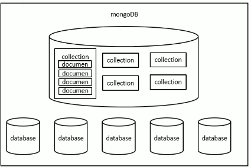

# Mongodb

This is a learning notes from [尚硅谷MongoDB入门基础教程（一天搞定mongodb）](https://www.bilibili.com/video/BV18s411E78K?p=2&spm_id_from=pageDriver&vd_source=a788bdd4d7cdd9dfe02852346d523cb9)

Start: 22/7/2022

End: 22/7/2022


Lecturer version: 3.2.4

Used Version: 6.0.0

------------

## Installation

> Lecturer version is older and required of alot manual setting up, please refer the video if you are using 3.x

1. Download from official website

   > Version: X.Y.Z
   >
   > If `Y` is even, `X.Y` refers to a release series; for example, `4.2` release series and `4.4` release series. Release series are **stable** and suitable for production.
   >
   > If `Y` is odd, `X.Y` refers to a development series; for example, `4.3` development series and `4.5` development series. Development series are **for testing only and not for production**.

2. Environment Variable => path : [your mongodb path]\ bin

   

----------------

## Start MongoDB


1. check by looking into your task manager => Services => find mongoDB => whether running
2. cmd => <mongosh> => success


--------------

## 3 Concepts

> One server => multi databases => multi Collections (like Array) => document
>
> 

1. Database
2. Collection
3. Document


In mongoDB, there is no need to create database and collection manually,

- when we create documents when there is no database and  collection => auto create

- can use `use [dbname]` even if the database is not exist 

-----------------------

## Commands

### Basic

```shell
show dbs			#as per command
show databases		#as per command
use [dbname]		#as per command
db					#show which db you using

show collections	#as per command

--------------------------------------------------------------------------
=== create ===
db.<collection>.insert/insertOne/insertMany(<doc (json)>)		 	#will auto insert _id: Object(<uniqueid>)
#eg. db.student.insertOne({name:"Jack",age:18,gender:"male"});
#eg. db.student.insertMany([
#	{name:"Jack",age:18,gender:"male"},
# 	{name:"Lucy",age:18,gender:"female"},
#	{name:"Mary",age:18,gender:"female"}
#]);

--------------------------------------------------------------------------
=== read ===
###Returning Array###
db.<collection>.find() 					#eg db.student.find();
db.<collection>.find({<json>})			#eg db.student.find({name:"jack"});
db.<collection>.find({<json>})[1]		#eg db.student.find({name:"jack"});
db.<collection>.find({<json>})[1].name	#eg db.student.find({name:"jack"});
db.<collection>.find({"field.inner":"value"}) #ed hobby: {movie:[...],cities: [...]} ****** MUST ADD " "

###Returning Object###
db.<collection>.findOne({...}) 				#return first doc
db.<collection>.findOne({...}).name 		#return first doc

###count###
db.<collection>.find({...}).count()			
db.<collection>.find({...}).length()

###choose only few column###
db.<collection>find({}, {name:1})		#show _id and name
db.<collection>find({}, {name:1,_id:0})	#show name
--------------------------------------------------------------------------
=== update ===
##db.<collection>.update == updateOne by default, else need the third parameter
db.<collection>.updateOne({selecting}, {new doc})
db.<collection>.updateOne({selecting}, {<update operator>: {<field1>:<value1>}})
db.<collection>.updateMany (...)
db.<collection>.replaceOne (...)

###update operator###
$set => only set the written , only add a new field
$unset => only delete the written field, for value it is ok to be anything
$push => to array eg $push :{a:"1"} push 1 to array a
$addToSet => ditto, but due to characteristic of set, repeated data will be record

#eg db.student.update({name:"jack"},{age:28}) #Please be noted that previous data will be lost eg name:"jack"

#eg db.student.update(
#	{name:"jack"},
#	{ $set: {
#		age:99
#	}}
#)

--------------------------------------------------------------------------
=== Delete ===
db.<collection>.remove({..}) 		#default many, need to set second param if one: {<query>，true}
db.<collection>.deleteOne({..})
db.<collection>.deleteMany({..})
db.<collection>.drop()				#delete this collection
db.dropDatabase()

#eg
db.<collection>.remove({_id:"hello"})
db.<collection>.remove()				#clear (slower than drop)
db.<collection>.drop()					#delete this collection
```

### Aid

```sql
..find().skip(n).limit(n)
..find({number:{$gt:30,$lt:40}})
..find().sort({sal:1})					#sort follow sal column (ascd)
..find().sort({sal:-1})					#sort follow sal column (desc)
..find().sort({sal:1,emp:-1})			#sort follow sal column first, then emp
```


---------------

## MongoDB Command Exercise

1. enter my_test db

   ```sql
   use my_test
   ```

2. insert one doc into user collection

   ```sql
   db.user.insert({username:"jack"})
   ```

3. query user collection

   ```sql
   db.user.find()
   ```

4. insert one doc into user collection

   ```sql
   db.user.insert({username:"lucy"})
   ```

5. query user collection

   ```sql
   db.user.find()
   ```

6. query user collection size

   ```sql
   db.user.find().count()
   ```

7. query user collection where username = jack

   ```sql
   db.user.find({username:"jack"})
   ```

8. update user collection to have new field: address, value: heaven, where username = jack

   ```sql
   db.user.updateOne({username:"jack"},{$set: {address:"heaven"}})
   ```

9. replace username：lucy to username: lulu

   ```sql
   db.user.replaceOne({username:"lucy"},{username:"lulu"})
   ```

10. delete address field from username jack

    ```sql
    db.user.update({username:"jack"}, {$unset: {address:1}})
    ```

11. add hobby:{cities:["KL","Bangkok","Taipei"]} for username:jack

    ```sql
    db.user.update({username:"jack"},{$set: {
                   hobby:{
                   	cities:[
                        "KL",
                        "Bangkok",
                        "Taipei"
                    ]
                   }
    }})
    ```

12. add hobby:{movie:["Avengers","Pokemon","OnePiece"]} for username:lulu

    ```sql
    db.user.update({username:"lulu"},{$set: {
                   hobby:{
                   	movie:[
                        "Avengers",
                        "Pokemon",
                        "OnePiece"
                    ]
                   }
    }})
    ```

13. query who's hobby is movie: OnePiece

    ```sql
    db.user.find({"hobby.movie":"OnePiece"})
    ```

14. insert new hobby movie : "Disney" into lulu

    ```sql
    db.user.update({username:lulu},{$push: {"hobby.movie":"Disney"}})
    ```

15. delete whoever likes city: KL

    ```sql
    db.user.remove({"hobby.cities":"KL"})
    ```

16.  delete user

    ```sql
    db.users.drop()
    ```

17. insert 20000 data into number

    ```sql
    for(var i=1; i<=20000; i++){
    	db.numbers.insert({num:i});
    }
    [SLOW!]
    -----------------------------------------
    var arr =[];
    for(var i=1; i<=20000; i++){
    	arr.push({num:i});
    }
    
    db.numbers.insert(arr);
    ```

18.  query number == 500

    ```sql
    db.numbers.find({num:500})
    ```

19. query number > 5000

    ```sql
    db.numbers.find({num: {$gt:500}})
    Tips:
    $gte
    ```

20. query number < 30

    ```sql
    db.numbers.find({num: {$lt:30}})
    Tips:
    $lte
    ```

21. query number > 40, < 50

    ```sql
    db.numbers.find({num: {$gt:40, $lt:50}})
    ```

22.  query number > 19996

    ```sql
    db.numbers.find({num: {$gt:19996}})
    ```

23.  show top 10

    ```sql
    db.numbers.find().limit(10)
    ```

24. show 11 - 20

    ```sql
    db.numbers.find().skip(10).limit(10)
    Tips:
    skip((page - 1) * pageSize).limit(pageSize)
    ```

25.  show 21 - 30

    ```sql
    db.numbers.find().skip(20).limit(10)
    Tips:
    it is ok to be db.numbers.find().limit(10).skip(20)
    as mongodb will switch limit and skip automatically
    ```

26. import dept, and emp collections into db

    ```sql
    use GUI
    ```

27. query salary < 2000

    ```sql
    db.emp.find(sal:{$lt:2000})
    ```

28. query salary between 1000-2000

    ```sql
    db.emp.find(sal:{$gt:1000,$lt:2000})
    ```

29. query salary <1000 or >2500

    ```sql
    db.emp.find({$or: [{sql:{$lt:1000}},{sal:{$gt:2500}}]})
    ```

30. query finance department employee

    ```sql
    var deptno = db.dept.findOne({dname:"finance"}).deptno
    db.emp.find({deptno:deptno})
    ```

31. query sales department employee

    ```sql
    var deptno = db.dept.findOne({dname:"sales"}).deptno
    db.emp.find({deptno:deptno})
    ```

32. query employee with mgr = 7698 (under which manager)

    ```sql
    db.emp.find({mgr:7698})
    ```

33. add 400$ salary to whoever lower than 1000

    ```sql
    db.emp.updateMany({sal:{$lt:1000},{$inc: {sal:400}})
    ```


-------------------

## GUI

[NoSQL Manager for MongoDB](https://www.mongodbmanager.com/)

1. Install

2. shortcut: 

   F5 => entired script

   F6 => cursor line

   F9 => selected line
   


------------------------

## Documents relationships

- one to one (embedded documents)
- one to many****** (embedded array ) (eg user vs order )
- many to many (types vs product)


--------------------

## Mongoose

- is a component in Node to control mongoDB
- However, mongoDB got its own component for Node to control too, but it is not that convinient compared to mongoose
- It is a ODM (Object Document Model) store 


### Strength:

- Schema for documents (setting rule on the column)
- convert type (eg when type "1234" for sal, then convert to 1234 in number)


### Objects

> When creating, should create in below order too.

- Schema
- Model (collection)
- Document

//////////////////////////////

- connection => to know the status of connection

  ```js
  mongoose.connection.once("open", function() {
     console.log("mongodb connection successs") 
  });
  Other : "close"
  ```

  ```js
  mongoose.disconnect()
  Tips:
  Normally not being used, mongodb always maintain connection until server closed
  ```

  

### Start

[Mongoose Doc](https://mongoosejs.com/docs/guide.html)

1. `npm i mongoose --save`

2. new js => 

   ```js
   const mongoose = require("mongoose");
   ```

3. Connect MongoDB

   ```js
   const mongoose = require('mongoose');
   mongoose.connect('mongodb://localhost:27017/<databaseName>');
   ```

Tips: 

1. can use `require("./.../yourmongooseconnectionjs")` to import your mongoose connection js which as a util

   ```js
   /tools/mongoose_conn.js
   ---------------------
   const mongoose = require("mongoose");
   
   mongoose.connect('mongodb://localhost:27017/mongoose_test');
   
   mongoose.connection.once("open", function() {
       console.log("mongodb connection successs") 
    });
   ```

   

2. can set a Model for reused , create /models/student.js

   ```js
   /models/student.js
   -------------------
   var mongoose = require("mongoose");
   
   var Schema = mongoose.Schema;
   
   var stuSchema = new Schema({
       name: 	String,
       age:	Number
   })
   
   var StuModel = mongoose.model('student', stuSchema);
   
   module.exports = StuModel;
   //exports.model = StuModel;
   ```

   ```js
   index.js
   --------------------
   require("./tools/mongoose_conn")
   var Student = require("./models/student")
   //var Student = require("./models/student".model)
   
   ....
   ```

   

### The use of Objects

[Mongoose Doc](https://mongoosejs.com/docs/guide.html)

1. defining your schema

   ```js
   var Schema = mongoose.Schema;
   
   var blogSchema = new Schema({
       title: 	String,
       author:	String,
       body:	String,
       comments:	[{body: String, date: Date}],
       date: {type: Date, default: Date.now},
       hidden: Boolean, //Be noted that Boolean is rarely used since cannot be extended
       meta: {
           votes: Number,
           favs: Number
       }
   })
   ```

2. Creating a model (Variable first letter normally is capital letter)

   > please be noted that blog will become blogs (mongodb automactically work it)

   ```js
   var BlogModel = mongoose.model('blog', blogSchema); //(<collection>, <schema>)
   ```

   ```js
   Model.create(doc(s),[callback])
   Model.findById(id, [projection], [options], [callback])
   Model.findOne(conditions, [projection], [options], [callback])
   Model.find(conditions, [projection], [options], [callback])
   Model.updateOne(conditions, doc, [options],[callback])
   Model.updateMany(conditions, doc, [options],[callback])
   Model.replaceOne(conditions, doc, [options],[callback])
   Model.deleteOne(conditions,[callback])
   Model.deleteMany(conditions,[callback])
   Model.count(conditions, [callback])
   ----------------
   projection = which column you want to show
   options = skip / limit
   callback = function
   ----------------
   Model.create([
       {...},
       {...}
   ], function(err){...})
   ----------------
   Model.find({name:"abc"},function (err, docs){
   Model.find({},"name age -_id",function (err, docs){
   Model.find({},{name:1, _id:0},function (err, docs){
   Model.find({},{name:1, _id:0},function (err, docs){
   Model.find({},null,{skip:3, limit:3},function (err, docs){
       if (!error) {
           console.log(docs); //be noted that find = array
           console.log(docs[0].name);
       }
   })
   
   Model.findOne({},function(err,doc){
   Model.findById("asdfasdfasdfaf",function (err, doc){ //Nicer as no need to key Object("HASDGUASDAD")
       if (!error) {
           console.log(doc); 
           console.log(doc.name); 
       }
   })
       
   Model.updateOne({name:"abc"}, {$set: {age:20}}, function(err){..})
       
   ```

3. Creating document (Model的实例 => Model# in mongoose document)

   ```js
   BlogModel.create(<doc>, function)
   --------------------------
   BlogModel.create({
       title: 	Hello,
       ...
   }, function(err) {
       if(!err) {
           console.log("Successfully inserted")
       }
   })
   ```

   ```js
   model#.save([option],[callback])
   model#.update(update,[options],[callback])
   model#.remove([callback])
   
   var blog = new BlogModel({
       name: ....
   }) // This only define the 'blog', not being inserted into mongodb
   blog.save(function(err) {..});
   
   -----------------------
   Model.findOne({},function (err, doc){
       if (!error) {
           doc.update({$set:{age:28}}, function (err) {..});
           
       	###OR###
           
           doc.age = 28;
           doc.save();
           
           ---------------
           console.log(doc.get("name"));
           ###OR###
           console.log(doc.name);
           
           ###same to set(<>)
           ---------------
                          
           doc.id;
           ###Same as doc._id;
       }
   })
   ```

   

---------------------------

## Java, SpringBoot with MongoDB

java version used: 1.8

springBoot : 2.7.0

### Dependencies

```xml
<dependency>
    <groupId>org.springframework.boot</groupId>
    <artifactId>spring-boot-starter-data-mongodb</artifactId>
</dependency>
```

### Your Customized Repository Interface

```java
public interface MyRepository extends MongoRepository<MyMongoClass, String> {
	
    MyMongoClass findFirstByMemberIdAndBrandId(Long memberId, Long brandId);

    int deleteByMemberIdAndBrandId(Long memberId, Long brandId);
	
    
    //eg . Pageable pageable = PageRequest.of(pageNum-1,pageSize);
    Page<MyMongoClass> findByMemberId(Long memberId, Pageable pageable);

    void deleteAllByMemberId(Long memberId);
    
    Page<MemberReadHistory> findByMemberIdOrderByCreateTimeDesc(Long memberId, Pageable pageable);
    
}
```


