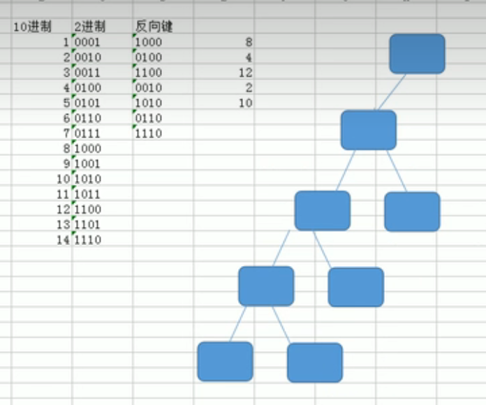
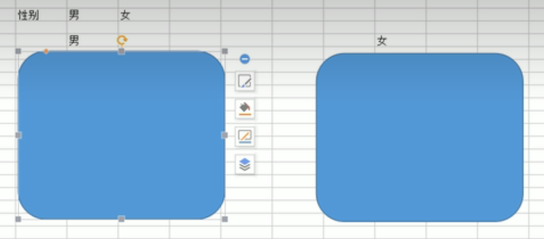

# Oracle

This is a learning note referred to [黑马程序员Oracle数据库精讲，从0到1学会Oracle数据库](https://www.bilibili.com/video/BV1KJ411h7NH/?spm_id_from=333.337.search-card.all.click)

## Remote login
> `sqlplus system/pwd@x.x.x.x:port/servicename`


## Data Type
### Character
1. CHAR
	- fixed length
	- max 2000 bytes
2. VARCHAR2 (有别名VARCHAR, 所以create table的时候写VARCHAR 也没关系)
	- flexible
	- max 4000 bytes
3. LONG
	- max 2G

### Number
1. NUMBER
	- NUMBER(5) --> max 99999
	- NUMBER(5,2) --> max 999.99
	- default is 18

### Date
1. DATE
	- **datetime --> until seconds**
	- timestamp --> until second + 9 decimals

**tips: ** able to add days as follow example
```
update tablex set adate=adate-3 where ...;
```

### Binary
1. CLOB
	- characteres
	- max 4G
2. BLOB
	- save images, audios, videos
	- max 4G


## Create

### Table Space
```
create tablespace [name]
datafile 'D:\name.dbf'
size 100m
autoextend on
next 10m;
```

### User
```
create user
-----------
create user username
identified by password
default tablespace [tablespace_name];

grant dba
---------
grant dba to username // able to logon

```

### Table
```
create table table_name (
	field type(len) primary key
)
```

**Example**
```
CREATE TABLE T_OWNERS(
	ID NUMBER PRIMARY KEY,
	NAME VARCHAR2(30),
	ADDRESSID NUMBER,
	HOUSENUMBER VARCHAR2(30),
	WATERMETER VARCHAR2(30),
	ADDDATE DATE,
	OWNERTYPEID NUMBER
)
```


## Table Related SQL
> **ALTER**
> **Add Field**
```
ALTER TABLE T_OWNERS ADD 
(
	REMARK VARCHAR2(20),
	OUTDATE DATE
)
```

> **Change Field**

```
ALTER TABLE TABLE_NAME MODIFY FIELD
(
	REMARK CHAR(20),
	OUTDATE TIME STAMP
)
```

> **Change field's name only**
```
ALTER TABLE TABLE_NAME RENAME COLUMN [ORIGINAL_NAME] TO [NEW_NAME]
```

> **Delete field**
```
ALTER TABLE TABLE_NAME DROP COLUMN FIELD_NAME[, FIELD_NAME2]
```

> **Delete table**
```
DROP TABLE TABLE_NAME
```


## Data related SQL
> **Insert + Commit**
```
INSERT INTO TABLE_NAME
(FIELD, ...) // can ignore if every field
VALUES
(VALUE, ...);

commit;
```

> **Update + Commit**
```
UPDATE TABLE_NAME SET FIELD = VALUE WHERE ... = .. 

commit;
```

> **Delete + Commit**
```
DELETE FROM TABLE_NAME WHERE ...

commit;
```

> **Truncate all date**
> - cannot rollback, think twice
> - Higher efficiency than delete
```
TRUNCATE TABLE TABLE_NAME 
```

### Query
> **Normal**
```sql
SELECT id, name, addrid from T_OWNERS where waretmeter='30303' and name like '%S%'

... BETWEEN ... AND ...
... IS NULL
... IS NOT NULL
SELECT DISTINCT ID ...
SELECT DISTINCT ID, ownerID ... // if a table 1, 5 | 2, 5 | 1, 4 | 1, 5 ==> | 1,5 | 2,5 | 1,4| 


... ORDER BY X [DESC]

```

> **聚合函数 & Group By**
```sql
SELECT SUM(balance) from ...
SELECT AVG(balance) from ...
SELECT MAX(balance) from ...
SELECT MIN(balance) from ...
SELECT COUNT(*) from ...

SELECT year, areaid, SUM(balance) from ... GROUP BY areaid, year
SELECT year, areaid, SUM(balance) from ... GROUP BY areaid, year HAVING SUM(BALANCE) > 10000
// Tips: for group by, the field after select MUST BE 聚合函数 or Groupby Condition

```

> **Multi-Table Query**
```sql
SELECT o.id OID, o.name Oname, ot.name OTname, ad.name addr from ... where t_owner o, t_ownertype ot, t_address ad where o.ownerTypeid = ot.id and o.addrid = ad.id

LEFT JOIN
---------
sql1999
~~~~~~~
select ... t1 LEFT JOIN t2 ON .. = .. 

Oracle style
~~~~~~~~~~~~
select ... t1, t2 where t1.t2id=t2.id(+)


RIGHT JOIN
----------
select ... t1 RIGHT JOIN t2 ON .. = .. 
select ... t1, t2 where t1.t2id(+)=t2.id

```

#### 子查询
> **where** 
- 单行子查询
	- = | > | >=  ...
```sql
SELECT .... WHERE .. = ..
SELECT ... WHERE usenum > (select avg(usenum) from .... )
```

- 多行子查询
	- IN() | ANY() | ALL()
```sql
SELECT ... IN (SELECT ... WHERE NAME LIKE '%X%')
```


> **from**
- 多行子查询
```sql
SELECT * FROM (SELECT ... WHERE ...) WHERE ...
```


> **select**
- 单行子查询
```sql
SELECT id, name, (SELECT name FROM T2 WHERE ID = addressID) addressname FROM t1

// be noted above addressID is from T1
```

#### 分页查询
```sql
// rownum : use > nothing will show
select rownum, t.* from .. t where rownum<=20 and rownum > 10 // THIS CASE WILL NOT WORK!

Use 子查询 
-----------------
select ... from (select rownum r, t.* from t2) where r<=20 and r> 10


Use 子查询 - ORDER BY (3层嵌套)
----------------------------
select ... from (select rownum r, t.* from (select * from .. ORDER BY ..) t) where r<=20 and r> 10

Use 分析函数 (2层嵌套)
-----------
select * from (select row_number() over(order by usenum) num ,t.* from t_account t) where num>10 and num<20

Use minus (不嵌套)
-----------------
select rownum,t.* from T_ACCOUNT t where rownum<=20 minus select rownum,t.* from T_ACCOUNT t where rownum<=10

```


**Tips: ** 
1. 'and' has higher priority than 'or', so if ... or ... and ... => ... or (... and ...)
2. table name is case insensitive, it is okay to write lower case or upper case in sql
3. Oracle has 伪列: rowid (物理地址, 比primary key有效率) 
	```sql
	// not ok to work with *
	select rowid, * from t_owners
	// ok 
	select rowid, t.* from t_owners t
	// ok
	select rowid, id, name from t_owners where ...
	```
4. 伪列: rownum
	```sql
	// if my table has id: 1 - 10
	select rownum, t.* from t_owners t where id > 3
	// result rownum | 1 | 2 | 3 | 4 | 5 | 6 | 7
	```


## Function
### 字符函数
> 字符串长度
```sql
SELECT LENGTH('ABCD') FROM dual
```
**Tips: ** dual是伪表，没有实际意义
| . | DUMMY |
|---|-------|
| 1 | X     |


> substring
```sql
SELECT SUBSTR('ABCD',2,2) FROM dual
===> result BC, please be noted not from index 0
```

> concatanate
```sql
SELECT CONCAT('ABC', 'D') from dual 
ok for mysql, but not oracle: SELECT CONCAT('ABC', 'D','EF') from dual 
oracle use, mysql cannot: SELECT 'ABC' || 'D' || 'EF' FROM dual
===> result ABCDEF
```

### 数值函数
> round
> 四舍五入
> round(number) no decimal
> round(number, decimal)
```sql
SELECT ROUND(100.665,2) FROM DUAL
=> 100.67
```

> truncate 截取
> oracle => trunc(..), mysql => truncate(...)
```sql
SELECT TRUNC(100.665,2) FROM DUAL
=> 100.66
```

> mod 取模(%)
```sql
SELECT MOD(10,3) FROM DUAL
=> 1
```

### 日期函数
`sysdate` => 当前日期

> add months
```sql
SELECT ADD_MONTHS(sysdate,2) FROM DUAL
MYSQL: SELECT ADDDATE(NOW(), INTERVAL 2 MONTH);
```

> last day
> 月的最后一天
```sql
SELECT LAST_DAY(sysdate) FROM DUAL
```

> truncate
> 截取
> mysql does not have this function
```sql
// TRUNC(sysdate) => yyyy/mm/dd dayOfWeek
// sysdate => yyyy/mm/dd dayOfWeek am hh:MM:ss
SELECT TRUNC(sysdate,'yyyy') FROM DUAL // yyyy/1/1 dayOfWeek
SELECT TRUNC(sysdate,'mm') FROM DUAL // yyyy/mm/1 dayOfWeek
SELECT TRUNC(sysdate,'hh') FROM DUAL // yyyy/mm/dd dayOfWeek hh:00:00
SELECT TRUNC(sysdate,'mi') FROM DUAL // yyyy/mm/dd dayOfWeek hh:mm:00
```

### 转换函数
> number to string
```sql
SELECT TO_CHAR(1024) FROM DUAL 
mysql: SELECT CONVERT(1024, char);
=> "1024"

Tips: SELECT CONCAT(100, "ABC") or SELECT 100 || "ABC" ...  no problem at all
```

> date to string
```sql
SELECT TO_CHAR(SYSDATE,'yyyy-mm-dd hh:mi:ss') FROM DUAL
```

> string to date
```sql
SELECT TO_DATE('2016-03-10','yyyy-mm-dd') FROM DUAL
```

> string to number
```sql
SELECT TO_NUMBER('100') + 10 FROM DUAL // however, select '100' + 10 also work, so we can '100'+0 also to convert string to number
```

### 其他函数
> processing null
> convert null to value (eg 0)
> Tips: use NVL2(tocheck, ifnotnull, ifnull) if the 'ifnull' is different type with tocheck
> eg `select nvl2(maxnum, to_char(maxnum), '不限') from t where...
```sql
SELECT NVL(100, 0) FROM DUAL
> 100

SELECT NVL(NULL, 0) FROM DUAL
> 0

MYSQL
-----
SELECT IFNULL(100, 0) FROM DUAL
```

> decode 条件取值
> `decode(value, if1, then1, if2, then2 ....)`
> `decode(value, if1, then1, if2, then2, default)`
```sql
SELECT DECODE(100, 1, 2, 3, 4, 100, 200) FROM DUAL
-> 200
SELECT DECODE(400, 1, 2, 3, 4, 100, 200,300) FROM DUAL
-> 300
SELECT DECODE(400, 1, 2, 3, 4, 100, 200) FROM DUAL
-> nothing

mysql or oracle another way (sql1999):
SELECT name
CASE type
    WHEN 1 THEN "居民"
    WHEN 2 THEN "行政"
    ELSE "The quantity is under 30"
END
FROM owner;
-> | name | case ... |
-> | ...  | 居民	     |
...
```

### 行列转换
```sql
SELECT (SELECT NAME FROM T1 WHERE ID=AREAID) AREA,
	SUM( CASE WHEN MONTH='01' THEN MONEY ELSE 0 END) JAN
	...
FROM T2 WHERE YEAR = '2020' GROUP BY AREAID

```


### 分析函数
> Rank
> 值相同，排名相同，序号跳跃
> 1,2,2,2,5,5,5
>  ok for mysql
> `RANK() OVER (ORDER BY ...)`
```sql
SELECT VAL, RANK() OVER (ORDER BY val) my_rank FROM t;
```

> 值相同，排名相同，序号连续
> 1,2,2,2,3,3,3
> ok for mysql
> `DENSE_RANK() OVER (ORDER BY ...)`
```sql
SELECT VAL, DENSE_RANK() OVER (ORDER BY val) my_rank FROM t;
```

> 序号连续 不管值是否相同
> 1,2,3,4,5,6,7
> ok for mysql
> `ROW_NUMBER() OVER (ORDER BY ...)`
```sql
SELECT VAL, ROW_NUMBER() OVER (ORDER BY val) my_rank FROM t;
```

### 集合运算
```sql
--并集运算  UNION ALL 不去掉重复记录
select * from t_owners where id < 7
union all
select * from t_owners where id < 5
--并集运算  UNION 去掉重复记录
select * from t_owners where id < 7
union
select * from t_owners where id < 5
--交集运算
select * from t_owners where id < 7
intersect 
select * from t_owners where id < 5
--差集运算
select * from t_owners where id < 7
minus
select * from t_owners where id <5
```


## Database Export and Import

> **By Database**
```bash
export - normal command, not sql
--------------------------------

exp system/pwd full=y
// create a file named EXPDAT.DMP, ... file=filename.dmp full=y to set name

import
------
imp system/pwd full=y // file=filename.dmp to set name
```

> **By User**
```bash
Export
------
exp system/pwd owner=whatuser file=filename.dmp

Import
------
imp system/pwd fromuser=whatuser file=filename.dmp

```


> **By Table**
```bash
Export
------
exp whatuser/pwd file=filename.dmp table=T_owners,T_ownertype

Import
------
imp whatuser/pwd file=filename.dmp table=T_owners,T_ownertype

```

## Sysdate

```
sysdate // current datetime now
INSERT INTO x VALUES (sysdate)
```


## 视图
> 虚拟试图: 简化开发
> 物化视图: 如果数据很大又经常要查询，用我来提高性能
### 虚拟视图
> the change in view will affect the table
#### Create
```sql
// 如果没有OR REPLACE的话 如果该VIEW已经存在 就不能再CREATE
// sub-query 是你的Query SQL
// WITH CHECK OPTION 的让subquery 里的WHERE ... 的FIELD 不可UPDATE，如果改就报错
// WITH READ ONLY (MYSQL NOT SUPPORT) 可读不可改
// FORCE (MYSQL NOT SUPPORT) 硬硬创建带错误sql的视图，例如没有该from 不存在的table
CREATE [OR REPLACE] [FORCE] VIEW view_name 
AS subquery 
[WITH CHECK OPTION ] 
[WITH READ ONLY]
```

**Tips: ** 如果是复杂表， 那只有key-preserved table才能被修改(UPDATE)，详情看[我](https://www.itheima.com/news/20210820/172708.html), 如果没有主键，那就什么都不能改。for mysql, does not matter.

### 物化视图 METERIALIZED
> MySQL not support
#### Create
```sql
CREATE METERIALIZED VIEW view_name
[BUILD IMMEDIATE | BUILD DEFERRED ]
REFRESH [FAST|COMPLETE|FORCE] [
ON [COMMIT |DEMAND ] | START WITH (start_time) NEXT
(next_time)
]
AS
subquery
```
> **BUILD IMMEDIATE** 是在创建物化视图的时候就生成数据
> BUILD DEFERRED 则在创建时不生成数据，以后根据需要再生成数据。
> 默认为 BUILD IMMEDIATE。
> 
> 刷新方法有三种：
> -- COMPLETE 完全刷新 --  有刷新需求就杀掉table重新query
> -- **FAST** 增量更新 -- 依照物化日志(log)来刷新, 刷新(refresh)后清空log
> -- FORCE 自动选择 -- 能增量就增量，不然就COMPLETE，因为增量是要用条件的
> 刷新的模式有两种：
> 
> **ON DEMAND**  指需要手动刷新物化视图(默认)
> ON COMMIT 指在基表发生COMMIT操作时自动刷新。

#### To sync 基表 and Meterialized table (IN CASE ON DEMAND) -- refresh
```sql
// 'C' stands for 'COMPLETE'
begin
	DBMS_MVIEW.refresh('MV_ADDRESS','C'); ..
end;
```
#### create auto refresh materialized view
```sql
create materialized view mv_address2 
refresh 
on commit
as
select ad.id,ad.name adname,ar.name ar_name 
from t_address ad,t_area ar 
where ad.areaid=ar.id
```

#### to create refresh fast view. Must accompanied with log table first
```sql
create materialized view log on t_address with rowid;

create materialized view mv_address
refresh fast
as
select ad.rowid adrowid, ar.rowid arrowid, ad.id, ad.name, ar.name
from t_address ad, t_area ar 
where ad.areaid=ar.id;
```


#### Delete
```sql
DROP MATERIALIZED VIEW view_name
```

## 序列化 Sequence
> Oracle 没有mysql的auto increment

### [CREATE] - Simple -- Everytime + 1
```sql
create sequence 序列名称

-- 查询sequence的下一个值 (每执行一次就+1)
select 序列名称.nextVal from dual

-- 查询sequence的当前值 (每执行一次不+1)
select 序列名称.currVal from dual

-- 以后insert:
insert into ... values(序列名称.nextval, ...)
```

### [CREATE] - Complicated 
```sql
CREATE SEQUENCE name
	[INCREMENT BY n]
	[START WITH n]
	[{MAXVALUE n | NOMAXVALUE}] // default: NOMAXVALUE, 超过会报错
	[{MINVALUE n | NOMINVALUE}] // default: NOMINVALUE
	[{CYCLE | NOCYCLE}] // default: NOCYCLE, ---> 不是主键的情况
	[{CACHE n | NOCACHE}] // default: CACHE 20, 意思: 一次性抓取n个nextValue到内存，当有需要的时候直接到内存找。可能断号: 当开始了服务器拿20,当服务器死了重开会从21开始，就算前20个没完全被使用
```

### [ALTER]
```sql
ALTER SEQUENCE name MAXVALUE 5000 CYCLE; // 'START WITH' cannot be altered
```

### [DROP]
```sql
DROP SEQUENCE name
```

##  同义词 (别名)
> 分私有 和 公有, 私有是只有该用户可访问(或管理员, 但必须: {who}.{别名})； 而公有的话是全部人都能用这个别名
### [CREATE]
> **私有**
```sql
CREATE SYNONYM name FOR whichTable;

SELECT * FROM name; // for admin: whichUser.synonymName
```

> **公有**
```sql
CREATE PUBLIC SYNONYM name FOR whichTable;

SELECT * FROM name;
```


## 索引
> 用空间换速度
> 如果数据少不建议加

### 类型
> **普通** 

```sql
CREATE INDEX name ON table(field) //普通索引 eg name: index_owners_name
```

> **唯一索引**
> 比普通索引快点
> 会创建唯一约束
> 主键创建的就是唯一索引

```sql
CREATE UNIQUE INDEX index_owners_meter ON table(field)
```

> **复合索引**
> 多个field组合
> 一个索引，一颗树
> 如果查询每次两个field一起出现，用复合索引
> 注意Where的顺序和复合索引的顺序要一致

```sql
CREATE INDEX name ON table(field1, field2)
```


> **反向键索引**
> 
> 当一个列的值为连续增长用普通索引会有歪脖子，影响效率，所以反向键是用来让索引树均匀分布的

```sql
CREATE INDEX name ON table(file) REVERSE;
```


> **位图索引**
> 适合低基数: 例如 性别
> 只在Where 用 = 有效， 不能 > <
> 

```sql
CREATE BITMAP INDEX name ON table(field)
```

## PL/SQL
> Procedure Language SQL
```sql
[declare
]
begin
[exception
]
end; //DO NOT IGNORE THIS ';'
```

### Variable
**声明: declare**
`name type(length);`
`name table.field%type;` (这样就不用去记类型了，eg `v_usenum t_account.usenum%type`)
`name table%rowtype` (记整行, 用 '.' 来call field)

**赋值: assignment (在begin 和 end之间)**
`name := value`
`SELECT NAME INTO variablename FROM .... WHERE ... ` (这个是有多行的话会有异常)

**Example**
```sql
DECLARE
	v_price number(10,2);
	v_usenum number; // 默认18, eg 999,999,999,999,999,999
	v_account t_account%rowtype;
BEGIN
	v_price:=2.45;
	DBMS_OUTPUT.put_line('price: ' || v_price || '字数:' || v_account.usenum);
	
	SELECT usenum INTO v_usenum FROM t_account WHERE ....
END

```

### Exception
> [20++异常](https://docs.oracle.com/cd/B10501_01/appdev.920/a96624/07_errs.htm)
> 常用: NO\_DATA\_FOUND (使用select into 未返回行), TOO\_MANY\_ROWS (使用select into 返回超过一行)

```sql
EXCEPTION
	WHEN exception_name(大小写都可以) THEN
		your logic..
	WHEN too_many_rows(大小写都可以) THEN
		your logic..

```

### If
```sql
IF
---------
IF condition THEN
	...
END IF;


IF-ELSE
---------
IF condition THEN
	...
ELSE
	...
END IF;


IF-ELSE IF-ELSE
---------
IF condition THEN
	...
ELSIF condition [and condition] THEN
	...
ELSIF condition THEN -- 我没写错, 就是ELSIF
	... 
ELSE
	...
END IF;
```

### loop
#### for
```sql
declare
begin
	for v_num in 1 .. 100 
	loop
		
	end loop;
end;

```

#### while
> 无条件循环
```sql
declare
	v_num number;
begin
	v_num:=1;
	loop -- start loop
		v_num:=v_num+1;
		if v_num>100 then -- or use exit when v_num>100; to save 3 lines
			exit; -- exit the loop
		end if;
	end loop; -- end loop
end;
```
> 有条件循环 (少用)
```sql
declare
	v_num number;
begin
	v_num:=1;
	while v_num<=100-- condition here
	loop -- start loop
		v_num:=v_num+1;
	end loop; -- end loop
end;
```

### 游标 cursor
> 想象成一个结果集，来暂时存放你查出来的结果们

#### 锁死了条件 WHERE
> 声明游标
```sql
DECLARE
	CURSOR cursor_name IS sql_sentence； -- eg SELECT * FROM T WHERE ..
```

> 使用游标
**for版，好**
```sql
BEGIN
	FOR variable_name IN cursor_name 
	LOOP
		DBMS_OUTPUT.PUT_LINE(variable_name.x);
	END LOOP;
END;
```

 
**loop版， 不要用，比较啰嗦**
```sql
BEGIN
	OPEN cursor_name;
	LOOP
		FETCH cursor_name INTO variable_name; --每过一次就往下移动记录了的一, 想像microsoft excel 
		EXIT WHEN cursor_name%notfound; --当游标走到尾了
		DBMS_OUTPUT.PUT_LINE(variable_name.x);
	END LOOP;
	CLOSE cursor_name;
END;
```

#### 没锁死条件
> 可把cursor作为方法
> 声明游标
```sql
DECLARE
	CURSOR cursor_name(v_abc number) IS sql_sentence； -- eg SELECT * FROM T WHERE a=v_abc
```

> 使用游标

**for版，好**
```sql
BEGIN
	FOR variable_name IN cursor_name(12345) 
	LOOP
		DBMS_OUTPUT.PUT_LINE(variable_name.x);
	END LOOP;
END;
```

**loop版， 不要用，比较啰嗦**
```sql
BEGIN
	OPEN cursor_name(12345);
	LOOP
		FETCH cursor_name INTO variable_name; --每过一次就往下移动记录了的一, 想像microsoft excel 
		EXIT WHEN cursor_name%notfound; --当游标走到尾了
		DBMS_OUTPUT.PUT_LINE(variable_name.x);
	END LOOP;
	CLOSE cursor_name;
END;
```

## 存储函数
> 可用来简化开发
> 和存储过程很类似，但存储函数多用在查询

> 创建函数
```sql
CREATE [OR REPLACE] FUNCTION function_name -- 可用fn_...来命名
	(参数名称 参数类型, 参数名称 参数类型 ...)
RETURN 结果变量数据类型
IS
	变量声明部分;
BEGIN
	逻辑部分;
	RETURN 结果变量;
[EXCEPTION]
	异常处理部分]
END;
```

> 使用函数
```sql
SELECT function_name FROM dual; 
SELECT id, name, fn_getAddress(addressid) from t_owners; -- fn_getAddress 是select * from t_address where .. = id
```

**Example**
```sql
CREATE OR REPLACE FUNCTION fn_getAddress
	(v_id number)
RETURN VARCHAR2
IS
	v_name varchar2(30);
BEGIN
	SELECT name INTO v_name FROM t_address where id = v_id;
	RETURN v_name;
END;
```

## 存储过程
> 当要求特别性能好的话可以用，不在java里用框架，但其实架构起来比较乱
> variable_name in type (default)
> variable_name out type -- 把值传出来给variable
> variable_name in out type -- 有传入又有传出

> 创建函数
```sql
CREATE [OR REPLACE] PROCEDURE procedure_name -- 名可放pro_...
	(参数名称 参数类型, 参数名称 参数类型 ...)
		-- 没有return, 对比存储函数
IS
	变量声明部分;
BEGIN
	逻辑部分;
	RETURN 结果变量;
[EXCEPTION]
	异常处理部分]
END;

```

> 使用
```sql
CALL procedure_name(params)
-- or
BEGIN
	procedure_name(params)
END;


```

> 在java用jdbc用 procedure
```java
public static void add(Owners owners) {
	java.sql.Connection conn = null;
	java.sql.CallableStatement stmt = null;
	try {
		conn = BaseDao.getConnection();
		stmt = conn.prepareCall("{call pro_owner_add(?,?,?,?,?)}");
		stmt.setString(1, owner.getName());
		//如果有传出参数
		stmt.registerOutParameter(6,OracleTypes.NUMBER);
		...
		// 省略设定参数
		stmt.execute();

		//拿出传出此参数
		System.out.println(stmt.getLong(6));
	} catch (SQLException e) {
		e.printStackTrace(); 
	} finally {
		BaseDao.closeAll(null, stmt, conn);
	}
}
```

**Example**
```sql
CREATE OR REPLACE PROCEDURE pro_owners_add
(
	v_name varchar2,...
	v_id out number
)
IS
BEGIN
	select seq_owners.nextVal into v_id from dual; -- example of 传出
	INSERT INTO table VALUES(v_id, v_name...)
END;

------------------------- the use of 传出 variable
declare
	v_id number;
begin
	pro.. (......, v_id);
	dbms_output.put_line(v_id);
end;
```
## 触发器
**用于**
> 数据确认
> 实施复杂的安全性检查
> 做审计,跟踪表上的所做的数据操作等
> 数据的备份和同步

**分类**
> BEFORE
> - 可以用于insert之前处理数据
> 
> AFTER
> - 当用户修改了某一个数据，我们可以用AFTER来记录修改前和后的值 (审计)
> - 注意，不可改:new的值，但可用

**伪变量**
> :old -> 修改之前的行, 注意, insert情况的:old为null
> :new -> 修改过后的行, 注意, delete情况的:new为null
> 用'.' 来拿里面的数据 eg :old.name

```sql
CREATE [or REPLACE] TRIGGER 触发器名
	BEFORE | AFTER
	[DELETE ] [OR] INSERT] [[OR] UPDATE [OF 列名]] -- 在哪个情况下出发 eg DELETE OR INSERT OR UPDATE OF field1, field2
	ON 表名
	[FOR EACH ROW ][WHEN(条件)] -- for each row: 每次影响一行记录就trigger一次,不然只执行一次; WHEN: 如果为假就不触发,几乎不用WHEN
DECLARE
	--
BEGIN
	PLSQL块 --不要写commit
END; 
```

**Example -- BEFORE**
```sql
CREATE or REPLACE TRIGGER tri_account_num1
	BEFORE
	UPDATE OF num1
	ON t_account
	FOR EACH ROW
DECLARE

BEGIN
	:new.usenum:=:new.num1-:new.num0;
END; 
```

**Example -- AFTER**
```sql
CREATE or REPLACE TRIGGER tri_owners_log
	AFTER
	UPDATE OF name
	ON t_owners
	FOR EACH ROW
DECLARE

BEGIN
	insert into t_owners_log values(sysdate,:new.id, :old.name, :new.name);
END; 
```


## Problem might face

> account is locked
```
login as system
---------------
alter user username account unlock;
alter user username identified by password; // change password

```


## Shortcuts
> Creating 1million data
```sql
begin
	for x in 1..1000000
	loop
		insert into tableX values(...);
	end loop;
	commit;
end;
```