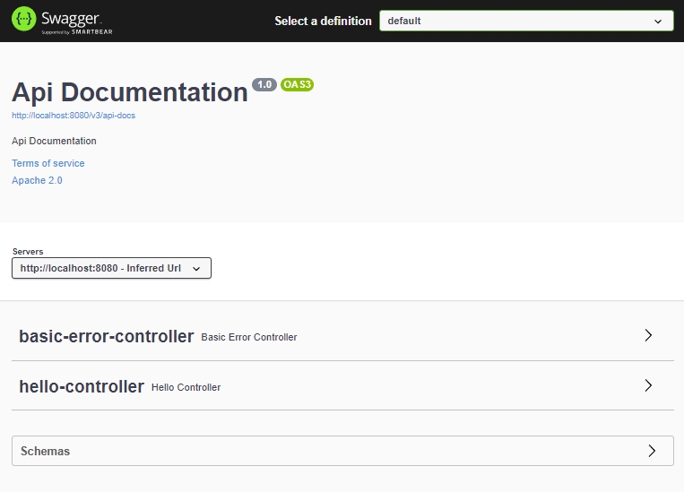
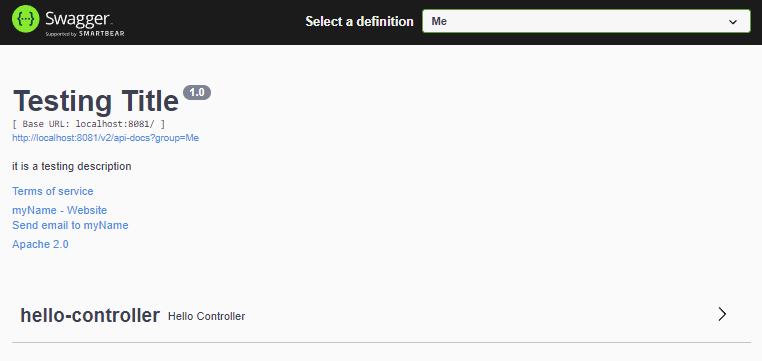
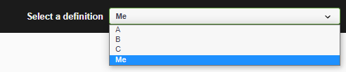
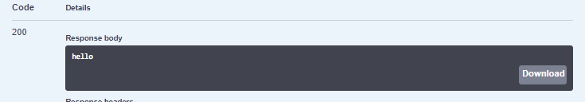
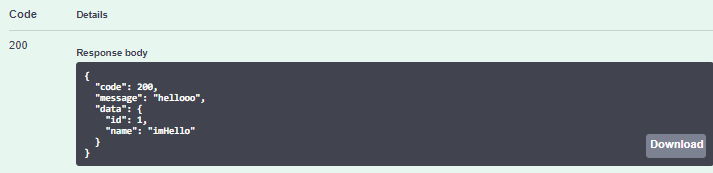
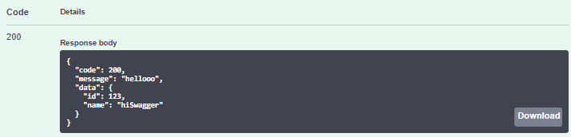
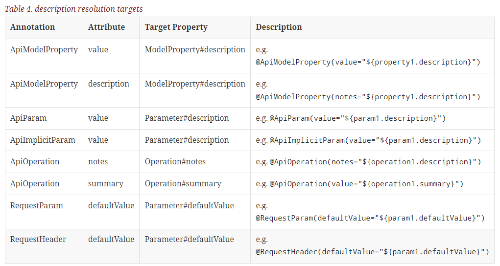

# Swagger2

This is a learning notes.

learning Swagger from 狂神说 in https://www.bilibili.com/video/BV1Y441197Lw?p=1

Total video length : 1h 41m 53s

24.06.2022 - start & complete


---------------------------------


- Why Swagger? Official website : https://swagger.io/, 

  > API framework
  >
  > interaction between front and back end ===> API
  >
  > RestFul api docs auto generate tool => API docs and API synchronously update 
  >
  > able to test API online
  >
  > supports lots of language (java , Php ... )

- Front and Back - end separation

  > Vue + SpringBoot
  >
  > Back End : controller, service, dao
  >
  > Front End :  controller, view

- Setting up swagger with SpringBoot


## Dependencies

- Dependencies
  - springfox-swagger2
  - springfox-swagger-ui


## Setting up swagger with Springboot

Environment:

1. spring-boot-starter-parent : 2.2.13.RELEASE

```
<dependency>
    <groupId>io.springfox</groupId>
    <artifactId>springfox-boot-starter</artifactId>
    <version>3.0.0</version>
</dependency>
```


**1. Setting up configuration class**

```
@Configuration
@EnableSwagger2
public class SwaggerConfig {
}
```

**2. Run**

**3. http://localhost:8080/swagger-ui/index.html** (springfox version 2.X use : http://localhost:8080/swagger-ui.html)




## Config Detail

https://springfox.github.io/springfox/docs/current/

**1. SpringFox docs**

```
@Bean
public Docket docket() {
    return new Docket()...;
}
```

as per springfox docs:

```java
@Bean
  public Docket petApi() {
    return new Docket(DocumentationType.SWAGGER_2)
        .select() //returns an instance of ApiSelectorBuilder to give fine grained control over the endpoints exposed via swagger
        .apis(RequestHandlerSelectors.any()) //allows selection of RequestHandler's using a predicate : any, none, withClassAnnotation, withMethodAnnotation and basePackage 
        .paths(PathSelectors.any()) //allows selection of Path's using a predicate: regex, ant, any, none
        .build() // selector needs to be built after configuring the api and path selectors
        .pathMapping("/") // Adds a servlet path mapping, when the servlet has a path mapping
        .directModelSubstitute(LocalDate.class, String.class) //Convenience rule builder that substitutes LocalDate with String when rendering model properties
        .genericModelSubstitutes(ResponseEntity.class)
        .alternateTypeRules(
            newRule(typeResolver.resolve(DeferredResult.class,
                typeResolver.resolve(ResponseEntity.class, WildcardType.class)),
                typeResolver.resolve(WildcardType.class))) 
        .useDefaultResponseMessages(false) // 	Flag to indicate if default http response codes need to be used or not
        .globalResponses(HttpMethod.GET, 
            singletonList(new ResponseBuilder()
                .code("500")
                .description("500 message")
                .representation(MediaType.TEXT_XML)
                .apply(r ->
                    r.model(m ->
                        m.referenceModel(ref ->
                            ref.key(k ->
                                k.qualifiedModelName(q ->
                                    q.namespace("some:namespace")
                                        .name("ERROR")))))) 
                .build()))
        .securitySchemes(singletonList(apiKey()))  // 	Sets up the security schemes used to protect the apis. Supported schemes are ApiKey, BasicAuth and OAuth
        .securityContexts(singletonList(securityContext())) // 	Provides a way to globally set up security contexts for operation.
        .enableUrlTemplating(true) 
        .globalRequestParameters(
            singletonList(new springfox.documentation.builders.RequestParameterBuilder()
                .name("someGlobalParameter")
                .description("Description of someGlobalParameter")
                .in(ParameterType.QUERY)
                .required(true)
                .query(q -> q.model(m -> m.scalarModel(ScalarType.STRING)))
                .build()))
        .tags(new Tag("Pet Service", "All apis relating to pets")) 
        .additionalModels(typeResolver.resolve(AdditionalModel.class)); 
  }

  @Autowired
  private TypeResolver typeResolver;

  private ApiKey apiKey() {
    return new ApiKey("mykey", "api_key", "header"); 
  }

  private SecurityContext securityContext() {
    return SecurityContext.builder()
        .securityReferences(defaultAuth())
        .forPaths(PathSelectors.regex("/anyPath.*")) 
        .build();
  }

  List<SecurityReference> defaultAuth() {
    AuthorizationScope authorizationScope
        = new AuthorizationScope("global", "accessEverything");
    AuthorizationScope[] authorizationScopes = new AuthorizationScope[1];
    authorizationScopes[0] = authorizationScope;
    return singletonList(
        new SecurityReference("mykey", authorizationScopes)); 
  }

  @Bean
  SecurityConfiguration security() {
    return SecurityConfigurationBuilder.builder() 
        .clientId("test-app-client-id")
        .clientSecret("test-app-client-secret")
        .realm("test-app-realm")
        .appName("test-app")
        .scopeSeparator(",")
        .additionalQueryStringParams(null)
        .useBasicAuthenticationWithAccessCodeGrant(false)
        .enableCsrfSupport(false)
        .build();
  }

  @Bean
  UiConfiguration uiConfig() {
    return UiConfigurationBuilder.builder() 
        .deepLinking(true)
        .displayOperationId(false)
        .defaultModelsExpandDepth(1)
        .defaultModelExpandDepth(1)
        .defaultModelRendering(ModelRendering.EXAMPLE)
        .displayRequestDuration(false)
        .docExpansion(DocExpansion.NONE)
        .filter(false)
        .maxDisplayedTags(null)
        .operationsSorter(OperationsSorter.ALPHA)
        .showExtensions(false)
        .showCommonExtensions(false)
        .tagsSorter(TagsSorter.ALPHA)
        .supportedSubmitMethods(UiConfiguration.Constants.DEFAULT_SUBMIT_METHODS)
        .validatorUrl(null)
        .build();
  }

```


2. **Class example:**

> ```java
> @Bean
> public Docket docket(Environment environment) {
>     Profiles profiles = Profiles.of("dev"); 
>     boolean flag = environment.acceptsProfiles(profiles); //so that allow only dev enabled swagger
>     return new Docket(DocumentationType.SWAGGER_2)
>         .groupName("Me")
>         .enable(flag)
>         .apiInfo(apiInfo())
>         .select()
>         .apis(myApis()) //default:everything without @ApiIgnore
>         .paths(myPath()) //default : Any
>         .build();
> }
> 
> private ApiInfo apiInfo() {
>     return new ApiInfo(
>         "Testing Title",
>         "it is a testing description",
>         "1.0",
>         "#",
>         new Contact("myName","myWebsite","myEmail"),
>         "Apache 2.0",
>         "http://www.apache.org/licenses/LICENSE-2.0",
>         new ArrayList<>()
>     );
> }
> 
> private Predicate<RequestHandler> myApis() {
>     return RequestHandlerSelectors.withMethodAnnotation(GetMapping.class)
>         .and(RequestHandlerSelectors.withClassAnnotation(ApiIgnore.class).negate());
> }
> 
> private Predicate<String> myPath() {
>     return PathSelectors.ant("/**");
> }
> ```
>
> 


> We can use groupName to show different group

```java
@Bean
public Docket docket1() {
return new Docket(DocumentationType.SWAGGER_2)
.groupName("A");
}
@Bean
public Docket docket2() {
return new Docket(DocumentationType.SWAGGER_2)
.groupName("B");
}
@Bean
public Docket docket3() {
return new Docket(DocumentationType.SWAGGER_2)
.groupName("C");
}
```




**MyController to Test**

```java
@RestController
public class HelloController {
    @GetMapping("/hello")
    public String test1() {
        return "hello";
    }

    @PostMapping("/hello/returnUser")
    public CommonResult<User> test2() {
        return new CommonResult<>(200, "hellooo", new User(1,"imHello"));
    }
    @PostMapping("/hello/generate")
    public CommonResult<User> test3(User user) {
        return new CommonResult<>(200, "hellooo", user);
    }

}
```

>  /hello



> hello/returnUser



> /hello/generate?id=123&name=hiSwagger




## API Annotations



_from springfox docs_


# Conclusion

1. able to put some comment on the API / fields which is hard to understand
2. API docs is update instantly
3. able to test online

Most of the company use Swagger. it is a good framework to provide information of the API in between frond and back end.

**[!!]** Remember to disable swagger when production environment. It is terrible for people to use swagger to get information or attack your website. Plus, it do helps to save memory as swagger actually consume amount of memory while running.


