# The Go Programming Language

Start: Early of April 2023

# 1 Tutorial

## Command-Line Arguments

> `gofmt` and `goimports`

They are tools to format and insert/removal of import each time you save the file.

`go get golang.org/x/tools/cmd/goimports`

> `os` package -- `Args`

is slice of strings.

**os.Args[0]** is the name of command itself; the other element are the arguments that were presented to the program when it started execution. It means we can abbreviate the desired slice as `os.Args[1:]`

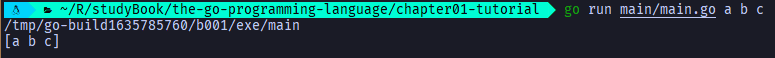

> `for` loop

```go
// a traditional "while" loop
for condition {
    // ...
}
```

```go
// a traditional infinite loop
for {
    // ...
}
```

```go
// it has the best performance, it use []byte
func Echo3() {
 fmt.Println(strings.Join(os.Args[1:], " "))
}
```

## Finding Duplicate Lines

> `Input`

```go
func Input() {
 counts := make(map[string]int)
 input := bufio.NewScanner(os.Stdin)
 for input.Scan() {
  counts[input.Text()]++
 }
    // NOTE: ignoring potential errors from input.Err()
 for line, n := range counts {
  if n > 1 {
   fmt.Printf("%d\t%s\n", n, line)
  }
 }
}
```

> `Dup2` Enhanced

```go
// Dup2 prints the count and text of lines that appear
// more than once in the input. It reads from stdin or
// from a list of named files.
func Dup2() {
 counts := make(map[string]int)
 files := os.Args[1:]
 if len(files) == 0 {
  countLines(os.Stdin, counts)
 } else {
  for _, arg := range files {
   f, err := os.Open(arg)
   if err != nil {
    fmt.Fprintf(os.Stderr, "dup2: %v\n", err)
    continue
   }
   countLines(f, counts)
   f.Close()
  }
 }
 for line, n := range counts {
  if n > 1 {
   fmt.Printf("%d\t%s\n", n, line)
  }
 }
}

func countLines(f *os.File, counts map[string]int) {
 input := bufio.NewScanner(f)
 for input.Scan() {
  counts[input.Text()]++
 }
 // NOTE: ignoring potential errors from input.Err()
}
```

**Tips:** A **map** is a _reference_ to the data structure by make. When a map is passed to a function, the function receives a copy of the reference

> `Dup3` load file in big gulp and use strings.Split to split the lines

```go
func Dup3() {
 counts := make(map[string]int)
 for _, filename := range os.Args[1:] {
  data, err := ioutil.ReadFile(filename)
  if err != nil {
   fmt.Fprintf(os.Stderr, "dup3: %v\n", err)
   continue
  }
  for _, line := range strings.Split(string(data), "\n") {
   counts[line]++
  }
 }
 for line, n := range counts {
  if n > 1 {
   fmt.Printf("%d\t%s\n", n, line)
  }
 }
}
```

> `fmt format`

| format     | description                                                |
| ---------- | ---------------------------------------------------------- |
| %d         | decimal Integer                                            |
| %x, %o, %b | integer in hexadecimal, octal, binary (%08b => "00100010") |
| %f, %g, %e | floating-point number: 3.141593 3.14159264                 |
| %t         | boolean                                                    |
| %c         | rune (Unicode code point)                                  |
| %s         | string                                                     |
| %q         | quoted string "abc" or rune 'c'                            |
| %v         | any value in a natural format                              |
| %T         | type of any value                                          |
| %%         | literal percent sign                                       |

```go
for k, v := range wordCount {
    fmt.Printf("%-30s %d\n", k, v)
}
// a                 1
// basdfasf          2
```

**Tips:** **%#v** display values in a form similar to Go syntax. **For struct values, this form includes the name of each field**, **%+v** adds field name

**Tips:** %10.9s display only first 9 characters, and the width is 10 characters.

**Tips:** %_s prints a string padded with a variable number of spaces. The width and the string are provided by the arguments depth_ 2 and "" `fmt.Printf("%*s</%s>\n", depth*2, "", n.Data)`

**Tips:** gb :`fmt.Printf("%d files %.1f GB\n", nfiles, float64(nbytes)/1e9)`

> **Exercise**

```go
// Modify dup2 to print the names of all files in which each duplicated
// line occurs
func Exercise1_4() {
 counts := make(map[string]map[string]int)
 files := os.Args[1:]
 if len(files) == 0 {
  countLines2(os.Stdin, counts)
 } else {
  for _, arg := range files {
   f, err := os.Open(arg)
   if err != nil {
    fmt.Fprintf(os.Stderr, "dup2: %v\n", err)
    continue
   }
   countLines2(f, counts)
   f.Close()
  }
 }
 for line, fileMap := range counts {
  total := 0
  filenames := make([]string, 0)
  for filename, count := range fileMap {
   filenames = append(filenames, filename)
   total += count
  }
  if total > 1 {
   fmt.Printf("%d\t%s\t%v\n", total, line, filenames)
  }

 }
}

func countLines2(f *os.File, counts map[string]map[string]int) {
 input := bufio.NewScanner(f)
 for input.Scan() {
  if counts[input.Text()] == nil {
   counts[input.Text()] = make(map[string]int)
  }
  counts[input.Text()][f.Name()]++
 }
 // NOTE: ignoring potential errors from input.Err()
}
```

## Animated GIFs

```go
func Lissajous() {
 lissajous(os.Stdout)
}

func lissajous(out io.Writer) {
 const (
  cycles  = 5     // number of complete x oscillator revolutions
  res     = 0.001 // angular resolution
  size    = 100   // image canvas covers [-size..+size]
  nframes = 64    // number of animation frames
  delay   = 8     // delay between frames in 10ms units
 )
 freq := rand.Float64() * 3.0 // relative frequency of y oscillator
 anim := gif.GIF{LoopCount: nframes}
 phase := 0.0 // phase difference
 for i := 0; i < nframes; i++ {
  rect := image.Rect(0, 0, 2*size+1, 2*size+1)
  img := image.NewPaletted(rect, pallette)
  for t := 0.0; t < cycles*2*math.Pi; t += res {
   x := math.Sin(t)
   y := math.Sin(t*freq + phase)
   img.SetColorIndex(size+int(x*size+0.5), size+int(y*size+0.5), blackIndex)
  }
  phase += 0.1
  anim.Delay = append(anim.Delay, delay)
  anim.Image = append(anim.Image, img)
 }
 gif.EncodeAll(out, &anim) // NOTE: ignoring encoding errors
}
```

**Tips:** the value of constant must be a number, string or boolean

> **Exercise**

- Change color from black to green

  ```go
  var pallette1_5 = []color.Color{color.White, color.RGBA{0x0, 0xff, 0x0, 0xff}}
  ```

## A Web Server

`go doc http.ListenAndServe` to access documents easily

comment to make documentations, **It's good style to write a comment before the declaration of each function to specify its behavior**: eg

```go
// ListenAndServe listens on the TCP network address addr and then calls
// Serve with handler to handle requests on incoming connections.
// Accepted connections are configured to enable TCP keep-alives.
//
// The handler is typically nil, in which case the DefaultServeMux is used.
//
// ListenAndServe always returns a non-nil error.
func ListenAndServe(addr string, handler Handler) error {
 server := &Server{Addr: addr, Handler: handler}
 return server.ListenAndServe()
}
```

# 2 Program Structure

`var name type = expression`

`""` for strings

`0` for numbers

`false` for boolean

`nil` for interface and reference type (**slice, pointer, map, channel and function**)

> **Swapping**

`i, j = j, i`

> **Short variable declaration** does not necessarily _declare_ all the variables on its left-hand side.

```go
f, err := os.Open(name)
if err != nil {
    return err
}
// ...use f...
f.Close()
```

> **Pointer** are comparable, two pointers are equal if and **only** if they point to the same variable or both are nil

```go
var x, y int
fmt.Println(&x == &x, &x == &y, &x == nil) // true false false
```

> **Another way to create variable** -- new

```go
p := new(int) // initializes it to zero value to T and return address
fmt.Println(*p) // "0"
*p = 2
fmt.Println(*p) // "2"
```

> Exception on address, two variables whose type carries no information and is therefore of size zero have the same address.

eg. struct{} and [0]int

> Since `new` is a predeclared function, not a keyword, it's possible to redefine the name for something else within a function. But built-in new function is unavailable.

```go
func delta(old, new int) int {return new - old}
```

> v, ok

- `v, ok = m[key]` map lookup
- `v, ok = x.(T)` type assertion
- `v, ok = <- ch` channel receive

> T(x) converts the value x to type T. A conversion from one type to another is allowed **if both have the same underlying type**, or both are unnamed pointer types that point to variable of the same underlying type.

> Many types declare a **String** method of this form because it controls how values of the type appear when printed as a string by the fmt package.

```go
c := FToC(212.0)
fmt.Println(c.String()) // 100°C
fmt.Printf("%v\n", c) // 100°C
fmt.Printf("%s\n", c) // 100°C
fmt.Println(c) // 100°C
fmt.Println("%g\n", c) // does not call String : 100
fmt.Println(float64(c)) // does not call String : 100
```

> **Shadow / hide**: the inner declaration is said to shadow or hide the outer one, making it inaccessible:

```go
func f() {}

var f = "f"

func main() {
    f := "f" // it shadow outer one
}
```

> If the package has multiple .go files, they are initialized in the order which the files are given to the compiler; the go tool sort .go files by name before invoking the compiler.

> **visibility of variable in if**

```go
// Example only, normal do not practice this
if f, err := os.Open(fname); err != nil {
    return err
} else {
    // f and err are visible here too
    f.ReadByte()
    f.Close()
}

// it is often necessary to declare f before the condition so that it is accessible after:
f, err := os.Open(fname)
if err != nil {
    return err
}
f.ReadByte()
f.Close()

// Short variable demand an awareness of scope. The global cwd variable remains uninitialized, to avoid := by declaring err in a seperate var declaration:
var cwd string
func init() {
    var err error
    cwd, err = os.Getwd()
    if err != nil {
        log.Fatalf("os.Getwd failed: %v", err)
    }
}
```

> `log.Fatalf`

prints a message and call `os.Exit(1)`

# 3 Basic Data Types

> **Unsigned numbers** tend to be used only when their bitwise operators or peculiar arithmetic operators are required, as when implementing bit sets, parsing binary file format, or for hashing and cryptography.

> **Rune** are printed with %c, or with %q if quoting is desired:

```go
ascii := 'a'
unicode := '国'
newline := '\n'
fmt.Printf("%d %[1]c %[1]q\n", ascii) // "97 a 'a'"
fmt.Printf("%d %[1]c %[1]q\n", unicode) // "22269 国 '国'"
fmt.Printf("%d %[1]q\n", newline) // "10 '\n'"
```

> **String** are immutable, constructions that try to modify a string's data in place are not allowed.
>
> Immutability make it cheap to copy strings of any length, two copies of a string share the same underlying memory.

```go
s[0] = 'L' // compile error: cannot assign to s[0]
```

> **Raw string literal**: no escape sequences are processed. They are a convenient way to write **regular expression** which tend to have lots of backslashes. They are also useful for **HTML templates**, **JSON literals**, **command usage message**, which often extend multiple lines

```go
`
today
tomorrow
haha
`
```

> **UTF-8 Length** and how to process

```go
import "unicode/utf8"

s := "Hello, 世界"
fmt.Println(len(s)) // 13
fmt.Println(utf8.RuneCountInString(s)) // 9

OR

n := 0
for _, _ = range s {
    n++
}

OR 

n := 0
for range s {
    n++
}
```

```go
for i := 0; i < len(s); {
    r, size := utf8.DecodeRuneInString(s[i:])
    fmt.Printf("%d\t%c\n", i, r)
    i += size
}

OR
** use this**
for i, r := range "Hello,世界" {
    fmt.Printf("%d\t%q\t%d\n", i, r, r)
}
```

> A []rune conversion applied to a UTF-8-encoded string returns the sequence of Unicode
> code points that the string encodes:

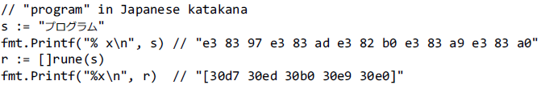

**Tips:** The verb % x in the first Printf inserts a space bet ween each pair of hex digits.

**Tips:** If a slice of runes is converted to a string , it produces the concatenation of the UTF-8 encodings of each rune:

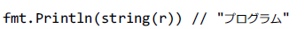

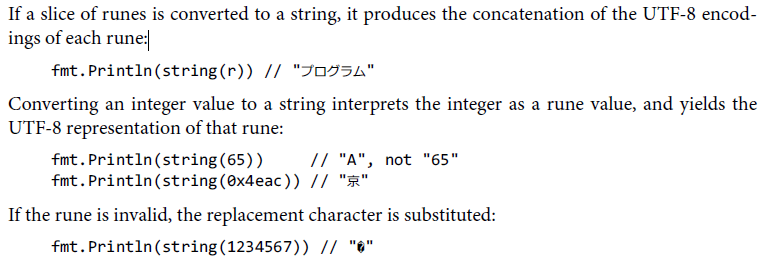

> The `unicode`package provides functions like IsDigit, IsLetter, IsUpper, and IsLower for classifying runes. ToUpper and ToLower to convert rune. **`string` package has similar functions**

> The **bytes** package provides the Buffer type for efficient manipulation of byte slices. A **Buffer** starts out empty but grows as data of types like **string, byte and []byte** are written to it.

- writeRune
- writeByte (to write ASCII)

> Conceptually, the **[]byte(s)** conversion **allocates a new byte array holding a copy of bytes of s**, and yield a slice that references the entirety of that array. **The conversion from byte slice to string with string(b) also makes a copy**

**To avoid conversions** and unnecessary memory allocation, many of utility functions in the bytes package directly parallel their counterparts in the strings package. for example: Contains, Count ...

> **strconv** / fmt.Sprintf

- strconv.FormatInt(int64(x), 2) // "1111011"
- fmt.Sprintf("%b", x)
- strconv.Itoa(x) // integer to string
- fmt.Sprintf("%d",x)
- x, err := strconv.Atoi("123") // to integer
- y, err := strconv.ParseInt("123", 10, 64) // base 10, up to 64 bits

## Constant

```go
const (
 a = 1
    b
    c = 2
    d
)
fmt.Println(a, b, c, d) // 1 1 2 2
```

**Enumerations**

```go
type Weekday int
const (
 Sunday Weekday = iota
    Monday
    Tuesday
    Wednesday
    Thursday
    Friday
    Saturday
)
```

```go
type Flags int

const (
 FlagUp Flags = 1 << iota
    FlagBroadcast
    FlagLoopback
    FlagPointToPoint
    FlagMulticast
)
```

```go
const (
    _ = 1 << (10 * iota)
    KiB // 1024
    MiB
    GiB
    TiB **** Exceeds 1 << 32
    PiB
    EiB
    ZiB **** Exceeds 1 << 
    YiB
)
```

```go
type Currency int
const (
 USD Currency = iota
    EUR
    GBP
    RMB
)
```

# 4 Composite Type

## Array

> q := [...]int{1,2,3} // fmt.Printf("%T", q) // [3]int

[3]int and [4]int are different types. So, this brings compile error:  q = [4]int{4,5,6}

> ```go
> type Currency int
> const (
>  USD Currency = iota
>     EUR
>     GBP
>     RMB
> )
> ```
>
> symbol := [...]string{USD: "$", EUR: "9", GBP: "!", RMB: """}  **indices can appear in any order**

fmt.Println(RMB, symbol[RMB])

> `r := [...]int{99: -1}` declare an array with 100 elements, all zero except last (99i) has value -1

> If an array's element type is comparable, then the array type is comparable too, so we may directly compare two arrays of the type using == operator, which reports whether all corresponding elements are equal.

```go
a := [2]int{1,2}
b := [...]int{1,2}
c := [2]int{1,3}
fmt.Println(a == b, a == c, b == c) // true false false
```

```go
c1 := sha256.Sum256([]byte("x"))
c2 := sha256.Sum256([]byte("X"))
fmt.Printf("%x\n%x\n%t\n%T\n", c1, c2, c1 == c2, c1)
// Output:
// 2d711642b726b04401627ca9fbac32f5c8530fb1903cc4db02258717921a4881
// 4b68ab3847feda7d6c62c1fbcbeebfa35eab7351ed5e78f4ddadea5df64b8015
// false
// [32]uint8
```

**Tips:** %x print all the elements of an array or slice of bytes in hexadecimal

> `func zero(arr [4]byte)` **arr is a copy, not the original**

**Use me instead**

```go
func zero(ptr *[32]byte) {
    for i := range ptr {
        ptr[i] = 0
    }
}
func zero(ptr *[32]byte) {
    *ptr = [32]byte{}
}
```

## Slice

- pointer -> points to first element of the array that is reachable through slice
- length
- capacity

> Below code is totally ok

```go
slice1 := make([]string, 1)
a := slice[0]
b := slice[1:] // ok, it is [1:1], thus become empty slice
c := slice[2:] // not ok!
```

> **Multiple slices can share the same underlying array**

```go
months := [...]string{1: "January", /*...*/, 12: "December"}
Q2 = months[4:7]
summer = months[6:9]
```

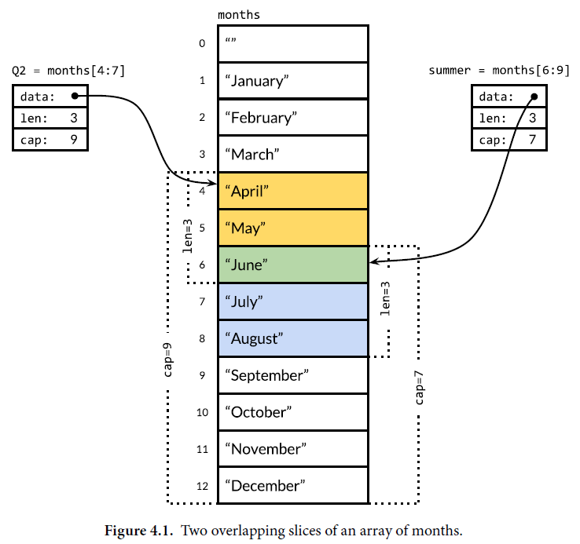

**Tips:** slicing beyond cap(s) causes panic, but slicing beyond len(s) extends the slice

```go
fmt.Println(summer[:20]) // panic
endlessSummer := summer[:5] //extend a slice within capacity
fmt.Println(endlessSummer) //[June July August September October]
```

> **Slice are not comparable,** so we cannot use == to test whether two slices contain the same elements.

The standard library provides the highly optimized **bytes.Equal** function for comparing two slices of bytes ([]byte).

For the other types of slice, we must do the comparison ourserlves:

```go
func equal(x, y []string) bool {
    if len(x) != len(y) {
        return false
    }
    for i := range x {
        if x[i] != y[i] {
            return false
        }
    }
    return true
}
```

> The only legal slice comparison is against nil, as in**if  summer == nil {/\*...\*/}**

```go
var s [int] // len(s) == 0, s == nil
s = nil // len(s) == 0, s == nil
s = []int(nil) // len(s) == 0, s == nil
s = []int{} // len(s) == 0, s == nil
```

**Thus,** if you need to test whether a slice is empty, use len(s)  == 0, not s == nil

**Tips:** reverse(nil) is completely save

> **append**

```go
var runes []rune
for _, r := range "Hello, 世界" {
    runes = append(runes, r)
}
fmt.Printf("%q\n", runes) // "['H' 'e' 'l' 'l' 'o' ',' ' ' 'B' 'F']"
```

```go
var x []int
x = append(x, 1)
x = append(x, 2, 3)
x = append(x, x...) // append the slice x, variadic
```

> Slices are not "pure" reference types but resemble an aggregate type such as this struct:

```go
type IntSlice struct {
    ptr *int
    len, cap int
}
```

> **Make use of same underlying array**

```go
// nonempty is an example of an in-place slice algorithm
func nonempty(strings []string) []string {
 i := 0
 for _, s := range strings {
  if s != "" {
   strings[i] = s
   i++
  }
 }
 return strings[:i]
}
```

```go
func noempty2(strings []string) []string {
 out := strings[:0] // zero-length slice of original
 for _, s := range strings {
  if s != "" {
   out = append(out, s)
  }
 }
 return out
}
```

> Implementing stack using slice

```go
stack = append(stack, v) // push
top := stack[len(stack-1)] // top of stack
stack := stack[:len(stack-1)] // pop
```

> **Remove from slice**

```go
func remove(slice []int, i int) []int {
    copy(slice[i:], slice[i+1:])
    return slice(:len(slice)-1)
}
```

```go
// if we don't need to preserve order.
func remove(slice []int, i int) []int {
    slice[i] = slice[len(slice)-1]
    return slice(:len(slice)-1)
}
```

> **append into nil is fine**

```go
func main() {
  fmt.Println(testSlice(nil)) // [sadf]
}

func testSlice(tests []string) [] string{
  return append(tests, "sadf")
}
```

## Map

```go
ages := map[string]int {
    "alice": 31,
    "charlie": 34,
}
```

```go
ages := make(map[string]int)
ages["alice"] = 31
ages["charlie"] = 34
```

> **Delete** -- it is safe even if the key is not in map

```go
delete(ages, "alice")
```

```go
ages["alice"]++ // is totally fine even alice is not presented
```

> **Map order is random**

To enumerate the key/value pairs in order, we must sort the key explicitly.

```go
import "sort"

var names []string
for name := range ages {
    names = append(names, name)
}
sort.Strings(names)
for _, name := range names {
    fmt.Printf("%s\t%d\n", name, ages[name])
}

```

> **Zero value**

```go
var ages map[string]int
fmt.Println(ages == nil) // true
fmt.Println(len(ages) == 0) // true
```

**Tips:** storing into nil map causes a panic. **You must allocate the map before you can store into it**

**Tips:** lookup, delete, len, and range is safe even nil map

> Maps **cannot be compared to each other**.

The only legal comparison is with **nil**

```go
func equal(x, y map[string]int) bool {
    if len(x) != len(y) {
        return false
    }
    for k, xv := range x {
        if yv, ok := y[k]; !ok || yv != xv {
            return false
        }
    }
    return true
}
```

> **ReadRune** method performs UTF-8 decoding and return three values: the decoded rune, the length of bytes, and an error value. If the input was not a legal UTF-8 encoding of a rune, the returned rune is unicode.ReplacementChar and the length is 1.

```go
// Charcount computes counts of Unicode characters
func charcount() {
 counts := make(map[rune]int)
 var utflen [utf8.UTFMax + 1]int
 invalid := 0

 in := bufio.NewReader(os.Stdin)
 for {
  r, n, err := in.ReadRune()
  if err == io.EOF {
   break
  }
  if err != nil {
   fmt.Fprintf(os.Stderr, "charcount: %v\n", err)
   os.Exit(1)
  }
  if r == unicode.ReplacementChar && n == 1 {
   invalid++
   continue
  }
  counts[r]++
  utflen[n]++
 }
 fmt.Printf("rune\tcount\n")
 for c, n := range counts {
  fmt.Printf("%q\t%d\n", c, n)
 }
 fmt.Print("\nlen\tcount\n")
 for i, n := range utflen {
  if i > 0 {
   fmt.Printf("%d\t%d\n", i, n)
  }
 }
 if invalid > 0 {
  fmt.Printf("\n%d invalid UTF-8 characteres\n", invalid)
 }
}
```

## Struct

> A named struct type S cannot declare a field with same type S: an aggregate value cannot contain itself (An analogous restriction applies to arrays).

But s may declare a field of the pointer type **\*S**

```go
type tree struct {
 value       int
 left, right *tree
}
```

> The struct with no fields is called the _empty_ struct, written `struct{}`. It has size zero and carries no information but may be useful nonetheless.

Some Go programmers use it instead of bool as the value type of a map that represents a set, to emphasize that only keys are significant, **but the space saving is marginal and the syntax more cumbersome, so we generally avoid it**

```go
seen := make(map[string]struct{})
if _, ok := seen[s]; !ok {
    seen[s] = struct{}{}
    ...
}
```

> **Struct Literal**
>
> A value of struct type can be written using struct literal that specifies values for its fields

```go
type Point struct{ X,Y int }
p := Point{1,2} // 1st: in the right order
anim := gif.GiF{LoopCount: nframes} // second (MOST USED),
```

**Tips:** 1st form makes code fragile should the set of fields later grow or be reordered. Accordingly this form tends to be used only within the package that defines the struct type, or with smaller struct types for which there is an obvious field ordering convention, like image.Point{x,y}

> For efficiency, **larger struct types are usually passed to or returned from** functions indirectly using pointer

```go
func Bonus(e *Employee, percent int) int {
    return e.Salary * percent / 100
}
```

```go
func AwardAnnualRaise(e *Employee) {
    e.Salary = e.Salary * 105 / 100
}
```

> **Struct are so commonly dealt with through pointers**, it's possible to use this shorthand notation to create and initialize a struct variable and obtain its address:

```go
pp := &Point{1,2}
// equavalent to
pp := new(Point)
*pp = Point{1,2}
```

> **Comparing structs**: if all the fields of a struct are comparable, the struct itself is comparable.

```go
p := Point{1,2}
q := Point{2,1}
fmt.Println(p.X == q.X && p.Y ==q.Y) // false
fmt.Println(p == q) // false
```

**Tips:** like other comparable types, may be used as the key type of a map

```go
type address struct {
    hostname string
    port int
}
hits := make(map[address]int)
hits[address{"golang.org", 433}]++
```

> **Anonymous fields**
>
> (Point is embedded within Circle)

```go
type Circle struct {
    Point
    Radius int
}
type Wheel struct {
    Circle
    Spokes int
}
var w wheel
w.X = 8
w.Y = 8
w.Radius = 5
w.Spokes = 20
```

**Tips:** even circle or point is unexported (lowercase), we can still use X as X is uppercase, `w.X = 8 // equavalent to w.circle.point.X = 8`

```go
w := anotherpkg1.Wheel{}
w.X = 1
```

> **NO corresponding short hand for the struct literal syntax**, so neither of these will compile:

```go
w = Wheel{8, 8, 5, 20} // compile error: unknown fields
w = Wheel{X: 8, y: 8, Radius: 5, Spokes: 20} // compile error: unknown fields
```

use below:

```go
w = Wheel{circle{Point{8, 8}, 5}, 20}
w = Wheel{
    circle: circle{
        Point: Point{X: 8, Y: 8},
    },
    Spokes: 20,
}

```

## JSON

> converting a Go data structure to JSON is called **marshaling**

```go
data, err := json.Marshal(movies)
if err != nil {
    log.Fatalf("JSON marshaling failed: %s", err)
}
fmt.Printf("%s\n", data)
```

> for human consumption, a variant called **json.MarshalIndent**

```go
data, err := json.MarshalIndent(movies, "", "  ")
if err != nil {
    log.Fatalf("JSON marshaling failed: %s", err)
}
fmt.Printf("%s\n", data)
```

> tag

- omitempty: indicates no JSON output should be produced if the field has the zero value for its type

> inverse operation to marshaling, decoding JSON and populating a Go datastructure, is called **unmarshaling**

```go
var titles []struct{ Title string }
if err := json.Unmarshal(data, &titles); err != nil {
    log.Fatalf("JSON unmarshaling failed: %s", err)
}
fmt.Println(titles)
```

> Example

```go
const IssueURL = "https://api.github.com/search/issues"

type IssuesSearchResult struct {
 TotalCount int `json:"total_count"`
 Items      []*Issue
}

type Issue struct {
 Number    int
 HTMLURL   string `json:"html_url"`
 Title     string
 State     string
 User      *User
 CreatedAt time.Time `json:"created_at"`
 Body      string    // In markdown format
}

type User struct {
 Login   string
 HTMLURL string `json:"html_url"`
}

func searchIssues(terms []string) (*IssuesSearchResult, error) {
 q := url.QueryEscape(strings.Join(terms, " "))
 resp, err := http.Get(IssueURL + "?q=" + q)
 if err != nil {
  return nil, err
 }

 if resp.StatusCode != http.StatusOK {
  resp.Body.Close()
  return nil, fmt.Errorf("search query failed: %s", resp.Status)
 }

 var result IssuesSearchResult
 if err := json.NewDecoder(resp.Body).Decode(&result); err != nil {
  resp.Body.Close()
  return nil, err
 }
 resp.Body.Close()
 return &result, nil
}

func SearchIssues() {
 result, err := searchIssues(os.Args[1:])
 if err != nil {
  log.Fatal(err)
 }
 fmt.Printf("%d issues: \n", result.TotalCount)
 for _, item := range result.Items {
  fmt.Printf("#%-5d %9.9s %.55s\n",
   item.Number, item.User.Login, item.Title)
 }
}
```

**Tips:** Since the query terms presented by a user could contain characters like ? and & that have special meaning in URL, we use url.QueryEscape to ensure that they are taken literally.

**Tips:** json.Decoder is _streaming decoder_, which allows several JSON entities to be decoded in sequence from the same stream

> **View exercise 4.10, 4.11, 4.12, 4.13**, there is  a lot of knowledge inside them

 ```go
 4.10
 // Modify issues to report the results in age categories, say less than
 // a month old, less than a year old, and more than a year old
 
 4.11
 // Build a tool that lets users create, read, update, and delete GitHub issues from
 // the command line, invoking their preferred text editor when substantial text input is
 // required.
 
 4.12
 // The popular web comic xkcd has a JSON interface. For example, a request to
 // https://xkcd.com/571/info.0.json produces a detailed description of comic 571, one of
 // many favorites. Download each URL (once!) and build an offline index. Write a tool xkcd
 // that, using this index, prints the URL and transcript of each comic that matches a search term
 // provided on the command line.
 
 4.13
 // The JSON-based web service of the Open Movie Database lets you search
 // https:// omdbapi.com/ for a movie by name and download its poster image.
 // Write a tool poster that downloads the poster image for the movie named on the command line.
 ```

## Text and HTML Template

> A template is a string or file containing one or more portions enclosed in double braces,
>
> {{...}}, called actions. `|` notation makes the result of one operation the argument of another, analogous to a Unix shell pipeline.

**text/template**

```go
const templ = `{{.TotalCount}} issues:
{{range.Items}}-----------------------------
Number: {{.Number}}
User: {{.User.Login}}
Title: {{.Title | printf "%.64s"}}
Age: {{.CreatedAt | daysAgo}} days
{{end}}
`

// because templates are usually fixed at compile time,
// failure to parse a template indicates a fatal bug in the program.
// The template.Must helper function makes error handling more convenient
var report = template.Must(template.New("issuelist").
 Funcs(template.FuncMap{"daysAgo": daysAgo}).
 Parse(templ))

func issuesReport() {
 // report, err := template.New("report").
 //  Funcs(template.FuncMap{"daysAgo": daysAgo}).
 //  Parse(templ)
 // if err != nil {
 //  log.Fatal(err)
 // }
 // result, err := searchIssues(os.Args[1:])
 result, err := searchIssues([]string{"json", "decode"})
 if err != nil {
  log.Fatal(err)
 }
 if err := report.Execute(os.Stdout, result); err != nil {
  log.Fatal(err)
 }
}

func daysAgo(t time.Time) int {
 return int(time.Since(t).Hours() / 24)
}
```

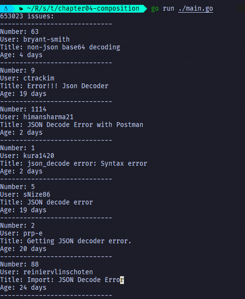

**html/template**

```go
var issueList = htmltemplate.Must(htmltemplate.New("issuelist").Parse(`
<h1>{{.TotalCount}} issues</h1>
<table>
<tr style='text-align: left'>
  <th>#</th>
  <th>State</th>
  <th>User</th>
  <th>Title</th>
</tr>
{{range .Items}}
<tr>
  <td><a href='{{.HTMLURL}}'>{{.Number}}</td>
  <td>{{.State}}</td>
  <td><a href='{{.User.HTMLURL}}'>{{.User.Login}}</a></td>
  <td><a href='{{.HTMLURL}}'>{{.Title}}</a></td>
</tr>
{{end}}
</table>
`))

func issuesReportHTML() {
  result, err := searchIssues([]string{"repo:golang/go", "3133", "10535"})
 if err != nil {
  log.Fatal(err)
 }
 if err := issueList.Execute(os.Stdout, result); err != nil {
  log.Fatal(err)
 }
}
```

**Tips:** if text/template is used in html, the four-character string "\&lt;" would have been rendered as a '<', and the string "<link\>" would have become a link element

> We can suppress this auto-escaping behavior for fields that contain trusted HTML data by using named string type template.HTML instead of string, similar named types exist for trusted JavaScript, CSS, and URLS

```go
func autoescape() {
 const templ = `<p>A: {{.A}}</p><p>B: {{.B}}</p>`
 t := htmltemplate.Must(htmltemplate.New("escape").Parse(templ))
 var data struct {
  A string            // untrusted plain text
  B htmltemplate.HTML // trusted HTML
 }
 data.A = "<b>Hello!</b>"
 data.B = "<b>Hello!</b>"
 if err := t.Execute(os.Stdout, data); err != nil {
  log.Fatal(err)
 }
}
```

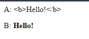

> For map

```go
{{ range $k, $v .Map }}
{{ $k }}
{{ $v }}
```

# 5 Functions

> A functions hides its implementation details from its users

> **Four ways** to declare a function

```go
func add(x int, y int) int {return x + y}
func sub(x, y int) (z int) {z=x-y; return}
func first(x int, _ int) int {return x}
func zero(int, int) int {return 0}
fmt.Printf("%T\n", add) // "func(int, int) int"
```

> You may occasionally encounter a function declaration without a body, indicating that the function is implemented in a language other than Go

```go
package math

func Sin(x float64) float64 // implemented in assembly language
```

> **golang.org/x/...** repositories hold packages designed and maintained by Go team for application such as networking, internationalized text processing, mobile platforms, image manipulation, cryptography, and developer tools.

These packages are not in the standard library because they're still under development or because they're rarely needed by the majority of Go programmers.

> **golang.org/x/net/html**

- html.Parse

  - reads a sequence of bytes, parses them, and returns the root of the HTML document tree, which is an html.Node. eg \<name key='value'>

  - ```go
    type Node struct {
        Type NodeType
        Data string
        Attr []Attribute
        FirstChild, NextSibling *Node
    }
    type NodeType int32
    
    const (
     ErrorNode NodeType = iota
     TextNode
     DocumentNode
     ElementNode
     CommentNode
     DoctypeNode
     // RawNode nodes are not returned by the parser, but can be part of the
     // Node tree passed to func Render to insert raw HTML (without escaping).
     // If so, this package makes no guarantee that the rendered HTML is secure
     // (from e.g. Cross Site Scripting attacks) or well-formed.
     RawNode
     scopeMarkerNode
    )
    
    const (
        // ErrorToken means that an error occurred during tokenization.
        ErrorToken TokenType = iota
     // TextToken means a text node.
     TextToken
     // A StartTagToken looks like <a>.
     StartTagToken
     // An EndTagToken looks like </a>.
     EndTagToken
     // A SelfClosingTagToken tag looks like <br/>.
     SelfClosingTagToken
     // A CommentToken looks like <!--x-->.
     CommentToken
     // A DoctypeToken looks like <!DOCTYPE x>
     DoctypeToken
    )
    
    ```

```go
func main() {
 Findlinks()
}

func Findlinks() {
 doc, err := html.Parse(os.Stdin)
 if err != nil {
  fmt.Fprintf(os.Stderr, "findlinks1: %v\n", err)
  os.Exit(1)
 }
 visit(doc)
}

func visit(n *html.Node) {
 if n.Type == html.ElementNode && n.Data == "a" {
  for _, a := range n.Attr {
   if a.Key == "href" {
    fmt.Println(a.Val)
   }
  }
 }
 for c := n.FirstChild; c != nil; c = c.NextSibling {
  visit(c)
 }
}
```

> Recusive

Many programming language implementations use a fixed-size function call stack; sizes from 64KB to 2MB are typical. Fixed-size stacks impose a limit on the depth of recursion, so one must be careful to avoid a _stack overflow_ when traversing large data structures recursively.

In contrast, typical Go implementations use variable-size stacks that start small and grow as needed up to a limit on the order of a gigabyte. This let us use recursion safely and without worrying about overflow.

> **We must ensure that resp.Body is closed** so that network resources are properly released even in case of error. Go's garbage collector recycles unused memory, but do not assume it will release unused operating system resources like **open files**, **network connections**.

They should be closed explicitly

> The result of a multi-valued call may itself be returned from a (multi-valued) calling function

```go
func findLinksLog(url string) ([]string, error) {
    log.Prinf("findLinks %s", url)
    return findlinks(url)
}
```

> A multi-valued call may appear as the sole argument when calling a function of multiple parameters. Although rarely used in production code, this feature is sometimes convenient during **debugging**

```go
log.Println(findLinks(url))
// equivalent to
links, err := findLinks(url)
log.Println(links, err)
```

> Well-chosen names can document the significance of a function's results.

```go
func Size(rec image.Rectangle) (width, height int)
func Split(path string) (dir, file int)
```

> **Bare return**
>
> - the operands of return statement may be omitted.

```go
func CountWordsAndImages
```

> Bare returns can reduce code duplication, but they rarely make code easier to understand. Thus, **bare returns are best used sparingly**

## Error

> - Some functions always succeed at their task, eg strings.Contains, strconv.FormatBool --- have well-defined results for all possible argument values and cannot fail
> - Other functions always succeed so long as their preconditions are met, eg time.Date function always construct a time.Time from its components -- year, month, and so on-- unless the last argument (the time zone) is nil, in which case it panics. **This panic is a sure sign of a bug in the calling code and should never happen in a well-written program.**
> - For many other functions, even in a well-written program, success is not assured because it depends on factors beyond the programmer's control. More often and especially for I/O, the failure may have variety of causes for which the caller will need an explanation. In such cases, the type of the additional result is error.

> non-nil **error** has an error message string, err.Error method

```go
// or print by calling
fmt.Println(err)
fmt.Printf("%v", err)
```

> **fmt.Errorf** function formats an error message using fmt.Sprintf

> **When the error is ultimately handled by the program's main function, it should provide a clear causal chain from the root problem to the overall failure**

> Because error messages are frequently chained together, **message strings should not be capitalized and newlines should be avoided**. The resulting errors may be long, but they will be self-contained when found by tools like grep.

> When designing error message, be deliberate, so that each one is a meaningful description of the problem with sufficient and relevant detail, and be consistent, so that **error returned by the same function of by a group of functions in the same package are similar in form and can be dealt with in the same way**

> **In general, the call f(x) is responsible for reporting the attempted operation f and the argument value x as they relate to the context of the error.**

> **Strategy:**
>
> **Retry**

```go
// WaitForServer attempts to contact the server of a URL.
// It tries for one minute using exponential back-off.
// It reports an error if all attempts fail.
func WaitForServer(url string) error {
 const timeout = 1 * time.Minute
 deadline := time.Now().Add(timeout)
 for tries := 0; time.Now().Before(deadline); tries++ {
  _, err := http.Head(url)
  if err == nil {
   return nil
  }
  log.Printf("server not responding (%s); retrying...", err)
  time.Sleep(time.Second << uint(tries))
 }
 return fmt.Errorf("server %s failed to respond after %s", url, timeout)
}
```

> **Strategy**
>
> **print and stop the program**
>
> - this course of action should generally be reserved for the main package of a program
> - Library functions should usually propagate errors to the caller

```go
// (In function main)
if err := WaitForServer(url); err != nil {
    fmt.Fprintf(os.Stderr, "Site is down: %v\n", err)
    os.Exit(1)
}
```

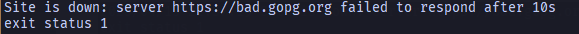

**Tips:** `log.Fatalf("Site is down:%v\n", err)` did the same. By default it prefixes the time and date to the error message

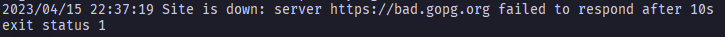

**Tips:** `log.SetPrefix("wait: ") log.SetFlags(0)` to suppress the display of the date and time

**Tips:** Alll `log` functions append a newline if one is not already present.

```go
log.Printf("a")
log.Printf("b")
// a
// b
```

> **Strategy**
>
> rare case, safely ignore an error entirely:

```go
dir, err := ioutil.TempDir("", "scratch")
if err != nil {
    return fmt.Errorf("failed to create temp dir: %v", err)
}
// ... use temp dir ...
os.RemoveAll(dir) // ignore error, $TMPDIR is cleaned periodically
```

The call to os.RemoveAll may fail, but the program ignores it because the operating system periodically cleans out the temporary directory

### End of File (EOF)

```go
in := bufio.NewReader(os.Stdin)
for {
    r, _, err := in.ReadRune()
    if err == io.EOF {
        break
    }
    if err != nil {
        return fmt.Errorf("read failed: %v", err)
    }
    // ... use r ...
}
```

## Function Values

> The zero value of a function type is nil

```go
var f func(int) int
f(3) // panic: call of nil function
```

> Not comparable

They may not be compared against each other or used as keys in map

> strings.Map

```go
func add1(r rune) rune {return r+1}

fmt.Println(strings.Map(add1, "HAL-9000")) // "IBM.:111"
fmt.Println(strings.Map(add1, "VMS")) // "WNT"
fmt.Println(strings.Map(add1, "Admix")) // "Benjy"
```

> Use a function value to seperate the logic

```go
// forEachNode callse the functions pre(x) and post(x) for each forEachNode
// x in the tree rooted at n. Both functions are optional.
// pre is called before the children are visited (preorder) and
// post is called after (postorder)
func forEachNode(n *html.Node, pre, post func(n *html.Node)) {
 if pre != nil {
  pre(n)
 }
 for c := n.FirstChild; c != nil; c = c.NextSibling {
  forEachNode(c, pre, post)
 }
 if post != nil {
  post(n)
 }
}

var depth int

func startElement(n *html.Node) {
 if n.Type == html.ElementNode {
  fmt.Printf("%*s<%s>\n", depth*2, "", n.Data)
  depth++
 }
}

func endElement(n *html.Node) {
 if n.Type == html.ElementNode {
    depth--
  fmt.Printf("%*s</%s>\n", depth*2, "", n.Data)
 }
}
```

## Anonymous function

`strings.Map(func(r rune) rune { return r + 1}, "HAL-9000")`

> Have access to the entire lexical environment, so the inner function can refer to variables from the enclosing function. Function value like these are implemented using a technique called **closure**.

```go
// squres returns a function that returns
// the next square number each time it is called.
func squares() func() int {
 var x int
 return func() int {
  x++
  return x * x
 }
}
```

> When an anonymous function requires recursion, we must first declare a variable, and then assign the anonymous function to that variable

```go
func topoSort(m map[string][]string) []string {
 var order []string
 seen := make(map[string]bool)
 var visitAll func(items []string)
 visitAll = func(items []string) {
  for _, item := range items {
   if !seen[item] {
    seen[item] = true
    visitAll(m[item])
    order = append(order, item)
   }
  }
 }
 var keys []string
 for key := range m {
  keys = append(keys, key)
 }
 sort.Strings(keys)
 visitAll(keys)
 return order
}
```

> **Caveat: Capturing iteration variable**
>
> The reason of declaration and assignment of d is:
>
> The for loop introduces a new lexical block in which the variable dir is declared. All function values created by this loop "capture" and share the same variable -- an addressable storage location, not its value at that particular moment. The value dir is updated in successive ieterations, so by the time the cleanup functions are called, the dir variable has been updated several times by the now-completed for loop. Thus, all calls to os.RemoveAll will attempt to remove the same directory

```go
func pitfall() {
  var rmdirs []func()
  for _, d := range tempDirs() {
    dir := d // NOTE: NECESSARY
    os.MkdirAll(dir, 0755) // creates parent directories too
    rmdirs = append(rmdirs, func() {
      os.RemoveAll(dir)
    })
    // do some work
    for _, rmdir := range rmdirs {
      rmdir()
    }
  }
}
```

**Tips:** it is not unique to range-based for loops. The fori (dirs[i]) have the same problem

## Variadic Functions

```go
func sum(vals ...int) int {
 total := 0
 for _, val := range vals {
  total += val
 }
 return total
}

fmt.Println(sum()) // "0"
fmt.Println(sum(3)) // "3"
fmt.Println(sum(1, 2, 3, 4)) // "10"
```

**Tips:** invoke a variadic function from slice

```go
values := []int{1, 2, 3, 4}
fmt.Println(sum(values...)) // "10"
```

> Although the ...int parameter behaves like a slice within the function body, the type of a variadic function is distinct from the type of a function with an ordinary slice parameter.

```go
func f(...int) {}
func g([]int) {}
fmt.Printf("%T\n", f) // "func(...int)"
fmt.Printf("%T\n", g) // "func([]int)"
```

> Variadic functions are often used for string formatting.

```go
func errorf(linenum int, format string, args ...interface{}) {
fmt.Fprintf(os.Stderr, "Line %d: ", linenum)
fmt.Fprintf(os.Stderr, format, args...)
fmt.Fprintln(os.Stderr)
}
linenum, name := 12, "count"
errorf(linenum, "undefined: %s", name) // "Line 12: undefined: count"
```

**Tips:** The suffix **f** is widely followed naming convention for variadic functions that accept a Printf-style format string.

## Deferred Function Calls

> Duplication of clean-up logic (eg. resp.Body.Close() ) may become a maintenance problem as functions grow more complex and have to handle more error.

> **The right place for a defer statement** that releases a resource is immediately after resource has been successfully acquired.

```go
func title2(url string) error {
 resp, err := http.Get(url)
 if err != nil {
  return err
 }
  defer resp.Body.Close()
 // Check Content-Type is HTML (e.g., "text/html; charset=utg-8")
 ct := resp.Header.Get("Content-Type")
 if ct != "text/html" && !strings.HasPrefix(ct, "text/html") {
  return fmt.Errorf("%s has type %s, not text/html", url, ct)
 }
 doc, err := html.Parse(resp.Body)
 if err != nil {
  return fmt.Errorf("parsing %s as HTML: %v", url, err)
 }
 visitNode := func(n *html.Node) {
  if n.Type == html.ElementNode && n.Data == "title" &&
   n.FirstChild != nil {
   fmt.Println(n.FirstChild.Data)
  }
 }
 forEachNode(doc, visitNode, nil)
 return nil
}
```

> **Same pattern to close an open file** and mutex

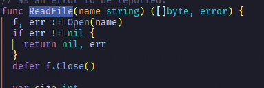

```go
var mu sync.Mutex
var m = make(map[string]int)

func lookup(key string) int {
  mu.Lock()
  defer mu.Unlock()
  return m[key]
}
```

> **Defer** statement can be used to pair "on entry" and "on exit" actions

```go
func bigSlowOperation() {
 defer trace("bigSlowOperation")() // do not forget the extra parentheses
 time.Sleep(10 * time.Second)
}

func trace(msg string) func() {
 start := time.Now()
 log.Printf("enter %s", msg)
 return func() { log.Printf("exit %s (%s)", msg, time.Since(start)) }
}
```

> **By naming result variable**, we can make the function print its arguments and result each time it is called.

```go
func double(x int) (result int) {
    defer func() {fmt.Println("double(%d) = %d\n", x, result)}()
    return x + x
}
```

> Deferred anonymous function can even**change the values of result**

```go
func triple(x int) (result int) {
 defer func() {result += x}()
 return double(x)
}
```

> **Because deferred functions aren't executed until the very end of a functions' execution, a defer statement in a loop deserves extra scrutiny**

```go
BAD
===
for _, filename := range filenames {
    f, err := os.Open(filename)
    if err != nil {
        return err
    }
    defer f.Close() // NOTE: risky! could run out of file descriptors
    // ...process f...
}
```

```go
// move it to another function
for _, filename := range filenames {
    if err := doFile(filename); err != nil {
        return err
    }
}

func doFile(filename string) error {
    f, err := os.Open(filename)
    if err != nil {
        return err
    }
    defer f.Close()
    // ...process f...
}
```

> **Subtly wrong using defered call to f.Close**, On many file system, notably NFS, write errors are not reported immediately but may be postponed until the file is closed. Failure to check the result of the close operation could cause serious data loss to go unnoticed. However, we should prefer to report error from io.Copy than f.Close() since it occurred first and is more likely to tell us the root cause.

```go

// Fetch downloads the URL and returns the
// name and length of the local file.
func fetch(url string) (filename string, n int64, err error) {
 resp, err := http.Get(url)
 if err != nil {
  return "", 0, err
 }
 defer resp.Body.Close()

 local := path.Base(resp.Request.URL.Path)
 if local == "/" {
  local = "index.html"
 }
 f, err := os.Create(local)
 if err != nil {
  return "", 0, err
 }
 n, err = io.Copy(f, resp.Body)
 // Close file, but prefer error from copy if any
 if closeErr := f.Close(); err == nil {
  err = closeErr
 }
 return local, n, err
}
```

## Panic

> Not all panics come from the runtime.
>
> The built-in panic function may be called directly. A panic is often the best thing to do when some "impossible" situation happens

```go
switch s := suit(drawCard()); s {
    case "Spades": //...
    case "Hearts": //...
    case "Diamonds": //...
    case "Clubs": //...
default:
    panic(fmt.Sprintf("invalid suit %q", s))
}
```

> Since most regular expressions are literals in the program source code, the **regexp** package provides a wrapper function **regexp.MustCompile** that does the checking, panicking if fail

```go
func Compile(expr string) (*Regexp, error) { /* ... */ }

func MustCompile(expr string) *Regexp {
    re, err := Compile(expr)
    if err != nil {
        panic(err)
    }
    return re
}
```

Makes it convenient for clients to initialize a package-level variable with a compiled regular expression

```go
var httpSchemeRE = regexp.MustCompile(`^https?:`) // "http:" or "https:"
```

> **Must method** should not be called with untrusted input values

> For diagnostic purposes, the runtime package lets the programmer dump the stack using the same machinery. By deferring a call to printStack in main,

```go
func f(x int) {
 fmt.Printf("f(%d)\n", x+0/x) // panics if x == 0
 defer fmt.Printf("defer %d\n", x)
 f(x - 1)
}

func PrintStack() {
  defer printStack()
  f(3)
}

func printStack() {
  var buf [4096]byte
  n := runtime.Stack(buf[:], false)
  os.Stdout.Write(buf[:n])
}
```

> Go's panic mechanism runs the deferred functions **before** it unwinds the stack.

### Recover

```go
func Parse(input string) (s *Syntax, err error) {
    defer func() {
        if p := recover(); p != nil {
            err = fmt.Errorf("internal error: %v", p)
        }
    }()
    // ...parser...
}
```

> Recovering indiscriminately from panics is a dubious practice because the state of a package's variables after a panic is rarely well defined or documented.

> Recovering from a panic within the same package can help simplify the handling of complex or unexpected errors.

**But as a general rule, you should not attempt to recover from another package's panic**. Public APIs should report failures as **errors**.

**Similarly, you should not recover from a panic that may pass through a function you do not maintain, such as a caller-provided callback, since you cannot reason about its safety**

> the **net/http** package provides a web server that dispatches incoming requests to user-provided handler functions. Rather than let a panic in one of these handlers kill the process, the server calls recover, prints a stack trace, and continues serving

This is convenient in practice, but it does risk leaking resources or leaving the failed handler in an unspecified state that could lead to other problems.

> Example
>
> This example does somewhat violate our advice about not using panics for "expected" errors, but it provides a compact illustration of the machanics.

```go
// soleTitle returns the text of the first non-empty title element
// in doc, and an error if there was not exactly one.
func soleTitle(doc *html.Node) (title string, err error) {
 type bailout struct{}

 defer func() {
  switch p := recover(); p {
  case nil:
  // no panic
  case bailout{}:
   // "expected" panic
   err = fmt.Errorf("multiple title elements")
  default:
   panic(p) // unexpected panic; carry on panicking
  }
 }()

 // Bail out of recursion if we find more than one non-empty title.
 forEachNode(doc, func(n *html.Node) {
  if n.Type == html.ElementNode && n.Data == "title" &&
   n.FirstChild != nil {
   if title != "" {
    panic(bailout{})
   }
   title = n.FirstChild.Data
  }
 }, nil)
 if title == "" {
  return "", fmt.Errorf("no title element")
 }
 return title, nil
}

```

# 6 Methods

## Method Declaration

```go
// traditional function
func Distance(p, q Point) float64 {
 return math.Hypot(q.X-p.X, q.Y-p.Y)
}

// same thing, but as a method of the Point type
func (p Point) Distance(q Point) float64 {
 return math.Hypot(q.X-p.X, q.Y-p.Y)
}
```

> In Go, we don't use a special name like this or self for the receiver; we choose receiver names just as we would for any other parameter

**A common choice of receiver name is the first letter of the type name, like p for Point**. It's a good idea to choose something short and to be consistent across methods as receiver name will be frequently used.

> The expression p.Distance is called a **selector**, because it selects the appropriate Distance method for the receiver p of type Point. Selectors are also used to select fields of struct types, as in P.X.

Since methods and fields inhabit the same name space, declaring a method X on the struct type Point would be ambiguous and the compiler will reject it.

> **Benefit:** method names can be shorter

```go
  perim := Path{{1,1}, {5,1}, {5,4},{1,1}}
  fmt.Println(geometry.PathDistance(perim))
  fmt.Println(perim.Distance())
```

## Methods with a Pointer Receiver

> - If an argument is so large
> - if a function needs to update a variable
>
> we must pass the address of the variable using pointer. Same goes for methods that need to update receiver variable

```go
func (p *Point) ScaleBy(factor float64) {
    p.X *= factor
    p.Y *= factor
}
```

> To avoid ambiguities, method declarations are not permitted on named types that are themselves pointer types:

```go
type P *int
func (P) f() { /* ... */ } // compile error: invalid receiver type
```

> The (*Point).ScaleBy can be called by

```go
// 1
r := &Point{1,2}
r.ScaleBy(2)
fmt.Println(*r) // "{2, 4}"

// 2 -- ungainly...
p := Point{1,2}
pptr := &p
pptr.ScaleBy(2)
fmt.Println(p) // "{2, 4}"

// 3 -- ungainly...
p := Point{1, 2}
(&p).ScaleBy(2)
fmt.Prinln(p) // "{2, 4}"

// 4 - if receiver p is variable of type Point but the method requires a *Point receiver, we can use this shorthand *** WORK ONLY FOR VARIABLES
p := Point{1,2}
p.ScaleBy(2)
fmt.Println(p) // "{2, 4}"

Point{1,2}.ScaleBy(2) // compile error -- no way to obtain address of temporary value
```

> Either one is true

- both have type T

  `Point{1, 2}.Distance(p)`

- both have type *T

  `pptr.ScaleBy(2)`

- receiver argument is a _variable_ of type T and receiver parameter has type *T. The compiler implicitly takes the address of the variable

  `p.ScaleBy(2) // implicit (&p)`

- receiver argument has type *T and the receiver parameter has type T

  `pptr.Distance(p) // implicit (*pptr)`

> If all the methods of a named type T have a receiver type of T itself (not *T), it is safe to copy instances of that type; calling any of its methods necessarily makes a copy.
>

For example,time.Duration values are liberally copied, including as arguments to functions.

But if any method has a pointer receiver, you should avoid copying instances of T because doing so may violate internal invariants. For example, copying an instance of bytes.Buffer would cause
the original and the copy to alias the **same underlying array** of bytes. Subsequent method calls would have unpredictable effects.

### Nil is a valid Receiver Value

```go
// An IntList is a linked list of integers.
// A nil *IntList represents the empty list.
type IntList struct {
  Value int
  Tail *IntList
}

func (list *IntList) Sum() int {
  if list == nil {
    return 0
  }
  return list.Value + list.Tail.Sum()
}
```

> **When you define a type whose methods allow nil as a receiver value, it's worth pointing this out explicitly in this documentation comment, as we did above**

Below is url package

```go
// Values maps a string key to a list of values
type Values map[string][]string

// Get returns the first value associated with the given key,
// or "" if there are none.
func (v Values) Get(key string) string {
  if vs := v[key]; len(vs) > 0 {
    return vs[0]
  }
  return ""
}

// Add adds the value to key
// It appends to any existing values associated with key/
func (v Values) Add(key, value string) {
  v[key] = append(v[key], value)
}

```

```go
func URLValues() {
  m := url.Values{"lang": {"en"}}
  m.Add("item", "1")
  m.Add("item", "2")

  fmt.Println(m.Get("lang")) // "en"
  fmt.Println(m.Get("q")) // ""
  fmt.Println(m.Get("item")) // "1"
  fmt.Println(m["item"]) // [1 2]
  m = nil
  fmt.Println(m.Get("item")) // "" ** Pay attention to here
  m.Add("item", "3") // panic
}
```

## Composing Types by Struct Embedding

```go
type ColoredPoint struct {
  Point
  Color color.RGBA
}
.. 
red := color.RGBA{255, 0, 0, 255}
var p = ColoredPoint{Point{1,1}, red}
fmt.Println(p.Distance(q.Point))
```

**Tips:** ColoredPoint is not a Point, it "has a" Point

> The type of anonymous field may be a _pointer_ to a named type.

Adding another level of indirection lets us share common structures and vary the relationships between objects dynamically.

```go
type ColoredPoint struct {
    *Point
    Color color.RGBA
}
...
q.Point = p.Point
p.ScaleBy(2)
fmt.Println(*p.Point, *q.Point)
```

> Possible and sometimes useful for ***unnamed types*** to have methods too, thanks to embedding

```go
var (
 mu      sync.Mutex // guards mapping
 mapping = make(map[string]string)
)

func Lookup(key string) string {
 mu.Lock()
 v := mapping[key]
 mu.Unlock()
 return v
}
// after
var cache = struct {
 sync.Mutex
 mapping map[string]string
}{mapping: make(map[string]string)}

func Lookup1(key string) string {
 cache.Lock()
 v := cache.mapping[key]
 cache.Unlock()
 return v
}
```

The new variable gives more expressive names to the variables relates to the cache

## Method Values and Expressions

> Method values are useful when a package's API calls for a function value

```go
type Rocket struct { /* ... */ }
func (r *Rocket) Launch() { /* ... */ }
r := new(Rocket)
time.AfterFunc(10 * time.Second, r.Launch)
```

> Method expressions can be useful when you need a value to represent a choice among several methods belonging to the same type so that you can call the chosen method with many different receivers.

```go
func (p Point) Add(q Point) Point { return Point{p.X + q.X, p.Y + q.Y} }
func (p Point) Sub(q Point) Point { return Point{p.X - q.X, p.Y - q.Y} }

func (path Path) TranslateBy(offset Point, add bool) {
 var op func(p, q Point) Point
 if add {
  op = Point.Add
 } else {
  op = Point.Sub
 }
 for i := range path {
  // Call either path[i].Add(offset) or path[i].Sub(offset).
  path[i] = op(path[i], offset)
 }
}
```

## Example: Bit Vector Type

> A bit vector use a slice of unsigned integer values or "words", each bit of which represents a possible element of the set. The set contains _i_ if the _i-th_ bit is set.

```go
// An IntSet is a set of small non-negative integers.
// Its zero value represents the empty set.
type IntSet struct {
 words []uint64
}

// Has reports whether the set contains the non-negative value x.
func (s *IntSet) Has(x int) bool {
 word, bit := x/64, uint(x%64)
 return word < len(s.words) && s.words[word]&(1<<bit) != 0
}

// Add adds the non-negative value x to the set
func (s *IntSet) Add(x int) {
 word, bit := x/64, uint(x%64)
 for word >= len(s.words) {
  s.words = append(s.words, 0)
 }
 s.words[word] |= 1 << bit
}

// UnionWith sets s to the union of s and t.
func (s *IntSet) UnionWith(t *IntSet) {
 for i, tword := range t.words {
  if i < len(s.words) {
   s.words[i] |= tword
  } else {
   s.words = append(s.words, tword)
  }
 }
}

// String returns the set as a string of the form "{1 2 3}"
func (s *IntSet) String() string {
 var buf bytes.Buffer
 buf.WriteByte('{')
 for i, word := range s.words {
  if word == 0 {
   continue
  }
  for j := 0; j < 64; j++ {
   if word&(1<<uint(j)) != 0 {
    if buf.Len() > len("{") {
     buf.WriteByte(' ')
    }
    fmt.Fprintf(&buf, "%d", 64*i+j)
   }
  }
 }
 buf.WriteByte('}')
 return buf.String()
}
func main() {
 var x, y IntSet
 x.Add(1)
 x.Add(144)
 x.Add(9)
 fmt.Println(x.String()) // "{1 9 144}"

 y.Add(9)
 y.Add(42)
 fmt.Println(y.String()) // "{9 42}"

 x.UnionWith(&y)
 fmt.Println(x.String())           // "{1 9 42 144}"
 fmt.Println(x.Has(9), x.Has(123)) // "true false"
}
```

**Tips:** Making String a method of intSet, not *IntSet, might be a good idea, but this is a case-by-case judgement

```go
Caution.. IntSet value does not have a String method
=========
fmt.Println(&x) // "{1 9 42 144}"
fmt.Println(x) // "{[4398046511618 0 65535]}"
```

> **Encapsulation**, that's the reason the IntSet type from the example was declared as a struct type even though it has only a single field:

```go
type IntSet struct {
    words []uint64
}
```

> **In Go**, when naming a **getter** method, we usually omit the **Get** prefix, this preference for brevity extends to all methods, not just field accessors. **And** to other redundant prefixes as well, such as Fetch, Find, and Lookup.

# 7 Interface

**Advice**

When designing a new package, novice Go programmers often start by creating a set of interfaces and only later define the concrete types that satisfy them. This approach results in many interfaces, each of which has only a single implementation. **Don't do that**. Such interfaces are unnecessary abstractions; they also have a run-time cost.

**Interfaces are only needed when there are two or more concrete types that must be dealt with in a uniform way**

**Tips:** Exception when an interface is satisfied by a single concrete type but that type cannot live in the same package as the interface because of its dependencies.

**A good rule of thumb for interface design is ask only for what you need**. Design small interface with fewer, simpler methods, often just one as with io.Writer or fmt.Stringer

## Interfaces as Contracts

> An interface is an _abstract_ type. It does not expose the representation or internal structure of its values.

> The F prefix of **Fprintf** stands for _file_ and indicates that the formatted output should be written to the file provided as the first argument.

In the Printf case, the argument, osStdout, is an *os.File.

In the Sprintf case, &buf is a pointer to a memory buffer to which bytes can be written.

> Declare a **String** method makes a type satisfy one of the most widely used interfaces of all, **fmt.Stringer**:

```go
package fmt
// The String method is used to print values passed
// as an operand to any format that accepts a string
// or to an unformatted printer such as Print.
type Stringer interface {
 String() string
}
```

## Interface Satisfaction

> **embedding** an interface

```go
type ReadWriter interface {
    Reader
    Writer
}

type ReadWriterCloser interface {
    Reader
    Writer
    Closer
}
```

> Assignability rule

```go
var w io.Writer
w = os.Stdout // ok
w = new(bytes.Buffer) // ok
w = time.Second // compile error: time.Duration lacks Write Method

var rwc io.ReadWriteCloser
rwc = os.Stdout // ok
rwc = new(bytes.Buffer) // compile error: lacks Close method

w = rwc // ok
rwc = w // compile error
```

## Parsing Flags with flag.Value

```go
type Celsius float64

type Fahrenheit float64

func (c Celsius) String() string    { return fmt.Sprintf("%g°C", c) }
func (f Fahrenheit) String() string { return fmt.Sprintf("%g°F", f) }

const (
 AbsoulateZeroC Celsius = -273.15
 FreezingC      Celsius = 0
 BoilingC       Celsius = 100
)

func CToF(c Celsius) Fahrenheit {
 return Fahrenheit(c*9/5 + 32)
}

func FToC(f Fahrenheit) Celsius {
 return Celsius((f - 32) * 5 / 9)
}

// CelsiusFlag defines a Celsius flag with the specified name,
// default value, and usage, and requtns the address of the flag variable.
// The flag argument must have a quantity and a unit, e.g., 100C,
func CelsiusFlag(name string, value Celsius, usage string) *Celsius {
 f := celsiusFlag{value}
 flag.CommandLine.Var(&f, name, usage)
 return &f.Celsius
}

var temp = CelsiusFlag("temp", 20.0, "the temperature")
func main() {
  flag.Parse()
  fmt.Println(*temp)
}
```

The call to Var adds the flag to the application's set of command-line flags, the global variable flag.CommandLine. Program with unusually complex command-line interfaces may have several variables of this type.

**Tips:** `program -help` for help

## Interface Values

> Conceptually, a value of an interface type, or _interface value_, has two components, a concrete type and a value of that type.

These are called the interface's _dynamic type_ and _dynamic value_

> In Go, variables are always initialized to a well-defined value, and interfaces are no exception.

The zero value for an interface has both its type and value components set to nil

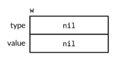

> An interface value is described as nil or non-nil based on its **dynamic type**. So above is a **nil** interface value.

**Calling any method of nil interface value causes a panic**

```go
var w io.Writer
w.Write([]byte("hello")) // panic
```

> **Assignment**. Involves an implicit conversion from a concrete type to an interface type, is equivalent to the explicit conversion **io.Writer(os.Stdout)**

```go
w = os.Stdout
```

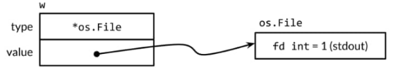

```go
var x interface{} = time.Now()
```

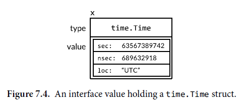

> if two interface values are compared and have the same dynamic type, but that type is not comparable, then the **comparison fails with a panic**

```go
var interface{} = []int{1,2,3}
fmt.Println(x == x) // panic
```

**Tips:** Other types are either safely comparable, or not comparable at all. So when comparing interface values or aggregate types that contain interface values, we must be aware of the potential for a panic. Only compare interface values if you are certain that they contain dynamic values of comparable types.

**Tips:** Since interface values are comparable, they may be used as the keys of a map or as the operand of a switch statement.

> When handling errors, or during debugging, it is often helpful to report the dynamic type of an interface value.

```go
var w io.Writer
fmt.Printf("%T\n", w)// "<nil>"

w = os.Stdout
fmt.Printf("%T\n", w)// "*os.File"

w = new(bytes.Buffer)
fmt.Printf("%T\n", w)// "*bytes.Buffer"
```

> **Caveat: An Interface Containing a Nil Pointer is Non-Nil**

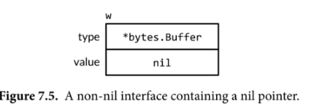

```go

const debug = true

func f(out io.Writer) {
  // ... do something ...
  if out != nil {
    out.Write([]byte("done!\n"))
  }
}

func main() {
  var buf *bytes.Buffer
  if debug {
    buf = new(bytes.Buffer)
  }
  f(buf) // NOTE: subtly incorrect
  if debug {
    // ...use buf...
  }
}
========== fix ===========
func main() {
  var buf io.Writer
  if debug {
    buf = new(bytes.Buffer)
  }
  f(buf) // ok
  if debug {
    // ...use buf...
  }
}
```

> We can have interface with String() string method and pass this item into fmt. It will automatically call this method.

```go
type Node interface{}

func (n *Element) String() string {
 b := &bytes.Buffer{}
 depth := 0
 var fn func(Node)
 fn = func(n1 Node) {
  switch n1 := n1.(type) {
  case *Element:
   fmt.Fprintf(b, "%*s<%s>\n", depth*2, "", n1.Type.Local)
   depth++
   for _, c := range n1.Children {
    fn(c)
   }
   depth--
  case string:
   fmt.Fprintf(b, "%*s%s\n", depth*2, "", n1)
  }
 }
 fn(n)
 return b.String()
}
var n Node
n = &Element{..}
...
fmt.Println(n) <--- this will call String()
```

## Sorting with sort.Interface

```go
package sort

type Interface interface {
    Len() int
    Less(i, j int) bool
    Swap(i, j int)
}
```

> **Reverse**

```go
package sort
type reverse struct {Interface}
func (r reverse) Less(i, j int) bool { return r.Interface.Less(j, i)}
func Reverse(data Interface) Interface {return reverse{data}}
```

> **StringSlice example**

```go
type StringSlice []string

func (p StringSlice) Len() int           { return len(p) }
func (p StringSlice) Less(i, j int) bool { return p[i] < p[j] }
func (p StringSlice) Swap(i, j int)      { p[i], p[j] = p[j], p[i] }

func main() {
  names := StringSlice{"5", "4", "3", "2", "1"}
  sort.Sort(names)
  fmt.Println(names)
}
```

> Track example

```go
type Track struct {
 Title  string
 Artist string
 Album  string
 Year   int
 Length time.Duration
}

var tracks = []*Track{
 {"Go", "Delilah", "From the Roots Up", 2012, length("3m38s")},
 {"Go", "Moby", "Moby", 1992, length("3m37s")},
 {"Go Ahead", "Alicia Keys", "As I Am", 2007, length("4m36s")},
 {"Ready 2 Go", "Martin Solveig", "Smash", 2011, length("4m24s")},
}

func length(s string) time.Duration {
 d, err := time.ParseDuration(s)
 if err != nil {
  panic(s)
 }
 return d
}

func printTracks(tracks []*Track) {
 const format = "%v\t%v\t%v\t%v\t%v\t\n"
 tw := new(tabwriter.Writer).Init(os.Stdout, 0, 8, 2, ' ', 0)
 fmt.Fprintf(tw, format, "Title", "Artist", "Album", "Year", "Length")
 fmt.Fprintf(tw, format, "-----", "-----", "-----", "-----", "-----")
 for _, t := range tracks {
  fmt.Fprintf(tw, format, t.Title, t.Artist, t.Album, t.Year, t.Length)
 }
 tw.Flush() // calculate column widths and print table
}

// sort by Artist
type byArtist []*Track

func (x byArtist) Len() int           { return len(x) }
func (x byArtist) Less(i, j int) bool { return x[i].Artist < x[j].Artist }
func (x byArtist) Swap(i, j int)      { x[i], x[j] = x[j], x[i] }

func main() {
  sort.Sort(byArtist(tracks))
  printTracks(tracks)
}
```

**Tips:** to sort by a different column, we must define a new type, such as byYear. As you can see, the Len and Swap methods have identical definitions for all slice types. In the next example, the con crete type **customSort combines a slice with a function, letting us define a new sort order by writing only the comparison function.**

> **Multi-tier ordering**

```go
type customSort struct {
 t    []*Track
 less func(x, y *Track) bool
}

func (x customSort) Len() int           { return len(x.t) }
func (x customSort) Less(i, j int) bool { return x.less(x.t[i], x.t[j]) }
func (x customSort) Swap(i, j int)      { x.t[i], x.t[j] = x.t[j], x.t[i] }

func main() {
 sort.Sort(customSort{tracks, func(x, y *Track) bool {
  if x.Title != y.Title {
   return x.Title < y.Title
  }
  if x.Year != y.Year {
   return x.Year < x.Year
  }
  if x.Length != y.Length {
   return x.Length < y.Length
  }
  return false
 }})
}
```

> For convenience, the sort package provides versions of its functions and types specialized for []int, []string and []float64 using their natural orderings.

For other types, such as []int64 or []uint, we're on our own, though the path is short.

> Sorting requires O(n log n), but checking if a sequence is already sort requires at most n-1 comparison.

```go
sort.IntsAreSorted(values)
```

## The http.Handler Interface

```go
package http

type Handler interface {
 ServeHTTP(w ResponseWriter, r *Request)
}
func ListenAndServe(address string, h Handler) error
```

> w.WriterHeader must be done before writing any text to w
>
> ```go
> w.WriteHeader(http.StatusNotFound)
> fmt.Fprintf(w, "no such page: %s\n", req.URL)
> ```

Equivalently, we could use the http.Error utility function

```go
msg := fmt.Sprintf("no such page: %s\n", req.URL)
http.Error(w, msg, http.StatusNotFound)
```

> A **ServerMux** aggregates a collections of http.Handlers into a single http.Handler.

```go
db := database{"shoes": 50, "socks": 5}
mux := http.NewServeMux()
mux.Handle("/list", http.HandlerFunc(db.list))
mux.Handle("/price", http.HandlerFunc(db.price))
log.Fatal(http.ListenAndServe(":8080", mux))
```

> For convenience, net/http provides a global **ServerMux** instance called **DefaultServeMux** and package-level function called http.Handle and http.HandleFunc. To use DefaultServeMux as the server's main handler, we needn't pass it to ListenAndServe; nil will do

```go
db := database{"shoes": 50, "socks": 5}
http.HandleFunc("/list", db.list)
http.HandleFunc("/price", db.price)
log.Fatal(http.ListenAndServe(":8080", nil))
```

## The error Interface

```go
type error interface {
    Error() string
}
```

> **The entire errors package is only four lines long**

```go
package errors

func New(text string) error { return &errorString{text} }

type errorString struct { text string }

func (e *errorString) Error() string { return e.text }
```

> We would not want a distinguished error such as io.EOF to compare equal to one that merely happened to have the same message. Thus errorString is a pointer type

```go
fmt.Println(errors.New("EOF") == errors.New("EOF")) // false
```

> Calls to errors.New are relatively infrequent because there's a convenient wrapper function. fmt.Errorf

```go
package fmt

import "errors"

func Errorf(format string, args ...interface{}) error {
    return errors.New(Sprintf(format, args...))
}
```

> **syscall** package provides Go's low-lever system call API. It defines a numeric type Errno that satisfies error.

```go
package syscall

type Errno uintptr // operating system error code

var errors = [...]string{
    1: "operation not permitted", // EPERM
    2: "no such file or directory", // ENOENT
    3: "no such process", // ESRCH
    // ...
}

func (e Errno) Error() string {
    if 0 <= int(e) && int(e) < len(errors) {
        return error[e]
    }
    return fmt.Sprintf("errno %d", e)
}

var err error = syscall.Errno(2)
fmt.Println(err.Error()) "no such file or directory"
fmt.Println(err) "no such file or directory"
```

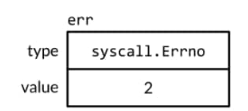

## Example: Expression Evaluator

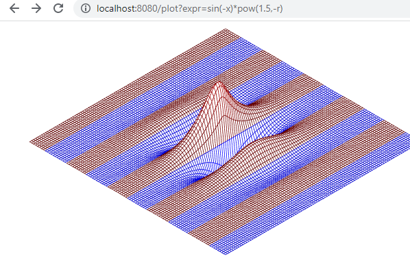

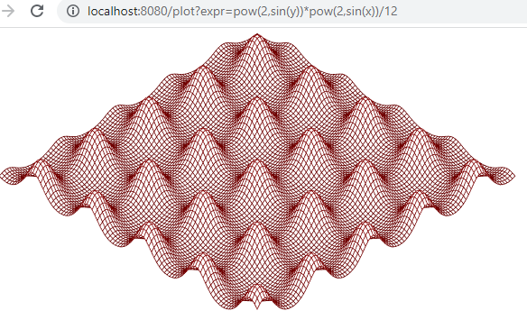

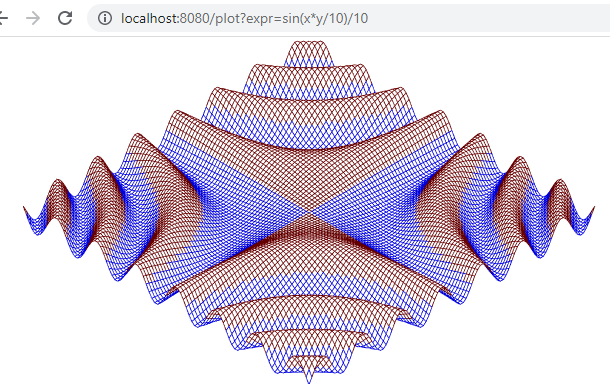

## Type Assetion

> x.(T)

> Two possibility

- asserted type T is a concrete type

  - type assertion checks whether x's dynamic type is **identical** to T. If this check succeeds, the result of the type assertion is x's dynamic value. Else **panic**

    ```go
    var w io.Writer
    w = os.Stdout
    f := w.(*os.File) // ok
    c := w.(*bytes.Buffer) // panic
    ```

- asserted type T is an interface type

  - type assertion checks whether x's dynamic type **satisfies** T. If this check succeeds, the dynamic value is not extracted; the result is still an interface value with the same type and value component, but the result has the interface type T.

    ```go
    var w io.Writer
    w = os.Stdout
    rw := w.(io.ReadWriter) // success
    
    w = new(ByteCounter)
    rw = w.(io.ReadWriter) // panic: *ByteCounter has no Read method
    ```

    **Tips:** a type assertion to a less restrictive interface type (one with fewer methods) is rarely needed. Except in the nil case

    ```go
    w = rw
    w = rw.(io.Writer) // fails only if rw == nil
    ```

> No matter what type was asserted, if the operand is a nil interface value, the type assertion fail.

> no panic:

```go
var w io.Writer = os.Stdout
f, ok := w.(*os.File) // ok
b, ok := w.(*bytes.Buffer) // failure: !ok, b==nil

if w, ok := w.(*ok.File); ok { // we can shadow the original w
    // ...use w...
}
```

## Discriminating Errors with Type Assertions

> os package provides three helper function to classify the failure indicated by a given error value:

```go
package os

func IsExist(err error) bool
func IsNotExist(err error) bool
func IsPermission(err error) bool
```

> Checking for substrings of error messages may be useful during testing to ensure that functions fail in expected manner, but it's inadequate for production code.

```go
func IsNotExist(err error) bool {
    // NOTE: not robust!
    return strings.Contains(err.Error(), "file does not exist")
}
```

> **A more reliable approach** is to represent structured error values using a dedicated type. The os package defines a type called **PathError** to describe failures involving an operation on a filepath, like **Open** or **Delete**, and variant called **LinkError** to describe failures of operations involving two file path, like **Symlink** and **Rename**

```go
package os

// PathError records an error and the operation and file path that caused it.
type PathError struct {
    Op string
    Path string
    Err error
}

func (e *PathError) Error() string {
    return e.Op + " " + e.Path + ": " + e.Err.Error()
}
```

Although PathError's Error method forms a message by simply concatenating the fields, **PathError**'s structure preserves the underlying components of the error.

> Client that need to distinguish one kind of failure from another can use a type assertion to detect the specific type of error

```go
func IsNotExist(err error) bool {
    if pe, ok := err.(*PathError); ok {
        err = pe.Err
    }
    return err == syscall.ENOENT || err == ErrNotExist
}
```

> Of course, **PathError**'s structure is lost if the error message is combined into a larger string.

Error discrimination must usually be done immediately after failing operation, before and error is propagated to the caller.

## Querying Behaviors with Interface Type Assertion

> An interface's methods express the similarities of the concrete types that satisfy the interface (but hide the representation details and intrinsic operations). The emphasis is on the methods.

This is the first style which interface are used.

> []byte("string") required more memory allocation for conversion, conversion allocates memory and makes a copy. Can we avoid it in http.ResponseWriter?

Some Writer has WriteString method, which avoids the need to allocate a temporary copy.

> We cannot assume that and arbitrary io.Writer w also has the WriteString method. But we can test it.

```go
// writeString writes s to w
func writeString(w io.Writer, s string) (n int, err error) {
 type stringWriter interface {
  WriteString(string) (n int, err error)
 }
 if sw, ok := w.(stringWriter); ok {
  return sw.WriteString(s) // avoid a copy
 }
 return w.Write([]byte(s)) // allocate temporary copy
}

func writeHeader(w io.Writer, contentType string) error {
 if _, err := writeString(w, "Content-Type: "); err != nil {
  return err
 }
 if _, err := writeString(w, contentType); err != nil {
  return err
 }
 // ...
 return nil
}
```

> It's also how fmt.Fprintf distinguishes values that satisfy error or fmt.Stringer from all other values. Within fmt.Fprintf, there is a step that converts a single operand to a string, something like this:

```go
package fmt

func formatOneValue(x interface{}) string {
 if err, ok := x.(error); ok {
  return err.Error()
 }
 if str, ok := x.(fmt.Stringer); ok {
  return str.String()
 }
  // ... all other types ...
  return ""
}
```

## Type Switches

> **Discriminated unions**, Ability of an interface value to hold values of a variety of concrete types and considers the interface to be union of those types. Type assertions are used to discriminate among these types dynamically and treat each case differently. Emphasis on the concrete types that satisfy the interface, not on the interface's methods, and there is no hiding of information

This is the second style which interface are used.

We consider below x is discriminated union of int, uint, bool, string, and nil

```go
func sqlQuote(x interface{}) string {
 if x == nil {
  return "NULL"
 } else if _, ok := x.(int); ok {
  return fmt.Sprintf("%d", x)
 } else if _, ok := x.(uint); ok {
  return fmt.Sprintf("%d", x)
 } else if b, ok := x.(bool); ok {
  if b {
   return "TRUE"
  }
  return "FALSE"
 } else if s, ok := x.(string); ok {
  return sqlQuoteString(s) // (note shown)
 } else {
  panic(fmt.Sprintf("unexpected type %T: %v", x, x))
 }
}
```

**simplest form**

```go
func sqlQuote2(x interface{}) string {
 switch x := x.(type) {
 case nil:
  return "NULL"
 case int, uint:
  return fmt.Sprintf("%d", x)
 case bool:
  if x {
   return "TRUE"
  }
  return "FALSE"
 case string:
  return sqlQuoteString(x) // (note shown)
 default:
  panic(fmt.Sprintf("unexpected type %T: %v", x, x))
 }
}
```

**Tips:** if there is no need to extract information of the object, use `switch x.(type)` instead

## Example: Token-Based XML Decoding

> Decode XML into Go data structure with encoding/xml.
>
> Primarily 4 kinds:
>
> - Start Element
> - End Element
> - CharData
> - Comment
>
> Each call to (*xml.Decoder).Token ret

```go
package xml

type Name struct {
 Local string // e.g., "Title" or "id"
}

type Attr struct { // e.g., name="value"
 Name  Name
 Value string
}

// A Token includes StartElement, EndElement, CharData,
// and Comment, plus a few esoteric types (not shown).
type Token interface{}
type StartElement struct { // e.g., <name>
 Name Name
 Attr []Attr
}
type EndElement struct{ Name Name } // e.g., </name>
type CharData []byte                // e.g. <p>CharData</p>
type Comment []byte                 // e.g., <!-- Comment -->

type Decoder struct { /* ... */
}

func NewDecoder(io.Reader) *Decoder   
func (*Decoder) Token() (Token, error) // returns next Token in sequence
```

```go
// extracts and prints the text found beneath certain elements in
// an XML document tree.
func ExtractAndPrintXML() {
 dec := xml.NewDecoder(os.Stdin)
 var stack []string // stack of element names
 for {
  tok, err := dec.Token()
  if err == io.EOF {
   break
  } else if err != nil {
   fmt.Fprintf(os.Stderr, "xmlselect: %v\n", err)
   os.Exit(1)
  }
  switch tok := tok.(type) {
  case xml.StartElement:
   stack = append(stack, tok.Name.Local)
  case xml.EndElement:
   stack = stack[:len(stack)-1]
  case xml.CharData:
   if containsAll(stack, os.Args[1:]) {
    fmt.Printf("%s: %s\n", strings.Join(stack, " "), tok)
   }
  }
 }
}
```

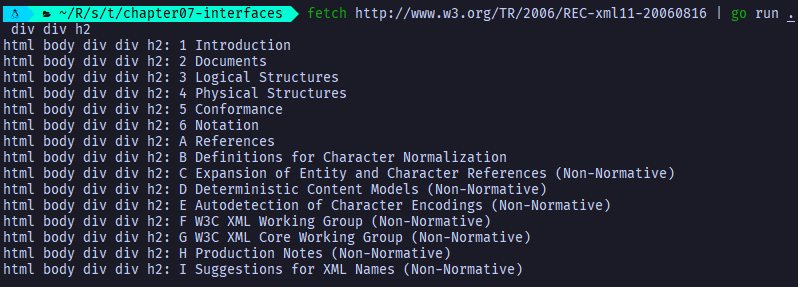

# 8 Goroutines and Channels

Go enables two styles of concurrent programming. This chapter represents goroutines and channels, which support ***communicating sequential process or CSP***, a model of concurrency in which **values are passed between independent activities (goroutines)**

Another style is **shared memory multithreading**

## Example: Concurrent Clock Server

> Multi connection server

**Tips:** `nc localhost 8000`, netcat, a standard utility program for manipulating network connections

**Tips:** `telnet localhost 8000`, Ctrl+ ] to quit, and `close` to close session

```go
CLIENT
======
// gopl.io/ch8/netcat1
// Netcat1 is a read-only TCP client.
func Netcat1() {
 conn, err := net.Dial("tcp", "localhost:8000")
 if err != nil {
  log.Fatal(err)
 }
 defer conn.Close()
 mustCopy(os.Stdout, conn)
}

func mustCopy(dst io.Writer, src io.Reader) {
 if _, err := io.Copy(dst, src); err != nil {
  log.Fatal(err)
 }
}

```

```go
SERVER
======
// gopl.io/ch8/clock2
// Clock 1 is a TCP server that periodically writes the time
func Clock1() {
 listener, err := net.Listen("tcp", "localhost:8000")
 if err != nil {
  log.Fatal(err)
 }
 for {
  conn, err := listener.Accept()
  if err != nil {
   log.Println(err) // e.g. connection aborted
   continue
  }
  // handleConn(conn) // handle one connection at a time
        go handleConn(conn) // handle connections concurrently
 }
}

func handleConn(c net.Conn) {
 defer c.Close()
 for {
  _, err := io.WriteString(c, time.Now().Format("15:04:05\n"))
  if err != nil {
   return // e.g., client disconnecter
  }
  time.Sleep(1 * time.Second)
 }
}

```

## Example: Concurrent Echo Server

> Multiple goroutines per connection.

**Server**

```go
func echo(c net.Conn, shout string, delay time.Duration) {
 fmt.Fprintln(c, "\t", strings.ToUpper(shout))
 time.Sleep(delay)
 fmt.Fprintln(c, "\t", shout)
 time.Sleep(delay)
 fmt.Fprintln(c, "\t", strings.ToLower(shout))
}

func handleConn2(c net.Conn) {
 input := bufio.NewScanner(c)
 for input.Scan() {
  go echo(c, input.Text(), 1*time.Second)
 }
 // NOTE: ignoring potential errors from input.Err()
 c.Close()
}

func Echo1() {
 listener, err := net.Listen("tcp", "localhost:8000")
 if err != nil {
  log.Fatal(err)
 }
 for {
  conn, err := listener.Accept()
  if err != nil {
   log.Println(err)
   continue
  }
  go handleConn2(conn)
 }
}

func main() {
 Echo1()
}
```

**Client**

```go
func Netcat2() {
 conn, err := net.Dial("tcp", "localhost:8000")
 if err != nil {
    log.Fatal(err)
 }
  defer conn.Close()
  go mustCopy(os.Stdout, conn)
  mustCopy(conn, os.Stdin)
}
```

## Channel

> The connections between goroutines. Let one goroutine send values to another go routine.

ch := make(chan int)

ch = make(chan int, 0)  // unbuffered channel

***Buffered channel***

ch = make(chan int, 3) // buffered channel with capacity 3

> the zero value of a channer is **nil**

```go
if ch != nil {
 // ...
}
```

> send or receive on a nil channel **block forever**.

> statements:

```go
ch <- x // send statement
<-ch // a receive statement, result is discarded
x = <-ch // a receive expression in an assignment statement
```

> **Close()**

indicating **no more values will ever be sent on this channel**, subsequent attempts to send **will panic**

**Tips:** receive operations on a closed channel **yield the values that have been sent until no more values are left**. Any receive operations thereafter complete immediately and **yield the zero value of the channel's element type**.

> **Unbuffered Channel**

- A send operation: blocks the sending goroutine until another go routine executes a corresponding receive on the same channel.
- If a receive operation was attempted first, the receiving go routine is blocked until another goroutine performs a send on the same channel
- cause sending and receiving goroutines to synchronize. Unbuffered channel are sometimes called ***synchronous channels***.

> **To make the program wait for the background go routine to complete before exiting**

```go
func Netcat3() {
 conn, err := net.Dial("tcp", "localhost:8000")
 if err != nil {
  log.Fatal(err)
 }
 done := make(chan struct{})
 go func() {
  io.Copy(os.Stdout, conn) // NOTE: ignoring errors
  log.Println("done")
  done <- struct{}{} //signal the main goroutine, common to use bool or int too, eg done <- 1
 }()
 mustCopy(conn, os.Stdin)
 conn.Close()
 <-done
}
```

Logic:

- When user close Stdin, **mustCopy** returns and the main goroutine calls conn.Close(), closing both halves of network connection.
- Closing the write half of connection causes the server to see an end-of-file condition.
- Closing the read half cause the background goroutine's call to io.Copy to return a "read from closed connection" (it is why we've removed the error logging, **Exercise 8.3 suggests a better solution**)

### Pipelines

> Channels can be used to connect goroutines together so that the output of one is the input to other

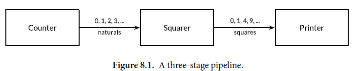

```go
func Pipeline1() {
 naturals := make(chan int)
 squares := make(chan int)
 //Counter
 go func() {
  for x := 0; x< 10; x++ {
   naturals <- x
  }
 }()
 //Squarer
 go func() {
  for {
   x := <-naturals
   squares <- x * x
  }
 }()
 // Printer (in main go routing)
 for {
  fmt.Println(<-squares)
 }
}
```

**Tips:** If the sender knows that no further values will ever be sent on a channel, it is useful to communicate this fact to the receiver goroutines so that they can stop waiting. This is accomplished by **closing** the channel. `close(naturals)` (all subsequent receive operations will proceed without blocking but will yield a **zero value**)

> **There is no way to test directly whether a channel has been closed**, **but there is a variant of receive operation that produces two results: the received channel element, plus a boolean value, ok** (true for successful receive, false for a receive on  a **closed and drained** channel)

```go
// DONOT USE IT, SEE THE EXAMPLE BELOW
func Pipeline1_5() {
 naturals := make(chan int)
 squares := make(chan int)
 //Counter
 go func() {
  for x := 0; x < 10; x++ {
   naturals <- x
  }
  close(naturals)
 }()
 //Squarer
 go func() {
  for {
   x, ok := <-naturals
   if !ok {
    break
   }
   squares <- x * x
  }
  close(squares)
 }()
 // Printer (in main go routing)
 for {
  x, ok := <-squares
  if !ok {
   break
  }
  fmt.Println(x)
 }
}
```

> **Because the syntax is clumsy and this pattern is common**, the language lets us use a **range** loop to iterate over channels too.
>
> This is a more convenient syntax for receiving all the values sent on a channel and terminating the loop after the last one.

```go
func Pipeline2() {
 naturals := make(chan int)
 squares := make(chan int)
 //Counter
 go func() {
  for x := 0; x < 100; x++ {
   naturals <- x
  }
  close(naturals)
 }()
 //Squarer
 go func() {
    for x := range naturals {
   squares <- x * x
  }
  close(squares)
 }()
 // Printer (in main go routing)
  for x := range squares{
  fmt.Println(x)
  }
}
```

> You needn't close every channel when you've finished with it. It's only necessary to close a channel when it is important to tell the receiving goroutines that all data have been sent. **A channel that the garbage collector determines to be unreachable will have its resources reclaimed whether or not it is closed.**

### Unidirectional Channel Types

> **Conversions from bidirectional to unidirectional channel types are permitted in any assignment**. There is **no** going back.

`<-chan`

`chan<-`

```go
func counter(out chan<- int) {
 for x := 0; x < 100; x++ {
  out <- x
 }
 close(out)
}

func squarer(out chan<- int, in <-chan int) {
 for x := range in {
  out <- x * x
 }
 close(out)
}

func printer(in <-chan int) {
 for x := range in {
  fmt.Println(x)
 }
}

func Pipeline3() {
 naturals := make(chan int)
 squares := make(chan int)
 go counter(naturals)
 go squarer(squares, naturals)
 printer(squares)
}
```

### Bufferred Channels

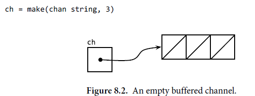

> **If the channel is full,** the send operation blocks its goroutine until space is made available by another goroutines' receive.

conversely, if the channel is empty, a receive operation **blocks** until a value is sent by another goroutine.

> `cap(ch)`

Unlikely event that a program needs to know the channel's buffer capacity

> `len(ch)`

returns **the number of elements currently buffered**. It could conceivably to be useful during fault diagnosis or performance optimization.

> Channels are deeply connected to goroutine scheduling, and without another goroutine receiving from the channel, a sender -- and perhaps the whole program -- risks becoming blocked forever.

**If all you need is a simple queue, make one using a slice.**

> Cautious in choosing unbuffered channel

```go
func mirroredQuery() string {
 responses := make(chan string, 3)
 go func() { responses <- request("asia.gopl.io") }()
 go func() { responses <- request("europe.gopl.io") }()
 go func() { responses <- request("americas.gopl.io") }()
 return <-responses
}

func request(hostname string) (response string) { /*...*/ return "aa" }
```

 Had we used an unbuffered channel, the two slower goroutines would have gotten stuck trying to send their responses on a channel from which no goroutine will ever receive. **This situation, called a goroutine leak, would be a bug.** Unlike garbage variables, **leaked goroutines are not automatically collected.**

> **The choice between unbuffered and buffered channels and the choice of a buffered channel's capacity, may both affect the correctness of a program**

**Unbuffered channels** give stronger synchronization guarantees.

**Buffered channels**, these operations are decoupled.

**When we know an upper bound on the number of values that will be sent on a channel**, it is usual to create a buffered channel of that size and perform all the sends before the first value is received. **Failure to allocate sufficient buffer capacity would cause the program to deadlock.**

## Looping in Parallel

> Problem that consist entirely of subproblems that are completely independent of each other are described as **embarrassingly parallel**. It is the easiest kind to implement concurrently and enjoy performance that scales linearly with the amount of parallelism.

```go
// gopl.io/ch8/thumbnail
// makeThumbnails makes thumbnails of the specified files.
func makeThumbnails(filenames []string) {
 for _, f := range filenames {
  if _, err := thumbnail.ImageFile(f); err != nil {
   log.Println(err)
  }
 }
}

// TOO FAST! makeThumbnails returns before it has finished doing what it was supposed to do.
// Doesn't wait for them to finish...
func makeThumbnails2(filenames []string) {
 for _, f := range filenames {
  go thumbnail.ImageFile(f) // NOTE: ignoring errors
 }
}

// not yet, we need to handle error
func makeThumbnails3(filenames []string) {
 ch := make(chan struct{})
 for _, f := range filenames {
  go func(f string) {
   thumbnail.ImageFile(f) // NOTE: ignoring errors
   ch <- struct{}{}
  }(f)
 }
 for range filenames {
  <-ch
 }
}

// It returns an error if any step failed
func makeThumbnails4(filenames []string) error {
 errors := make(chan error)
 for _, f := range filenames {
  go func(f string) {
   _, err := thumbnail.ImageFile(f)
   errors <- err
  }(f)
 }
 for range filenames {
  if err := <-errors; err != nil {
   return err // NOTE: incorrect: goroutine leak!
  }
 }
 return nil
}

// Solution to makeThumbnails4, using a sufficient capacity buffered channel
// It returns the generated file names in an arbitrary order.
// or an error if any step failed
func makeThumbnails5(filenames []string) (thumbfiles []string, err error) {
 type item struct {
  thumbfile string
  err       error
 }
 ch := make(chan item, len(filenames))
 for _, f := range filenames {
  go func(f string) {
   var it item
   it.thumbfile, it.err = thumbnail.ImageFile(f)
   ch <- it
  }(f)
 }

 for range filenames {
  it := <-ch
  if it.err != nil {
   return nil, it.err
  }
  thumbfiles = append(thumbfiles, it.thumbfile)
 }
 return thumbfiles, nil
}
```

### Counter

```go
// makeThumbnail6 makes thumbnails for each file received from the channel.
// It returns the number of bytes occupied by the files it creates.
func makeThumbnails6(filenames <-chan string) int64 {
 sizes := make(chan int64)
 var wg sync.WaitGroup
 for f := range filenames {
  wg.Add(1)
  // worker
  go func(f string) {
   defer wg.Done()
   thumb, err := thumbnail.ImageFile(f)
   if err != nil {
    log.Println(err)
    return
   }
   info, _ := os.Stat(thumb) // OK to ignore error
   sizes <- info.Size()
  }(f)
 }
 // closer, must be concurrent with the loop over sizes
    // if it is placed in the main goroutine before loop, it will never end because sizes are blocked
    // if it is placed after loop, it would be unreachable since with nothing closing the channel.
 go func() {
  wg.Wait()
  close(sizes)
 }()
 var total int64
 for size := range sizes {
  total += size
 }
 return total
}
```

**Tips:** Done() is same as Add(-1)

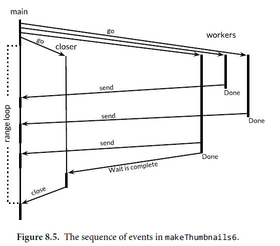

## Example:  Concurrent Web Crawler

> **Unbounded parallelism is rarely a good idea since there is always a limit factor in the system, such as the number of CPU cores for compute-bound workloads, the number of spindles and heads for local disk I/O operations, the bandwidth of the network for streaming downloads, or the serving capacity of a web service.**

The solution is to limit the number of parallel uses of the resources to match the level of parallelism that is available.

```go
// gopl.io/ch8/crawl1
func crawl(url string) []string {
 fmt.Println(url)
 list, err := links.Extract(url)
 if err != nil {
  log.Print(err)
 }
 return list
}

// It has two problems.
//  1. The program created so many network connections at once that it exceeded the per-process limit on
//     on the number or open files, causing operation such as DNS lookups and calls to net.Dial to start failing.
//  2. The program never terminates.
func Crawl() {
 worklist := make(chan []string)

 // Start with the command-line arguments.
 go func() { worklist <- os.Args[1:] }()

 // Crawl the web concurrently.
 seen := make(map[string]bool)
 for list := range worklist {
  for _, link := range list {
   if !seen[link] {
    seen[link] = true
    go func(link string) {
     worklist <- crawl(link)
    }(link)
   }
  }
 }
}
```

```go
// gopl.io/ch8/crawl2
// tokens is a counting semaphore used to
// enforce a limit of 20 concurrent request.
var tokens = make(chan struct{}, 20)

func crawl2(url string) []string {
 fmt.Println(url)
 tokens <- struct{}{} // acquire a token
 list, err := links.Extract(url)
 <-tokens // release the token
 if err != nil {
  log.Print(err)
 }
 return list
}

// n for break the program to terminate
func Crawl2() {
 worklist := make(chan []string)
 var n int // number of pending sends to worklist, that are yet to occured

 // Start with the command-line arguments.
 n++
 go func() { worklist <- os.Args[1:] }()

 // Crawl the web concurrently.
 seen := make(map[string]bool)
 for ; n > 0; n-- {
  list := <-worklist
  for _, link := range list {
   if !seen[link] {
    seen[link] = true
    n++
    go func(link string) {
     worklist <- crawl(link)
    }(link)
   }
  }
 }
}

```

```go
// Alternative for Crawl2
func Crawl3() {
 worklist := make(chan []string)
 unseenLinks := make(chan string)
 var n int // number of pending sends to worklist, that are yet to occured

 // Add command-line arguments to worklist.
 n++
 go func() { worklist <- os.Args[1:] }()

 // Create 20 crawler goroutines to fetch each unseen link.
 for i := 0; i < 20; i++ {
  go func() {
   for link := range unseenLinks {
    foundLinks := crawl(link)
    go func() { worklist <- foundLinks }()
   }
  }()
 }
 // The main goroutine de-duplicates worklist items
 // and sends the unseen ones to the crawlers.
 seen := make(map[string]bool)
 for ; n > 0; n-- {
  list := <-worklist
  for _, link := range list {
   if !seen[link] {
    seen[link] = true
    n++
    unseenLinks <- link
   }
  }
 }
}


```

## Multiplexing with select

```go
select {
    case <-ch1:
    //...
    case x := <-ch2:
    // ...use x...
    case ch3 <- y:
    // ...
    default:
    // ...
}
```

> Each case specifies a communication, and an associated block of statements.

> A **select** wait until a communication for some case is ready to proceed. It then perform that communication and executes the case's associated statement;

The other communications do not happen. A **select** with no cases, select{}, waits forever

> ticker (acts as time.Sleep())

```go
time.Tick(time.Duration) // <-chan time.Time
time.NewTicker(time.Duration) // ticker.Stop() can stop ticker's goroutine.
time.After(time.Time) // <-chan time.Time
```

```go
func Countdown1() {
 fmt.Println("Commencing countdown.")
 tick := time.Tick(1 * time.Second)
 for countdown := 10; countdown > 0; countdown-- {
  fmt.Println(countdown)
  <-tick
 }
 launch()
}

func launch() {
 fmt.Println("launch!")
}

// gopl.io/ch8/countdown2
// abort function
func Countdown2() {
 abort := make(chan struct{})
 go func() {
  os.Stdin.Read(make([]byte, 1)) // read a single byte
  abort <- struct{}{}
 }()
 fmt.Println("Commencing countdown. Press return to abort.")
 select {
 case <-time.After(10 * time.Second):
 // Do nothing.
 case <-abort:
  fmt.Println("Launch aborted!")
  return
 }
 launch()
}

// Example of select
func Countdown2_5() {
 ch := make(chan int, 1)
 for i := 0; i < 10; i++ {
  select {
  case x := <-ch:
   fmt.Println(x) // "0" "2" "4" "6" "8"
  case ch <- i:
  }
 }
}

// gopl.io/ch8/countdown3
// goroutine leak! ticker goroutine is still there trying in vain to send on
// a channel from which no goroutine is receiving
func Countdown3() {
 abort := make(chan struct{})
 go func() {
  os.Stdin.Read(make([]byte, 1)) // read a single byte
  abort <- struct{}{}
 }()
 fmt.Println("Commencing countdown. Press return to abord.")
 tick := time.Tick(1 * time.Second)
 for countdown := 10; countdown > 0; countdown-- {
  fmt.Println(countdown)
  select {
  case <-tick:
  //Do nothing
  case <-abort:
   fmt.Println("Launch aborted")
   return
  }
 }
 launch()
}

// we use time.NewTicker() to terminate goroutine instead of time.Ticker
func Countdown3a() {
 abort := make(chan struct{})
 go func() {
  os.Stdin.Read(make([]byte, 1)) // read a single byte
  abort <- struct{}{}
 }()
 fmt.Println("Commencing countdown. Press return to abord.")
 ticker := time.NewTicker(1 * time.Second)
 for countdown := 10; countdown > 0; countdown-- {
  fmt.Println(countdown)
  select {
  case <-ticker.C:
  //Do nothing
  case <-abort:
   ticker.Stop() // cause the ticker's goroutine to terminate
   fmt.Println("Launch aborted")
   return
  }
 }
 launch()
}

```

> **IF MULTIPLE CASES ARE READY, SELECT PICKS ONE AT RANDOM**. which ensures that every channel has an equal chance of being selected.

> Since a nil channel block forever, a case in a select statement whose channel is nil is never selected.

**This let us use nil to enable or disable cases that correspond to features like handling timeouts or cancellation, responding to other input events, or emitting output. We'll see an example in the next section**

## Example: Concurrent Directory Traversal

> The use of time.Tick for show verbose progress messages

```go
// gopl.io/ch8/du1
// walkDir recursively walks the file tree rooted at dir
// and sends the size of each found file on fileSizes.
func walkDir(dir string, fileSizes chan<- int64) {
 for _, entry := range dirents(dir) {
  if entry.IsDir() {
   subdir := filepath.Join(dir, entry.Name())
   walkDir(subdir, fileSizes)
  } else {
   info, err := entry.Info()
   if err != nil {
    fmt.Fprintf(os.Stderr, "du1: %v\n", err)
    return
   }
   fileSizes <- info.Size()
  }
 }
}

// dirents returns the entries of directory dir.
func dirents(dir string) []fs.DirEntry {
 entries, err := os.ReadDir(dir)
 if err != nil {
  fmt.Fprintf(os.Stderr, "du1: %v\n", err)
  return nil
 }
 return entries
}

func WalkDir() {
 flag.Parse()
 roots := flag.Args()
 if len(roots) == 0 {
  roots = []string{"."}
 }
 // Traverse the file tree.
 fileSize := make(chan int64)
 go func() {
  for _, root := range roots {
   walkDir(root, fileSize)
  }
  close(fileSize)
 }()
 // print the results
 var nfiles, nbytes int64
 for size := range fileSize {
  nfiles++
  nbytes += size
 }
 printDiskUsage(nfiles, nbytes)
}

func printDiskUsage(nfiles, nbytes int64) {
 fmt.Printf("%d files %.5f MB\n", nfiles, float64(nbytes)/1000000)
}

// gopl.io/ch8/du2
// It still takes too long to finish. There's no reason why all the calls to walkDir
// can't be done concurrently.
var verbose = flag.Bool("v", false, "show verbose progress messages")

func WalkDir2() {
 flag.Parse()
 roots := flag.Args()
 if len(roots) == 0 {
  roots = []string{"."}
 }
 // Traverse the file tree.
 fileSize := make(chan int64)
 go func() {
  for _, root := range roots {
   walkDir(root, fileSize)
  }
  close(fileSize)
 }()
 // print the results
 var nfiles, nbytes int64
 var tick <-chan time.Time
 if *verbose {
  tick = time.Tick(500 * time.Millisecond)
 }
loop:
 for {
  select {
  case size, ok := <-fileSize:
   if !ok {
    break loop // fileSizes was close
   }
   nfiles++
   nbytes += size
  case <-tick:
   printDiskUsage(nfiles, nbytes)
  }
 }
 printDiskUsage(nfiles, nbytes)
}

// gopl.io/ch8/du3
// Since this program creates many thousands of goroutines at its peak,
// we have to change dirents to use a counting semophore to prevent it from
// opening too many files at once
func walkDir3(dir string, wg *sync.WaitGroup, fileSizes chan<- int64) {
 defer wg.Done()
 for _, entry := range dirents1(dir) {
  if entry.IsDir() {
   wg.Add(1)
   subdir := filepath.Join(dir, entry.Name())
   go walkDir(subdir, fileSizes)
  } else {
   info, err := entry.Info()
   if err != nil {
    fmt.Fprintf(os.Stderr, "du1: %v\n", err)
    return
   }
   fileSizes <- info.Size()
  }
 }
}

func WalkDir3() {
 flag.Parse()
 roots := flag.Args()
 if len(roots) == 0 {
  roots = []string{"."}
 }
 // Traverse the file tree.
 fileSizes := make(chan int64)
 var n sync.WaitGroup
 for _, root := range roots {
  n.Add(1)
  go walkDir3(root, &n, fileSizes)
 }
 go func() {
  n.Wait()
  close(fileSizes)
 }()
 // print the results
 var nfiles, nbytes int64
 var tick <-chan time.Time
 if *verbose {
  tick = time.Tick(500 * time.Millisecond)
 }
loop:
 for {
  select {
  case size, ok := <-fileSizes:
   if !ok {
    break loop // fileSizes was close
   }
   nfiles++
   nbytes += size
  case <-tick:
   printDiskUsage(nfiles, nbytes)
  }
 }
 printDiskUsage(nfiles, nbytes)
}

// sema is a counting semaphore for limiting concurrency in dirents.
var sema = make(chan struct{}, 20)

// dirents returns the entries of directory dir.
func dirents1(dir string) []fs.DirEntry {
 sema <- struct{}{}
 entries, err := os.ReadDir(dir)
 <-sema
 if err != nil {
  fmt.Fprintf(os.Stderr, "du1: %v\n", err)
  return nil
 }
 return entries
}
```

## Cancellation

> Recall that after a channel has been closed and drained of all sent values, subsequent receive operations proceed immediately, yielding zero values. We can exploit this to create a **broadcast mechanism**: don’t send a value on the channel, **close it.**

```go
// gopl.io/ch8/du4
var done = make(chan struct{})

func cancelled() bool {
 select {
 case <-done:
  return true
 default:
  return false
 }
}

// Cancel traversal when input is detected.
go func() {
    os.Stdin.Read(make([]byte, 1)) // read a single byte
    close(done)
}()

// make our goroutines respond to the cancellation
for {
    select {
    case <-done:
        // Drain fileSizes to allow existing goroutines to finish.
        for range fileSizes {
        // Do nothing.
        }
      return
    case size, ok := <-fileSizes:
     // ...
    }
}

func walkDir(dir string, n *sync.WaitGroup, fileSizes chan<- int64) {
    defer n.Done()
    if cancelled() {
     return
    }
    for _, entry := range dirents(dir) {
     // ...
    }
}

func dirents(dir string) []os.FileInfo {
    select {
    case sema <- struct{}{}: // acquire token
    case <-done:
        return nil // cancelled
    }
    defer func() { <-sema }() // release token
    // ...read directory...
}
```

**Tips:** It might be profitable to poll the cancellation status again within walkDir's loop, to avoid creating goroutines after cancellation event. Cancellation involves a trade-off; a quicker response often requires more intrusive changes to program logic. Ensuring that no expensive operations ever occur after the cancellation event may require updating many places in your code, but **often most of the benefit can be obtained by checking for cancellation in a few important places.**

> Good way to check if the main function that cleans up after itself: **panic**

**Instead of returning from main in the event of cancellation, we execute a call to panic, then the runtime will dump the stack of every goroutine in the program.** If other goroutines remain, they may not have been properly cancelled, **or perhaps they have been cancelled but the cancellation takes time**; a little investigation may be worthwhile.

**Tips:** since some revision of Go, an unhandled `panic` by default dumps only the stack trace of the panicking goroutine. -- [stackoverflow](https://stackoverflow.com/questions/56349068/will-this-code-with-unbuffered-channel-cause-goroutine-leak-in-go), to enable it, `export GOTRACEBACK=all`

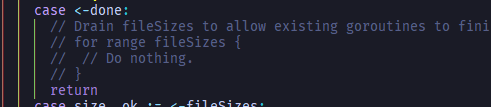

purposely not to drain fileSizes to demonstrate goroutine leaking.

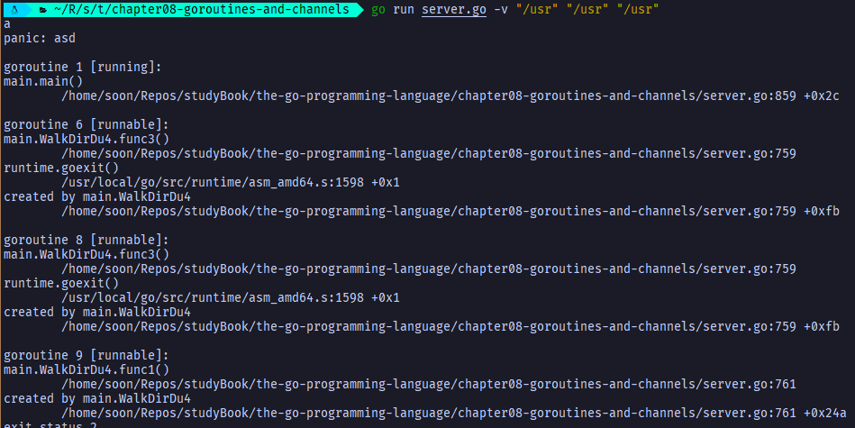

## Example: Chat Server

> Lets several users broadcast textual messages to each other.

```go
// gopl.io/ch8/chat
func Chat() {
 listener, err := net.Listen("tcp", "localhost:8000")
 if err != nil {
  log.Fatal(err)
 }
 go broadcaster()
 for {
  conn, err := listener.Accept()
  if err != nil {
   log.Print(err)
   continue
  }
  go handleConnChat(conn)
 }
}

type client chan<- string // an outgoing message channel

var (
 entering = make(chan client)
 leaving  = make(chan client)
 messages = make(chan string) // all incoming client message
)

func broadcaster() {
 clients := make(map[client]bool) // all connected client
 for {
  select {
  case msg := <-messages:
   // Broadcast incoming message to all
   // clients' outgoing message channels
   for cli := range clients {
    cli <- msg
   }
  case cli := <-entering:
   clients[cli] = true
  case cli := <-leaving:
   delete(clients, cli)
   close(cli)
  }
 }
}

func handleConnChat(conn net.Conn) {
 ch := make(chan string) // outgoing client messages
 go clientWriter(conn, ch)

 who := conn.RemoteAddr().String()
 ch <- "You are " + who
 messages <- who + " has arrived"
 entering <- ch

 input := bufio.NewScanner(conn)
 for input.Scan() {
  messages <- who + ": " + input.Text()
 }
 // NOTE: ignoring potential errors from input.Err()

 leaving <- ch
 messages <- who + " has left"
 conn.Close()
}

func clientWriter(conn net.Conn, ch chan string) {
  for msg := range ch {
    fmt.Fprintln(conn, msg) // NOTE: ignoring network errors
  }
}
```

# 9 Concurrency with Shared Variables

> Many programmers -- even some very clever ones -- will occasionally offer justifications for known data races in their programs: "the cost of mutual exclusion is too high," "this logic is only for logging", "I don't mind if I drop some messages"

A good rule of thumb is that **there is no such thing as a benign data race**

> A data race occurs whenever two goroutines access the same variable concurrently and at least one of the accesses is a write

Three ways to avoid data race:

1. not to write the variable

2. avoid accessing the variable from multiple goroutines. Variables are confined to a single routine (for example, the clients map is accessed only by broadcaster goroutine in last chapter)

   - **Tips:** Go mantra: do not communicate by share memory, share memory by **communicating (channel)**

     ```go
     // gopl.io/ch9/bank1
     // share memory by communicating
     // provides a concurrency-safe bank with one account.
     var deposits1 = make(chan int) // send amount to deposit
     var balances1 = make(chan int) // receive balance
     
     func Deposit1(amount int) { deposits1 <- amount }
     func Balance1() int       { return <-balances1 }
     
     func teller() {
      var balance int // balance is confined to teller goroutine
      for {
       select {
       case amount := <-deposits1:
        balance += amount
       case balances1 <- balance:
       }
      }
     }
     
     func init() {
         go teller()
     }
     ```

3. Allow many goroutines to access the variable, but only one at a time. Known as **mutual exclusion**

> Even when a variable cannot be confined to a single goroutine for its entire lifetime, confinement may still be a solution to the problem of concurrent access.

For example,  it's common to **share a variable between goroutines in a pipeline by passing its address from one stage to the next over a channel**. **If each stage of the pipeline refrains from accessing the variable after sending it to the next stage, then all accesses to the variable are sequential.** So called serial confinement.

```go
type Cake struct{ state string }

func baker(cooked chan<- *Cake) {
 for {
  cake := new(Cake)
  cake.state = "cooked"
  cooked <- cake // baker never touches this cake again
 }
}

func icer(iced chan<- *Cake, cooked <-chan *Cake) {
 for cake := range cooked {
  cake.state = "iced"
  iced <- cake // icer never touch this cake again
 }
}
```

## Mutual Exclusion: sync.Mutex

```go
// gopl.io/ch9/bank2
// use a channel of capacity 1 to ensure that at most one goroutine accesses a shared variable at a time
var (
 sema     = make(chan struct{}, 1) // a binary semaphore guarding balance
 balance int
)

func Deposit(amount int) {
 sema <- struct{}{} // acquire toke
 balance = balance + amount
 <-sema // release token
}

func Balance() int {
 sema <- struct{}{} // acquire token
 b := balance
 <-sema //release token
 return b
}

// gopl.io/ch9/bank3
// These arrange of functions, mutex lock, and variable is called a monitor.
var (
 mu       sync.Mutex // guards balance
 balance int
)

func Deposit(amount int) {
 mu.Lock()
 balance = balance + amount
 mu.Unlock()
}

func Balance() int {
 mu.Lock()
 b := balance
 mu.Unlock()
 return b
}

// This is better.
func Balance() int {
    mu.Lock()
 defer mu.Unlock()
 return balance
}
```

> A defer is marginally more expensive than an explicit call to Unlock, but not enough to justify less clear code.

As always with concurrent programs, favor clarity and resist premature optimization. **Where possible, use defer and let critical sections extend to the end of a function.**

> Not atomic function

```go
// NOTE: not atomic!
func Withdraw(amount int) bool {
 Deposit(-amount)
 if Balance() < 0 {
  Deposit(amount)
  return false // insufficient funds
 }
 return true
}

// common solution:
func Withdraw(amount int) bool {
 mu.Lock()
 defer mu.Unlock()
 deposit(-amount)
 if Balance() < 0 {
  deposit(amount)
  return false // insufficient funds
 }
 return true
}

// This function requires that the lock be held
func deposit(amount int) {
 balance = balance + amount
}

```

## Read/Write Mutexes: sync.RWMutex

> It would be safe for multiple Balance calls to run concurrently, so long as no Deposit or Withdraw call is running.

In this scenario we need a special kind of lock that allows read-only operations to proceed in parallel with each other, but write operations to have fully exclusive access.
**Tips:** This is called a multi readers, single writer lock

```go
var mu sync.RWMutex
var balance int

func Balance() int {
 mu.RLock() // readers lock / shared lock
 defer mu.RUnlock()
 return balance
}
```

> It's only profitable to use an **RWMutex** when most of the goroutines that acquire the lock are readers, and the lock is under _contention_, that is, goroutines routinely have to wait to acquire it.

An RWMutex requires more complex internal bookkeeping, **making it slower than a regular mutex for uncontended locks**

## Lazy Initalization: sync.Once

> It is good practice to defer an expensive initialization step until the moment it is needed.

```go
var icons map[string]image.Image

func loadIcons() {
 icons = map[string]image.Image{
  "spades.png":   loadIcon("spades.png"),
  "hearts.png":   loadIcon("hearts.png"),
  "diamonds.png": loadIcon("diamonds.png"),
  "clubs.png":    loadIcon("clubs.png"),
 }
}

// NOTE: not concurrency-safe!
func Icon(name string) image.Image {
 if icons == nil {
  loadIcons() // one-time initialization
 }
 return icons[name]
}

func loadIcon(name string) image.Image {
 return nil
}

```

**Correct way**

```go
var muIcon sync.RWMutex

// Give greater concurrency but is complex and thus error-prone.
func Icon(name string) image.Image {
 muIcon.RLock()
 if icons != nil {
  icon := icons[name]
  muIcon.Unlock()
  return icon
 }
 defer muIcon.RUnlock()

 // acquire an exclusive lock
 muIcon.Lock()
 if icons == nil {
  loadIcons()
 }
 icon := icons[name]
 muIcon.Unlock()
 return icon
}

```

**Better way with sync.Once**

```go
var loadIconsOnce sync.Once

func Icon(name string) image.Image {
 loadIconsOnce.Do(loadIcons)
 return icons[name]
}
```

## The Race Detector

> Even with the greatest of care, it's all too easy to make concurrency mistakes.

Fortunately, the Go runtime and toolchain are equipped with a sophisticated and easy-to-use dynamic analysis tool, the **race detector**.

> Add the `-race` flag to `go build`, `go run`, or `go test` command.

Cause the compiler to build a modified version of application or test with additional instrumentation that effectively records all accesses to shared variables that occurred during execution, along with the identify of the goroutine that read or wrote the variable.

> Due to extra bookkeeping, a program built with race detection needs more time and memory to run

But the overhead is tolerable even for many production jobs. For infrequently occurring race conditions, letting the race detector do its job can save hours or days of debugging.

## Example: Concurrent Non-Blocking Cache

**Mutex version**

```go
func httpGetBody(url string) (interface{}, error) {
 resp, err := http.Get(url)
 if err != nil {
  return nil, err
 }
 defer resp.Body.Close()
 return io.ReadAll(resp.Body)
}

// gopl.io/ch9/mem1
// A Memo caches the results of a calling func
// type Memo struct {
//  f     Func
//  cache map[string]result
// }

// gopl.io/ch9/mem2
// type Memo struct {
//  f     Func
//  mu    sync.Mutex // guards cache
//  cache map[string]result
// }

type Func func(key string) (interface{}, error)

type result struct {
 value interface{}
 err   error
}

// func New(f Func) *Memo {
//  return &Memo{f: f, cache: make(map[string]result)}
// }

// NOTE: not concurrency-safe!
// gopl.io/ch9/mem1
// func (memo *Memo) Get(key string) (interface{}, error) {
//  res, ok := memo.cache[key]
//  if !ok {
//   res.value, res.err = memo.f(key)
//   memo.cache[key] = res
//  }
//  return res.value, res.err
// }

// gopl.io/ch9/mem2
// func (memo *Memo) Get(key string) (interface{}, error) {
//  memo.mu.Lock()
//  defer memo.mu.Unlock()
//  res, ok := memo.cache[key]
//  if !ok {
//   res.value, res.err = memo.f(key)
//   memo.cache[key] = res
//  }
//  return res.value, res.err
// }

// gopl.io/ch9/mem3
// after mem3, the performance improves again, but now we notice that some URLs are
// being fetched twice. This happens when two or more goroutines call Get for the same URL at
// about the same time.jjjjjjjj
// func (memo *Memo) Get(key string) (interface{}, error) {
//  memo.mu.Lock()
//  res, ok := memo.cache[key]
//  memo.mu.Unlock()
//  if !ok {
//   res.value, res.err = memo.f(key)

//   // Between the two critical sections, several goroutines
//   // may race to comput f(key) and update the map
//   memo.mu.Lock()
//   memo.cache[key] = res
//   memo.mu.Unlock()
//  }
//  return res.value, res.err
// }

// gopl.io/ch9/mem4
// Duplicate suppresion
type entry struct {
 res   result
 ready chan struct{}
}

type Memo struct {
 f     Func
 mu    sync.Mutex // guards cache
 cache map[string]*entry
}

func New(f Func) *Memo {
 return &Memo{f: f, cache: make(map[string]*entry)}
}

func (memo *Memo) Get(key string) (interface{}, error) {
 memo.mu.Lock()
 e := memo.cache[key]
 if e == nil {
  e = &entry{ready: make(chan struct{})}
  memo.cache[key] = e
  memo.mu.Unlock()
  e.res.value, e.res.err = memo.f(key)
  close(e.ready)
 } else {
  // this is a repeat request for this key
  memo.mu.Unlock()
  <-e.ready // wait for ready condition
 }
 return e.res.value, e.res.err
}

func main() {
 m := New(httpGetBody)
 var n sync.WaitGroup
 for _, url := range incomingURLs() {
  n.Add(1)
  go func(url string) {
   start := time.Now()
   value, err := m.Get(url)
   if err != nil {
    log.Print(err)
   }
   fmt.Printf("%s, %s, %d bytes\n",
    url, time.Since(start), len(value.([]byte)))
   n.Done()
  }(url)
 }
 n.Wait()
}

func incomingURLs() []string {
 return []string{
  "https://google.com",
  "https://google.com",
  "https://google.com",
  "https://google.com",
  "https://golang.org",
  "https://golang.org",
 }
}

```

**Monitor goroutine** version -- by communicating sequential process

```go
func httpGetBody(url string) (interface{}, error) {
 resp, err := http.Get(url)
 if err != nil {
  return nil, err
 }
 defer resp.Body.Close()
 return io.ReadAll(resp.Body)
}

type Func func(key string) (interface{}, error)

type result struct {
 value interface{}
 err   error
}

type request struct {
 key      string
 response chan<- result
}

type Memo struct{ requests chan request }

func New(f Func) *Memo {
 memo := &Memo{requests: make(chan request)}
 go memo.server(f)
 return memo
}

func (memo *Memo) Get(key string) (interface{}, error) {
 response := make(chan result)
 memo.requests <- request{key, response}
 res := <-response
 return res.value, res.err
}

type entry struct {
 res   result
 ready chan struct{}
}

func (memo *Memo) server(f Func) {
 cache := make(map[string]*entry)
 for req := range memo.requests {
  e := cache[req.key]
  if e == nil {
   e = &entry{ready: make(chan struct{})}
   cache[req.key] = e
   go e.call(f, req.key)
  }
  go e.deliver(req.response)
 }
}

func (memo *Memo) Close() { close(memo.requests) }

func (e *entry) call(f Func, name string) {
 // Evaluate the function.
 e.res.value, e.res.err = f(name)
 // Broadcast the ready condition
 close(e.ready)
}

func (e *entry) deliver(response chan<- result) {
 // Wait for the ready condition
 <-e.ready
 // Send the result to the client
 response <- e.res
}

func main() {
 m := New(httpGetBody)
 var n sync.WaitGroup
 for _, url := range incomingURLs() {
  n.Add(1)
  go func(url string) {
   start := time.Now()
   value, err := m.Get(url)
   if err != nil {
    log.Print(err)
   }
   fmt.Printf("%s, %s, %d bytes\n",
    url, time.Since(start), len(value.([]byte)))
   n.Done()
  }(url)
 }
 n.Wait()
}

func incomingURLs() []string {
 return []string{
  "https://google.com",
  "https://google.com",
  "https://google.com",
  "https://google.com",
  "https://golang.org",
  "https://golang.org",
 }
}

```

> It's not always obvious which approach is preferable in a given situation, but it's worth knowing how they correspond.

Sometimes switching from one approach to the other can make your code simpler.

## Goroutines and Threads

> **Growable Stacks**

- Each OS thread has a fixed-size block of memory for its stack (often as large as 2MB)
  - A 2MB stack would be a huge waste of memory for a little goroutine
  - A 2MB is not always big enough for the most complex and depply recursive of functions.
- Goroutine starts life with a small stack, typically 2KB. It is not fixed, it grows and shrinks as needed.
  - The size limit for a goroutine stack may be as much as 1GB, though of course few goroutines use that much.

> **Scheduling**

- OS threads are scheduled by the OS kernel. Every few milliseconds, a hardware timer interrupts the processor, which causes a kernel function called the _scheduler_ to be invoked. This function suspends the currently executing thread and saves its registers in memory, looks over the list of threads and decides which one should run next, restores that thread's registers from memory, then resume the execution of that thread.
  - Because OS threads are scheduled by the kernel, passing control from one thread to another requires a **full context switch**. that is, saving the state of one user thread to memory; restoring the state of another, and updating the scheduler's data structures.
  - This operation is slow due to its poor locality and the number of memory accesses required.
- Go runtime contains its own scheduler uses a technique known as **m:n scheduling**, because it multiplexes (or schedules) **m goroutines on n OS threads**.
  - Job of Go scheduler is analogous to that of the kernel scheduler, but it is concerned only with the goroutines of a single Go program.
  - Is not invoked periodically by a hardware timer, but implicitly by certain Go language constructs
    - e.g. when a goroutine calls **time.Sleep** or blocks in a channel or mutex operation, the scheduler puts it to sleep and runs another goroutine until it is time to wake the first one up.
  - Cheaper than rescheduling a thread as it doesn't need a switch to kernel context

> **GOMAXPROC**

- The Go scheduler uses a parameter called **GOMAXPROCS** to determine **how many OS threads may be actively executing Go code simultaneously**. It default value is the number of CPUs on the machine. (**GOMAXPROCS** is the n in m:n scheduling).

  - Goroutines that are sleeping or blocked in a communication does not need a thread at all.

  - Goroutines that are blocked in I/O or other system calls or are calling non-Go functions, do need an OS thread, but **GOMAXPROCS** need not account for them.

  - **Tips:** control this parameter

    ```go
    for {
        go fmt.Print(0)
        fmt.Print(1)
    }
    
    $ GOMAXPROCS=1 go run hacker-cliche.go
    111111111111111100000000000000011111.....
    
    $ GOMAXPROCS=2 go run hacker-cliche.go
    01001010101001010100100100101010100101....
    ```

    In the first run, at most one goroutine was executed at a time. Initially, it was the main goroutine, which prints ones. After a period of time, the Go scheduler put it to sleep and woke up the goroutine that prints zeros.

> **Goroutines have no identity**

- In most os and programming languages that support multithreading, the current thread has a distinct identity. This makes it easy to build an abstraction called **thread-local storage**, which each thread can store and retrieve values independent of other threads
- Goroutines have no notion of identity, this is by design since thread-local storage tends to e abused.
  - e.g. in a webserver implemented in a language with thread-local storage. It's common for many functions to find information about the HTTP request on whose behalf they are currently working by looking in that storage. This can lead to an unhealthy "**action at a distance**" in which the behavior of a function is not determined by its arguments alone, but by the identity of the thread in which it runs.

# 10 Packages and the Go Tool

> Go compilation is notably faster than most other compiled languages

**Reasons:**

- All imports must be explicitly listed at the beginning of each source file, so the compiler does not have to read and process an entire file to determine its dependencies
- The dependencies of a package form a directed acyclic graph, and because there are no cycles, packages can be compiled separately and perhaps parallel.
- Object file for a compiled Go package records export information not just for package itself, but for its dependencies too. When compiling a package, the compiler must read one object file for each import but need not look beyond these files.

## Import paths

> Package starts with internet domain name of the organization

Example: third-party MySQL database driver -- "github.com/go-sql-driver/mysql"

Example: HTML parser maintained by the Go team -- "golang.org/x/net/html"

> Conventionally, the package name is the last segment of the import path

**Exception**

- package that defining a command: always have the name main. This is a signal to go build that it must invoke the linker to make an executable file
- with suffix **_test** on package name in a directory if the file name ends with _test.go.  It is an ***external test package***. This suffix signals to `go test` that it must build both packages (one without_test and one with_test).
  - External test packages are used to avoid cycle in the import graph
- some tools for dependency management append version name suffixes to package import paths, such as "gopkg.in/yaml.v1". The package name excludes the suffix, so in this case it would be just yaml

> **Renaming Import**
>
> ```go
> import (
>  pathpkg "path"
> )
> ```

Use it when

- two packages have conflicts
- There are variables need to use the package name eg. path -> pathpkg

> **Blank Imports**
>
> ```go
> import (
>  _ "path"
> )
> ```

Use it when

- to implement a compile-time mechanism where by the main program can enable opt ion al features by blank-importing additional packages

  ```go
  package main
  
  import (
   "fmt"
   "image"
   "image/jpeg"
      _ "image/png" //*****Else converting PNG would failed! : jpeg: image: unknown format
   "io"
   "os"
  )
  
  func main() {
   if err := toJPEG(os.Stdin, os.Stdout); err != nil {
    fmt.Fprintf(os.Stderr, "jpeg: %v\n", err)
    os.Exit(1)
   }
  }
  
  func toJPEG(in io.Reader, out io.Writer) error {
   img, kind, err := image.Decode(in)
   if err != nil {
    return err
   }
   fmt.Fprintln(os.Stderr, "input format =", kind)
   return jpeg.Encode(out, img, &jpeg.Options{Quality: 95})
  }
  
  ```

  **Tips:** here's how it works. The standard library provides decoders for GIF, PNG, and JPEG, and users may provide others, but to keep the executables small, decoders are not included in an application unless explicitly requested. Below is the image/png init function to add entry to the table.

  ```go
  func init() {
   image.RegisterFormat("png", pngHeader, Decode, DecodeConfig)
  }
  ```

  **Tips:** the **database/sql** package uses a similar mechanism to let users install just the database drivers they need. e.g.

  ```go
  import (
   "database/sql"
   _ "github.com/go-sql-driver/mysql" // support MySQL
   _ "github.com/lib/pq"              // support Postgres
  )
  
  func main() {
    // ... 
   db, err = sql.Open("postgres", dbname) // ok
   db, err = sql.Open("mysql", dbname)    // ok
   db, err = sql.Open("sqlite3", dbname)  // returns error: unknown driver "sqlite3"
  }
  ```

## Packages and Naming

> Keep package name short, but not so short as to be cryptic

The most frequently used package in the standard library are named bufio.bytes, flag, fmt, http, io, json, os, sort, sync, and time

> Be descriptive and unambiguous where possible

For example, don't name a utility package `util` when a name such as `imageutil` or `ioutil` is specific yet still concise.

> **Avoid choosing package names that are commonly used for related local variables**

> Singular form.

The standard packages bytes, errors, and strings use plural to **avoid hiding the corresponding predeclared types**, and in the case of go/types, to avoid conflict with a keyword

> Avoid package names that already have other connotations.

For example, `temp` is an almost universal synonym for "temporary" (than of "temperature"). But "temperature" was too long for a package and didn't say what package did. In the end, tempconv was used, which is shorter and parallel with strconv

> The burden of describing the package member is borne equally by the package name and the member name. **When designing a package, consider how the two parts of a qualified identifier work together, not the member name alone.**

For example, `fmt.Println`, we need not mention the concept of formatting in Prinln because the package name fmt does that already.

```go
Other examples:
===============
bytes.Equal
flag.Int
http.Get
json.Marshal
```

> `New` function to create instances for ***single-type packages***. Which is expose one principal data type plus its methods.

```go
package rand // "math/rand"

type Rand struct{ /* ... */ }
func New(source Source) *Rand
```

**Tips:** This can lead to repetition, as in template.Template or rand.Rand, which is why the names of these kinds of packages are often especially short.

> There are packages like net/http that have a lot of names without a lot of structure, because they perform a complicated task.

Despite having over twenty types and many more functions, the packages's most important members have the simplest name: Get, Post, Handle, Error, Client, Server

## The Go Tool

```bash
$ go
...
        bug         start a bug report
        build       compile packages and dependencies
        clean       remove object files and cached files
        doc         show documentation for package or symbol
        env         print Go environment information
        fix         update packages to use new APIs
        fmt         gofmt (reformat) package sources
        generate    generate Go files by processing source
        get         add dependencies to current module and install them
        install     compile and install packages and dependencies
        list        list packages or modules
        mod         module maintenance
        work        workspace maintenance
        run         compile and run Go program
        test        test packages
        tool        run specified go tool
        version     print Go version
        vet         report likely mistakes in packages
```

> Workspace Organization

**GOPATH** Environment Variable

After `go get`, the programs are downloaded into $GOPATH/src/

GOPATH has three subdirectories:

- src: holds the source code

- pkg: where the build tools store compiled package

- bin: holds executable programs

**GOROOT** Environment Variable

Specifies the root directory of the Go distribution, which provides all the packages of the standard library.

**Tips:** `go env` command prints the effective values of the environment variable

> `go build` compiles each argument package

If the package is named main, `go build` invokes the linker to create an executable in the current directory; the name of the exe is taken from the last segment of the package's import path.

Since each directory contains one package, each executable program, or _command_ in Unix terminology, requires its own directory. These directories are sometimes **children of a directory named cmd**, such as the golang.org/x/tools/cmd/godoc command which serves Go package documentation through a web interface.

```bas
$ cd $GOPATH/src/gopl.io/ch1/helloworld
$ go build

and 

$ cd anywhere
$ go build gopl.io/ch/helloworld

and:

$ cd $GOPATH
$ go build ./src/gopl.io/ch1/helloworld

but not: 

$ cd $GOPATH
$ go build src/gopl.io/ch1/helloworld
Error: cannot find package "src/gopl.io/ch1/helloworld"
```

Packages may also be specified as a list of file names. If the package name is main, the executable name comes from the basename of the first .go file

```bash
go build quoteargs.go
./quoteargs args...
go run quoteargs.go args...
```

> By default, `go build` throws away all the compiled code except the final executable, if any. The time to recompile dependencies can become noticeable, even when those dependencies haven't changed at all when projects grow to dozens of packages

The `go install` command is very similar to `go build`, except that it saves the compiled code for each package and command instead of throwing it away. They are saved in $GOPATH/pkg, and the executable are saved in $GOPATH/bin
Thereafter, go build and go install do not run the compiler for those packages and commands if they have not changed.

**Tips:** `go build -i` installs the packages that are dependencies of the build target.

> It is straightforward to cross-compile a Go program

Set the GOOS or GOARCH variables during the build.

```bash
GOARCH=386 go build gopl.io/ch10/cross
./cross
```

> Some packages may need to compile different versions of the code for certain platforms or processors

If a file name includes an operating system or processor architecture name like net_linux.go or asm_amd64.s, then the go tool will compile the file only when building for that target. Special comments called build tags give more fine-grained control. For example, if a file contains this comment:

```go
// +build linux darwin
```

before the package declaration (and its doc comment), `go build` will compile it only when building for Linux or Mac OS X, and this comment says never to compile the file:

```go
// +build ignore
```

`go doc go/build` for more details

## Documenting Packages

> Each declaration of an exported package member and the package declaration itself should be immediately preceded by a comment explaining **its purpose and usage**

Go _doc comments_ are always complete sentences, and the first sentence is usually a summary that **starts with the name being declared**.

> Function parameters and other identifiers are mentioned without quotation or markup.

```go
// Fprinf formats according to a format specifier and writes to w.
// It returns the number of bytes written and any write error encountered.
func Fprintf(w io.Writer, format string, a ...interface{}) (int, error)
```

> Package comment must be only one, though it may appear in any file.

Longer package comments may warrant a file of their own; fmt's is over 300 lines. This file is usually called doc.go

> Many declarations can be explained in one well-worded sentence, and if the behavior is truly obvious, no comment is needed.

> `go doc` tool prints the declaration and doc comment of the entity specified on the command line

```bash
# may be a package
$ go doc time

# a package member
$ go doc time.Since

# a method
$ go doc time.Duration.Seconds
$ go doc time.Seconds # it does not need complete import path

```

> `godoc`, serves cross-linked HTML pages that provide the same information as `go doc` and much more. The _godoc_ server at <https://golang.org/pkg> covers the standard library.

```bash
godoc -http :8000
curl http://localhost:8000/pkg
```

**Tips:** -analysis=type and -analysis=pointer flags augment the documentation and the source code with the results of advanced static analysis

## Internal Packages

> `go build` tool treats a package specially if its import path contains a path segment named internal (_internal packages_).

An internal package may be imported only by another package that is inside the tree rooted at the parent of the internal directory:

```bash
net/http # ok to import internal/ chunked
net/http/internal/chunked
net/http/httputil # ok to import internal/chunked
net/url # not ok
```

## Querying Packages

> `go list` tool reports information about available packages.

```bash
# test whether a package is present in the workspace and prints its import path if so:
$ go list github.com/go-sql-driver/mysql
github.com/go-sql-driver/mysql

# ... matches any substring of a package's import path. Use it to enumerate all the packages within a Go workspace
$ go list \...
or within a specific subtree
$ go list gopl.io/ch/...
or related to a particular topics:
$ go list ...xml...
```

> `go list` command obtains the complete metadata for each package, not just the import path

```bash
# list the entire record of each package in JSON format
$ go list -json hash
```

> `-f` flag lets users customize the output format using the template language of package text/template

```bash
go list -f '{{join .Deps " "}}' strconv
go list -f '{{.ImportPath}} -> {{join .Imports " "}}' compress/...
```

> `go list` command is useful for both one-off interactive queries and for build and test automation scripts.

`go help list` for more information

# 11 Testing

## The `go test` Tool

> Files whose names end with _test.go are not part of the package ordinarily built by go build, but are a part of it when built by go test.

> Within *_test.go files, three kinds of functions are treated specially: tests, benchmarks, and examples.

- test: functions whose name begins with Test, exercises some program logic for correct behaviour. Result is either PASS or FAIL

- benchmark: functions whose name begins with Benchmark, measures the performance of some operation.

- example: functions whose name starts with Example, provides machine-checked documentation

> `go test` tool scans the *_test.go files, generates a temporary main package, builds and runs it, reports the results, and then cleans up.

## Test Functions

```go
func TestName(t *testing.T) {
  // ...
}
```

```go
func TestIsPalindrome(t *testing.T) {
 tests := []struct {
  input string
  want  bool
 }{
  {"", true},
  {"a", true},
  {"aa", true},
  {"ab", false},
  {"kayak", true},
  {"detartrated", true},
  {"A man, a plan, a canal: Panama", true},
  {"Evil I did dwell; lewd did I live.", true},
  {"Able was I ere I saw Elba", true},
  {"été", true},
  {"Et se resservir, ivresse reste.", true},
  {"palindrome", false}, // non-palindrome
  {"desserts", false},   // semi-palindrome
 }
 for _, test := range tests {
  if got := IsPalindrome(test.input); got != test.want {
   t.Errorf("IsPalindrome(%q) = %v", test.input, got)
  }
 }
}
```

> It is a good practice to **write the test first** and observe that it triggers the same failure described by the user's bug report.

Only then can we be confident that whatever fix we come up with addresses the right problem.

> As a bonus, running `go test` is usually quicker than manually going through the steps described in the bug report.

If the test suite contains many slow tests, we may make even faster progress if we're selective about which ones we run.

> `-v` flag prints the name and execution time of each test in the package

> The output of a failing test does not include the entire stack trace at the moment of the call to t.Errorf. Nor does t.Errorf cause a panic or stop the execution of the test.

Test are independent of each other, If an early entry in the table causes the test to fail, later table entries **will still be checked**

**Tips:** When we really must stop a test function, perhaps because some initialization code failed or to prevent a failure already reported from causing a confusing cascade of others. We use t.Fatal or t.Fatalf.

> Test failure message are usually are the form **"f(x) = y, want z"**.

When testing a boolean function such as IsPalindrome, omit z part since it adds no information.

### Randomized Testing

> Table-driven tests are convenient for checking that a function works on inputs carefully selected to exercise interesting case in the logic.

Randomized testing, explores a broader range of inputs by constructing inputs at a random.

> Two strategies to know expected output.

- Write an alternative implementation of the function that uses a less efficient but simpler and clearer algorigthm, and check both implementation give the same result.

- Create input values according to a pattern so that we know what output to expect.

> Example of second approach:

```go
// randomPalindrome returns a parindrome whose length and contents
// are derived from the pseudo-random number generator rng/
func randomPalindrome(rng *rand.Rand) string {
 n := rng.Intn(25) // random length up to 24
 runes := make([]rune, n)
 for i := 0; i < (n+1)/2; i++ {
  r := rune(rng.Intn(0x1000)) // random rne up to '\u0999'
  runes[i] = r
  runes[n-1-i] = r
 }
 return string(runes)
}

func TestRandomPalindromes(t *testing.T) {
 // Initialize a pseudo-random number generator.
 seed := time.Now().UTC().UnixNano()
 t.Logf("Random seed: %d", seed)
 rng := rand.New(rand.NewSource(seed))
 for i := 0; i < 1000; i++ {
  p := randomPalindrome(rng)
  if !IsPalindrome(p) {
   t.Errorf("IsPalindrme(%q) = false", p)
  }
 }
}
```

**Tips:** Since randomized tests are nondeterministic, it is critical that the log of the failing test record sufficient information to reproduce the failure. In this example, we log the seed of the pseudo-random generator than to dump the entire input data structure. Armed with that seed value, we can easily modify the test to replay the failure deterministically.

### Testing a command

> Using global variable to change Writer

```go
// Pay attention to global variable

// main.go
var (
 n = flag.Bool("n", false, "omit trailing newline")
 s = flag.String("s", " ", "seperator")
)

var out io.Writer = os.Stdout // modified during testing

func main() {
 flag.Parse()
 if err := echo(!*n, *s, flag.Args()); err != nil {
  fmt.Fprintf(os.Stderr, "echo :%v\n", err)
  os.Exit(1)
 }
}

func echo(newline bool, sep string, args []string) error {
 fmt.Fprint(out, strings.Join(args, sep))
 if newline {
  fmt.Fprintln(out)
 }
 return nil
}


// main_test.go
func TestEcho(t *testing.T) {
 tests := []struct {
  newline bool
  sep     string
  args    []string
  want    string
 }{
  {true, "", []string{}, "\n"},
  {false, "", []string{}, ""},
  {true, "\t", []string{"one", "two", "three"}, "one\ttwo\tthree\n"},
  {true, ",", []string{"a", "b", "c"}, "a,b,c\n"},
  {false, ":", []string{"1", "2", "3"}, "1:2:3"},
 }

 for _, test := range tests {
  descr := fmt.Sprintf("echo(%v, %q, %q)", test.newline, test.sep, test.args)
  out = &bytes.Buffer{}
  if err := echo(test.newline, test.sep, test.args); err != nil {
   t.Errorf("%s failed: %v", descr, err)
  }
  got := out.(*bytes.Buffer).String()
  if got != test.want {
   t.Errorf("%s = %q, want %q", descr, got, test.want)
  }
 }
}

```

> It's important that code being tested not call log.Fatal or os.Exit which will stop the process in its tracks.

Calling these functions should be regarded as the exclusive right of main. Expected errors should be reported by returning a non-nil error value.

### White-Box Testing

> Has privileged access to the internal functions and data structures of the package and can make observations and changes that an ordinary client cannot.

For example, a white-box test can check that the invariants of the package's data types are maintained after every operation.
**Tips:** The name white box is traditional, but _clear box_ would be more accurate

**Note:** For example, TestEcho calls the echo function and updates the global variable *out*, both of which are unexported.

> It can provide more detailed coverage of the trickier pars of the implementation.

> Example: We can change implementation by having global variable

```go
func bytesInUse(username string) int64 { return 98000000 /*...*/ }

// Email sender configuration/
// Note: never put passwords in source code!
const sender = "notification@example.com"
const password = "correcthorsebatterystaple"
const hostname = "smtp.example.com"

const template = "Warning: you are using %d bytes of storage, %d%% of your quota"

// gopl.io/ch11/storage2
// implementing notifyUser as we don't want the test to send out real email
var notifyUser = func(username, msg string) {
	auth := smtp.PlainAuth("", sender, password, hostname)
	err := smtp.SendMail(hostname+":587", auth, sender, []string{username}, []byte(msg))
	if err != nil {
		log.Printf("smtp.SendMail(%s) failed: %s", username, err)
	}
}

func CheckQuota(username string) {
	used := bytesInUse(username)
	const quota = 100000000 // 1GB
	percent := 100 * used / quota
	if percent < 90 {
		return
	}
	msg := fmt.Sprintf(template, used, percent)
	notifyUser(username, msg)
}

```
```go
// Test file

// we must notify the test to restore the previous value so that subsequent
// test observe no effect, and we must do this on all execution pahts,
// including test failures and panics
// We can temporarily save and restore command-line flags, debugging options,
// and performance parameters
// Use global variable in this way is sofe only because go test does not normally runc
// multiple tests concurrently.
func TestCheckQuotaNotifyUser(t *testing.T) {
  // Save and restore original notifyUser
	saved := notifyUser
	defer func() { notifyUser = saved }()

	var notifiedUser, notifiedMsg string
	notifyUser = func(user, msg string) {
		notifiedUser, notifiedMsg = user, msg
	}
	// ...simulate a 980MB-used condition...

	const user = "joe@example.org"
	CheckQuota(user)
	if notifiedUser == "" && notifiedMsg == "" {
		t.Fatalf("notifyUser not called")
	}
	if notifiedUser != user {
		t.Errorf("wrong user (%s) notified, want %s", notifiedUser, user)
	}
	const wantSubString = "98% of your quota"
	if !strings.Contains(notifiedMsg, wantSubString) {
		t.Errorf("unexpected notification message <<%s>>, want substring %q", notifiedMsg, wantSubString)
	}
}

```

### Black-Box Testing

> Assumes nothing about the package other than what is exposed by its API and specified by its documentation; the package's internals are opaque.

It is usually more robust, needing fewer updates as the software evolves.

**Note:** For example, TestIsPalindrome calls only the exported function IsPalindrome


> Help the test author empathize with the client of the package and can reveal flaws in the API design.


### External Test Packages

> Consider the package one of the test in net/url imports net/http, and net/http imports net/url

Declaring this test function in the net/url package would create a cycle in the package import graph. Go specification forbids import cycles.


> We resolve the problem by declaring the test function in an `external test package`

```go
--net
  |-url
    |- example_test.go // this file with package url_test
```
The extra _test in package is a signal to `go test` that it should build an additional package containing **just these files** and run its tests. 

**Tips:** it cannot be imported under this or any other name


> Because external tests live in a seperate package, they may import helper packages that also depend on the package being tested.

as in-package cannot do this.


> By avoiding import cycles, external test packages allow tests, especially **integration tests (which test the interaction of several components)**

It can import other packages freely, exactly as an application world.


> Use `go list` tool to summarize which Go Source files in a package directory are production code, in-package tests, and external tests.

`go list -f={{.GoFiles}} fmt`
`go list -f={{.TestGoFiles}} fmt`
`go list -f={{.XTestGoFiles}} fmt`


> Sometimes an external test package may need privileged access to the internals of the package under test (unexported members), e.g. a white-box test must live in a seperate package to avoid an import cycle.

We use a trick, we add declarations to an in-package _test.go file to expose the necessary internals to the external tsts. It is often called **export_test.go**. 

**NOTE:** have a look in fmt package: export_test.go


### Writing Effective Tests

> A good test should not give up after one failure but should try to report several errors in a single run, since the pattern of failures may itself be revealing.

The maintainer should not need to read the source code to dicipher a test failure.


> Example of effective test

Best results are rarely obtained by starting with a library of extract, generic testing functions.
```go
// a poor assertion function.
// suffer from premature abstraction: by treating
// the failure of this particular test as a mere difference of two integers.
// we forfeit the opportunity to provide meaningful context.
// Only once repetitive pattern emerge in a given test suite is it time to introduce
// abstractions
func assertEqual(x, y int) {
	if x != y {
		panic(fmt.Sprintf("%d != %d", x, y))
	}
}

func TestSplit(t *testing.T) {
	words := strings.Split("a:b:c", ":")
	assertEqual(len(words), 3)
}

// We should implement in this way
func TestSplit1(t *testing.T) {
	s, sep := "a:b:c", ":"
	words := strings.Split(s, sep)
	if got, want := len(words), 3; got != want {
		t.Errorf("Split(%q, %q) returned %d words, want %d", s, sep, got, want)
	}
}
```


### Avoiding Brittle Test

> `buggy`: application fails when it encounter new but valid inputs
>
> `brittle`: **a test fails when a sound change was made to the program**. It is called *change detector* or *status quo* tests

The time spent dealing with brittle test can quickly deplete any beneft they once seemed to provide.


> To avoid it:

To check **only** the properties you care about. Test your program's simpler and more stable interfaces in preference to its internal functions. Be selective in your assertions.

Do not check for exact string matches.

Even though that may seem like a lot of up-front effort. it can pay for itself quickly in time that would otherwise be spent fixing spuriously failing tests.

## Coverage

`go test -v -run=Coverage gopl.io/ch7/eval`

`go test -run=Coverage -coverprofile=c.out gopl.io/ch7/eval`, show summary and write to c.out log file

`go test -cover`, it show summary

`go test -coverprofile=c.out -covermode=count`  the resulting log of execution counts of each enables quantitative comparisons between "hotter" blocks, which are more frequently executed, and the "colder" ones.

> display the usage message of coverage tool:

`go tool cover`

> Having gathered the data, we run `cover` tool, processing the log and generates a HTML report:

`go tool cover -html=c.out`

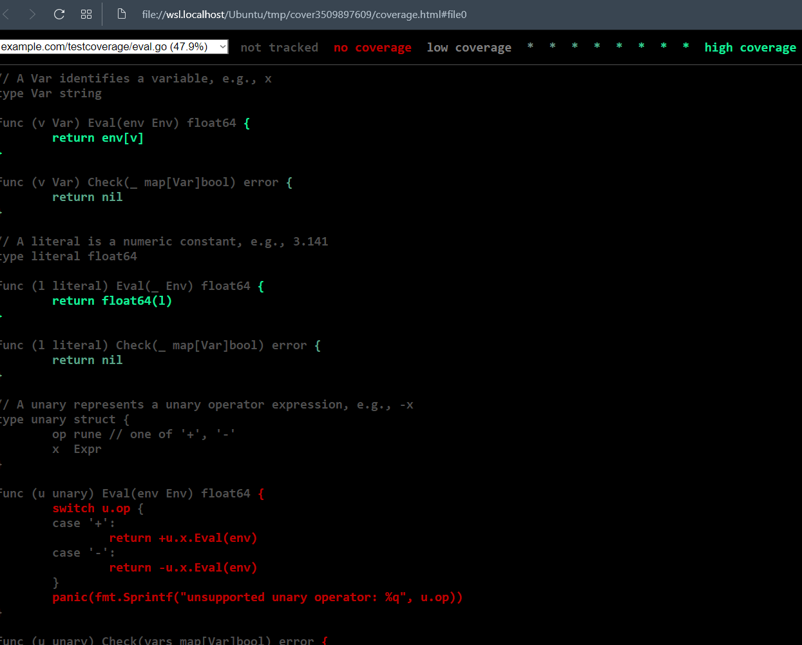

> Achieving 100% statement coverage sounds like a noble goal

But it is not usually feasible in practice, **nor is it likely to be a good use of effort**

Just because a statement is executed does not mean it is bug-free; complex expressions must be executed many times with different inputs to cover the interesting cases. Some statements, like the some of the panic statement can never be reached.

## Beanchmark Functions

> measuring the performance of a program on a fixed workload.

> function with **Benchmark** prefix, and a *testing.B parameter.

field N specifies the number of times to perform the operation being measured.

```go
func BenchmarkIsPalindrome(b *testing.B) {
	for i := 0; i < b.N; i++ {
		IsPalindrome("A man, a plan, a canal: Paname")
	}
}
```

> `-bench` flag select which benchmarks to run. It is a regular expression matching strategy.

The "." pattern cause it to match all benchmarks

`go test -bench=.`
`go test -bench=IsPalindrome`

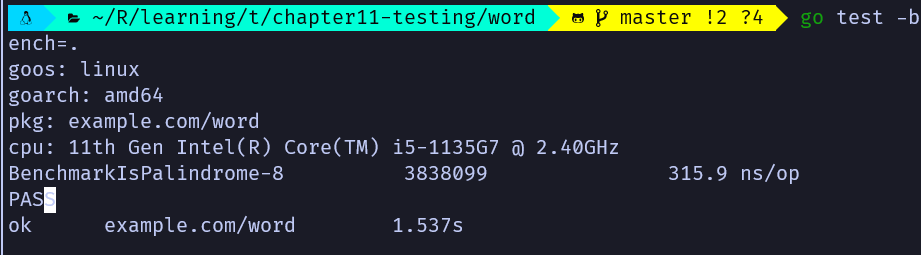

**Tips:** The numberic suffix -8 hwre, indicates the value of **GOMAXPROCS**, which is important for concurrent benchmarks.

**Tips:** This report tells: 315.9ns averaged over 3838099 runs.

> The reason the loop is implemented by the benchmark function:

It has the opportunity to execute any necessary one-time setup code outside the loop without this adding to the measured time of each iteration. If this setup code is still perturbing the results, the **testing.B** parameter provides methods to stop, resume, and reset the timer, but these are rarely needed.

> As the example in `chapter11-word`, the **fastest program is often the one that makes the fewest memory allocations**. 

The -benchmem comman-line flag will include memory allocation statistics in its report.

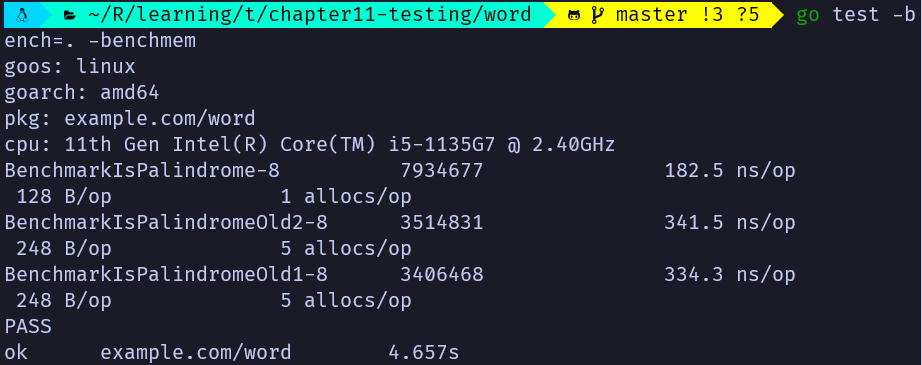

> Comparative benchmarks

Comparative benchmarks are just regular code

```go
func benchmark(b *testing.B, size int) { /* ... */ }
func Benchmark10(b *testing.B) { benchmark(b,10) }
func Benchmark100(b *testing.B) { benchmark(b,100) }
func Benchmark1000(b *testing.B) { benchmark(b,1000) }
```

## Profiling

> Go supports many kinds of profiling:

**CPU profile**

- identifies the functions whose execution requires the most CPU time.

- `go test -cpuprofile=cpu.out`

**Heap profile**

- identifies the statements responsible for allocating the most memory.

- `go test -memprofile=men.out`

**Blocking profile**

- identifies the operations responsible for blocking goroutines the longest, such as system calls, channel sends and receives, and acquisitions of locks.

- `go test -blockprofile=block.out`

**Tips:** when using more than one flag at a time, the machinery for gathering one kind of profile may skew the results of others.

> Below show how to gather and display a simple CPU profile. 

Although `go test` usually discards the test executable once the test is complete, **when profiling is enabled it saves the executable as name.test.


```bash
# we disabled bench marking test cases by using filter -run=NONE
$ go test -run=NONE -bench=ClientServerParallelTLS64 -cpuprofile=cpu.log net/http

# Once we've gathered a profile, we need to analyze it using the pprof tool. It is a standard part of the Go distribution.
# The -text flag specifies the output format. In this case, a textual table with one row per function, sorted so the "hottest" functions -- those consumes the most CPU cycles appeared frst. 
# The -nodecount=10 flag limits the result to 10 rows.
$ go tool pprof -text -nodecount=10 ./http.test cpu.log

```

For more subtle problems, you may be better off using one of `pprof`'s graphical displays. These require GraphViz, which can be downloaded from www.graphviz.org. The -web flag then renders a directed graph of the functions of the program, annotated by their CPU profile numbers and colored to indicate the hottest functions.

> For more, read "Profiling Go Programs" article on Go Blog.

## Example Funcions

> It has neither parameters nor results. It serves three purposes

- documentation. It can be a more succinct or intuitive way to convey the behavior of a library function than its prose description. Especially when used as a reminder or quick reference.

    - Example functions are real Go code, which subject to compile-time checking, so they don't become stale as the code evolves.

- Examples are executable tests run by `go test`.

    - If the example function contains a final // Output:, the test driver will execute the function and check that what it printed to its standard output matches the text within the comment

- Hands-on experimentation. The `godoc` server at golang.org uses the Go Playground to let the user edit and run each example function from within a web browser

    - This is often the fastest way to get a feel for a particular function or language feature.

```go
func ExampleIsPalindrome() {
	fmt.Println(IsPalindrome("A man, a plan, a canal: Panama"))
	fmt.Println(IsPalindrome("palindrome"))
	// Output:
	// true
	// false
}
```

> `godoc`  associates example functions with the fnction or package they exemplify.

ExampleIsPalindrome would be shown with the documentation for the IsPalindrome function

# Reflection

> Capable of dealing uniformly with values of types that don't satisfy a common
> interface, don't have a known representation, or don't exist at the time we
> design the function -- or even all three

Example, formatting logic within fmt.Fprinf.

> Our implementation of simple fmt.Sprint

```go
func Sprint(x interface{}) string {
 type stringer interface {
  String() string
 }
 switch x := x.(type) {
 case stringer:
  return x.String()
 case string:
  return x
 case int:
  return strconv.Itoa(x)
 // ...similar cases for int16, uint32, and so on...
 case bool:
  if x {
   return "true"
  }
  return "false"
 default:
  // array, chan, func, map, pointer, slice, struct
  return "???"
 }
}
```

> What about other types like slice, map[string]\[]string, named types (e.g. url.Values)?

We need reflection

## reflect.Type and reflect.Value

> The sole implementation of reflect.Type is the **type descriptor**
> (Chapter 7.5), the same entity that identifies the dynamic type of an
> interface value.
>
> **reflect.TypeOf function accepts any interface{} and returns its dynamic type
> as a type.**

```go
t := reflect.TypeOf(3)  // a reflect.Type
fmt.Println(t.String()) // int
fmt.Println(t)          // int
```

**Tips:** reflect.TypeOf returns an interface values's dynamic type, it **always
returns a concrete type**

```go
var w io.Writer = os.Stdout
fmt.Println(reflect.TypeOf(w)) // "*os.File"
```

> **reflect.Type** satisfy fmt.Stringer. fmt.Printf provides a shorthand %T that
use reflect.TypeOf internally

```go
fmt.Printf("%T\n", 3) // "int"
```

> **reflect.Value** can hold a value of any type. **reflect.ValueOf function
accepts any interface{} and returns a reflect.Value containing the interface's
dynamic value**.

As with reflect.TypeOf, results of reflect.ValueOf are always concrete, but a
reflect.Value can hold interface values too.

> like reflect.Type, reflect.Value also satisfies fmt.Stringer.

But **unless the Values holds a string**, the result of the String method
reveals only the type.

```go
v := reflect.ValueOf(3) // a reflect.Value
fmt.Println(v)          // "3"
fmt.Printf("%v\n", v)   // "3"
fmt.Println(v.String()) // NOTE: "<int value>"
```

**Tips:** Instead, use the fmt package's %v verb, which treats reflect.Values specially.

> Although reflect.Value has many methods, only a few are safe to call on any
> given values.

For example, the **Index** method may be called on values of kind Slice, Array,
or String, but panics for any other kind.

> calling reflect.Value's Type return reflect.Type

```go
t := v.Type()                 // a reflect.Type
fmt.Println(t.String())       // "int"
```

> The inverse operation from reflect.Value to interface{}

reflect.Value.Interface method

```go
v := reflect.ValueOf(3)   // reflect.Value
x := v.Interface()        // an interface{}
i := x.(int)              // an int
fmt.Printf("%d\n",i)      // "3"
```

> Kind instead of type switch in reflection

Instead of a type switch, we use **reflect.Value**'s **Kind** method to
discriminate the cases. There are only a finite number kinds of type.

- Bool

- String

- all the numbers

- Aggregate type: Array, Struct

- Reference type: Chan, Func, Ptr, Slice, Map

- Interface types

- Invalid (meaning no value at all, the zero value of a reflect.Value has kind Invalid)

```go
// gopl.io/ch 12/format
func Any(value interface{}) string {
 return formatAtom(reflect.ValueOf(value))
}

// formatAtom formats a value without inspecting its internal structure.
func formatAtom(v reflect.Value) string {
 switch v.Kind() {
 case reflect.Invalid:
  return "invalid"
 case reflect.Int, reflect.Int8, reflect.Int16,
  reflect.Int32, reflect.Int64:
  return strconv.FormatInt(v.Int(), 10)
 case reflect.Uint, reflect.Uint8, reflect.Uint16,
  reflect.Uint32, reflect.Uint64, reflect.Uintptr:
  return strconv.FormatUint(v.Uint(), 10)
 // ...floating-point and complex cases omitted for brevity...
 case reflect.Bool:
  return strconv.FormatBool(v.Bool())
 case reflect.String:
  return strconv.Quote(v.String())
 case reflect.Chan, reflect.Func, reflect.Ptr, reflect.Slice, reflect.Map:
  return v.Type().String() + " 0x" + strconv.FormatUint(uint64(v.Pointer()), 16)
 default: // reflect.Array, reflect.Struct, reflect.Interface
  return v.Type().String() + " value"
 }
}
```

> Where possible, you should avoid exposing reflection in the API of a package.

Define an unexported package

```go
// gopl.io/ch12/display
func Display(name string, x interface{}) {
  fmt.Printf("Display %s (%T):\n",name,x)
  display(name, reflect.ValueOf(x))
}
```

> Unexported fields are visible to reflection.

## Example: Display, a Recursive Value Printer

> Prints the complete structure of value, labeling each element with the path by
which it was found

```go
// gopl.io/ch12/display
func Display(name string, x interface{}) {
 fmt.Printf("Display %s (%T):\n", name, x)
 display(name, reflect.ValueOf(x))
}

func display(path string, v reflect.Value) {
 switch v.Kind() {
 case reflect.Invalid:
  fmt.Printf("%s = invalid\n", path)
 case reflect.Slice, reflect.Array:
  for i := 0; i < v.Len(); i++ {
   display(fmt.Sprintf("%s[%d]", path, i), v.Index(i))
  }
 case reflect.Struct:
  for i := 0; i < v.NumField(); i++ {
   fieldPath := fmt.Sprintf("%s.%s", path, v.Type().Field(i).Name)
   display(fieldPath, v.Field(i))
  }
 case reflect.Map:
  for _, key := range v.MapKeys() {
   display(fmt.Sprintf("%s[%s]", path, formatAtom(key)), v.MapIndex(key))
  }
 case reflect.Ptr:
  if v.IsNil() {
   fmt.Printf("%s = nil\n", path)
  } else {
   display(fmt.Sprintf("(*%s)", path), v.Elem())
  }
 case reflect.Interface:
  if v.IsNil() {
   fmt.Printf("%s = nil\n", path)
  } else {
   fmt.Printf("%s.type = %s\n", path, v.Elem().Type())
   display(path+".value", v.Elem())
  }
 default:
  fmt.Printf("%s = %s\n", path, formatAtom(v))
 }
}
```

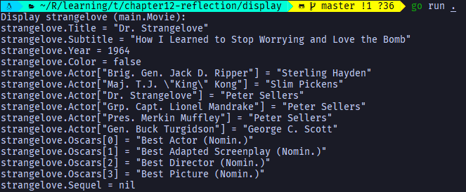

> However, the above function will never terminate if it encounters a cycle in
the object graph

```go
type Cycle struct{ Value int; Tail *Cycle }
var c Cycle
c = Cycle(42, &c)
```

A general solution requires **unsafe** language features.

## Example: Encoding S-Expressions

> a package that encodes arbitrary Go objects using an S-expression
notation that supports the following con structs:

42      - integer
"hello" - string (with Go-style quotation)
foo     - symbol (an unquoted name)
(1 2 3) - list (zero or more items enclosed in parentheses)

```go
func encode(buf *bytes.Buffer, v reflect.Value) error {
 switch v.Kind() {
 case reflect.Invalid:
  buf.WriteString("nil")
 case reflect.Int, reflect.Int8, reflect.Int16, reflect.Int32, reflect.Int64:
  fmt.Fprintf(buf, "%d", v.Int())
 case reflect.Uint, reflect.Uint8, reflect.Uint16, reflect.Uint32, reflect.Uint64:
  fmt.Fprintf(buf, "%d", v.Uint())
 case reflect.Bool:
  fmt.Fprintf(buf, "%s", strconv.FormatBool(v.Bool()))
 case reflect.String:
  fmt.Fprintf(buf, "%q", v.String())
 case reflect.Pointer:
  return encode(buf, v.Elem())
 case reflect.Array, reflect.Slice:
  buf.WriteByte('(')
  for i := 0; i < v.Len(); i++ {
   if i > 0 {
    buf.WriteByte(' ')
   }
   if err := encode(buf, v.Index(i)); err != nil {
    return err
   }
  }
  buf.WriteByte(')')
 case reflect.Struct:
  buf.WriteByte('(')
  for i := 0; i < v.NumField(); i++ {
   if i > 0 {
    buf.WriteByte(' ')
   }
   fmt.Fprintf(buf, "(%s ", v.Type().Field(i).Name)
   if err := encode(buf, v.Field(i)); err != nil {
    return err
   }
   buf.WriteByte(')')
  }
  buf.WriteByte(')')
 case reflect.Map:
  buf.WriteByte('(')
  for i, key := range v.MapKeys() {
   if i > 0 {
    buf.WriteByte(' ')
   }
   buf.WriteByte('(')
   if err := encode(buf, key); err != nil {
    return err
   }
   buf.WriteByte(' ')
   if err := encode(buf, v.MapIndex(key)); err != nil {
    return err
   }
   buf.WriteByte(')')
  }
  buf.WriteByte(')')
 default: // float, complex, bool, chan, func, interface
  return fmt.Errorf("unsupported type: %s", v.Type())
 }
 return nil
}

// Marshal encodes a Go value in S-expression form
func Marshal(v interface{}) ([]byte, error) {
 var buf bytes.Buffer
 if err := encode(&buf, reflect.ValueOf(v)); err != nil {
  return nil, err
 }
 return buf.Bytes(), nil
}

```

## Setting Variables with reflect.Value

> A variable is an ***addressable*** storage location that contains a value, and its value may be updated through that address

```go
x := 2                      // value       type          variable?
a := reflect.Value(2)       // 2           int            no
b := reflect.Value(x)       // 2           int            no
c := reflect.Value(&x)      // &x          *int           no
d := c.Elem()               // 2           int            yes (x)
```

No reflect.Value returned by reflect.ValueOf(x) is addressable.
Dereferencing the pointer within it, refers to a variable and is thus addressable.

**Thus, we can use this approach, calling `reflect.ValueOf(&x).Elem()`, to obtain an addressable Value

> We can ask reflect.Value whether it is addressable through its `CanAddr` method:

```go
fmt.Println(a.CanAddr()) // "false"
fmt.Println(b.CanAddr()) // "false"
fmt.Println(c.CanAddr()) // "false"
fmt.Println(d.CanAddr()) // "true"
```

> Below demonstrate updating variable using reflection

```go
x := 2
d := reflect.ValueOf(&x).Elem()     // d refers to the variable x
px := d.Addr().Interface().(*int)   // px := &x
*px = 3
fmt.Println(x)                      // 3

====OR====
// we can update the **variable referred to (non-pointer will panic which is unaddressable)**, by an addressable reflect.Value directly
d.Set(reflect.ValueOf(4))  // however, int64(4) makes program panic. It's crucial to make sure the value is assignable to the type of the variable
```

> There are variants of `Set` specialized for certain groups of basic types

```go
d.SetInt
d.SetUint
d.SetString
d.SetFloat
...
```

**Tips:** these methods are more forgiving. SetInt, for example, will succeed so long as the variable's type is some kind of signed integer, or even
a named type whose underlying type is a signed integer. If the value is too large, it will be quietly truncated to fit.

**Important:** calling `SetInt` on a `reflect.Value` that refers to an interface{} variable will panic, even though Set would succeed

```go
 x := 1
 rx := reflect.ValueOf(&x).Elem()
 rx.SetInt(2)                     // OK, x = 2
 rx.Set(reflect.ValueOf(3))       // OK, x = 3
 rx.SetString("hello")            // panic: string is not assignable to int
 rx.Set(reflect.ValueOf("hello")) // panic: string is not assignable to int

 var y interface{}
 ry := reflect.ValueOf(&y).Elem()
 ry.SetInt(2)                     // panic: SetInt called on interface value
 ry.Set(reflect.ValueOf(3))       // OK, y = int(3)
 ry.SetString("hello")            // panic: SetString called on interface value
 ry.Set(reflect.ValueOf("hello")) // OK, y = "hello"
```

> Reflection can read the values of unexported struct fields. However, it cannot update such fields

```go
 stdout := reflect.ValueOf(os.Stdout).Elem() // *os.Stdout, an os.File var
 fmt.Println(stdout.Type())                  // "os.File"
 fd := stdout.FieldByName("fd")
 fmt.Println(fd.Int()) // "int"
 fd.SetInt(2)          // panic: unexported field
```

**Tips:** `CanSet` reports whether a reflect.Value is addressable and settable. `CanAddr` reports whether a reflect.Value is addressable

## Example: Decoding S-Expressions

```go
refer ex12.7
```

## Accessing Struct Field Tags

```go
   // v.Kind() is a reflect.Struct
   fieldInfo := v.Type().Field(i) // a reflect.StructField
   tag := fieldInfo.Tag           // a reflect.StructTag
   name := tag.Get("sexpr")
```

## Displaying the Methods of a Type

```go
// Print prints the method set of the value x.
func Print(x interface{}) {
 v := reflect.ValueOf(x)
 t := v.Type()
 fmt.Printf("type %s\n", t)

 for i := 0; i < v.NumMethod(); i++ {
  methType := v.Method(i).Type()
  fmt.Printf("func (%s) %s%s\n", t, t.Method(i).Name, strings.TrimPrefix(methType.String(), "func"))
 }
}

func main() {
 Print(time.Hour)
 Print(new(strings.Replacer))
  // type time.Duration
  // func (time.Duration) Abs() time.Duration
  // func (time.Duration) Hours() float64
  // func (time.Duration) Microseconds() int64
  // func (time.Duration) Milliseconds() int64
  // func (time.Duration) Minutes() float64
  // func (time.Duration) Nanoseconds() int64
  // func (time.Duration) Round(time.Duration) time.Duration
  // func (time.Duration) Seconds() float64
  // func (time.Duration) String() string
  // func (time.Duration) Truncate(time.Duration) time.Duration
  // type *strings.Replacer
  // func (*strings.Replacer) Replace(string) string
  // func (*strings.Replacer) WriteString(io.Writer, string) (int, error)
}
```

## A Word of Caution

> Reflection is a powerful and expressive tool, but it should be used with care

- reflection-based code can be fragile. A reflection error is reported during execution as a panic.

  - The best way to avoid this fragility is to ensure that the use of reflection is fully encapsulated
  within your package and, if possible, avoid `reflect.Value` in favor of specific types in your package's API

  - If it is not possible, perform additional dynamic checks before each risky operation

  - For example, fmt.Printf does not panic mysteriously but prints an informative error message : fmt.Printf(
  "%d %s\n", "hello", 42) // "%!d(string=hello) %!s(int=42)"

- Since type serve as a form of documentation and operations of reflection cannot be subject to static type checking.
Heavily reflective code is often hard to understand.

  - Always carefully document the expected types and other invariants of functions that accept an interface{} or a reflect.Value

- Reflection-based functions may be one or two orders of magnitude slower than code specialized for a particular type

  - For functions on the critical path, reflection is best avoided.

# Low-level programming

> The approaches described here should not be used frivolously.

Without careful attention to detail, they may cause the kinds of unpredictable, inscrutable, non-local failures with which C programmers are unhappily acquainted.

> Package `unsafe` is used extensively within low-level packages like `runtime`, `os`, `syscall`, and `net` that interact with the operating system. It is almost never needed by ordinary programs

## `unsafe.Sizeof`, `Alignof`, and `Offsetof`

> `unsafe.Sizeof` reports the size in bytes of the representation of its operand.

```go
fmt.Println(unsafe.Sizeof(float(0))) // "8", a uintptr type
```

**It reports only the size of the fixed part of each datastructure, like the pointer and length of a string, but not indirect parts like the contents of the string

> Computers load and store values from memory efficiently when those values are properly aligned.

e.g. the address of a two-byte value (int16) should be an even number
e.g. the address of a four-byte value (rune) should be a multiple of four
e.g. the address of a eight-byte value (float64, uint64, 64-bit pointer) should be a multiple of eight.

For this reason, the size of a value of an aggregate type (a struct or array) is at least the sum of the sizes of its fields or elements but may be greater due to the presence of "holes"

| Type | Size |
| --- | --- |
| bool | 1 byte |
| intN, uintN, floatN, complexN | N / 8 bytes |
| int, uint, uintptr | 1 word |
| *T | 1 word |
| string | 2 words (data, len) |
| []T | 3 words (data, len, cap) |
| map | 1 word |
| func | 1 word |
| chan | 1 word |
| interface | 2 word (type, value) |

> If the types of a struct's fields are of different sizes, it may be more space-efficient to declare the fields in an order that packs them as tightly as possible.

```go
                                // 64-bit  32-bit
struct{ bool; float64; int16 }  // 3 words 4 words
struct{ float64; int16; bool }  // 2 words 3 words
struct{ bool; int16; float64 }  // 2 words 3 words
```

It's certainly not worth worrying about every struct, but efficient packing may make frequently allocated datastructures more compact and therefore faster.

> The `unsafe.Alignof` function reports the required alignment of its argument's type. 

Like `Sizeof`, it may be applied to an expression of any type, and it yields a constant.
> The `unsafe.Offsetof` function, whose operand must be field selector x.f,  computes offset of field f relative to the start of its enclosing struct x.

```go
var x struct {
    a bool
    b int16
    c []int
}
```

***32-bit***

|   |   |   |   |
| --- | --- | --- | --- |
| a | -blank- | b | b |
| c | c | c | c |
| c | c | c | c |
| c | c | c | c |

```go
Sizeof(x) = 16 Alignof(x) = 4
Sizeof(x.a) = 1 Alignof(x.a) = 1 Offsetof(x.a) = 0
Sizeof(x.b) = 2 Alignof(x.b) = 2 Offsetof(x.b) = 2
Sizeof(x.c) = 12 Alignof(x.c) = 4 Offsetof(x.c) = 4
```

***64-bit***

|   |   |   |   |   |   |   |   |
| --- | --- | --- | --- | --- | --- | --- | --- |
| a | -blank- | b | b | -blank- |  |  |  | 
| c | c | c | c | c | c | c | c |
| c | c | c | c | c | c | c | c |
| c | c | c | c | c | c | c | c |

```go
Sizeof(x) = 32 Alignof(x) = 8
Sizeof(x.a) = 1 Alignof(x.a) = 1 Offsetof(x.a) = 0
Sizeof(x.b) = 2 Alignof(x.b) = 2 Offsetof(x.b) = 2
Sizeof(x.c) = 24 Alignof(x.c) = 8 Offsetof(x.c) = 8
```

## `Unsafe.Pointer`

> it is comparable and may be compared with nil (the zero value of the type)

> An ordinar *T pointer may be converted to an `unsafe.Pointer`, and an unsafe.Pointer may be converted back to an ordinary pointer **not necessarily of the same type *T**.

```go
package math

func Float64bits(f float64) uint64 { return *(*uint64)(unsafe.Pointer(&f)) }
```

> Example

Although the syntax is cumbersome -- perhaps no bad thing since these features should be use sparingly

**do not be tempted to introduce temporary variables of type uintptr to break the lines, Some garbage collectors move variables around memory to reduce fragmentation or bookkeeping**. This kind of gc is known as moving GCs. No current Go implementation uses a moving GC. But who knows in future?

```go
var x struct {
	a bool
	b int16
	c []int
}

func main() {
	// equivalent to pb := &x.b
	pb := (*int16)(unsafe.Pointer(
		uintptr(unsafe.Pointer(&x)) + unsafe.Offsetof(x.b)))
	*pb = 42

	fmt.Println(x.b)
}
```

> **When calling a library function that returns a uintptr, such as those below from the reflect package, the result should be immediately converted to an `unsafe.Pointer` to ensure that it continues to point to the same variable**

```go
package reflect

func (v Value) Pointer() uintptr
func (v Value) UnsafeAddr() uintptr
func (v Value) InterfaceData() [2]uintptr // (index 1)
```

## Example: Deep Equivalence

> it finds widespread use in tests

> Although DeepEqual is convenient, its distinctions can seem arbitrary. E.g. It doesn't consider a nil map equal to a non-nil empty map, nor a nil slice equal to a non-nil empty one

> Example below consider nil map equal to a non-nil empty map

```go
func equal(x, y reflect.Value, seen map[comparison]bool) bool {
	if !x.IsValid() || !y.IsValid() {
		return x.IsValid() == y.IsValid()
	}
	if x.Type() != y.Type() {
		return false
	}
	// ...cycle check omitted (shown later)...

	switch x.Kind() {
	case reflect.Bool:
		return x.Bool() == y.Bool()
	case reflect.String:
		return x.String() == y.String()
	// numeric case omitted for brevity...
	case reflect.Chan, reflect.UnsafePointer, reflect.Func:
		return x.Pointer() == y.Pointer()
	case reflect.Ptr, reflect.Interface:
		return equal(x.Elem(), y.Elem(), seen)
	case reflect.Array, reflect.Slice:
		if x.Len() != y.Len() {
			return false
		}
		for i := 0; i < x.Len(); i++ {
			if !equal(x.Index(i), y.Index(i), seen) {
				return false
			}
			return true
		}
		// ...struct and map cases omitted for brevity ...
	}
	panic("unreachable")
}

func Equal(x, y interface{}) bool {
	seen := make(map[comparison]bool)
	return equal(reflect.ValueOf(x), reflect.ValueOf(y), seen)
}

type comparison struct {
	x, y unsafe.Pointer
	t    reflect.Type
}
```

To ensure that algorithm terminates even for cyclic data structures, it must record which pairs of variables it has 
already compared and avoid comparing them a second time

We need to record the types, different type can has the same address e.g. y and y[0]

## Calling C code with cgo

> `cgo`, a tool that creates Go bindings for C functions. Such tools are called *foreign-function interfaces* (FFIs), and cgo is not the only one for Go programs. SWIG is another.

> Example: bzip Compressor

- bzip runs slower than gzip but ields significantly better compressions.


`cgo` generates a temporary package that contains Go declarations corresponding to all the
C functions and types used by the file, such as C.bz_stream
The comment may also contain #cgo directives that specify extra options to the toolchain. The CFLAGS and LDFLAGS values contribute extra arguments to the compiler and linker commands so that they can locat the bzlib.h header file and libbz2.a archive lib.

- `NewWriter` makes a call to the C function BZ2_bzCompressInit to init the buffers for the stream

- `Write` feeds the uncompressed data to the compressor.

## Another Word of Caution

> Most programmers will never need to use `unsafe` at all.

# Other

> `parse` must be called before usage

- flag.Parse() // panic if err

- req.ParseForm()

> path package

- Base --

  ```go
  // Base returns the last element of path.
  // Trailing slashes are removed before extracting the last element.
  // If the path is empty, Base returns ".".
  // If the path consists entirely of slashes, Base returns "/".
  ```

> **Naming**

int: n

byte / buffer : b, data, dst, src

error msg: unexpected, bad,

action: handle

conn

raw

nfiles, nbytes

who

input, output

incoming, outgoing

delim (delimiter [] ())

(one time usage function return value to be used directly in expression)

tempconv

> time.Time.Format

Mon Jan 2 03:04:05PM 2006 UTC-0700

time.RFC1123

**Tips:** time.Parse to parse a time

> signal

```go
interrupt := make(chan os.Signal, 1)
signal.Notify(interrupt, os.Interrupt)
```

## Packaged used

```go
text/template
html/template
text/tabwriter - to produce a table whose columns are neat aligned and padded
database/sql
```
